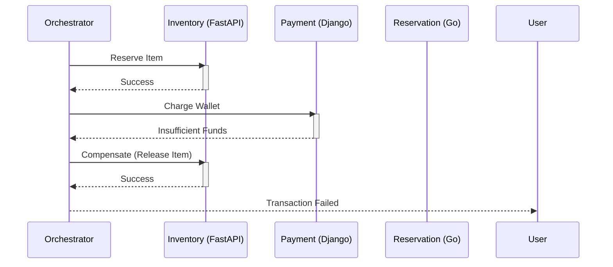

# Architecture & Design: Race Condition Mitigation

## 1. System High-Level Architecture

The system consists of three primary services communicating via events (RabbitMQ/Kafka) and sharing data stores (PostgreSQL, Redis).

```mermaid
graph TD
    User[User / Client] -->|HTTP Requests| LB[Load Balancer]
    
    subgraph "Services"
        FastAPI[FastAPI Service<br>(Inventory)]
        Django[Django Service<br>(Payment/Wallet)]
        Go[Go Service<br>(Reservation)]
    end
    
    LB --> FastAPI
    LB --> Django
    LB --> Go
    
    subgraph "Data Layer"
        Redis[(Redis Cluster)]
        Postgres[(PostgreSQL)]
    end
    
    subgraph "Event Bus"
        Kafka{{Kafka / RabbitMQ}}
    end
    
    FastAPI -->|Reads/Writes| Redis
    FastAPI -->|Reads/Writes| Postgres
    FastAPI <-->|Events| Kafka
    
    Django -->|Reads/Writes| Redis
    Django -->|Reads/Writes| Postgres
    Django <-->|Events| Kafka
    
    Go -->|Reads/Writes| Redis
    Go -->|Reads/Writes| Postgres
    Go <-->|Events| Kafka
```

## 2. Race Condition Scenarios & Mitigation Strategies

| Scenario | Service | Critical Resource | Mitigation Strategy | Technology |
| :--- | :--- | :--- | :--- | :--- |
| **Over-selling Inventory** | FastAPI | Product Stock Count | **Optimistic Concurrency Control** (Version Stamps) + **Redis Distributed Lock** | `redis-py` Lock, SQLAlchemy Versioning |
| **Double Spending** | Django | User Wallet Balance | **Pessimistic Locking** (Select For Update) + **Atomic Updates** | Django `select_for_update`, `F()` expressions |
| **Double Booking** | Go | Reservation Slot | **Distributed Lock** (Redlock) + **Idempotency Keys** | `go-redis/redlock`, Redis Keys |
| **Lost Updates** | All | Shared Documents | **Optimistic Locking** (ETags / Versioning) | Database Row Versioning |
| **Duplicate Requests** | All | API Endpoints | **Idempotency Middleware** | Redis-based key tracking |

## 3. Locking Strategy Matrix

| Strategy | usage | Pros | Cons |
| :--- | :--- | :--- | :--- |
| **Optimistic Locking** | High concurrency, low conflict (e.g., Inventory) | Non-blocking, high throughput | Retries needed on failure |
| **Pessimistic Locking** | High conflict, critical data (e.g., Wallet) | Strong consistency, easy to reason about | Reduces concurrency, deadlock risk |
| **Distributed Locking** | Cross-service resources (e.g., Global Reservations) | Coordinates across multiple instances/services | Network latency, lock expiry complexity |
| **Atomic Operations** | Simple counters/updates | Fastest, database-level guarantee | Limited to simple mathematical operations |

## 4. Cross-Service Coordination

### Saga Pattern (Orchestration)
For distributed transactions spanning multiple services (e.g., Book Item -> Charge Wallet -> Reserve Slot).



### Idempotency Key Flow
To prevent duplicate processing of the same request.

1. **Client** generates `Idempotency-Key` (UUID) header.
2. **Middleware** checks Redis for Key.
   - If exists & completed: Return cached response.
   - If exists & processing: Return 409 Conflict / 429 Too Many Requests.
   - If new: Store Key as "Processing" with TTL.
3. **Service** processes request.
4. **Middleware** updates Key with response payload.
