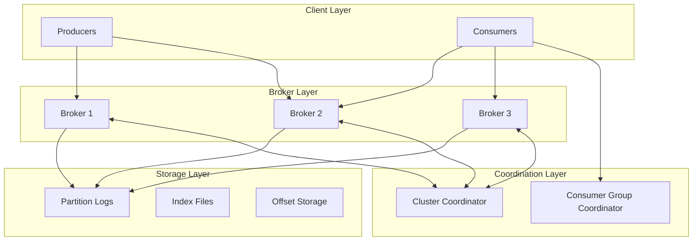
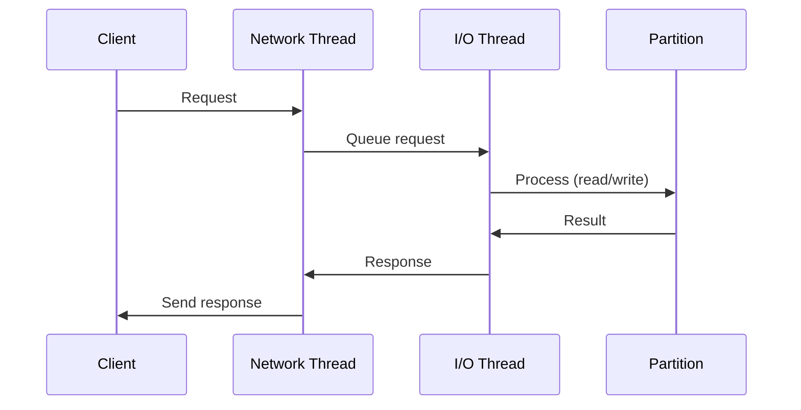

# Architecture Deep Dive

Detailed architectural documentation for the distributed message queue system.

## System Architecture

### Component Overview



## Core Components

### 1. Partition

**Purpose**: Ordered, immutable log of messages

**Key Features**:
- Segment-based storage for efficient management
- Binary search index for fast offset lookups
- High watermark tracking for consistency
- Thread-safe append and read operations

**Data Structure**:
```
Partition
├── Segments (ordered list)
│   ├── Segment 0 (offsets 0-999)
│   ├── Segment 1 (offsets 1000-1999)
│   └── Segment N (active)
├── High Watermark (committed offset)
└── Log End Offset (last written offset)
```

**Implementation Details**:
- Each segment has `.log` and `.index` files
- Index stores (offset, file_position) pairs
- Segments are immutable once full
- Active segment accepts new writes

### 2. Replication Manager

**Purpose**: Ensures data durability through replication

**Key Features**:
- Leader-follower replication protocol
- In-Sync Replica (ISR) tracking
- High watermark computation
- Automatic failover

**Replication Flow**:
```
1. Producer → Leader
2. Leader writes to local log
3. Leader responds (if acks=1)
4. Followers fetch from leader
5. Leader updates high watermark
6. Consumers read up to high watermark
```

**ISR Management**:
- Replica is in ISR if lag < `replica.lag.time.max.ms`
- Leader tracks follower LEOs
- ISR updated on every fetch
- Minimum ISR required for writes (if `acks=all`)

### 3. Broker

**Purpose**: Central server handling client requests

**Request Handling**:


**Thread Model**:
- **Network Threads**: Accept connections, read/write sockets
- **I/O Threads**: Process requests, interact with storage
- **Replication Threads**: Fetch data from leaders (followers only)

### 4. Producer

**Purpose**: Publish messages to topics

**Architecture**:
```
Application
    ↓
Producer API
    ↓
Partitioner → Batch Buffer → Compressor → Network
                                              ↓
                                           Broker
```

**Batching**:
- Messages buffered per topic-partition
- Batch sent when full or `linger.ms` expires
- Reduces network overhead
- Improves throughput

**Partitioning Strategies**:
1. **Hash**: `partition = hash(key) % num_partitions`
2. **Round-Robin**: Distribute evenly
3. **Custom**: Application-defined logic

### 5. Consumer

**Purpose**: Read messages from topics

**Architecture**:
```
Consumer
    ↓
Subscription → Rebalancing → Partition Assignment
    ↓
Fetch Loop → Offset Management → Message Processing
```

**Offset Management**:
- **Auto-commit**: Periodic automatic commits
- **Manual commit**: Application controls commits
- **Transactional**: Exactly-once with external systems

**Rebalancing**:
- Triggered by consumer join/leave
- Coordinator assigns partitions
- Consumers stop, reassign, resume
- Cooperative rebalancing minimizes disruption

## Data Flow

### Write Path

```
Producer
    ↓ (1) Send batch
Broker (Leader)
    ↓ (2) Append to log
Partition Log
    ↓ (3) Update LEO
Replication Manager
    ↓ (4) Followers fetch
Follower Brokers
    ↓ (5) Update HW
Consumers (can now read)
```

**Latency Breakdown**:
- Network: 1-2 ms
- Leader write: 1-5 ms
- Replication: 5-10 ms (if `acks=all`)
- Total: 7-17 ms

### Read Path

```
Consumer
    ↓ (1) Fetch request
Broker
    ↓ (2) Find segment
Partition
    ↓ (3) Binary search index
Index File
    ↓ (4) Read from position
Log File
    ↓ (5) Return messages
Consumer (up to HW only)
```

**Optimization**:
- Zero-copy transfer (sendfile syscall)
- Page cache utilization
- Batched reads

## Failure Scenarios

### 1. Leader Failure

```
Before:
  Leader: Broker 1 (LEO: 100, HW: 98)
  Follower: Broker 2 (LEO: 99)
  Follower: Broker 3 (LEO: 98)

Broker 1 fails:
  1. Coordinator detects failure (heartbeat timeout)
  2. Elect new leader from ISR (Broker 2)
  3. Update epoch (fencing)
  4. Clients discover new leader

After:
  Leader: Broker 2 (LEO: 99, HW: 98)
  Follower: Broker 3 (LEO: 98)
  Follower: Broker 1 (when recovered)
```

**Data Loss Risk**:
- If `acks=1`: Messages 99-100 may be lost
- If `acks=all`: No data loss (HW=98 committed)

### 2. Follower Failure

```
Before:
  ISR: [1, 2, 3]

Broker 3 fails:
  1. Stops fetching from leader
  2. After `replica.lag.time.max.ms`, removed from ISR
  3. ISR: [1, 2]

Broker 3 recovers:
  1. Fetches from leader
  2. Catches up to HW
  3. Rejoins ISR: [1, 2, 3]
```

**Impact**: None if `min.insync.replicas` satisfied

### 3. Network Partition

```
Partition: [Broker 1] | [Broker 2, Broker 3]

Leader (Broker 1) isolated:
  1. Cannot replicate to followers
  2. ISR shrinks to [1]
  3. If `min.insync.replicas=2`, writes fail
  4. Prevents split-brain

Partition heals:
  1. Followers catch up
  2. ISR expands to [1, 2, 3]
  3. Writes resume
```

## Consistency Model

### Guarantees

1. **Per-Partition Ordering**: Messages in a partition are strictly ordered
2. **At-Least-Once**: Default delivery semantic
3. **Exactly-Once**: With idempotent producer + transactional consumer

### Consistency Levels

| Configuration | Consistency | Availability | Performance |
|---------------|-------------|--------------|-------------|
| `acks=0` | Weak | High | Highest |
| `acks=1` | Medium | Medium | Medium |
| `acks=all, min.isr=2` | Strong | Lower | Lower |

### CAP Theorem Trade-offs

- **Consistency**: Configurable via `acks` and `min.insync.replicas`
- **Availability**: Degrades with stricter consistency
- **Partition Tolerance**: Always maintained

**Choice**: CP (Consistency + Partition Tolerance) with `acks=all`

## Performance Characteristics

### Throughput

**Factors**:
- Batch size: Larger batches = higher throughput
- Compression: Reduces network/disk I/O
- Replication: More replicas = lower throughput
- Partitions: More partitions = more parallelism

**Benchmarks** (single broker):
- Write: 50 MB/s per partition
- Read: 100 MB/s per partition
- With 10 partitions: 500 MB/s write, 1 GB/s read

### Latency

**Factors**:
- `linger.ms`: Higher = more batching, higher latency
- `acks`: `all` adds replication latency
- Network RTT: Geographic distance matters
- Disk I/O: SSD vs HDD

**Typical Latencies**:
- `acks=0`: 1-2 ms
- `acks=1`: 5-10 ms
- `acks=all`: 10-20 ms

### Scalability

**Horizontal Scaling**:
- Add brokers: Linear throughput increase
- Add partitions: Linear consumer parallelism
- Add consumers: Up to num_partitions

**Limits**:
- Max partitions per broker: ~2000-4000
- Max consumers per group: num_partitions
- Max throughput: Network bandwidth

## Design Decisions

### 1. Log-Based Storage

**Why**:
- Sequential I/O is fast (100+ MB/s on HDD)
- Simple data structure
- Enables replay
- Natural fit for streaming

**Trade-off**: Random access is slow

### 2. Pull-Based Consumption

**Why**:
- Consumer controls rate (backpressure)
- Simpler broker implementation
- Enables batching

**Trade-off**: Adds latency (polling interval)

### 3. Partition-Level Parallelism

**Why**:
- Simple and scalable
- Maintains ordering within partition
- Easy to reason about

**Trade-off**: No global ordering

### 4. Replication via Fetch

**Why**:
- Reuses consumer protocol
- Simpler implementation
- Followers can lag without blocking leader

**Trade-off**: Eventual consistency

## Comparison with Alternatives

### vs. RabbitMQ

| Feature | This System | RabbitMQ |
|---------|-------------|----------|
| Model | Log-based | Queue-based |
| Persistence | Always | Optional |
| Replay | Yes | No |
| Throughput | Higher | Lower |
| Latency | Higher | Lower |
| Use Case | Event streaming | Task queues |

### vs. Apache Kafka

| Feature | This System | Kafka |
|---------|-------------|-------|
| Language | Python | Java/Scala |
| Maturity | Educational | Production |
| Features | Core only | Full ecosystem |
| Performance | Lower | Higher |
| Complexity | Simpler | More complex |

## Future Enhancements

1. **Log Compaction**: Keep only latest value per key
2. **Transactions**: Atomic multi-partition writes
3. **Exactly-Once Semantics**: End-to-end guarantees
4. **Tiered Storage**: Hot/cold data separation
5. **Schema Registry**: Centralized schema management
6. **Streams API**: Built-in stream processing
7. **Connectors**: Integration with external systems
8. **Security**: SSL/TLS, SASL, ACLs
9. **Multi-DC Replication**: Geographic redundancy
10. **Quotas**: Per-client rate limiting

## References

- [Kafka Design Documentation](https://kafka.apache.org/documentation/#design)
- [The Log: What every software engineer should know](https://engineering.linkedin.com/distributed-systems/log-what-every-software-engineer-should-know-about-real-time-datas-unifying)
- [Consensus Protocols](https://raft.github.io/)
- [Designing Data-Intensive Applications](https://dataintensive.net/)
