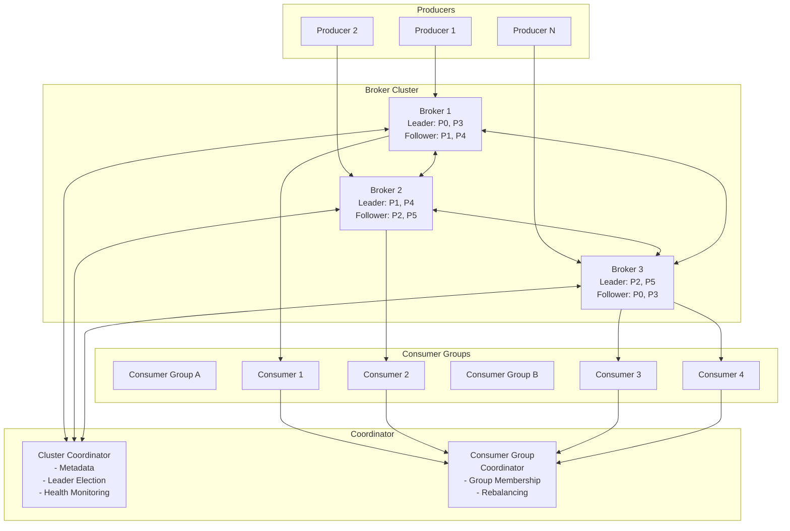
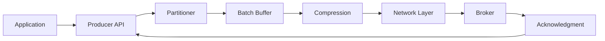
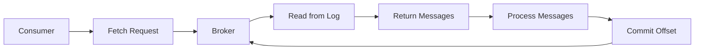
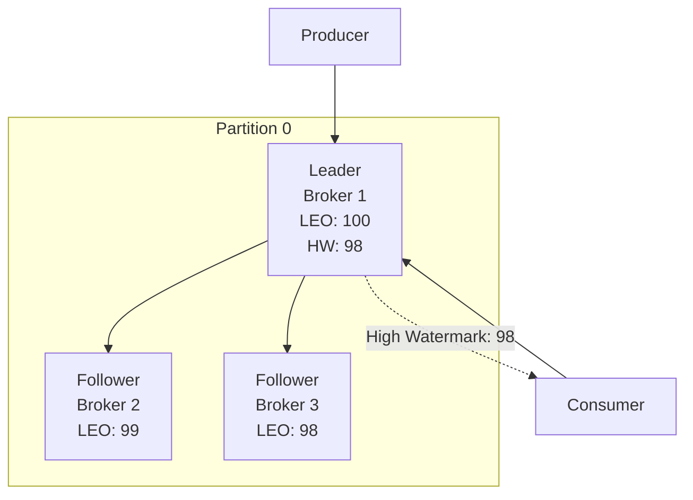
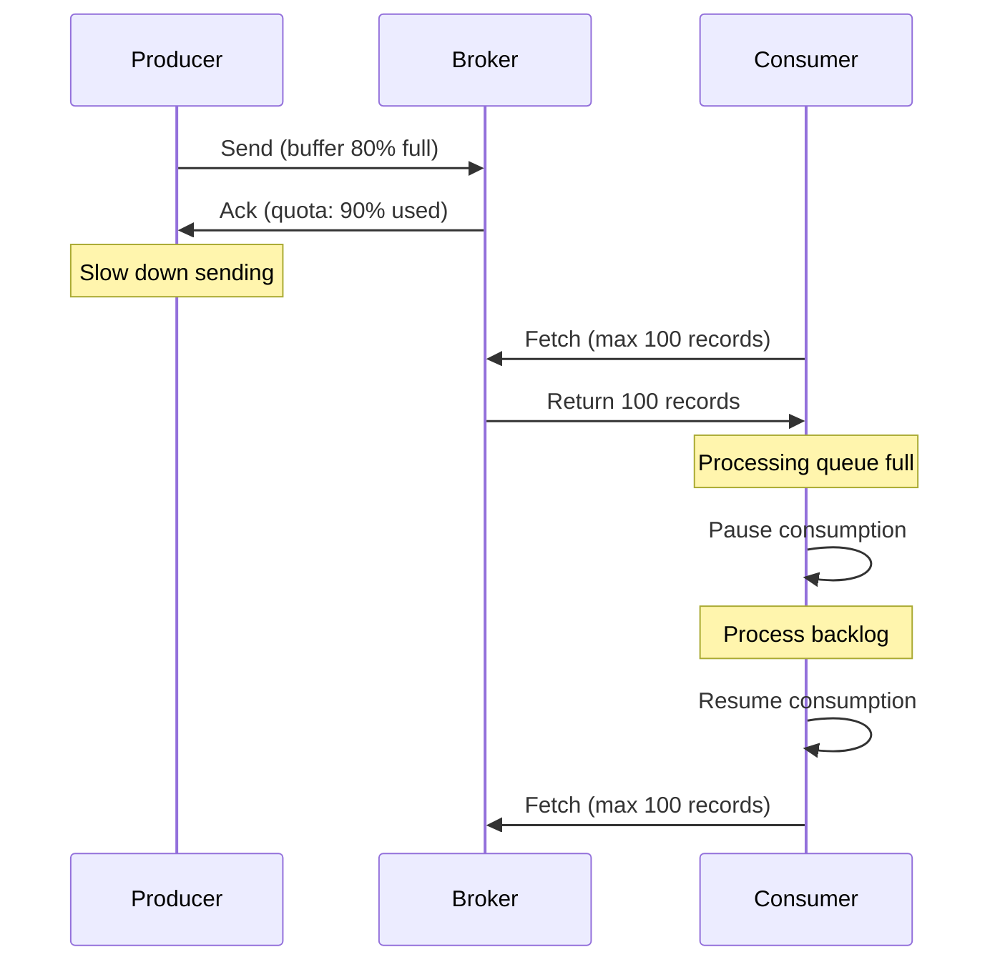
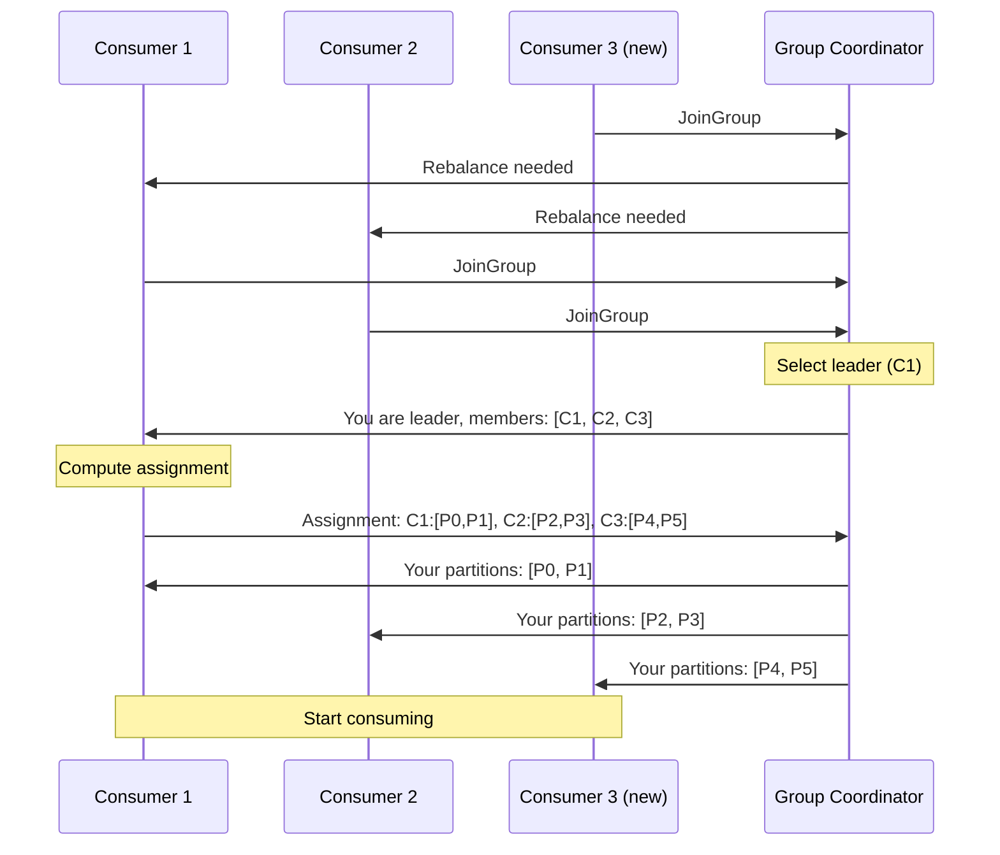

# Distributed Message Queue System Design

> A comprehensive system design for a distributed message queue similar to Apache Kafka and RabbitMQ

## Table of Contents

1. [Architecture Overview](#architecture-overview)
2. [Topics and Partitions](#topics-and-partitions)
3. [Producers and Consumers](#producers-and-consumers)
4. [Offset Management](#offset-management)
5. [Durability and Replication](#durability-and-replication)
6. [Ordering Guarantees](#ordering-guarantees)
7. [Backpressure Handling](#backpressure-handling)
8. [Consumer Groups](#consumer-groups)
9. [Failure Recovery](#failure-recovery)
10. [Horizontal Scalability](#horizontal-scalability)

---

## Architecture Overview

### High-Level Architecture



### Core Components

#### 1. **Broker**
- Manages topics and partitions
- Handles message storage and retrieval
- Coordinates replication
- Serves producer and consumer requests

#### 2. **Producer**
- Publishes messages to topics
- Handles partitioning logic
- Manages batching and compression
- Implements retry and error handling

#### 3. **Consumer**
- Subscribes to topics
- Fetches messages from partitions
- Manages offset commits
- Participates in consumer groups

#### 4. **Coordinator**
- **Cluster Coordinator**: Manages broker metadata, leader election, health monitoring
- **Consumer Group Coordinator**: Manages consumer group membership and rebalancing

---

## Topics and Partitions

### Design Rationale

**Topics** provide logical grouping of messages, while **partitions** enable:
- **Parallelism**: Multiple consumers can read from different partitions simultaneously
- **Scalability**: Partitions can be distributed across brokers
- **Ordering**: Messages within a partition maintain strict ordering

### Partition Structure

```
Topic: user-events
├── Partition 0 (Leader: Broker 1, Replicas: [Broker 1, Broker 2])
│   ├── Segment 0 (offsets 0-999)
│   ├── Segment 1 (offsets 1000-1999)
│   └── Segment 2 (offsets 2000-2500) [active]
├── Partition 1 (Leader: Broker 2, Replicas: [Broker 2, Broker 3])
└── Partition 2 (Leader: Broker 3, Replicas: [Broker 3, Broker 1])
```

### Partition Assignment Strategies

#### 1. **Round-Robin**
- Distributes messages evenly across partitions
- No message key required
- Best for load balancing

```python
partition = hash(message_id) % num_partitions
```

#### 2. **Key-Based (Hash Partitioning)**
- Messages with the same key go to the same partition
- Maintains ordering for related messages
- Example: All events for user_id=123 go to the same partition

```python
partition = hash(message_key) % num_partitions
```

#### 3. **Custom Partitioner**
- Application-specific logic
- Example: Geographic partitioning, priority-based routing

### Segment-Based Storage

Each partition is divided into **segments** for efficient management:

```
Partition Directory: /data/topic-name/partition-0/
├── 00000000000000000000.log    # Messages [0, 999]
├── 00000000000000000000.index  # Offset index
├── 00000000000000001000.log    # Messages [1000, 1999]
├── 00000000000000001000.index
├── 00000000000000002000.log    # Active segment
└── 00000000000000002000.index
```

**Benefits**:
- **Fast lookups**: Binary search in index files
- **Efficient deletion**: Remove old segments without rewriting
- **Parallel reads**: Multiple consumers can read different segments

---

## Producers and Consumers

### Producer Architecture



#### Producer Configuration

| Parameter | Description | Values |
|-----------|-------------|--------|
| `acks` | Acknowledgment level | `0` (none), `1` (leader), `all` (all replicas) |
| `batch.size` | Max batch size in bytes | Default: 16KB |
| `linger.ms` | Wait time before sending batch | Default: 0ms |
| `compression.type` | Compression algorithm | `none`, `gzip`, `snappy`, `lz4`, `zstd` |
| `retries` | Number of retry attempts | Default: Integer.MAX_VALUE |
| `max.in.flight.requests` | Max unacknowledged requests | Default: 5 |

#### Acknowledgment Modes

**acks=0 (Fire and Forget)**
```
Producer → Broker
         ← (no ack)
```
- Lowest latency
- No durability guarantee
- Use case: Metrics, logs where some loss is acceptable

**acks=1 (Leader Acknowledgment)**
```
Producer → Leader Broker
         ← ack (after write to leader's log)
```
- Balanced latency and durability
- Risk: Data loss if leader fails before replication
- Use case: Most applications

**acks=all (All Replicas)**
```
Producer → Leader Broker → Follower 1
                         → Follower 2
         ← ack (after all in-sync replicas acknowledge)
```
- Highest durability
- Higher latency
- Use case: Financial transactions, critical data

### Consumer Architecture



#### Consumer Configuration

| Parameter | Description | Default |
|-----------|-------------|---------|
| `group.id` | Consumer group identifier | Required |
| `auto.offset.reset` | Offset reset policy | `latest` |
| `enable.auto.commit` | Auto-commit offsets | `true` |
| `auto.commit.interval.ms` | Auto-commit frequency | 5000ms |
| `max.poll.records` | Max records per poll | 500 |
| `fetch.min.bytes` | Min data for fetch response | 1 byte |
| `fetch.max.wait.ms` | Max wait time for fetch | 500ms |

#### Fetch Protocol

**Long Polling**:
```
Consumer: FETCH topic=events, partition=0, offset=1000, max_bytes=1MB
Broker: (waits up to fetch.max.wait.ms for fetch.min.bytes)
Broker: Returns messages [1000-1050] (51 messages, 512KB)
```

**Benefits**:
- Reduces network overhead
- Balances latency and throughput
- Efficient for low-traffic topics

---

## Offset Management

### Offset Semantics

An **offset** is a unique, monotonically increasing integer identifying each message within a partition.

```
Partition 0:
Offset:  0    1    2    3    4    5    6    7
Message: [A] [B] [C] [D] [E] [F] [G] [H]
                      ↑
                 Consumer Position
```

### Offset Storage

#### 1. **Broker-Side Storage** (Recommended)
- Offsets stored in a special internal topic: `__consumer_offsets`
- Replicated for fault tolerance
- Automatic cleanup of old offsets

```
Topic: __consumer_offsets
Key: (group_id, topic, partition)
Value: (offset, metadata, timestamp)
```

#### 2. **External Storage** (Custom)
- Store offsets in external systems (Redis, PostgreSQL, etc.)
- Enables exactly-once semantics with transactional systems
- Requires manual management

### Commit Strategies

#### Auto-Commit (At-Least-Once)
```python
consumer = Consumer(
    group_id='my-group',
    enable_auto_commit=True,
    auto_commit_interval_ms=5000
)

for message in consumer:
    process(message)
    # Offset auto-committed every 5 seconds
```

**Risk**: If consumer crashes after auto-commit but before processing, messages are lost.

#### Manual Commit (At-Least-Once)
```python
consumer = Consumer(
    group_id='my-group',
    enable_auto_commit=False
)

for message in consumer:
    process(message)
    consumer.commit()  # Commit after processing
```

**Risk**: If consumer crashes after processing but before commit, messages are reprocessed.

#### Transactional Commit (Exactly-Once)
```python
# Store offset with processed data in a transaction
with database.transaction():
    process_and_save(message)
    save_offset(message.offset)
```

### Offset Reset Policies

| Policy | Behavior | Use Case |
|--------|----------|----------|
| `earliest` | Start from beginning | Reprocess all data |
| `latest` | Start from end | Only new messages |
| `none` | Throw exception | Strict offset management |
| `<timestamp>` | Start from specific time | Time-based replay |

---

## Durability and Replication

### Replication Architecture



### Key Concepts

#### 1. **Leader and Followers**
- Each partition has one **leader** and multiple **followers**
- Leader handles all reads and writes
- Followers replicate data from the leader

#### 2. **In-Sync Replicas (ISR)**
- Replicas that are "caught up" with the leader
- Defined by `replica.lag.time.max.ms` (default: 10s)
- Only ISR members can become leader

#### 3. **Log End Offset (LEO)**
- Offset of the last message written to the log
- Each replica has its own LEO

#### 4. **High Watermark (HW)**
- Offset of the last message replicated to all ISR members
- Only messages up to HW are visible to consumers
- Ensures consistency

### Replication Protocol

```
1. Producer sends message to Leader
   Leader appends to log (LEO = 100)

2. Leader responds to Producer (if acks=1)
   OR waits for followers (if acks=all)

3. Followers fetch from Leader
   Follower 1: Fetches offset 99, updates LEO = 99
   Follower 2: Fetches offset 98, updates LEO = 98

4. Leader updates High Watermark
   HW = min(LEO of all ISR) = 98

5. Consumers can read up to offset 98
```

### Durability Guarantees

#### Configuration Parameters

| Parameter | Description | Impact |
|-----------|-------------|--------|
| `replication.factor` | Number of replicas | Higher = more durability |
| `min.insync.replicas` | Min ISR for writes | Higher = stronger guarantee |
| `unclean.leader.election` | Allow non-ISR leader | `false` = no data loss |

#### Example Configurations

**Maximum Durability** (Financial systems):
```yaml
replication.factor: 3
min.insync.replicas: 2
acks: all
unclean.leader.election.enable: false
```

**Balanced** (Most applications):
```yaml
replication.factor: 3
min.insync.replicas: 2
acks: 1
unclean.leader.election.enable: false
```

**High Throughput** (Logs, metrics):
```yaml
replication.factor: 2
min.insync.replicas: 1
acks: 1
unclean.leader.election.enable: true
```

### Write-Ahead Log (WAL)

All messages are written to disk before acknowledgment:

```
1. Append to OS page cache
2. fsync() to disk (configurable)
3. Acknowledge to producer
```

**Configuration**:
- `flush.messages`: Number of messages before fsync (default: ∞, rely on OS)
- `flush.ms`: Time before fsync (default: ∞)

**Trade-off**: More frequent fsync = higher durability, lower throughput

---

## Ordering Guarantees

### Ordering Levels

#### 1. **Per-Partition Ordering** (Guaranteed)

Messages within a partition are strictly ordered:

```
Partition 0: [A] → [B] → [C] → [D]
             Consumer reads: A, B, C, D (always in order)
```

#### 2. **Cross-Partition Ordering** (Not Guaranteed)

```
Partition 0: [A] → [C] → [E]
Partition 1: [B] → [D] → [F]

Consumer may read: A, B, C, D, E, F  OR  A, C, B, E, D, F
```

### Maintaining Order with Multiple In-Flight Requests

**Problem**: With `max.in.flight.requests > 1`, retries can cause reordering:

```
Request 1: [A, B] → Broker (fails, will retry)
Request 2: [C, D] → Broker (succeeds)
Request 1: [A, B] → Broker (retry succeeds)

Result: C, D, A, B (out of order!)
```

**Solution**: Use idempotent producer:

```python
producer = Producer(
    enable_idempotence=True,  # Automatically sets:
    # max.in.flight.requests=5
    # retries=Integer.MAX_VALUE
    # acks=all
)
```

**How it works**:
- Each message gets a sequence number
- Broker detects and rejects duplicates
- Maintains order even with retries

### Ordering Best Practices

| Requirement | Strategy |
|-------------|----------|
| Strict global order | Use single partition (limits throughput) |
| Order per entity | Use entity ID as message key |
| Order per partition | Default behavior |
| No order required | Use round-robin partitioning |

---

## Backpressure Handling

### Producer-Side Backpressure

#### 1. **Buffer Management**

```python
producer = Producer(
    buffer_memory=33554432,  # 32MB total buffer
    max_block_ms=60000       # Block for 60s if buffer full
)
```

**Behavior**:
- If buffer is full, `send()` blocks up to `max_block_ms`
- If still full, throws `BufferExhaustedException`

#### 2. **Rate Limiting**

```python
# Application-level rate limiting
from ratelimit import limits

@limits(calls=1000, period=1)  # 1000 msg/sec
def send_message(producer, message):
    producer.send(message)
```

#### 3. **Async Send with Callbacks**

```python
def on_send_error(excp):
    log.error('Failed to send', exc_info=excp)
    # Implement exponential backoff

def on_send_success(record_metadata):
    log.info(f'Sent to {record_metadata.topic}')

producer.send('topic', value=msg).add_callback(on_send_success).add_errback(on_send_error)
```

### Broker-Side Backpressure

#### 1. **Quota Management**

```yaml
# Per-client quotas
quota.producer.default: 10485760  # 10 MB/sec
quota.consumer.default: 20971520  # 20 MB/sec
```

**Behavior**:
- Broker throttles clients exceeding quota
- Clients receive delay in response
- Prevents single client from overwhelming broker

#### 2. **Request Throttling**

```yaml
# Limit concurrent requests per connection
max.connections.per.ip: 100
max.connections: 1000
```

### Consumer-Side Backpressure

#### 1. **Fetch Size Control**

```python
consumer = Consumer(
    max_poll_records=100,      # Max records per poll
    fetch_min_bytes=1024,      # Min bytes to fetch
    fetch_max_bytes=52428800,  # Max bytes per fetch (50MB)
    max_partition_fetch_bytes=1048576  # Max per partition (1MB)
)
```

#### 2. **Processing Rate Control**

```python
for message in consumer:
    process(message)
    
    # Pause if processing queue is full
    if processing_queue.size() > MAX_QUEUE_SIZE:
        consumer.pause(consumer.assignment())
        wait_for_queue_to_drain()
        consumer.resume(consumer.assignment())
```

#### 3. **Manual Offset Commit**

```python
# Commit only after successful processing
for message in consumer:
    try:
        process(message)
        consumer.commit()
    except ProcessingError:
        # Don't commit, will reprocess
        log.error('Processing failed, will retry')
        break
```

### Flow Control Diagram



---

## Consumer Groups

### Concept

A **consumer group** is a set of consumers that cooperatively consume a topic. Each partition is assigned to exactly one consumer in the group.

```
Topic: events (4 partitions)

Consumer Group A:
├── Consumer 1: [Partition 0, Partition 1]
└── Consumer 2: [Partition 2, Partition 3]

Consumer Group B:
├── Consumer 3: [Partition 0]
├── Consumer 4: [Partition 1]
├── Consumer 5: [Partition 2]
└── Consumer 6: [Partition 3]
```

**Key Properties**:
- Each message is delivered to **one consumer per group**
- Different groups receive **all messages** (pub-sub model)
- Enables both **queue** and **pub-sub** semantics

### Partition Assignment Strategies

#### 1. **Range Assignment**

Assigns contiguous partitions to consumers:

```
Topic: events (6 partitions)
Consumers: C1, C2, C3

Assignment:
C1: [P0, P1]
C2: [P2, P3]
C3: [P4, P5]
```

**Pros**: Simple, deterministic
**Cons**: Uneven distribution with multiple topics

#### 2. **Round-Robin Assignment**

Distributes partitions evenly in round-robin fashion:

```
Topic: events (7 partitions)
Consumers: C1, C2, C3

Assignment:
C1: [P0, P3, P6]
C2: [P1, P4]
C3: [P2, P5]
```

**Pros**: Even distribution
**Cons**: More partition movement during rebalancing

#### 3. **Sticky Assignment**

Minimizes partition movement during rebalancing:

```
Initial:
C1: [P0, P1, P2]
C2: [P3, P4, P5]

C2 leaves:
C1: [P0, P1, P2, P3]  # Keeps original partitions
New C3: [P4, P5]
```

**Pros**: Reduces rebalancing overhead
**Cons**: More complex logic

#### 4. **Cooperative Sticky**

Incremental rebalancing without stopping all consumers:

```
Traditional (Stop-the-World):
1. All consumers stop
2. Rebalance
3. All consumers resume

Cooperative:
1. Only affected consumers stop
2. Incremental reassignment
3. Minimal disruption
```

### Rebalancing Protocol



### Rebalancing Triggers

1. **Consumer joins group**
2. **Consumer leaves group** (graceful shutdown or heartbeat timeout)
3. **Topic metadata changes** (partitions added)
4. **Consumer subscription changes**

### Heartbeat Mechanism

```python
consumer = Consumer(
    session_timeout_ms=10000,    # Max time without heartbeat
    heartbeat_interval_ms=3000,  # Heartbeat frequency
    max_poll_interval_ms=300000  # Max time between polls
)
```

**Failure Detection**:
- Consumer sends heartbeats every `heartbeat_interval_ms`
- If no heartbeat for `session_timeout_ms`, consumer is considered dead
- If no `poll()` for `max_poll_interval_ms`, consumer is considered stuck

---

## Failure Recovery

### Broker Failures

#### 1. **Follower Failure**

```
Before:
Leader: Broker 1 (ISR: [1, 2, 3])
Follower: Broker 2 ✓
Follower: Broker 3 ✗ (fails)

After:
Leader: Broker 1 (ISR: [1, 2])
Follower: Broker 2 ✓
Follower: Broker 3 (catching up, not in ISR)

Recovery:
Broker 3 restarts → Fetches from leader → Rejoins ISR
```

**Impact**: None (if `min.insync.replicas` is satisfied)

#### 2. **Leader Failure**

```
Before:
Leader: Broker 1 ✗ (fails)
Follower: Broker 2 (ISR)
Follower: Broker 3 (ISR)

Leader Election:
Coordinator selects new leader from ISR (Broker 2)

After:
Leader: Broker 2 ✓
Follower: Broker 3 ✓
Follower: Broker 1 (when recovered, becomes follower)
```

**Impact**: Brief unavailability during election (~few seconds)

#### 3. **Unclean Leader Election**

If all ISR members fail:

```yaml
unclean.leader.election.enable: true
```

- Allows non-ISR replica to become leader
- **Risk**: Data loss (non-ISR replica may be behind)
- **Use case**: Availability > consistency

```yaml
unclean.leader.election.enable: false  # Recommended
```

- Wait for ISR member to recover
- **Risk**: Partition unavailable until ISR member returns
- **Use case**: Consistency > availability

### Producer Failures

#### 1. **Network Failure**

```python
producer = Producer(
    retries=Integer.MAX_VALUE,
    retry_backoff_ms=100,
    request_timeout_ms=30000
)
```

**Behavior**:
- Producer retries automatically
- Exponential backoff between retries
- If all retries fail, exception thrown

#### 2. **Producer Crash**

**Without idempotence**:
- In-flight messages may be lost
- No duplicate detection

**With idempotence**:
```python
producer = Producer(enable_idempotence=True)
```
- Messages are deduplicated
- Exactly-once delivery to broker

### Consumer Failures

#### 1. **Consumer Crash**

```
Consumer C1 crashes (had partitions [P0, P1])

1. Heartbeat timeout detected (10s)
2. Group coordinator triggers rebalance
3. Partitions [P0, P1] reassigned to other consumers
4. New consumer starts from last committed offset
```

**Potential Issues**:
- **Duplicate processing**: If crash after processing but before commit
- **Message loss**: If crash after commit but before processing

**Mitigation**:
```python
# Idempotent processing
def process(message):
    if not already_processed(message.key):
        do_work(message)
        mark_processed(message.key)
        consumer.commit()
```

#### 2. **Slow Consumer**

```python
# Consumer is slow, exceeds max.poll.interval.ms
consumer = Consumer(max_poll_interval_ms=300000)  # 5 minutes

# If processing takes > 5 minutes, consumer is kicked out
```

**Solution**:
- Increase `max_poll_interval_ms`
- Reduce `max_poll_records`
- Offload processing to worker threads

```python
# Async processing
for message in consumer:
    worker_queue.put(message)
    consumer.commit_async()
```

### Coordinator Failures

#### Cluster Coordinator

Uses consensus algorithm (Raft/Paxos) for leader election:

```
Coordinator 1 ✗ (fails, was leader)
Coordinator 2 ✓ (becomes leader via election)
Coordinator 3 ✓
```

**Impact**: Brief unavailability during election

#### Consumer Group Coordinator

```
Group coordinator fails:
1. Clients detect failure via heartbeat
2. Clients query cluster for new coordinator
3. Rejoin group with new coordinator
4. Rebalancing triggered
```

### Split-Brain Prevention

**Problem**: Network partition causes multiple leaders

**Solution**: Epoch/Generation numbers

```
Leader Epoch: 5
Partition: events-0

Broker 1 (old leader, epoch 4): Rejected
Broker 2 (new leader, epoch 5): Accepted
```

All requests include epoch number; brokers reject requests with old epochs.

---

## Horizontal Scalability

### Scaling Brokers

#### Adding Brokers

```
Initial Cluster:
Broker 1: [P0, P1, P2]
Broker 2: [P3, P4, P5]

Add Broker 3:
Broker 1: [P0, P1]
Broker 2: [P3, P4]
Broker 3: [P2, P5]  # Partitions moved
```

**Process**:
1. Start new broker
2. Trigger partition reassignment
3. Replicas copied to new broker
4. Update metadata
5. Old replicas deleted

**Tools**:
```bash
# Generate reassignment plan
kafka-reassign-partitions --generate

# Execute reassignment
kafka-reassign-partitions --execute

# Verify reassignment
kafka-reassign-partitions --verify
```

#### Removing Brokers

```bash
# Move partitions off broker before shutdown
kafka-reassign-partitions --broker-ids 3 --remove
```

### Scaling Partitions

#### Increasing Partitions

```bash
# Add partitions to existing topic
kafka-topics --alter --topic events --partitions 10
```

**Limitations**:
- Cannot decrease partition count
- Key-based partitioning may change (hash % new_count)
- Existing messages stay in original partitions

**Best Practice**: Over-partition initially

```
Expected throughput: 100 MB/s
Partition throughput: 10 MB/s
Partitions needed: 100 / 10 = 10

Create: 20-30 partitions (room for growth)
```

### Scaling Consumers

#### Scaling Up

```
Initial:
Consumer 1: [P0, P1, P2, P3]

Add Consumer 2:
Consumer 1: [P0, P1]
Consumer 2: [P2, P3]
```

**Limit**: Max consumers = number of partitions

```
10 partitions:
- 10 consumers: Each gets 1 partition
- 15 consumers: 5 consumers are idle
```

#### Scaling Down

```
Initial:
Consumer 1: [P0, P1]
Consumer 2: [P2, P3]

Remove Consumer 2:
Consumer 1: [P0, P1, P2, P3]
```

### Scaling Producers

Producers scale independently:

```
1 producer → 100 producers: No coordination needed
```

**Best Practices**:
- Use async send for throughput
- Batch messages
- Compress data
- Monitor buffer usage

### Performance Characteristics

#### Throughput Scaling

```
Single Broker:
- Write: ~50 MB/s per partition
- Read: ~100 MB/s per partition

3-Broker Cluster (10 partitions):
- Write: ~500 MB/s total
- Read: ~1 GB/s total
```

#### Latency Characteristics

| Configuration | Latency (p99) |
|---------------|---------------|
| acks=0 | 1-2 ms |
| acks=1 | 5-10 ms |
| acks=all, replication=3 | 10-20 ms |

### Capacity Planning

#### Storage Calculation

```
Messages per day: 1 billion
Average message size: 1 KB
Retention: 7 days
Replication factor: 3

Storage = 1B * 1KB * 7 * 3 = 21 TB
```

#### Broker Count Calculation

```
Total throughput: 500 MB/s
Broker throughput: 50 MB/s (with replication)
Replication factor: 3

Brokers = (500 / 50) * 3 = 30 brokers
```

#### Partition Count Calculation

```
Target consumer throughput: 10 MB/s per consumer
Total throughput: 500 MB/s

Partitions = 500 / 10 = 50 partitions
```

### Load Balancing

#### Producer Load Balancing

```python
# Automatic load balancing across partitions
producer.send('topic', key=user_id, value=data)
# Messages distributed based on key hash
```

#### Consumer Load Balancing

```
Partition Assignment (automatic):
Consumer 1: [P0, P2, P4]
Consumer 2: [P1, P3, P5]
```

#### Broker Load Balancing

```bash
# Monitor broker load
kafka-broker-load --describe

# Rebalance partitions
kafka-reassign-partitions --generate --balance
```

---

## Trade-offs and Design Decisions

### 1. **Throughput vs. Latency**

| Priority | Configuration |
|----------|---------------|
| Throughput | Large batches, compression, async send |
| Latency | Small batches, no compression, sync send |

### 2. **Availability vs. Consistency**

| Priority | Configuration |
|----------|---------------|
| Availability | `unclean.leader.election=true`, `acks=1` |
| Consistency | `unclean.leader.election=false`, `acks=all`, `min.insync.replicas=2` |

### 3. **Storage vs. Performance**

| Priority | Configuration |
|----------|---------------|
| Storage | Compression, log compaction, short retention |
| Performance | No compression, longer segments, more memory |

### 4. **Ordering vs. Parallelism**

| Priority | Configuration |
|----------|---------------|
| Ordering | Single partition, `max.in.flight.requests=1` |
| Parallelism | Many partitions, `max.in.flight.requests=5` |

---

## Comparison with Other Systems

### Kafka vs. RabbitMQ

| Feature | Kafka | RabbitMQ |
|---------|-------|----------|
| **Model** | Log-based, pull | Queue-based, push |
| **Throughput** | Very high (millions/s) | High (tens of thousands/s) |
| **Latency** | Higher (ms) | Lower (μs) |
| **Ordering** | Per-partition | Per-queue |
| **Persistence** | Always persisted | Optional |
| **Replay** | Yes (offset-based) | No (messages deleted after ack) |
| **Use Case** | Event streaming, logs | Task queues, RPC |

### Kafka vs. Pulsar

| Feature | Kafka | Pulsar |
|---------|-------|--------|
| **Storage** | Coupled (broker + storage) | Decoupled (BookKeeper) |
| **Multi-tenancy** | Limited | Native |
| **Geo-replication** | MirrorMaker | Built-in |
| **Ordering** | Per-partition | Per-key (even across partitions) |
| **Maturity** | Very mature | Growing |

---

## Summary

This distributed message queue system provides:

✅ **High Throughput**: Millions of messages per second via partitioning and batching  
✅ **Durability**: Replication and write-ahead logging ensure no data loss  
✅ **Scalability**: Horizontal scaling of brokers, partitions, and consumers  
✅ **Ordering**: Strict ordering within partitions  
✅ **Fault Tolerance**: Automatic failover and recovery  
✅ **Flexibility**: Multiple delivery semantics (at-least-once, at-most-once, exactly-once)  
✅ **Backpressure**: Flow control at all levels  

**Key Design Principles**:
1. **Immutable log**: Append-only, offset-based access
2. **Partitioning**: Enables parallelism and scalability
3. **Replication**: Ensures durability and availability
4. **Consumer groups**: Enables both queue and pub-sub patterns
5. **Zero-copy**: Efficient data transfer using OS page cache

This design balances **performance**, **reliability**, and **scalability** for modern distributed systems.
