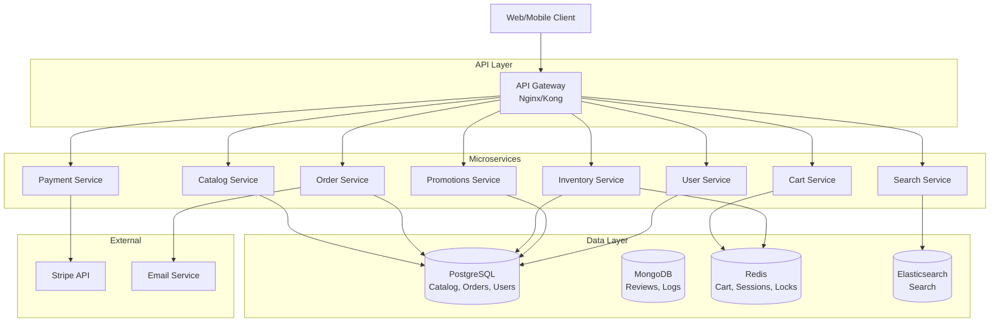

# E-Commerce Backend System Design

> Complete backend architecture for a scalable e-commerce platform

## Table of Contents

1. [Architecture Overview](#architecture-overview)
2. [Catalog Service](#catalog-service)
3. [Search Service](#search-service)
4. [Cart Service](#cart-service)
5. [Order Service](#order-service)
6. [Payment Integration](#payment-integration)
7. [Inventory Management](#inventory-management)
8. [Promotions Engine](#promotions-engine)
9. [User Accounts](#user-accounts)
10. [Consistency Models](#consistency-models)
11. [Concurrency Handling](#concurrency-handling)
12. [Scaling Strategies](#scaling-strategies)

---

## Architecture Overview

### High-Level Architecture



### Technology Stack

| Component | Technology | Reason |
|-----------|-----------|--------|
| **Services** | FastAPI (Python) | High performance, async, easy development |
| **API Gateway** | Nginx/Kong | Routing, rate limiting, auth |
| **Catalog DB** | PostgreSQL | ACID transactions, relational data |
| **Cart Storage** | Redis | Fast, TTL support, atomic operations |
| **Search** | Elasticsearch | Full-text search, facets, ranking |
| **Message Queue** | RabbitMQ | Async processing, event-driven |
| **Caching** | Redis | Session, query caching |
| **Monitoring** | Prometheus + Grafana | Metrics and visualization |

### Design Principles

1. **Microservices**: Independent deployment, scaling
2. **Event-Driven**: Async communication via message queue
3. **API-First**: Well-defined contracts
4. **Stateless Services**: Horizontal scaling
5. **Database per Service**: Data isolation
6. **CQRS**: Separate read/write models where needed

---

## Catalog Service

### Responsibilities

- Product management (CRUD)
- Category hierarchy
- Product attributes and variants
- Brand management
- Image management

### Data Model

```sql
-- Products table
CREATE TABLE products (
    id UUID PRIMARY KEY DEFAULT gen_random_uuid(),
    sku VARCHAR(100) UNIQUE NOT NULL,
    name VARCHAR(500) NOT NULL,
    description TEXT,
    category_id UUID REFERENCES categories(id),
    brand_id UUID REFERENCES brands(id),
    base_price DECIMAL(10,2) NOT NULL,
    status VARCHAR(20) DEFAULT 'active',
    created_at TIMESTAMP DEFAULT NOW(),
    updated_at TIMESTAMP DEFAULT NOW(),
    INDEX idx_category (category_id),
    INDEX idx_brand (brand_id),
    INDEX idx_status (status)
);

-- Categories (hierarchical)
CREATE TABLE categories (
    id UUID PRIMARY KEY,
    name VARCHAR(200) NOT NULL,
    slug VARCHAR(200) UNIQUE NOT NULL,
    parent_id UUID REFERENCES categories(id),
    level INT NOT NULL,
    path VARCHAR(1000), -- Materialized path: /electronics/phones/
    INDEX idx_parent (parent_id),
    INDEX idx_path (path)
);

-- Product variants (size, color, etc.)
CREATE TABLE product_variants (
    id UUID PRIMARY KEY,
    product_id UUID REFERENCES products(id),
    sku VARCHAR(100) UNIQUE NOT NULL,
    attributes JSONB, -- {"size": "L", "color": "red"}
    price_adjustment DECIMAL(10,2) DEFAULT 0,
    stock_quantity INT DEFAULT 0,
    INDEX idx_product (product_id)
);

-- Product attributes
CREATE TABLE product_attributes (
    id UUID PRIMARY KEY,
    product_id UUID REFERENCES products(id),
    attribute_name VARCHAR(100),
    attribute_value VARCHAR(500),
    INDEX idx_product_attr (product_id, attribute_name)
);
```

### API Endpoints

```
GET    /api/v1/products              # List products (paginated)
GET    /api/v1/products/:id          # Get product details
POST   /api/v1/products              # Create product (admin)
PUT    /api/v1/products/:id          # Update product (admin)
DELETE /api/v1/products/:id          # Delete product (admin)

GET    /api/v1/categories            # List categories
GET    /api/v1/categories/:id/products  # Products in category
```

### Caching Strategy

```python
# Cache product details (1 hour TTL)
cache_key = f"product:{product_id}"
product = redis.get(cache_key)
if not product:
    product = db.query(Product).get(product_id)
    redis.setex(cache_key, 3600, json.dumps(product))

# Invalidate on update
def update_product(product_id, data):
    db.update(product_id, data)
    redis.delete(f"product:{product_id}")
    # Publish event for search reindex
    rabbitmq.publish('product.updated', {'id': product_id})
```

---

## Search Service

### Responsibilities

- Full-text product search
- Faceted search (filters)
- Search suggestions/autocomplete
- Ranking and relevance
- Real-time index updates

### Elasticsearch Schema

```json
{
  "mappings": {
    "properties": {
      "id": {"type": "keyword"},
      "sku": {"type": "keyword"},
      "name": {
        "type": "text",
        "analyzer": "standard",
        "fields": {
          "keyword": {"type": "keyword"},
          "suggest": {"type": "completion"}
        }
      },
      "description": {"type": "text"},
      "category": {
        "type": "nested",
        "properties": {
          "id": {"type": "keyword"},
          "name": {"type": "keyword"},
          "path": {"type": "keyword"}
        }
      },
      "brand": {"type": "keyword"},
      "price": {"type": "float"},
      "attributes": {"type": "nested"},
      "in_stock": {"type": "boolean"},
      "rating": {"type": "float"},
      "num_reviews": {"type": "integer"},
      "created_at": {"type": "date"}
    }
  }
}
```

### Search Query Example

```python
# Multi-field search with filters
query = {
    "query": {
        "bool": {
            "must": [
                {
                    "multi_match": {
                        "query": "laptop",
                        "fields": ["name^3", "description", "brand^2"],
                        "type": "best_fields"
                    }
                }
            ],
            "filter": [
                {"term": {"category.id": "electronics"}},
                {"range": {"price": {"gte": 500, "lte": 2000}}},
                {"term": {"in_stock": True}}
            ]
        }
    },
    "aggs": {
        "brands": {"terms": {"field": "brand", "size": 20}},
        "price_ranges": {
            "range": {
                "field": "price",
                "ranges": [
                    {"to": 500},
                    {"from": 500, "to": 1000},
                    {"from": 1000, "to": 2000},
                    {"from": 2000}
                ]
            }
        }
    },
    "sort": [
        {"_score": "desc"},
        {"rating": "desc"}
    ]
}
```

### Real-Time Indexing

```python
# Listen to product events
@rabbitmq.subscribe('product.created')
def index_product(event):
    product = fetch_product(event['id'])
    es.index(index='products', id=product.id, body=product.to_dict())

@rabbitmq.subscribe('product.updated')
def reindex_product(event):
    product = fetch_product(event['id'])
    es.update(index='products', id=product.id, body={'doc': product.to_dict()})

@rabbitmq.subscribe('product.deleted')
def delete_from_index(event):
    es.delete(index='products', id=event['id'])
```

---

## Cart Service

### Responsibilities

- Add/remove/update cart items
- Cart persistence (Redis)
- Anonymous cart → user cart merge
- Cart expiration (TTL)
- Price calculation

### Data Model (Redis)

```python
# Cart stored as hash
# Key: cart:{user_id} or cart:session:{session_id}
# TTL: 7 days for user carts, 1 day for anonymous

cart_data = {
    'user_id': 'uuid',
    'items': [
        {
            'product_id': 'uuid',
            'variant_id': 'uuid',
            'quantity': 2,
            'price': 29.99,  # Snapshot at add time
            'added_at': '2024-01-01T10:00:00Z'
        }
    ],
    'updated_at': '2024-01-01T10:05:00Z',
    'version': 5  # For optimistic locking
}
```

### Concurrency Handling

**Problem**: Multiple requests updating same cart simultaneously

**Solution**: Optimistic locking with versioning

```python
def update_cart(cart_id, updates, expected_version):
    # Get current cart
    cart = redis.hgetall(f"cart:{cart_id}")
    current_version = int(cart.get('version', 0))
    
    # Check version
    if current_version != expected_version:
        raise ConcurrencyError("Cart was modified by another request")
    
    # Apply updates
    cart['items'] = apply_updates(cart['items'], updates)
    cart['version'] = current_version + 1
    cart['updated_at'] = datetime.now().isoformat()
    
    # Save with version check (Lua script for atomicity)
    lua_script = """
    local current_ver = redis.call('HGET', KEYS[1], 'version')
    if current_ver == ARGV[1] then
        redis.call('HMSET', KEYS[1], unpack(ARGV, 2))
        return 1
    else
        return 0
    end
    """
    
    success = redis.eval(lua_script, 1, f"cart:{cart_id}", 
                        expected_version, *flatten(cart))
    
    if not success:
        raise ConcurrencyError("Version mismatch")
    
    return cart
```

### API Endpoints

```
GET    /api/v1/cart                  # Get current cart
POST   /api/v1/cart/items            # Add item
PUT    /api/v1/cart/items/:id        # Update quantity
DELETE /api/v1/cart/items/:id        # Remove item
DELETE /api/v1/cart                  # Clear cart
POST   /api/v1/cart/merge            # Merge anonymous → user cart
```

---

## Order Service

### Responsibilities

- Order creation from cart
- Order state management
- Order history
- Distributed transaction coordination (Saga)

### Order State Machine

```
PENDING → CONFIRMED → PAID → PROCESSING → SHIPPED → DELIVERED
    ↓         ↓         ↓         ↓           ↓
  CANCELLED CANCELLED REFUNDED CANCELLED  RETURNED
```

### Data Model

```sql
CREATE TABLE orders (
    id UUID PRIMARY KEY,
    user_id UUID NOT NULL,
    order_number VARCHAR(50) UNIQUE NOT NULL,
    status VARCHAR(20) NOT NULL,
    subtotal DECIMAL(10,2) NOT NULL,
    discount DECIMAL(10,2) DEFAULT 0,
    tax DECIMAL(10,2) NOT NULL,
    shipping DECIMAL(10,2) NOT NULL,
    total DECIMAL(10,2) NOT NULL,
    
    shipping_address JSONB NOT NULL,
    billing_address JSONB NOT NULL,
    
    payment_method VARCHAR(50),
    payment_id VARCHAR(100),
    
    created_at TIMESTAMP DEFAULT NOW(),
    updated_at TIMESTAMP DEFAULT NOW(),
    
    INDEX idx_user (user_id),
    INDEX idx_status (status),
    INDEX idx_created (created_at)
);

CREATE TABLE order_items (
    id UUID PRIMARY KEY,
    order_id UUID REFERENCES orders(id),
    product_id UUID NOT NULL,
    variant_id UUID,
    sku VARCHAR(100) NOT NULL,
    name VARCHAR(500) NOT NULL,
    quantity INT NOT NULL,
    unit_price DECIMAL(10,2) NOT NULL,
    total_price DECIMAL(10,2) NOT NULL,
    INDEX idx_order (order_id)
);

CREATE TABLE order_history (
    id UUID PRIMARY KEY,
    order_id UUID REFERENCES orders(id),
    status VARCHAR(20) NOT NULL,
    note TEXT,
    created_at TIMESTAMP DEFAULT NOW(),
    INDEX idx_order (order_id)
);
```

### Saga Pattern (Distributed Transaction)

**Order Creation Flow**:

```python
class OrderSaga:
    """
    Coordinates distributed transaction across services:
    1. Reserve inventory
    2. Apply promotions
    3. Create payment intent
    4. Create order
    
    If any step fails, compensate previous steps
    """
    
    async def execute(self, cart_data, user_id):
        saga_state = {
            'inventory_reserved': False,
            'promotion_applied': False,
            'payment_created': False,
            'order_created': False
        }
        
        try:
            # Step 1: Reserve inventory
            reservation_id = await inventory_service.reserve(
                items=cart_data['items'],
                ttl=600  # 10 minutes
            )
            saga_state['inventory_reserved'] = True
            saga_state['reservation_id'] = reservation_id
            
            # Step 2: Apply promotions
            discount = await promotions_service.calculate_discount(
                user_id=user_id,
                items=cart_data['items']
            )
            saga_state['promotion_applied'] = True
            saga_state['discount'] = discount
            
            # Step 3: Create payment intent
            payment_intent = await payment_service.create_intent(
                amount=calculate_total(cart_data, discount),
                currency='usd',
                metadata={'user_id': user_id}
            )
            saga_state['payment_created'] = True
            saga_state['payment_intent_id'] = payment_intent.id
            
            # Step 4: Create order
            order = await create_order(
                user_id=user_id,
                items=cart_data['items'],
                discount=discount,
                payment_intent_id=payment_intent.id
            )
            saga_state['order_created'] = True
            
            return order
            
        except Exception as e:
            # Compensate in reverse order
            await self.compensate(saga_state)
            raise
    
    async def compensate(self, saga_state):
        """Rollback completed steps"""
        if saga_state.get('payment_created'):
            await payment_service.cancel_intent(
                saga_state['payment_intent_id']
            )
        
        if saga_state.get('inventory_reserved'):
            await inventory_service.release_reservation(
                saga_state['reservation_id']
            )
        
        # Promotions don't need compensation (read-only)
```

---

## Payment Integration

### Responsibilities

- Payment intent creation
- Payment confirmation
- Webhook handling
- Refunds
- Idempotency

### Stripe Integration

```python
import stripe

class PaymentService:
    def __init__(self):
        stripe.api_key = settings.STRIPE_SECRET_KEY
    
    async def create_payment_intent(self, amount, currency, metadata, 
                                    idempotency_key):
        """
        Create payment intent with idempotency
        """
        try:
            intent = stripe.PaymentIntent.create(
                amount=int(amount * 100),  # Convert to cents
                currency=currency,
                metadata=metadata,
                idempotency_key=idempotency_key,
                automatic_payment_methods={'enabled': True}
            )
            
            # Store in database
            await db.execute(
                """
                INSERT INTO payment_intents 
                (id, order_id, amount, currency, status, stripe_id)
                VALUES ($1, $2, $3, $4, $5, $6)
                """,
                uuid.uuid4(), metadata['order_id'], amount, 
                currency, 'created', intent.id
            )
            
            return intent
            
        except stripe.error.IdempotencyError as e:
            # Request already processed, return existing intent
            return e.idempotent_request.result
    
    async def handle_webhook(self, payload, sig_header):
        """
        Handle Stripe webhooks
        """
        try:
            event = stripe.Webhook.construct_event(
                payload, sig_header, settings.STRIPE_WEBHOOK_SECRET
            )
        except ValueError:
            raise InvalidWebhookError()
        except stripe.error.SignatureVerificationError:
            raise InvalidSignatureError()
        
        # Handle event
        if event.type == 'payment_intent.succeeded':
            await self.handle_payment_success(event.data.object)
        elif event.type == 'payment_intent.payment_failed':
            await self.handle_payment_failure(event.data.object)
        
        return {'status': 'success'}
    
    async def handle_payment_success(self, payment_intent):
        """Update order status when payment succeeds"""
        order_id = payment_intent.metadata['order_id']
        
        await db.execute(
            """
            UPDATE orders 
            SET status = 'paid', payment_id = $1, updated_at = NOW()
            WHERE id = $2
            """,
            payment_intent.id, order_id
        )
        
        # Confirm inventory reservation
        await inventory_service.confirm_reservation(order_id)
        
        # Send confirmation email
        await email_service.send_order_confirmation(order_id)
```

### Idempotency

```python
# Generate idempotency key from order ID
idempotency_key = f"order_{order_id}_payment"

# Stripe handles duplicate requests automatically
# Same key = same response, no duplicate charge
```

---

## Inventory Management

### Responsibilities

- Stock level tracking
- Inventory reservations
- Stock updates
- Low stock alerts
- Distributed locking

### Data Model

```sql
CREATE TABLE inventory (
    id UUID PRIMARY KEY,
    product_id UUID NOT NULL,
    variant_id UUID,
    warehouse_id UUID NOT NULL,
    quantity INT NOT NULL DEFAULT 0,
    reserved_quantity INT NOT NULL DEFAULT 0,
    available_quantity INT GENERATED ALWAYS AS (quantity - reserved_quantity) STORED,
    
    updated_at TIMESTAMP DEFAULT NOW(),
    
    UNIQUE(product_id, variant_id, warehouse_id),
    INDEX idx_product (product_id),
    CHECK (quantity >= 0),
    CHECK (reserved_quantity >= 0),
    CHECK (reserved_quantity <= quantity)
);

CREATE TABLE inventory_reservations (
    id UUID PRIMARY KEY,
    order_id UUID,
    product_id UUID NOT NULL,
    variant_id UUID,
    quantity INT NOT NULL,
    status VARCHAR(20) DEFAULT 'pending', -- pending, confirmed, released
    expires_at TIMESTAMP NOT NULL,
    created_at TIMESTAMP DEFAULT NOW(),
    
    INDEX idx_order (order_id),
    INDEX idx_expires (expires_at)
);
```

### Concurrency: Pessimistic Locking

**Problem**: Prevent overselling when multiple orders placed simultaneously

**Solution**: Distributed lock + database row lock

```python
async def reserve_inventory(items, order_id, ttl=600):
    """
    Reserve inventory with distributed locking
    """
    reservation_id = str(uuid.uuid4())
    
    for item in items:
        lock_key = f"inventory_lock:{item['product_id']}"
        
        # Acquire distributed lock (Redis)
        async with RedisLock(lock_key, timeout=5):
            # Check availability with row lock
            inventory = await db.fetch_one(
                """
                SELECT * FROM inventory 
                WHERE product_id = $1 AND variant_id = $2
                FOR UPDATE  -- Pessimistic lock
                """,
                item['product_id'], item.get('variant_id')
            )
            
            if inventory['available_quantity'] < item['quantity']:
                raise InsufficientStockError(
                    f"Only {inventory['available_quantity']} available"
                )
            
            # Create reservation
            await db.execute(
                """
                INSERT INTO inventory_reservations
                (id, order_id, product_id, variant_id, quantity, expires_at)
                VALUES ($1, $2, $3, $4, $5, NOW() + INTERVAL '$6 seconds')
                """,
                uuid.uuid4(), order_id, item['product_id'],
                item.get('variant_id'), item['quantity'], ttl
            )
            
            # Update reserved quantity
            await db.execute(
                """
                UPDATE inventory
                SET reserved_quantity = reserved_quantity + $1
                WHERE product_id = $2 AND variant_id = $3
                """,
                item['quantity'], item['product_id'], item.get('variant_id')
            )
    
    return reservation_id
```

### Concurrency: Optimistic Locking (Alternative)

```python
async def reserve_inventory_optimistic(items, order_id):
    """
    Reserve using compare-and-swap (CAS)
    """
    for item in items:
        max_retries = 3
        
        for attempt in range(max_retries):
            # Read current state
            inventory = await db.fetch_one(
                """
                SELECT quantity, reserved_quantity, version
                FROM inventory
                WHERE product_id = $1
                """,
                item['product_id']
            )
            
            available = inventory['quantity'] - inventory['reserved_quantity']
            
            if available < item['quantity']:
                raise InsufficientStockError()
            
            # Try to update with version check
            result = await db.execute(
                """
                UPDATE inventory
                SET reserved_quantity = reserved_quantity + $1,
                    version = version + 1
                WHERE product_id = $2 AND version = $3
                RETURNING id
                """,
                item['quantity'], item['product_id'], inventory['version']
            )
            
            if result:
                # Success
                break
            
            if attempt == max_retries - 1:
                raise ConcurrencyError("Failed to reserve after retries")
            
            # Retry with exponential backoff
            await asyncio.sleep(0.1 * (2 ** attempt))
```

### Cleanup Expired Reservations

```python
# Background job (runs every minute)
async def cleanup_expired_reservations():
    expired = await db.fetch_all(
        """
        SELECT * FROM inventory_reservations
        WHERE status = 'pending' AND expires_at < NOW()
        """
    )
    
    for reservation in expired:
        # Release reserved quantity
        await db.execute(
            """
            UPDATE inventory
            SET reserved_quantity = reserved_quantity - $1
            WHERE product_id = $2
            """,
            reservation['quantity'], reservation['product_id']
        )
        
        # Mark as released
        await db.execute(
            """
            UPDATE inventory_reservations
            SET status = 'released'
            WHERE id = $1
            """,
            reservation['id']
        )
```

---

## Promotions Engine

### Responsibilities

- Discount rules management
- Coupon codes
- Promotion validation
- Stacking rules
- Usage tracking

### Data Model

```sql
CREATE TABLE promotions (
    id UUID PRIMARY KEY,
    code VARCHAR(50) UNIQUE,
    name VARCHAR(200) NOT NULL,
    type VARCHAR(20) NOT NULL, -- percentage, fixed, bogo, free_shipping
    value DECIMAL(10,2),
    
    conditions JSONB, -- Eligibility rules
    max_uses INT,
    max_uses_per_user INT,
    current_uses INT DEFAULT 0,
    
    start_date TIMESTAMP NOT NULL,
    end_date TIMESTAMP NOT NULL,
    active BOOLEAN DEFAULT TRUE,
    
    created_at TIMESTAMP DEFAULT NOW(),
    INDEX idx_code (code),
    INDEX idx_dates (start_date, end_date)
);

CREATE TABLE promotion_usage (
    id UUID PRIMARY KEY,
    promotion_id UUID REFERENCES promotions(id),
    user_id UUID NOT NULL,
    order_id UUID NOT NULL,
    discount_amount DECIMAL(10,2) NOT NULL,
    created_at TIMESTAMP DEFAULT NOW(),
    
    INDEX idx_promotion (promotion_id),
    INDEX idx_user (user_id)
);
```

### Rules Engine

```python
class PromotionsEngine:
    async def calculate_discount(self, user_id, cart_items, coupon_code=None):
        """
        Calculate total discount for cart
        """
        discounts = []
        
        # Auto-applied promotions
        auto_promos = await self.get_active_auto_promotions()
        for promo in auto_promos:
            if await self.is_eligible(promo, user_id, cart_items):
                discount = self.calculate_promo_discount(promo, cart_items)
                discounts.append(discount)
        
        # Coupon code
        if coupon_code:
            promo = await self.get_promotion_by_code(coupon_code)
            if await self.validate_coupon(promo, user_id):
                discount = self.calculate_promo_discount(promo, cart_items)
                discounts.append(discount)
        
        # Apply stacking rules
        final_discount = self.apply_stacking_rules(discounts)
        
        return final_discount
    
    async def is_eligible(self, promo, user_id, cart_items):
        """
        Check if user/cart meets promotion conditions
        """
        conditions = promo['conditions']
        
        # Minimum purchase amount
        if 'min_amount' in conditions:
            cart_total = sum(item['price'] * item['quantity'] 
                           for item in cart_items)
            if cart_total < conditions['min_amount']:
                return False
        
        # Specific categories
        if 'categories' in conditions:
            cart_categories = {item['category_id'] for item in cart_items}
            if not cart_categories & set(conditions['categories']):
                return False
        
        # First-time customer
        if conditions.get('first_time_only'):
            order_count = await db.fetch_val(
                "SELECT COUNT(*) FROM orders WHERE user_id = $1",
                user_id
            )
            if order_count > 0:
                return False
        
        return True
    
    async def validate_coupon(self, promo, user_id):
        """
        Validate coupon usage limits
        """
        # Check if active and within date range
        now = datetime.now()
        if not promo['active'] or not (promo['start_date'] <= now <= promo['end_date']):
            raise InvalidCouponError("Coupon is not active")
        
        # Check total usage limit
        if promo['max_uses'] and promo['current_uses'] >= promo['max_uses']:
            raise InvalidCouponError("Coupon usage limit reached")
        
        # Check per-user limit
        if promo['max_uses_per_user']:
            user_uses = await db.fetch_val(
                """
                SELECT COUNT(*) FROM promotion_usage
                WHERE promotion_id = $1 AND user_id = $2
                """,
                promo['id'], user_id
            )
            if user_uses >= promo['max_uses_per_user']:
                raise InvalidCouponError("You've already used this coupon")
        
        return True
```

---

## User Accounts

### Responsibilities

- User registration/login
- Profile management
- Address book
- Order history
- JWT authentication

### Data Model

```sql
CREATE TABLE users (
    id UUID PRIMARY KEY,
    email VARCHAR(255) UNIQUE NOT NULL,
    password_hash VARCHAR(255) NOT NULL,
    first_name VARCHAR(100),
    last_name VARCHAR(100),
    phone VARCHAR(20),
    email_verified BOOLEAN DEFAULT FALSE,
    status VARCHAR(20) DEFAULT 'active',
    created_at TIMESTAMP DEFAULT NOW(),
    updated_at TIMESTAMP DEFAULT NOW(),
    
    INDEX idx_email (email)
);

CREATE TABLE addresses (
    id UUID PRIMARY KEY,
    user_id UUID REFERENCES users(id),
    type VARCHAR(20), -- shipping, billing
    is_default BOOLEAN DEFAULT FALSE,
    
    full_name VARCHAR(200),
    address_line1 VARCHAR(255) NOT NULL,
    address_line2 VARCHAR(255),
    city VARCHAR(100) NOT NULL,
    state VARCHAR(100),
    postal_code VARCHAR(20) NOT NULL,
    country VARCHAR(2) NOT NULL,
    phone VARCHAR(20),
    
    created_at TIMESTAMP DEFAULT NOW(),
    INDEX idx_user (user_id)
);
```

### Authentication

```python
from passlib.context import CryptContext
import jwt
from datetime import datetime, timedelta

pwd_context = CryptContext(schemes=["bcrypt"], deprecated="auto")

class AuthService:
    def hash_password(self, password: str) -> str:
        return pwd_context.hash(password)
    
    def verify_password(self, plain_password: str, hashed_password: str) -> bool:
        return pwd_context.verify(plain_password, hashed_password)
    
    def create_access_token(self, user_id: str, expires_delta: timedelta = None):
        if expires_delta is None:
            expires_delta = timedelta(hours=24)
        
        expire = datetime.utcnow() + expires_delta
        
        payload = {
            'sub': user_id,
            'exp': expire,
            'iat': datetime.utcnow()
        }
        
        token = jwt.encode(payload, settings.JWT_SECRET, algorithm='HS256')
        return token
    
    async def register(self, email: str, password: str, **kwargs):
        # Check if email exists
        existing = await db.fetch_one(
            "SELECT id FROM users WHERE email = $1", email
        )
        if existing:
            raise EmailAlreadyExistsError()
        
        # Hash password
        password_hash = self.hash_password(password)
        
        # Create user
        user_id = await db.fetch_val(
            """
            INSERT INTO users (id, email, password_hash, first_name, last_name)
            VALUES ($1, $2, $3, $4, $5)
            RETURNING id
            """,
            uuid.uuid4(), email, password_hash, 
            kwargs.get('first_name'), kwargs.get('last_name')
        )
        
        # Send verification email
        await email_service.send_verification(email)
        
        return user_id
    
    async def login(self, email: str, password: str):
        # Get user
        user = await db.fetch_one(
            "SELECT * FROM users WHERE email = $1", email
        )
        
        if not user or not self.verify_password(password, user['password_hash']):
            raise InvalidCredentialsError()
        
        # Create token
        token = self.create_access_token(str(user['id']))
        
        return {
            'access_token': token,
            'token_type': 'bearer',
            'user': {
                'id': str(user['id']),
                'email': user['email'],
                'first_name': user['first_name'],
                'last_name': user['last_name']
            }
        }
```

---

## Consistency Models

### CAP Theorem Trade-offs

| Service | Consistency | Availability | Partition Tolerance | Choice |
|---------|-------------|--------------|---------------------|--------|
| **Catalog** | Eventual | High | Yes | AP (cache invalidation) |
| **Cart** | Strong | High | Yes | CP (Redis atomic ops) |
| **Order** | Strong | Medium | Yes | CP (ACID transactions) |
| **Inventory** | Strong | Medium | Yes | CP (distributed locks) |
| **Search** | Eventual | High | Yes | AP (async indexing) |
| **Payment** | Strong | Medium | Yes | CP (idempotency) |

### Consistency Patterns

#### 1. Strong Consistency (Orders, Inventory)

```python
# ACID transaction
async with db.transaction():
    # Create order
    order_id = await create_order(...)
    
    # Reserve inventory
    await reserve_inventory(...)
    
    # If any fails, entire transaction rolls back
```

#### 2. Eventual Consistency (Catalog → Search)

```python
# Update catalog (immediate)
await db.execute("UPDATE products SET name = $1 WHERE id = $2", name, id)

# Publish event for async processing
await rabbitmq.publish('product.updated', {'id': id})

# Search index updated eventually (within seconds)
@rabbitmq.subscribe('product.updated')
async def update_search_index(event):
    product = await fetch_product(event['id'])
    await es.update(index='products', id=product.id, body=product)
```

#### 3. Causal Consistency (User Actions)

```python
# Ensure user sees their own writes
# Use session affinity or read-your-writes pattern

# Write to master
await master_db.execute("INSERT INTO addresses ...")

# Read from replica with lag check
address = await replica_db.fetch_one(
    "SELECT * FROM addresses WHERE id = $1", address_id
)

# If not found, read from master (read-your-writes)
if not address:
    address = await master_db.fetch_one(
        "SELECT * FROM addresses WHERE id = $1", address_id
    )
```

---

## Concurrency Handling

### Cart vs Inventory Conflicts

**Scenario**: User adds last item to cart while another user is checking out

```
Time  User A                    User B                    Inventory
----  ----------------------    ----------------------    ---------
T1    View product (stock: 1)   
T2                              View product (stock: 1)   
T3    Add to cart ✓                                       stock: 1
T4                              Add to cart ✓             stock: 1
T5    Checkout → Reserve        
T6                              Checkout → Reserve        
T7    Reserve succeeds ✓                                  reserved: 1
T8                              Reserve FAILS ✗           (already reserved)
```

**Solution**: Inventory reservation at checkout, not at cart add

```python
# Adding to cart (no inventory check)
async def add_to_cart(user_id, product_id, quantity):
    # Just add to cart, don't reserve
    await redis.hset(f"cart:{user_id}", product_id, quantity)
    return {'status': 'added'}

# Checkout (reserve inventory)
async def checkout(user_id):
    cart = await get_cart(user_id)
    
    try:
        # Reserve inventory with locks
        reservation_id = await reserve_inventory(cart.items)
        
        # Create order
        order = await create_order(user_id, cart, reservation_id)
        
        return order
        
    except InsufficientStockError as e:
        # Show which items are out of stock
        return {'error': 'Some items are no longer available', 'details': e.items}
```

### Optimistic vs Pessimistic Locking

**Optimistic Locking** (Cart updates):
- Assume conflicts are rare
- Use versioning
- Retry on conflict
- Better performance

**Pessimistic Locking** (Inventory updates):
- Assume conflicts are common
- Use database row locks
- Block concurrent access
- Prevents overselling

```python
# Optimistic (Cart)
UPDATE cart SET items = $1, version = version + 1
WHERE user_id = $2 AND version = $3

# Pessimistic (Inventory)
SELECT * FROM inventory WHERE product_id = $1 FOR UPDATE
UPDATE inventory SET quantity = quantity - $2 WHERE product_id = $1
```

---

## Scaling Strategies

### Horizontal Scaling

#### 1. Stateless Services

```yaml
# Kubernetes deployment
apiVersion: apps/v1
kind: Deployment
metadata:
  name: catalog-service
spec:
  replicas: 5  # Scale to 5 instances
  selector:
    matchLabels:
      app: catalog
  template:
    spec:
      containers:
      - name: catalog
        image: catalog-service:latest
        resources:
          requests:
            memory: "256Mi"
            cpu: "250m"
          limits:
            memory: "512Mi"
            cpu: "500m"
```

#### 2. Database Scaling

**Read Replicas**:
```python
# Write to master
await master_db.execute("INSERT INTO products ...")

# Read from replica
products = await replica_db.fetch_all("SELECT * FROM products WHERE ...")
```

**Sharding** (by user_id):
```python
def get_shard(user_id):
    return hash(user_id) % NUM_SHARDS

# Route to appropriate shard
shard = get_shard(user_id)
db = db_connections[shard]
orders = await db.fetch_all("SELECT * FROM orders WHERE user_id = $1", user_id)
```

#### 3. Caching Layers

```
Client → CDN (static assets)
       → Redis (hot data: products, cart)
       → Database (cold data)
```

```python
# Multi-level caching
async def get_product(product_id):
    # L1: In-memory cache
    if product_id in memory_cache:
        return memory_cache[product_id]
    
    # L2: Redis cache
    cached = await redis.get(f"product:{product_id}")
    if cached:
        memory_cache[product_id] = cached
        return cached
    
    # L3: Database
    product = await db.fetch_one(
        "SELECT * FROM products WHERE id = $1", product_id
    )
    
    # Populate caches
    await redis.setex(f"product:{product_id}", 3600, json.dumps(product))
    memory_cache[product_id] = product
    
    return product
```

#### 4. Load Balancing

```
                    Load Balancer
                         |
        +----------------+----------------+
        |                |                |
   Service A-1      Service A-2      Service A-3
```

**Strategies**:
- Round-robin
- Least connections
- IP hash (session affinity)

### Performance Optimization

#### 1. Database Indexing

```sql
-- Composite index for common queries
CREATE INDEX idx_products_category_price 
ON products(category_id, price DESC);

-- Partial index for active products
CREATE INDEX idx_active_products 
ON products(created_at DESC) 
WHERE status = 'active';
```

#### 2. Query Optimization

```python
# Bad: N+1 query problem
orders = await db.fetch_all("SELECT * FROM orders")
for order in orders:
    items = await db.fetch_all(
        "SELECT * FROM order_items WHERE order_id = $1", order['id']
    )

# Good: Join or batch fetch
orders = await db.fetch_all("""
    SELECT o.*, json_agg(oi.*) as items
    FROM orders o
    LEFT JOIN order_items oi ON oi.order_id = o.id
    GROUP BY o.id
""")
```

#### 3. Connection Pooling

```python
# Database connection pool
db_pool = await asyncpg.create_pool(
    dsn=DATABASE_URL,
    min_size=10,
    max_size=50,
    command_timeout=60
)
```

---

## Summary

This e-commerce backend provides:

✅ **Complete Microservices**: 8 independent services  
✅ **Robust Catalog**: Products, categories, variants  
✅ **Powerful Search**: Elasticsearch with facets  
✅ **Reliable Cart**: Redis with concurrency control  
✅ **Order Management**: Saga pattern for distributed transactions  
✅ **Payment Integration**: Stripe with idempotency  
✅ **Inventory Control**: Distributed locks, reservations  
✅ **Promotions**: Flexible rules engine  
✅ **User Management**: JWT auth, profiles  
✅ **Strong Consistency**: Where needed (orders, inventory)  
✅ **Eventual Consistency**: Where acceptable (catalog, search)  
✅ **Concurrency Handling**: Optimistic and pessimistic locking  
✅ **Horizontal Scaling**: Stateless services, read replicas, caching  

**Next Steps**: See implementation guide for step-by-step code examples.
