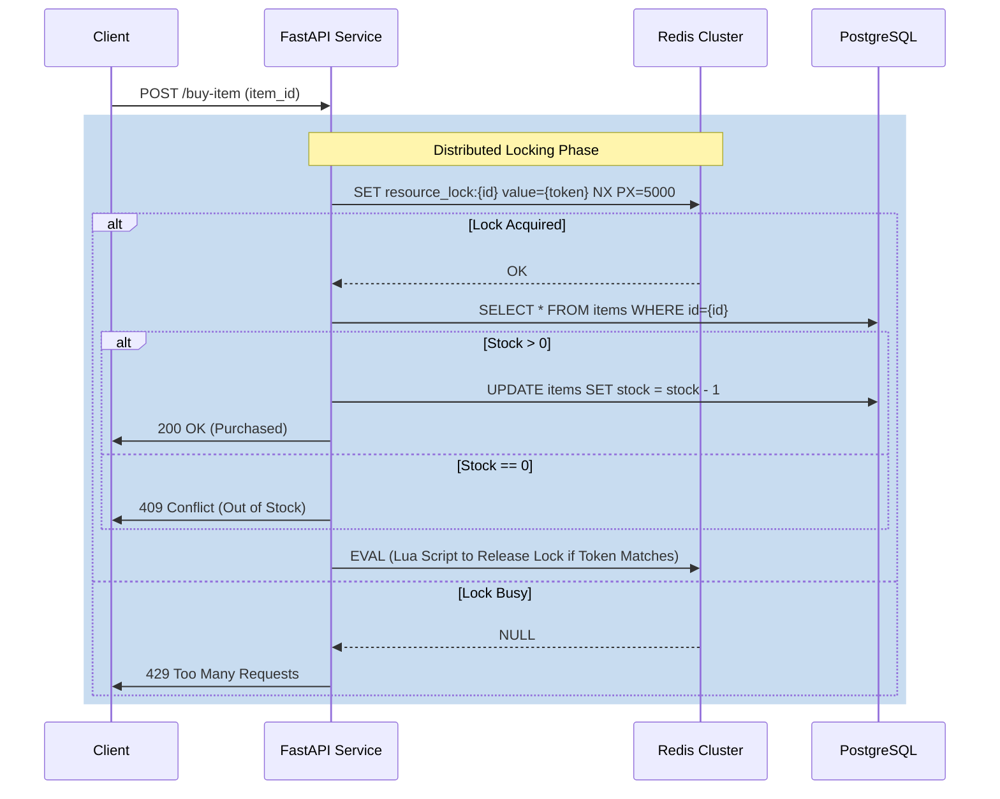
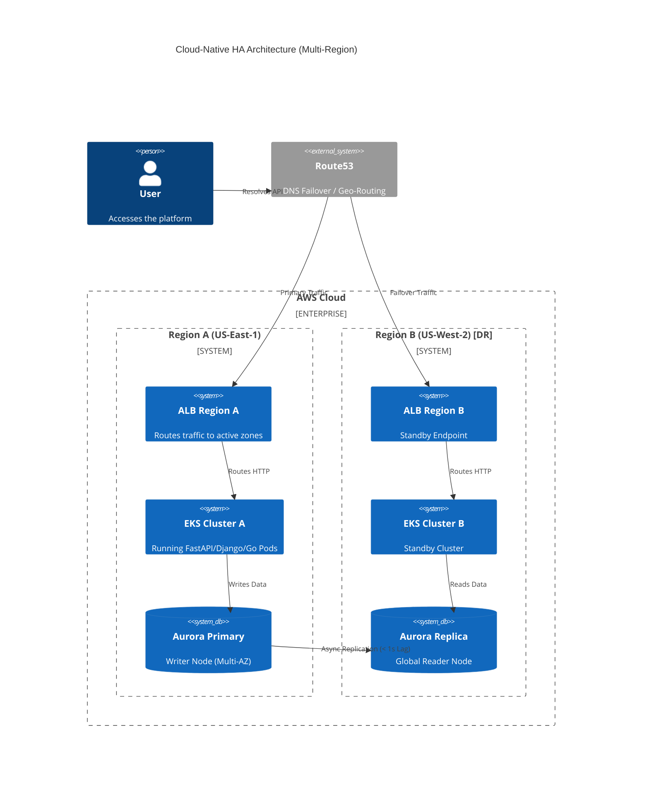
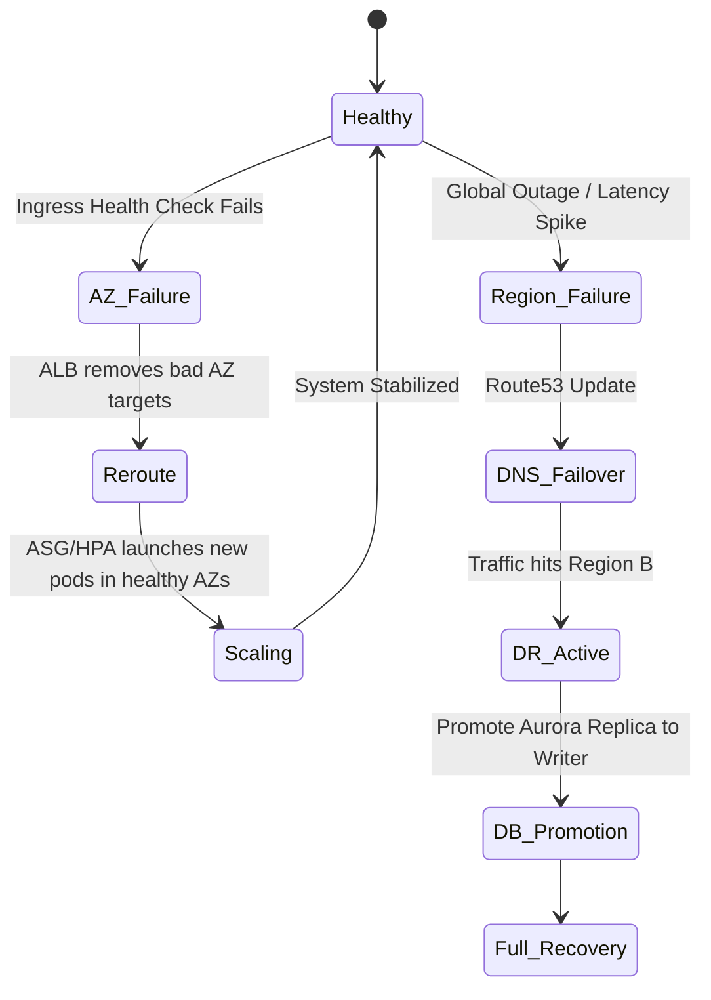
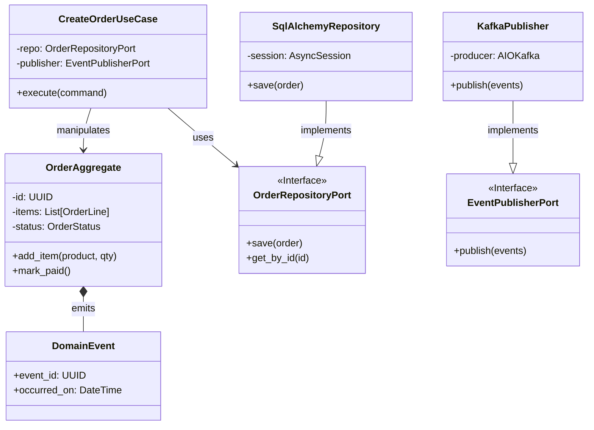
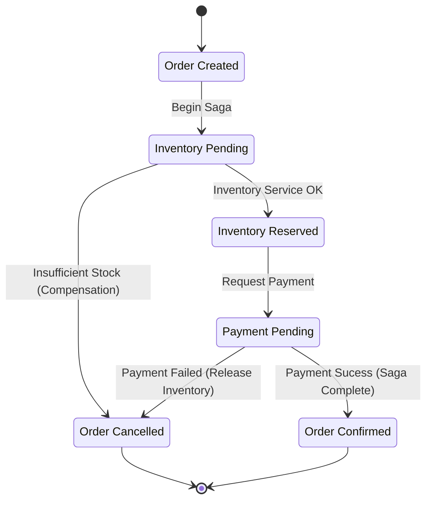

# Master System Architecture Overview

This document provides a comprehensive visual and technical overview of the three architectural systems implemented in this laboratory environment.

## Table of Contents
1.  [Executive Summary](#executive-summary)
2.  [Race Condition Mitigation Strategies](#1-race-condition-mitigation-strategies)
3.  [Cloud-Native High Availability Architecture](#2-cloud-native-high-availability-architecture)
4.  [Enterprise Reference Architecture (DDD & Hexagonal)](#3-enterprise-reference-architecture-ddd--hexagonal)

---

## Executive Summary

| System | Primary Goal | Key Technologies | Architectural Style |
| :--- | :--- | :--- | :--- |
| **Race Mitigation** | Data Consistency & Integrity | Redis Lock (Redlock), Postgres Advisory Locks | Distributed Services |
| **Cloud-Native HA** | 99.99% Availability & Resilience | AWS EKS, Aurora Multi-AZ, Terraform | Microservices on K8s |
| **Enterprise Ref** | Maintainability & Scalability | Python, DDD, Ports & Adapters | Hexagonal / Event-Driven |

---

## 1. Race Condition Mitigation Strategies

**Location**: `~/Documents/labs/System-Design/Race-Condition-Mitigation/`

This system addresses concurrent access problems (Inventory Overselling, Double Spending) using various locking strategies.

### 1.1 Locking & Consistency Flow

The following sequence diagram illustrates the **Redlock** algorithm used in the FastAPI service to prevent overselling inventory.



### 1.2 System Components

```mermaid
graph TD
    subgraph "Race Condition Mitigation Lab"
        LB[Load Balancer] --> FastAPI[FastAPI (Inventory)]
        LB --> Django[Django (Wallet/Payment)]
        LB --> Go[Go Service (Reservation)]
        
        FastAPI -->|Redlock| Redis[(Redis)]
        FastAPI -->|Advisory Locks| DB[(PostgreSQL)]
        
        Django -->|select_for_update| DB
        Django -->|Optimistic Lock| DB
        
        Go -->|SETNX| Redis
    end
```

---

## 2. Cloud-Native High Availability Architecture

**Location**: `~/Documents/labs/System-Design/Cloud-Native-HA/`

This architecture ensures zero single points of failure using Multi-AZ deployments and automated failover.

### 2.1 Multi-Region Deployment Model (C4 System Context)



### 2.2 Automated Failover Workflow



---

## 3. Enterprise Reference Architecture (DDD & Hexagonal)

**Location**: `~/Documents/labs/System-Design/Enterprise-Reference-Architecture/`

This reference system implements the **Order Context** using strict Clean Architecture principles.

### 3.1 Hexagonal Architecture (Class Diagram)

Detailed view of how the `Order` component isolates Domain logic from Infrastructure.



### 3.2 Saga Orchestration State Machine

The order lifecycle involves coordination between Order, Inventory, and Payment services.


