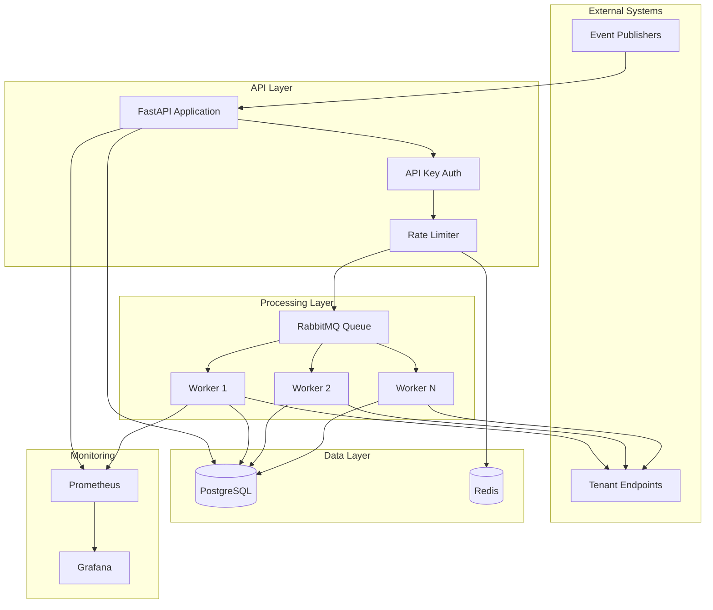

# Architecture Documentation

## System Overview

The Webhook Delivery Platform is a production-ready system designed to reliably deliver webhook events to tenant endpoints with comprehensive retry mechanisms, idempotency guarantees, and observability.

## High-Level Architecture



## Component Details

### 1. API Gateway (FastAPI)

**Responsibilities**:
- Tenant registration and management
- Webhook endpoint configuration
- Event ingestion
- API key authentication
- Rate limiting enforcement
- Metrics exposure

**Key Features**:
- RESTful API with OpenAPI documentation
- Async request handling
- Structured JSON logging
- Prometheus metrics integration

**Endpoints**:
- `/api/v1/tenants` - Tenant CRUD operations
- `/api/v1/events` - Event publishing
- `/api/v1/dlq` - Dead-letter queue management
- `/metrics` - Prometheus metrics
- `/health` - Health check

### 2. Message Queue (RabbitMQ)

**Purpose**: Decouple event ingestion from delivery

**Benefits**:
- Asynchronous processing
- Load leveling
- Fault tolerance
- Horizontal scalability

**Queue Configuration**:
- Durable queues (survive broker restarts)
- Message persistence
- Prefetch count = 1 (fair distribution)
- Dead-letter exchange for failed messages

### 3. Delivery Workers (Celery)

**Responsibilities**:
- Fetch events from queue
- Generate HMAC signatures
- Deliver webhooks via HTTP POST
- Handle retries with exponential backoff
- Move failed events to DLQ

**Worker Configuration**:
- Concurrency: 4 tasks per worker
- Task time limit: 5 minutes
- Soft time limit: 4 minutes
- Max tasks per child: 1000 (memory management)

**Retry Strategy**:
```python
Attempt 1: Immediate
Attempt 2: 1s delay   (2^0)
Attempt 3: 2s delay   (2^1)
Attempt 4: 4s delay   (2^2)
Attempt 5: 8s delay   (2^3)
Attempt 6: 16s delay  (2^4)
Attempt 7: 32s delay  (2^5, max)
```

### 4. Database (PostgreSQL)

**Schema Design**:

#### Tenants Table
```sql
- id (PK)
- name
- email (unique)
- api_key (unique, indexed)
- secret_key (for HMAC)
- rate_limit
- is_active
- created_at, updated_at
```

#### Webhook Endpoints Table
```sql
- id (PK)
- tenant_id (FK)
- url
- event_types (JSON array)
- is_active
- created_at, updated_at
```

#### Events Table
```sql
- id (PK)
- event_id (unique, indexed)
- tenant_id (FK, indexed)
- event_type (indexed)
- payload (JSON)
- idempotency_key (unique, indexed)
- status (enum: pending, success, failed, retrying)
- created_at, updated_at
```

#### Delivery Attempts Table
```sql
- id (PK)
- event_id (FK)
- endpoint_id (FK)
- attempt_number
- status
- http_status_code
- response_body
- error_message
- duration_ms
- attempted_at
- next_retry_at
```

#### Dead Letter Queue Table
```sql
- id (PK)
- event_id (FK)
- tenant_id (FK)
- endpoint_id (FK)
- total_attempts
- last_error
- last_http_status
- event_type
- payload (JSON snapshot)
- is_resolved
- created_at, resolved_at
```

**Indexes**:
- Composite index on (tenant_id, event_type)
- Index on (status, created_at) for efficient queries
- Index on next_retry_at for retry scheduling

### 5. Cache (Redis)

**Use Cases**:

1. **Rate Limiting** (DB 0):
   - Token bucket per tenant
   - Key: `rate_limit:tenant:{tenant_id}`
   - Value: Hash with `tokens` and `last_refill`

2. **Celery Results** (DB 1):
   - Task result storage
   - Task state tracking

**Configuration**:
- Max connections: 50
- Connection pooling enabled
- Persistence: RDB snapshots

### 6. Monitoring Stack

#### Prometheus
**Metrics Collected**:
- `webhook_events_published_total{tenant_id, event_type}` - Counter
- `webhook_delivery_attempts_total` - Counter
- `webhook_delivery_success_total` - Counter
- `webhook_delivery_failure_total` - Counter
- `webhook_delivery_duration_seconds` - Histogram
- `webhook_rate_limit_hits_total{tenant_id}` - Counter
- `webhook_dlq_size` - Gauge
- `webhook_active_tenants` - Gauge

#### Grafana
**Dashboards**:
- Event throughput over time
- Delivery success rate (%)
- P50/P95/P99 latency
- Retry attempt distribution
- DLQ size trends
- Per-tenant metrics

## Data Flow

### Event Publishing Flow

```
1. Publisher sends event to /api/v1/events
   ↓
2. API validates API key → Get tenant
   ↓
3. Check rate limit (Redis token bucket)
   ↓ (if allowed)
4. Generate idempotency key (SHA256 of event_id + tenant_id)
   ↓
5. Check for duplicate event in database
   ↓ (if new)
6. Create event record in PostgreSQL
   ↓
7. Query matching webhook endpoints
   ↓
8. For each endpoint:
   - Enqueue delivery task to RabbitMQ
   ↓
9. Return 201 Created response
```

### Webhook Delivery Flow

```
1. Worker fetches task from RabbitMQ
   ↓
2. Generate HMAC-SHA256 signature
   ↓
3. Prepare HTTP POST request with headers:
   - X-Webhook-Signature: sha256={signature}
   - X-Webhook-Event-Id: {event_id}
   - X-Webhook-Event-Type: {event_type}
   - X-Webhook-Delivery-Attempt: {attempt_number}
   ↓
4. Send HTTP POST to tenant endpoint (30s timeout)
   ↓
5. Record delivery attempt in database
   ↓
6. If 2xx response:
   - Mark event as SUCCESS
   - Update metrics
   - Done ✓
   ↓
7. If non-2xx or error:
   - Calculate next retry delay (exponential backoff)
   - Record failed attempt
   - If attempts < max_retries:
     → Schedule retry task
   - Else:
     → Move to Dead Letter Queue
     → Mark event as FAILED
```

### Idempotency Mechanism

```
Idempotency Key = SHA256(event_id + ":" + tenant_id)

Example:
- event_id: "evt_123"
- tenant_id: 42
- Key: SHA256("evt_123:42") = "a1b2c3..."

Database constraint: UNIQUE(idempotency_key)

If duplicate detected:
- Return existing event (200 OK)
- No new delivery triggered
- Idempotent behavior guaranteed
```

### Rate Limiting Algorithm

**Token Bucket Implementation**:

```python
bucket_capacity = tenant.rate_limit  # e.g., 100
refill_rate = capacity / window      # e.g., 100/60 = 1.67 tokens/sec

On each request:
1. Get current bucket state from Redis
2. Calculate elapsed time since last refill
3. Add tokens: min(capacity, current + elapsed * refill_rate)
4. If tokens >= 1:
   - Consume 1 token
   - Allow request
5. Else:
   - Calculate retry_after
   - Return 429 Too Many Requests
```

## Security Model

### Authentication
- API key-based authentication
- Header: `X-API-Key: {api_key}`
- Keys are 64-character hex strings (256 bits)
- Stored hashed in database (future enhancement)

### Webhook Signature
- HMAC-SHA256 with tenant secret key
- Payload: JSON string with sorted keys
- Header: `X-Webhook-Signature: sha256={hex_digest}`
- Recipients verify using their secret key

### Best Practices
1. Rotate API keys periodically
2. Use HTTPS for all webhook endpoints
3. Verify signatures on webhook receipt
4. Implement IP whitelisting (optional)
5. Rate limit per tenant to prevent abuse

## Scalability Considerations

### Horizontal Scaling

**API Layer**:
- Stateless design
- Scale with load balancer
- Session affinity not required

**Worker Layer**:
- Scale workers independently
- Add more worker containers
- RabbitMQ distributes tasks fairly

**Database Layer**:
- Read replicas for queries
- Connection pooling (20 connections per instance)
- Partitioning by tenant_id (future)

### Performance Optimization

1. **Database**:
   - Indexes on frequently queried columns
   - Connection pooling
   - Prepared statements
   - Query optimization

2. **Redis**:
   - Connection pooling
   - Pipeline commands
   - Appropriate TTLs

3. **Workers**:
   - Async HTTP client (httpx)
   - Configurable concurrency
   - Task result expiration

4. **API**:
   - Async request handlers
   - Response streaming
   - Gzip compression

## Reliability Features

### Fault Tolerance
- Automatic retries with exponential backoff
- Dead-letter queue for manual intervention
- Database transactions for consistency
- Idempotent event processing

### Monitoring & Alerting
- Comprehensive metrics
- Structured logging
- Health check endpoints
- Grafana dashboards

### Data Durability
- PostgreSQL with WAL
- Redis persistence (RDB snapshots)
- RabbitMQ durable queues
- Regular database backups

## Future Enhancements

1. **Webhook Replay**: Allow tenants to replay events
2. **Batch Delivery**: Group multiple events in single request
3. **Event Filtering**: Advanced filtering with JSONPath
4. **Webhook Templates**: Custom payload transformations
5. **Multi-Region**: Deploy across regions for low latency
6. **Event Streaming**: Real-time event stream via WebSocket
7. **Audit Logs**: Complete audit trail of all operations
8. **API Key Rotation**: Automated key rotation
9. **Circuit Breaker**: Prevent cascading failures
10. **Priority Queues**: High-priority event delivery
