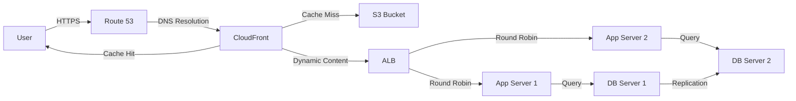
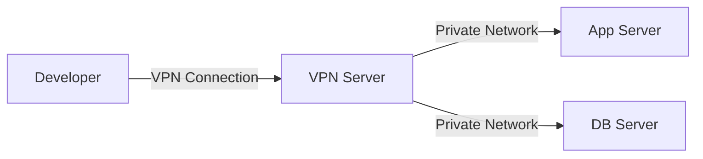
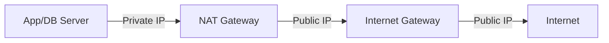

# Architecture Documentation

## Overview

This document provides a detailed explanation of the AWS three-tier architecture with CloudFront CDN, including component interactions, data flow, security architecture, and design decisions.


## Table of Contents

1. [Architecture Components](#architecture-components)
2. [Network Architecture](#network-architecture)
3. [Data Flow](#data-flow)
4. [Security Architecture](#security-architecture)
5. [High Availability Design](#high-availability-design)
6. [Scalability](#scalability)
7. [Disaster Recovery](#disaster-recovery)
8. [Design Decisions](#design-decisions)

---

## Architecture Components

### 1. Edge Layer

#### CloudFront CDN
- **Purpose**: Global content delivery network for low-latency access
- **Features**:
  - Edge locations worldwide
  - HTTPS/TLS encryption
  - Custom SSL certificates
  - Cache behaviors and policies
  - Origin failover
  - Real-time logs
- **Integration**: Serves content from S3 bucket and ALB origin

#### Route 53
- **Purpose**: DNS service and traffic routing
- **Features**:
  - Health checks
  - Routing policies (latency, geolocation, failover)
  - DNSSEC support
  - Domain registration
- **Integration**: Routes traffic to CloudFront distribution

### 2. Storage Layer

#### S3 Bucket
- **Purpose**: Static content storage (images, CSS, JavaScript, media)
- **Features**:
  - Versioning enabled
  - Server-side encryption (SSE-S3 or SSE-KMS)
  - Lifecycle policies
  - Access logging
  - Origin Access Identity (OAI) for CloudFront
- **Integration**: Origin for CloudFront distribution

### 3. Network Layer

#### VPC (Virtual Private Cloud)
- **CIDR Block**: `10.0.0.0/16` (65,536 IP addresses)
- **Availability Zones**: 2 AZs for high availability
- **DNS**: Enabled for hostname resolution
- **Tenancy**: Default (shared hardware)

#### Subnets

**Public Subnets** (2 AZs)
- **CIDR**: `10.0.1.0/24`, `10.0.2.0/24`
- **Resources**: ALB, VPN Server, NAT Gateway
- **Route**: Internet Gateway for internet access
- **Auto-assign Public IP**: Enabled

**Private Subnets - Application Tier** (2 AZs)
- **CIDR**: `10.0.11.0/24`, `10.0.12.0/24`
- **Resources**: Application servers (Auto Scaling Group)
- **Route**: NAT Gateway for outbound internet access
- **Auto-assign Public IP**: Disabled

**Private Subnets - Database Tier** (2 AZs)
- **CIDR**: `10.0.21.0/24`, `10.0.22.0/24`
- **Resources**: Database servers (Auto Scaling Group)
- **Route**: NAT Gateway for outbound internet access
- **Auto-assign Public IP**: Disabled

#### Internet Gateway
- **Purpose**: Internet connectivity for public subnets
- **Attached to**: VPC
- **Route**: `0.0.0.0/0` → Internet Gateway (in public route table)

#### NAT Gateway
- **Purpose**: Outbound internet access for private subnets
- **Location**: Public subnet (one per AZ for HA)
- **Elastic IP**: Assigned for static public IP
- **Route**: `0.0.0.0/0` → NAT Gateway (in private route tables)

### 4. Compute Layer

#### VPN Server
- **Purpose**: Secure administrative access to private resources
- **Instance Type**: `t3.small`
- **Location**: Public subnet
- **Software**: OpenVPN or WireGuard
- **Access**: Developers and administrators
- **Security**: Security Group restricts access to specific IPs

#### Application Load Balancer (ALB)
- **Purpose**: Distribute traffic across application servers
- **Type**: Application Load Balancer (Layer 7)
- **Scheme**: Internet-facing
- **Location**: Public subnets (multi-AZ)
- **Features**:
  - Path-based routing
  - Host-based routing
  - SSL/TLS termination
  - Health checks
  - Sticky sessions
  - Access logs

#### Application Servers (Auto Scaling Group)
- **Purpose**: Run application logic and serve dynamic content
- **Instance Type**: `t3.medium` (configurable)
- **Location**: Private subnets (multi-AZ)
- **Scaling**:
  - Min: 2 instances
  - Max: 6 instances
  - Desired: 2 instances
- **Health Checks**: ALB health checks
- **User Data**: Automated application deployment

#### Database Servers (Auto Scaling Group)
- **Purpose**: Data persistence and management
- **Instance Type**: `t3.large` (configurable)
- **Location**: Private subnets (multi-AZ)
- **Scaling**:
  - Min: 2 instances
  - Max: 4 instances
  - Desired: 2 instances
- **Configuration**: MongoDB replica set or similar
- **Backups**: Automated snapshots

### 5. Security Components

#### Security Groups

**VPN Server Security Group**
- Inbound: SSH (22) from specific IPs, VPN port (1194/443)
- Outbound: All traffic

**ALB Security Group**
- Inbound: HTTP (80), HTTPS (443) from `0.0.0.0/0`
- Outbound: Application server ports

**Application Server Security Group**
- Inbound: Application port from ALB security group
- Outbound: Database port, internet (via NAT)

**Database Server Security Group**
- Inbound: Database port from application server security group
- Outbound: Replication ports, internet (via NAT)

#### Network ACLs

**Public Subnet NACL**
- Inbound: HTTP/HTTPS, SSH (from specific IPs), ephemeral ports
- Outbound: All traffic

**Private Subnet NACL (Application)**
- Inbound: Application ports, ephemeral ports
- Outbound: All traffic

**Private Subnet NACL (Database)**
- Inbound: Database ports, ephemeral ports
- Outbound: All traffic

#### GuardDuty
- **Purpose**: Threat detection and monitoring
- **Features**:
  - Continuous monitoring
  - Machine learning-based threat detection
  - Integration with CloudWatch Events
  - Findings exported to SNS

### 6. Monitoring & Logging

#### CloudWatch
- **Metrics**: CPU, memory, disk, network, custom application metrics
- **Logs**: Application logs, system logs, VPC flow logs
- **Dashboards**: Real-time visualization
- **Alarms**: Automated alerts for threshold breaches

#### SNS (Simple Notification Service)
- **Purpose**: Alert notifications
- **Subscribers**: Email, SMS, Lambda functions
- **Topics**: Critical alerts, scaling events, security findings

#### CloudTrail
- **Purpose**: API activity logging and auditing
- **Features**:
  - All API calls logged
  - S3 storage with encryption
  - Log file validation
  - Integration with CloudWatch Logs

---

## Network Architecture

### Routing Tables

#### Public Route Table
```
Destination     Target
10.0.0.0/16     local
0.0.0.0/0       igw-xxxxx (Internet Gateway)
```

#### Private Route Table (AZ-A)
```
Destination     Target
10.0.0.0/16     local
0.0.0.0/0       nat-xxxxx-a (NAT Gateway in AZ-A)
```

#### Private Route Table (AZ-B)
```
Destination     Target
10.0.0.0/16     local
0.0.0.0/0       nat-xxxxx-b (NAT Gateway in AZ-B)
```

### IP Address Allocation

| Subnet Type | AZ | CIDR | Usable IPs | Purpose |
|-------------|-----|------|------------|---------|
| Public | us-east-1a | 10.0.1.0/24 | 251 | ALB, NAT-A, VPN |
| Public | us-east-1b | 10.0.2.0/24 | 251 | ALB, NAT-B |
| Private (App) | us-east-1a | 10.0.11.0/24 | 251 | App Servers |
| Private (App) | us-east-1b | 10.0.12.0/24 | 251 | App Servers |
| Private (DB) | us-east-1a | 10.0.21.0/24 | 251 | DB Servers |
| Private (DB) | us-east-1b | 10.0.22.0/24 | 251 | DB Servers |

---

## Data Flow

### User Request Flow (End Users)



**Step-by-step**:
1. User makes HTTPS request to `example.com`
2. Route 53 resolves DNS to CloudFront distribution
3. CloudFront checks cache:
   - **Cache Hit**: Returns cached content (static files)
   - **Cache Miss**: Fetches from origin (S3 or ALB)
4. For dynamic content, CloudFront forwards to ALB
5. ALB distributes request to healthy application servers
6. Application server processes request and queries database
7. Database returns data to application server
8. Application server returns response through ALB → CloudFront → User

### Developer Access Flow



**Step-by-step**:
1. Developer connects to VPN server via public IP
2. VPN server authenticates and establishes tunnel
3. Developer can access private resources (app servers, DB servers)
4. All traffic routed through VPN tunnel

### Outbound Internet Access (Private Instances)



**Step-by-step**:
1. Private instance initiates outbound connection (e.g., software updates)
2. Traffic routed to NAT Gateway in same AZ
3. NAT Gateway translates private IP to public IP
4. Traffic sent to Internet Gateway
5. Response follows reverse path

---

## Security Architecture

### Defense in Depth

```
┌─────────────────────────────────────────────────────────┐
│ Layer 1: Edge Security                                  │
│ - CloudFront WAF (optional)                             │
│ - DDoS Protection (AWS Shield)                          │
│ - SSL/TLS Encryption                                    │
└─────────────────────────────────────────────────────────┘
                          ↓
┌─────────────────────────────────────────────────────────┐
│ Layer 2: Network Security                               │
│ - VPC Isolation                                         │
│ - Network ACLs (Subnet Level)                           │
│ - Private Subnets                                       │
└─────────────────────────────────────────────────────────┘
                          ↓
┌─────────────────────────────────────────────────────────┐
│ Layer 3: Instance Security                              │
│ - Security Groups (Stateful Firewall)                   │
│ - IAM Roles (No Hardcoded Credentials)                  │
│ - SSH Key Pairs                                         │
└─────────────────────────────────────────────────────────┘
                          ↓
┌─────────────────────────────────────────────────────────┐
│ Layer 4: Data Security                                  │
│ - Encryption at Rest (EBS, S3)                          │
│ - Encryption in Transit (TLS)                           │
│ - Database Encryption                                   │
└─────────────────────────────────────────────────────────┘
                          ↓
┌─────────────────────────────────────────────────────────┐
│ Layer 5: Monitoring & Detection                         │
│ - GuardDuty (Threat Detection)                          │
│ - CloudTrail (Audit Logs)                               │
│ - VPC Flow Logs                                         │
│ - CloudWatch Alarms                                     │
└─────────────────────────────────────────────────────────┘
```

### Security Best Practices Implemented

1. **Principle of Least Privilege**
   - Security Groups allow only necessary ports
   - IAM roles with minimal permissions
   - NACLs provide additional subnet-level filtering

2. **Network Segmentation**
   - Public subnets for internet-facing resources only
   - Private subnets for application and database tiers
   - No direct internet access to private instances

3. **Encryption**
   - HTTPS/TLS for all external communication
   - S3 server-side encryption
   - EBS volume encryption
   - Database encryption at rest

4. **Access Control**
   - VPN for administrative access
   - No SSH from internet to private instances
   - Bastion host pattern (VPN server)

5. **Monitoring & Auditing**
   - All API calls logged (CloudTrail)
   - Real-time threat detection (GuardDuty)
   - Automated alerting (CloudWatch + SNS)

---

## High Availability Design

### Multi-AZ Deployment

All critical components deployed across 2 availability zones:

- **ALB**: Automatically distributes across AZs
- **Application Servers**: Auto Scaling Group spans both AZs
- **Database Servers**: Auto Scaling Group spans both AZs
- **NAT Gateway**: One per AZ for redundancy

### Failure Scenarios

#### AZ Failure
- **Impact**: Resources in one AZ become unavailable
- **Recovery**: 
  - ALB automatically routes to healthy AZ
  - Auto Scaling launches replacement instances in healthy AZ
  - Database replication ensures data availability
- **RTO**: < 5 minutes
- **RPO**: Near-zero (synchronous replication)

#### Instance Failure
- **Impact**: Single instance becomes unavailable
- **Recovery**:
  - ALB health checks detect failure
  - ALB stops routing traffic to failed instance
  - Auto Scaling launches replacement instance
- **RTO**: 2-5 minutes
- **RPO**: Zero (stateless application servers)

#### NAT Gateway Failure
- **Impact**: Outbound internet access lost in one AZ
- **Recovery**:
  - Instances in other AZ unaffected
  - Replace failed NAT Gateway
- **RTO**: 5-10 minutes
- **RPO**: N/A

---

## Scalability

### Horizontal Scaling (Auto Scaling)

#### Application Tier
- **Metric**: CPU Utilization, Request Count
- **Scale Out**: Add instances when CPU > 70% for 2 minutes
- **Scale In**: Remove instances when CPU < 30% for 5 minutes
- **Cooldown**: 300 seconds
- **Max Capacity**: 6 instances

#### Database Tier
- **Metric**: CPU Utilization, Connection Count
- **Scale Out**: Add instances when CPU > 80% for 5 minutes
- **Scale In**: Remove instances when CPU < 40% for 10 minutes
- **Cooldown**: 600 seconds
- **Max Capacity**: 4 instances

### Vertical Scaling

- Instance types can be changed via Launch Template updates
- Requires rolling update of Auto Scaling Group
- Minimal downtime with proper deployment strategy

### CloudFront Scaling

- Automatic scaling based on global demand
- No manual intervention required
- Handles traffic spikes seamlessly

---

## Disaster Recovery

### Backup Strategy

#### Application Servers
- **Type**: Stateless (no backups needed)
- **Recovery**: Launch from Launch Template

#### Database Servers
- **Type**: Automated snapshots
- **Frequency**: Daily
- **Retention**: 7 days
- **Location**: S3 (cross-region replication optional)

#### S3 Bucket
- **Versioning**: Enabled
- **Replication**: Cross-region replication (optional)
- **Lifecycle**: Archive to Glacier after 90 days

### Recovery Procedures

#### Complete Region Failure
1. Deploy infrastructure in secondary region using Terraform
2. Restore database from latest snapshot
3. Update Route 53 to point to new region
4. Update CloudFront origin to new ALB
5. **RTO**: 1-2 hours
6. **RPO**: Last snapshot (< 24 hours)

#### Data Corruption
1. Identify corruption time
2. Restore database from snapshot before corruption
3. Replay application logs if available
4. **RTO**: 30 minutes - 1 hour
5. **RPO**: Last snapshot

---

## Design Decisions

### Why CloudFront?
- **Global Performance**: Edge locations reduce latency worldwide
- **Cost Optimization**: Reduces load on origin servers
- **Security**: DDoS protection, WAF integration
- **SSL/TLS**: Centralized certificate management

### Why Multi-AZ?
- **High Availability**: Survive AZ failures
- **Zero Downtime**: Rolling updates possible
- **Performance**: Reduced latency for users in different locations

### Why Private Subnets?
- **Security**: No direct internet exposure
- **Compliance**: Meets security requirements
- **Control**: All outbound traffic through NAT Gateway

### Why Auto Scaling?
- **Cost Efficiency**: Pay only for needed capacity
- **Performance**: Handle traffic spikes automatically
- **Reliability**: Replace failed instances automatically

### Why VPN Instead of Bastion?
- **Security**: Encrypted tunnel for all traffic
- **Convenience**: Access all private resources
- **Compliance**: Meets audit requirements

### Why Separate Database Tier?
- **Security**: Additional isolation layer
- **Performance**: Dedicated resources for database
- **Scalability**: Independent scaling from application tier

---

## Performance Optimization

### CloudFront Optimization
- Cache static content (images, CSS, JS) for 24 hours
- Cache dynamic content for 5 minutes (if applicable)
- Compress objects (gzip, brotli)
- Use HTTP/2 and HTTP/3

### ALB Optimization
- Enable connection draining (300 seconds)
- Configure appropriate health check intervals
- Use target group stickiness for stateful applications

### Application Server Optimization
- Use appropriate instance types (compute-optimized if needed)
- Enable enhanced networking
- Use placement groups for low latency (optional)

### Database Optimization
- Use provisioned IOPS for EBS volumes
- Configure appropriate instance types (memory-optimized)
- Implement read replicas for read-heavy workloads

---

## Cost Breakdown (Estimated Monthly)

| Component | Quantity | Unit Cost | Total |
|-----------|----------|-----------|-------|
| EC2 (App) | 2-6 t3.medium | $30/instance | $60-180 |
| EC2 (DB) | 2-4 t3.large | $60/instance | $120-240 |
| EC2 (VPN) | 1 t3.small | $15/instance | $15 |
| ALB | 1 | $20 + data | $30-50 |
| NAT Gateway | 2 | $32 + data | $80-120 |
| CloudFront | - | Data transfer | $50-200 |
| S3 | - | Storage + requests | $10-50 |
| Route 53 | 1 hosted zone | $0.50 + queries | $5-10 |
| CloudWatch | - | Metrics + logs | $10-30 |
| GuardDuty | - | Events analyzed | $10-30 |
| **Total** | | | **$390-925/month** |

> **Note**: Costs vary based on traffic, data transfer, and usage patterns.

---

## Compliance & Governance

### AWS Well-Architected Framework

This architecture follows the five pillars:

1. **Operational Excellence**: CloudWatch monitoring, automated deployments
2. **Security**: Defense in depth, encryption, least privilege
3. **Reliability**: Multi-AZ, Auto Scaling, automated recovery
4. **Performance Efficiency**: Right-sized instances, caching, CDN
5. **Cost Optimization**: Auto Scaling, reserved instances, lifecycle policies

### Compliance Standards

- **PCI DSS**: Network segmentation, encryption, logging
- **HIPAA**: Encryption, access controls, audit trails
- **SOC 2**: Monitoring, incident response, access management
- **GDPR**: Data encryption, access controls, audit logs

---

## Future Enhancements

1. **WAF Integration**: Add AWS WAF to CloudFront for application-level protection
2. **AWS Shield Advanced**: Enhanced DDoS protection
3. **AWS Config**: Configuration compliance monitoring
4. **AWS Systems Manager**: Centralized instance management
5. **Container Migration**: Move to ECS/EKS for better orchestration
6. **Serverless Components**: Use Lambda for event-driven workloads
7. **Multi-Region**: Deploy to multiple regions for global HA
8. **Database Migration**: Move to managed RDS/Aurora for easier management

---

**Document Version**: 1.0  
**Last Updated**: 2025-12-31  
**Author**: Infrastructure Team
