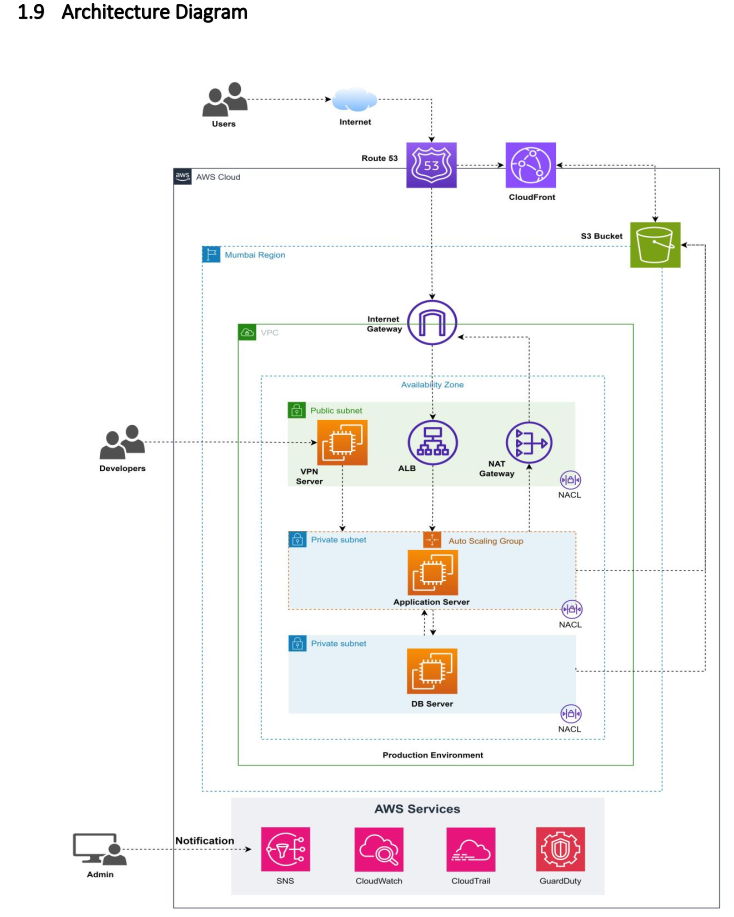

# AWS Three-Tier Production Architecture with CloudFront

A complete, production-ready AWS infrastructure implementing a three-tier architecture with CloudFront CDN, VPC networking, Auto Scaling Groups, and comprehensive monitoring.



## 🏗️ Architecture Overview

This project implements a highly available, scalable, and secure AWS infrastructure with the following components:

### Edge & Content Delivery
- **CloudFront CDN**: Global content delivery with low latency
- **Route 53**: DNS management and routing
- **S3 Bucket**: Static content storage with versioning

### Network Layer
- **VPC**: Isolated network environment across multiple availability zones
- **Public Subnets**: For ALB, VPN Server, and NAT Gateway
- **Private Subnets**: For Application and Database servers
- **Internet Gateway**: Internet access for public resources
- **NAT Gateway**: Outbound internet access for private resources

### Compute Layer
- **VPN Server**: Secure access to private resources
- **Application Load Balancer**: Traffic distribution across application servers
- **Auto Scaling Groups**: Automatic scaling for application and database tiers
- **EC2 Instances**: Application and database servers

### Security
- **Security Groups**: Instance-level firewall rules
- **Network ACLs**: Subnet-level network filtering
- **GuardDuty**: Threat detection and monitoring
- **IAM Roles**: Secure access management

### Monitoring & Logging
- **CloudWatch**: Metrics, logs, and dashboards
- **SNS**: Alert notifications
- **CloudTrail**: API activity logging

## ✨ Features

- ✅ **High Availability**: Multi-AZ deployment for fault tolerance
- ✅ **Auto Scaling**: Automatic capacity adjustment based on demand
- ✅ **Security**: Multiple layers of security controls
- ✅ **Monitoring**: Comprehensive observability with CloudWatch
- ✅ **CDN**: Global content delivery with CloudFront
- ✅ **Infrastructure as Code**: Complete Terraform modules
- ✅ **Documentation**: Detailed setup guides for each component

## 🚀 Quick Start

### Prerequisites

- AWS Account with appropriate permissions
- AWS CLI configured
- Terraform >= 1.0
- SSH key pair for EC2 instances
- Domain name (optional, for Route 53)

### Deployment

1. **Clone and Navigate**
   ```bash
   cd /home/rk/Documents/labs/ha-design-lab/aws-three-tier-cloudfront
   ```

2. **Configure Variables**
   ```bash
   cd terraform/environments/dev
   cp terraform.tfvars.example terraform.tfvars
   # Edit terraform.tfvars with your settings
   ```

3. **Deploy Infrastructure**
   ```bash
   # Initialize Terraform
   terraform init
   
   # Review the plan
   terraform plan
   
   # Apply the configuration
   terraform apply
   ```

4. **Verify Deployment**
   ```bash
   # Run health checks
   ../../scripts/health-check.sh
   ```

### Quick Deployment Script

```bash
./scripts/deploy.sh dev
```

## 📁 Project Structure

```
aws-three-tier-cloudfront/
├── README.md                          # This file
├── ARCHITECTURE.md                    # Detailed architecture documentation
├── QUICK_START.md                     # Quick deployment guide
├── architecture-diagram.png           # Architecture diagram
├── terraform/                         # Infrastructure as Code
│   ├── modules/
│   │   ├── networking/               # VPC, subnets, IGW, NAT
│   │   ├── security/                 # Security Groups, NACLs
│   │   ├── compute/                  # EC2, Auto Scaling Groups
│   │   ├── loadbalancer/            # Application Load Balancer
│   │   ├── cdn/                      # CloudFront, S3
│   │   ├── dns/                      # Route 53
│   │   ├── vpn/                      # VPN Server
│   │   └── monitoring/               # CloudWatch, SNS, CloudTrail
│   ├── environments/
│   │   ├── dev/                      # Development environment
│   │   └── prod/                     # Production environment
│   └── scripts/                      # Terraform helper scripts
├── docs/                             # Detailed documentation
│   ├── 01-VPC-SETUP.md
│   ├── 02-SUBNETS-ROUTING.md
│   ├── 03-INTERNET-GATEWAY-NAT.md
│   ├── 04-SECURITY-GROUPS.md
│   ├── 05-NACLS.md
│   ├── 06-VPN-SERVER.md
│   ├── 07-LOAD-BALANCER.md
│   ├── 08-AUTO-SCALING-APP.md
│   ├── 09-AUTO-SCALING-DB.md
│   ├── 10-S3-BUCKET.md
│   ├── 11-CLOUDFRONT.md
│   ├── 12-ROUTE53.md
│   ├── 13-CLOUDWATCH.md
│   ├── 14-SNS.md
│   ├── 15-CLOUDTRAIL.md
│   ├── 16-GUARDDUTY.md
│   └── 99-TROUBLESHOOTING.md
├── scripts/                          # Deployment scripts
│   ├── deploy.sh                     # Automated deployment
│   ├── destroy.sh                    # Infrastructure teardown
│   ├── validate.sh                   # Configuration validation
│   └── health-check.sh               # Health check script
└── configs/                          # Configuration files
    ├── user-data/
    │   ├── vpn-server.sh            # VPN server initialization
    │   ├── app-server.sh            # Application server setup
    │   └── db-server.sh             # Database server configuration
    └── cloudwatch/
        └── dashboard.json           # CloudWatch dashboard config
```

## 📚 Documentation

### Setup Guides

1. [VPC Setup](docs/01-VPC-SETUP.md) - Virtual Private Cloud configuration
2. [Subnets & Routing](docs/02-SUBNETS-ROUTING.md) - Subnet design and route tables
3. [Internet Gateway & NAT](docs/03-INTERNET-GATEWAY-NAT.md) - Internet connectivity
4. [Security Groups](docs/04-SECURITY-GROUPS.md) - Instance-level security
5. [Network ACLs](docs/05-NACLS.md) - Subnet-level security
6. [VPN Server](docs/06-VPN-SERVER.md) - Secure remote access
7. [Load Balancer](docs/07-LOAD-BALANCER.md) - Application Load Balancer setup
8. [Auto Scaling - Application](docs/08-AUTO-SCALING-APP.md) - Application tier scaling
9. [Auto Scaling - Database](docs/09-AUTO-SCALING-DB.md) - Database tier scaling
10. [S3 Bucket](docs/10-S3-BUCKET.md) - Static content storage
11. [CloudFront](docs/11-CLOUDFRONT.md) - CDN configuration
12. [Route 53](docs/12-ROUTE53.md) - DNS management
13. [CloudWatch](docs/13-CLOUDWATCH.md) - Monitoring and logging
14. [SNS](docs/14-SNS.md) - Notification setup
15. [CloudTrail](docs/15-CLOUDTRAIL.md) - API logging
16. [GuardDuty](docs/16-GUARDDUTY.md) - Threat detection

### Additional Resources

- [Architecture Details](ARCHITECTURE.md) - In-depth architecture explanation
- [Quick Start Guide](QUICK_START.md) - Fast deployment instructions
- [Troubleshooting](docs/99-TROUBLESHOOTING.md) - Common issues and solutions

## 🔧 Configuration

### Environment Variables

Key configuration parameters in `terraform.tfvars`:

```hcl
# Project Configuration
project_name = "three-tier-app"
environment  = "dev"
region       = "us-east-1"

# Network Configuration
vpc_cidr = "10.0.0.0/16"
availability_zones = ["us-east-1a", "us-east-1b"]

# Compute Configuration
app_instance_type = "t3.medium"
db_instance_type  = "t3.large"
app_min_size      = 2
app_max_size      = 6
db_min_size       = 2
db_max_size       = 4

# Domain Configuration (optional)
domain_name = "example.com"
```

## 🛡️ Security Best Practices

- ✅ Private subnets for application and database tiers
- ✅ Security Groups with least privilege access
- ✅ Network ACLs for additional subnet protection
- ✅ VPN for secure administrative access
- ✅ Encryption at rest (S3, EBS)
- ✅ Encryption in transit (HTTPS, TLS)
- ✅ GuardDuty for threat detection
- ✅ CloudTrail for audit logging
- ✅ IAM roles with minimal permissions

## 💰 Cost Optimization

- Auto Scaling to match demand
- NAT Gateway in single AZ for dev (multi-AZ for prod)
- CloudFront caching to reduce origin requests
- S3 lifecycle policies for old content
- Reserved Instances for baseline capacity
- Spot Instances for non-critical workloads (optional)

## 🔍 Monitoring

### CloudWatch Dashboards

- Network metrics (VPC, NAT, ALB)
- Compute metrics (CPU, memory, disk)
- Application metrics (requests, latency, errors)
- Auto Scaling metrics (group size, scaling activities)

### Alarms

- High CPU utilization
- Low healthy host count
- High error rates
- Scaling events
- Security threats (GuardDuty)

## 🧪 Testing

```bash
# Validate Terraform configuration
./scripts/validate.sh

# Run health checks
./scripts/health-check.sh

# Test auto scaling
# Trigger load on application servers

# Test failover
# Terminate an instance and verify ALB redirects traffic
```

## 🗑️ Cleanup

```bash
# Destroy all resources
./scripts/destroy.sh dev

# Or manually
cd terraform/environments/dev
terraform destroy
```

## 📝 License

This project is provided as-is for educational and production use.

## 🤝 Contributing

Contributions are welcome! Please follow these guidelines:

1. Test changes in dev environment first
2. Update documentation for any changes
3. Follow Terraform best practices
4. Ensure security best practices are maintained

## 📞 Support

For issues or questions:
- Check [Troubleshooting Guide](docs/99-TROUBLESHOOTING.md)
- Review [Architecture Documentation](ARCHITECTURE.md)
- Consult individual component guides in `docs/`

## 🎯 Next Steps

After deployment:

1. Configure your application on the application servers
2. Set up database replication and backups
3. Configure CloudWatch dashboards for your metrics
4. Set up SNS notifications for critical alerts
5. Review and adjust Auto Scaling policies
6. Configure Route 53 with your domain
7. Test disaster recovery procedures

---

**Built with ❤️ for production-ready AWS infrastructure**
