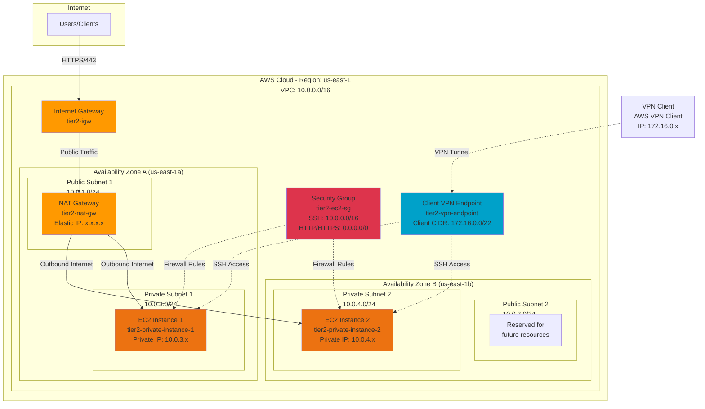
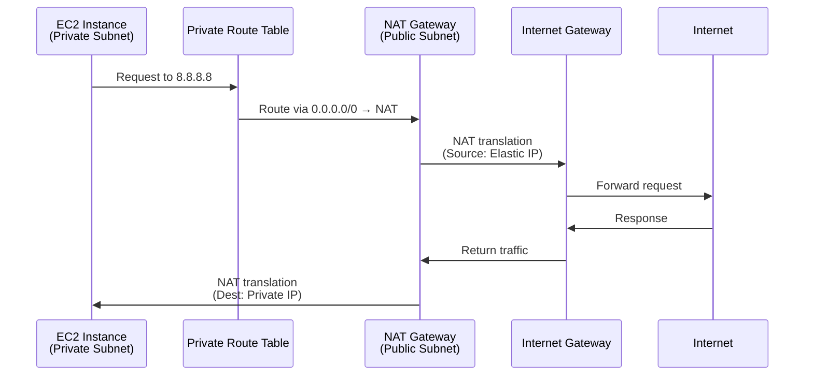
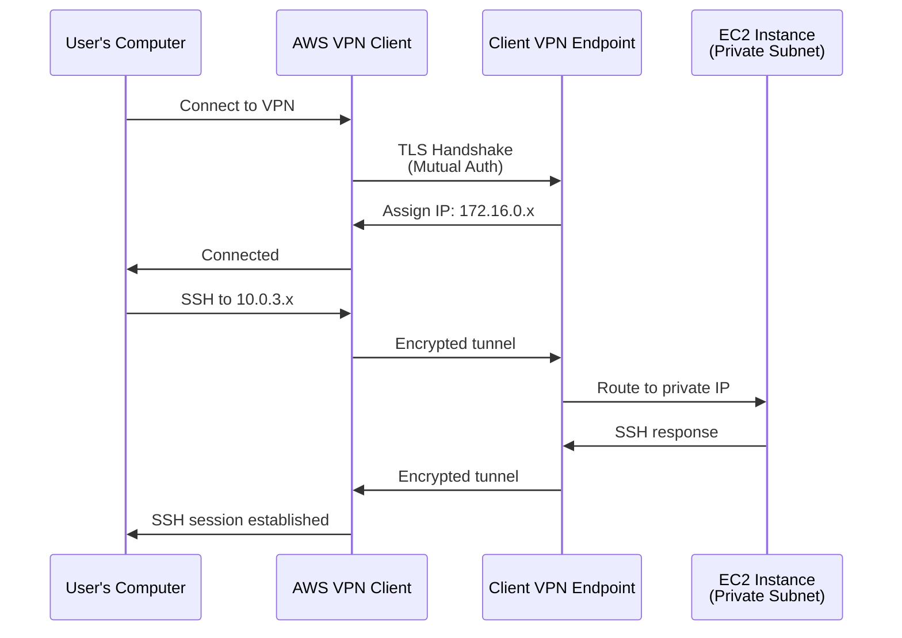
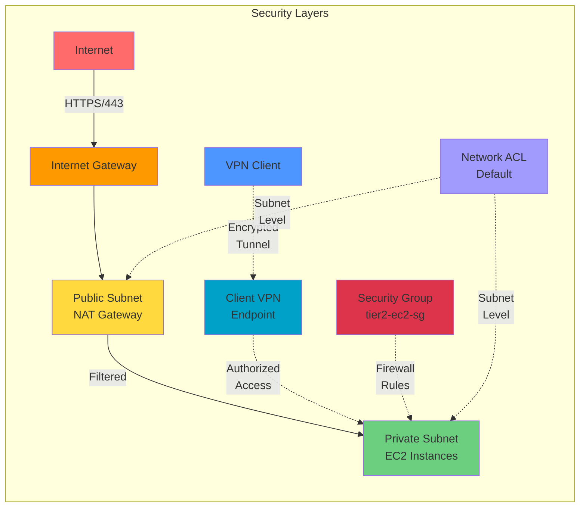
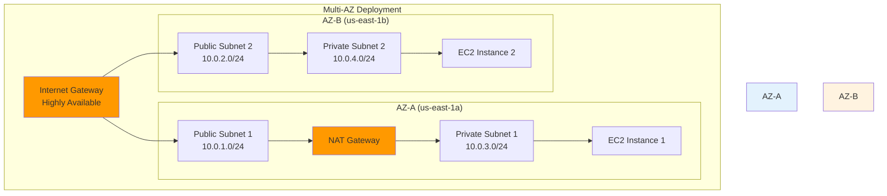
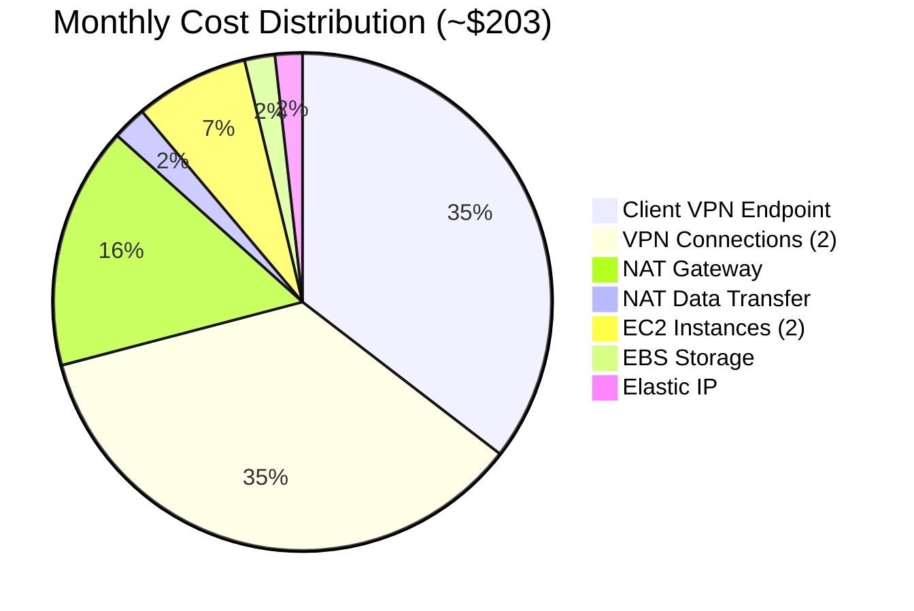

# 🏗️ Tier-2 Architecture Network Diagram

## Complete Architecture Overview



---

## Traffic Flow Diagrams

### Outbound Internet Traffic (Private Instances → Internet)



---

### VPN Access Flow (User → Private Instance)



---

## Network Topology

### Subnet Layout

```
┌─────────────────────────────────────────────────────────────────────┐
│                        VPC: 10.0.0.0/16                             │
│                     (65,536 IP addresses)                           │
├─────────────────────────────────────────────────────────────────────┤
│                                                                      │
│  ┌────────────────────────────────────────────────────────────┐    │
│  │                    PUBLIC TIER                             │    │
│  ├────────────────────────────────────────────────────────────┤    │
│  │                                                            │    │
│  │  ┌──────────────────────┐    ┌──────────────────────┐    │    │
│  │  │ Public Subnet 1      │    │ Public Subnet 2      │    │    │
│  │  │ 10.0.1.0/24          │    │ 10.0.2.0/24          │    │    │
│  │  │ AZ: us-east-1a       │    │ AZ: us-east-1b       │    │    │
│  │  │ IPs: 251 usable      │    │ IPs: 251 usable      │    │    │
│  │  │                      │    │                      │    │    │
│  │  │ ┌──────────────────┐ │    │                      │    │    │
│  │  │ │ NAT Gateway      │ │    │                      │    │    │
│  │  │ │ + Elastic IP     │ │    │                      │    │    │
│  │  │ └──────────────────┘ │    │                      │    │    │
│  │  └──────────────────────┘    └──────────────────────┘    │    │
│  │                                                            │    │
│  │  Route Table: tier2-public-rt                             │    │
│  │  • 10.0.0.0/16 → local                                    │    │
│  │  • 0.0.0.0/0 → Internet Gateway                           │    │
│  └────────────────────────────────────────────────────────────┘    │
│                                                                      │
│  ┌────────────────────────────────────────────────────────────┐    │
│  │                    PRIVATE TIER                            │    │
│  ├────────────────────────────────────────────────────────────┤    │
│  │                                                            │    │
│  │  ┌──────────────────────┐    ┌──────────────────────┐    │    │
│  │  │ Private Subnet 1     │    │ Private Subnet 2     │    │    │
│  │  │ 10.0.3.0/24          │    │ 10.0.4.0/24          │    │    │
│  │  │ AZ: us-east-1a       │    │ AZ: us-east-1b       │    │    │
│  │  │ IPs: 251 usable      │    │ IPs: 251 usable      │    │    │
│  │  │                      │    │                      │    │    │
│  │  │ ┌──────────────────┐ │    │ ┌──────────────────┐ │    │    │
│  │  │ │ EC2 Instance 1   │ │    │ │ EC2 Instance 2   │ │    │    │
│  │  │ │ Private IP only  │ │    │ │ Private IP only  │ │    │    │
│  │  │ └──────────────────┘ │    │ └──────────────────┘ │    │    │
│  │  └──────────────────────┘    └──────────────────────┘    │    │
│  │                                                            │    │
│  │  Route Table: tier2-private-rt                            │    │
│  │  • 10.0.0.0/16 → local                                    │    │
│  │  • 0.0.0.0/0 → NAT Gateway                                │    │
│  └────────────────────────────────────────────────────────────┘    │
│                                                                      │
└─────────────────────────────────────────────────────────────────────┘
```

---

## Security Architecture



---

## IP Address Allocation

| CIDR Block | Network | First IP | Last IP | Usable IPs | Purpose |
|------------|---------|----------|---------|------------|---------|
| **10.0.0.0/16** | 10.0.0.0 | 10.0.0.1 | 10.0.255.254 | 65,534 | **VPC** |
| 10.0.1.0/24 | 10.0.1.0 | 10.0.1.1 | 10.0.1.254 | 251 | Public Subnet 1 (AZ-a) |
| 10.0.2.0/24 | 10.0.2.0 | 10.0.2.1 | 10.0.2.254 | 251 | Public Subnet 2 (AZ-b) |
| 10.0.3.0/24 | 10.0.3.0 | 10.0.3.1 | 10.0.3.254 | 251 | Private Subnet 1 (AZ-a) |
| 10.0.4.0/24 | 10.0.4.0 | 10.0.4.1 | 10.0.4.254 | 251 | Private Subnet 2 (AZ-b) |
| **172.16.0.0/22** | 172.16.0.0 | 172.16.0.1 | 172.16.3.254 | 1,022 | **VPN Clients** |

### Reserved IPs (AWS)
Each subnet reserves 5 IPs:
- `.0` - Network address
- `.1` - VPC router
- `.2` - DNS server
- `.3` - Future use
- `.255` - Broadcast address

---

## High Availability Design



**HA Features**:
- ✅ Resources distributed across 2 AZs
- ✅ Internet Gateway is inherently HA
- ⚠️ Single NAT Gateway (cost optimization)
- 💡 For production: Add NAT Gateway in AZ-B

---

## Cost Breakdown



---

**Return to**: [Main README](../README.md) | [Quick Reference](../QUICK_REFERENCE.md)
