# GitHub Actions CI/CD Architecture

## Overview

This document provides a comprehensive architectural view of the GitHub Actions CI/CD system, including file structure, workflow architecture, and component interactions.

## Table of Contents

1. [Project File Structure](#project-file-structure)
2. [Workflow Architecture](#workflow-architecture)
3. [CI/CD Pipeline Flow](#cicd-pipeline-flow)
4. [Deployment Architecture](#deployment-architecture)
5. [Security Architecture](#security-architecture)
6. [Component Interactions](#component-interactions)

---

## Project File Structure

### Directory Tree

```
lab-4.1/
├── .github/
│   └── workflows/
│       ├── ci-cd.yml                    # Main CI/CD pipeline
│       └── README.md                    # Workflow documentation
│
├── docs/
│   ├── 00-project-requirements.md       # Prerequisites & setup
│   ├── 01-introduction.md               # GitHub Actions fundamentals
│   ├── 02-build-stage.md                # Build configurations
│   ├── 03-test-stage.md                 # Testing strategies
│   ├── 04-deployment-stage.md           # Deployment guides
│   ├── 05-secrets-security.md           # Security best practices
│   ├── 06-problems-solutions.md         # Troubleshooting guide
│   ├── 07-real-world-examples.md        # Production examples
│   ├── QUICK-REFERENCE.md               # Quick reference cheat sheet
│   └── ARCHITECTURE.md                  # This file
│
├── examples/
│   ├── nodejs/
│   │   ├── index.js                     # Express application
│   │   ├── package.json                 # Dependencies & scripts
│   │   └── Dockerfile                   # Multi-stage build
│   │
│   ├── python/
│   │   ├── main.py                      # FastAPI application
│   │   ├── requirements.txt             # Python dependencies
│   │   └── Dockerfile                   # Multi-stage build
│   │
│   ├── java/                            # (Placeholder for Java examples)
│   └── docker/                          # (Placeholder for Docker examples)
│
├── k8s-manifests/
│   ├── deployment.yaml                  # Kubernetes deployment
│   ├── service.yaml                     # Kubernetes service
│   └── ingress.yaml                     # Kubernetes ingress with TLS
│
├── .gitignore                           # Git ignore rules
├── README.md                            # Main project documentation
└── PROJECT-SUMMARY.md                   # Quick project overview
```

### File Structure Diagram

```mermaid
graph TD
    A[lab-4.1/] --> B[.github/]
    A --> C[docs/]
    A --> D[examples/]
    A --> E[k8s-manifests/]
    A --> F[Config Files]
    
    B --> B1[workflows/]
    B1 --> B2[ci-cd.yml]
    B1 --> B3[README.md]
    
    C --> C1[00-project-requirements.md]
    C --> C2[01-introduction.md]
    C --> C3[02-build-stage.md]
    C --> C4[03-test-stage.md]
    C --> C5[04-deployment-stage.md]
    C --> C6[05-secrets-security.md]
    C --> C7[06-problems-solutions.md]
    C --> C8[07-real-world-examples.md]
    C --> C9[QUICK-REFERENCE.md]
    C --> C10[ARCHITECTURE.md]
    
    D --> D1[nodejs/]
    D --> D2[python/]
    D --> D3[java/]
    D --> D4[docker/]
    
    D1 --> D1A[index.js]
    D1 --> D1B[package.json]
    D1 --> D1C[Dockerfile]
    
    D2 --> D2A[main.py]
    D2 --> D2B[requirements.txt]
    D2 --> D2C[Dockerfile]
    
    E --> E1[deployment.yaml]
    E --> E2[service.yaml]
    E --> E3[ingress.yaml]
    
    F --> F1[.gitignore]
    F --> F2[README.md]
    F --> F3[PROJECT-SUMMARY.md]
    
    style B2 fill:#4CAF50
    style C1 fill:#2196F3
    style C2 fill:#2196F3
    style C3 fill:#2196F3
    style C4 fill:#2196F3
    style C5 fill:#2196F3
    style C6 fill:#2196F3
    style C7 fill:#2196F3
    style C8 fill:#2196F3
    style D1A fill:#FFC107
    style D2A fill:#FFC107
    style E1 fill:#9C27B0
```

### Component Explanation

| Directory/File | Purpose | Key Contents |
|----------------|---------|--------------|
| **`.github/workflows/`** | GitHub Actions workflows | CI/CD pipeline definitions |
| **`docs/`** | Documentation | 9 comprehensive guides covering all aspects |
| **`examples/`** | Sample applications | Node.js, Python apps with Dockerfiles |
| **`k8s-manifests/`** | Kubernetes configs | Deployment, service, ingress manifests |
| **`README.md`** | Main documentation | Project overview, quick start, features |
| **`PROJECT-SUMMARY.md`** | Quick overview | Statistics, file list, usage guide |

---

## Workflow Architecture

### Complete CI/CD Pipeline

```mermaid
graph TB
    subgraph "Trigger Events"
        T1[Push to main/develop]
        T2[Pull Request]
        T3[Manual Dispatch]
    end
    
    subgraph "Stage 1: Code Quality"
        L1[ESLint]
        L2[Prettier]
        L3[Code Standards]
    end
    
    subgraph "Stage 2: Security Scanning"
        S1[Snyk Scan]
        S2[Trivy Scan]
        S3[npm audit]
        S4[Upload SARIF]
    end
    
    subgraph "Stage 3: Build"
        B1[Install Dependencies]
        B2[Build Application]
        B3[Upload Artifacts]
    end
    
    subgraph "Stage 4: Test"
        TS1[Unit Tests]
        TS2[Integration Tests]
        TS3[Coverage Report]
        TS4[Publish Results]
    end
    
    subgraph "Stage 5: Docker"
        D1[Setup Buildx]
        D2[Login to Registry]
        D3[Build Multi-Platform]
        D4[Push Image]
        D5[Scan Image]
    end
    
    subgraph "Stage 6: Deploy Dev"
        DEV1[Configure kubectl]
        DEV2[Deploy to Dev]
        DEV3[Smoke Tests]
    end
    
    subgraph "Stage 7: Deploy Staging"
        STG1[Configure kubectl]
        STG2[Deploy to Staging]
        STG3[E2E Tests]
    end
    
    subgraph "Stage 8: Deploy Production"
        PROD1[Manual Approval]
        PROD2[Deploy to Prod]
        PROD3[Smoke Tests]
        PROD4[Rollback on Failure]
        PROD5[Slack Notification]
    end
    
    T1 --> L1
    T2 --> L1
    T3 --> L1
    
    L1 --> L2 --> L3
    L3 --> S1
    
    S1 --> S2 --> S3 --> S4
    S4 --> B1
    
    B1 --> B2 --> B3
    B3 --> TS1
    
    TS1 --> TS2 --> TS3 --> TS4
    TS4 --> D1
    
    D1 --> D2 --> D3 --> D4 --> D5
    D5 --> DEV1
    
    DEV1 --> DEV2 --> DEV3
    DEV3 --> STG1
    
    STG1 --> STG2 --> STG3
    STG3 --> PROD1
    
    PROD1 --> PROD2 --> PROD3
    PROD3 --> PROD4 --> PROD5
    
    style L1 fill:#FFC107
    style S1 fill:#F44336
    style B1 fill:#4CAF50
    style TS1 fill:#2196F3
    style D1 fill:#9C27B0
    style DEV1 fill:#00BCD4
    style STG1 fill:#FF9800
    style PROD1 fill:#E91E63
```

### Pipeline Stage Details

#### Stage 1: Code Quality (Lint)
- **Purpose**: Ensure code meets quality standards
- **Tools**: ESLint, Prettier
- **Duration**: ~30 seconds
- **Runs on**: All branches

#### Stage 2: Security Scanning
- **Purpose**: Identify vulnerabilities early
- **Tools**: Snyk, Trivy, npm audit
- **Duration**: ~2 minutes
- **Output**: SARIF files uploaded to GitHub Security

#### Stage 3: Build
- **Purpose**: Compile and package application
- **Actions**: Install dependencies, build, create artifacts
- **Duration**: ~1-3 minutes
- **Caching**: npm/pip dependencies cached

#### Stage 4: Test
- **Purpose**: Validate functionality
- **Types**: Unit, integration tests
- **Services**: PostgreSQL, Redis (for integration tests)
- **Duration**: ~2-5 minutes
- **Output**: Coverage reports, test results

#### Stage 5: Docker
- **Purpose**: Create container images
- **Features**: Multi-platform (amd64, arm64), layer caching
- **Registry**: GitHub Container Registry (GHCR)
- **Duration**: ~3-5 minutes
- **Security**: Image scanning with Trivy

#### Stage 6-8: Deployments
- **Environments**: Development → Staging → Production
- **Strategy**: Progressive deployment with gates
- **Rollback**: Automatic on failure
- **Verification**: Smoke tests at each stage

---

## CI/CD Pipeline Flow

### High-Level Flow Diagram

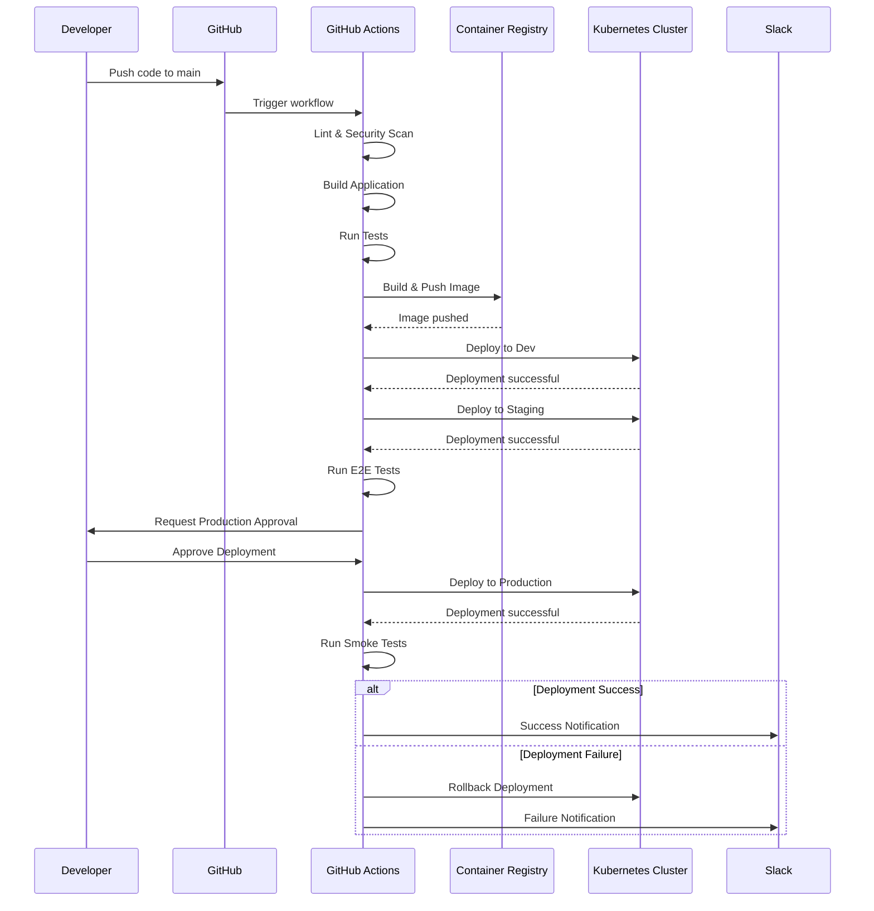

### Detailed Workflow Execution

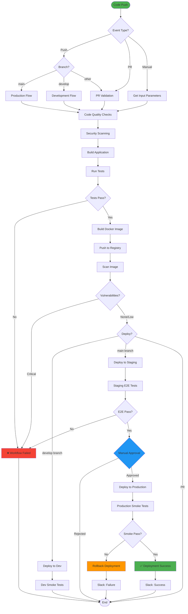

---

## Deployment Architecture

### Multi-Environment Deployment

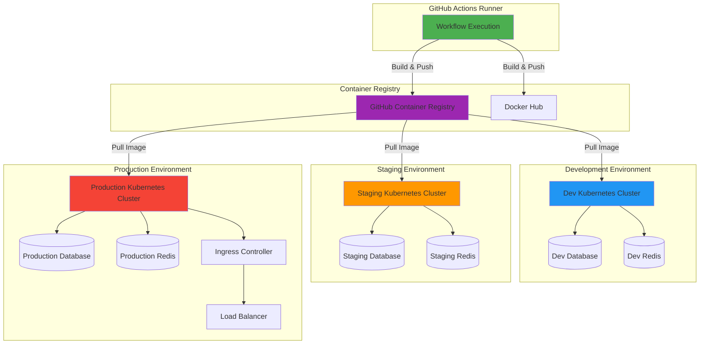

### Kubernetes Deployment Architecture

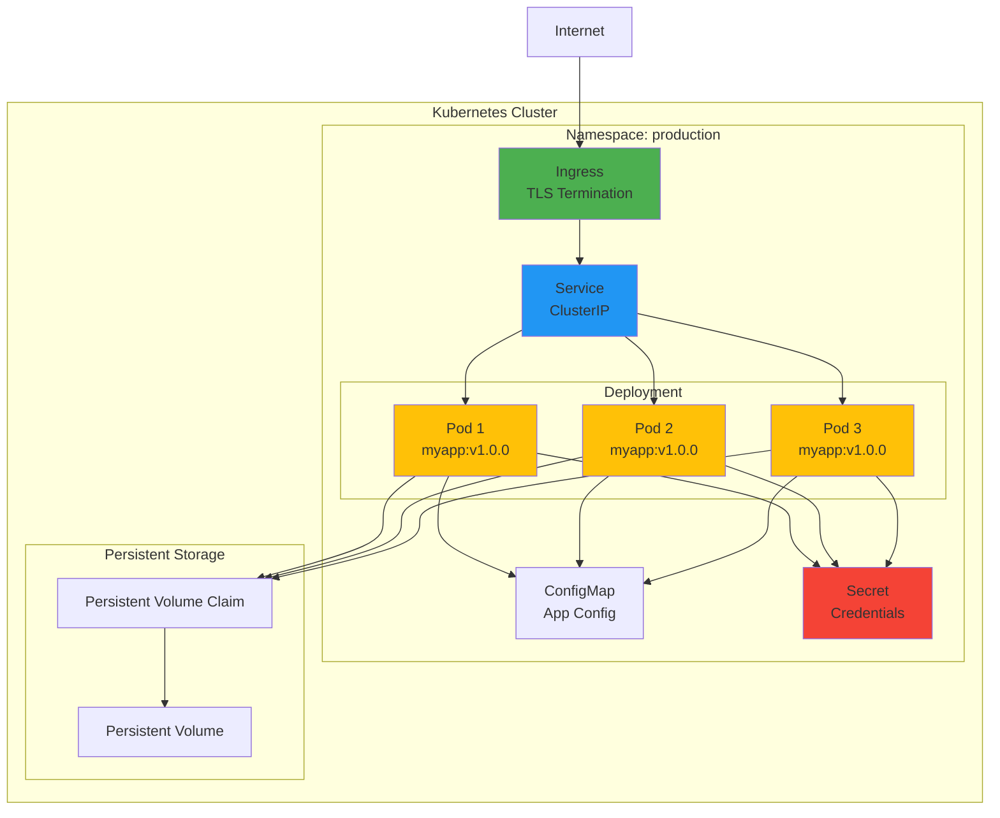

---

## Security Architecture

### Secrets Management Flow

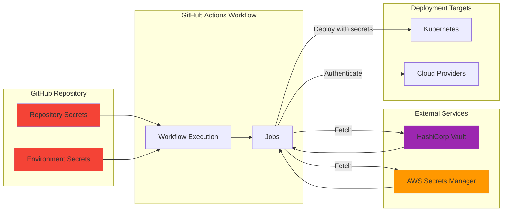

### OIDC Authentication Flow

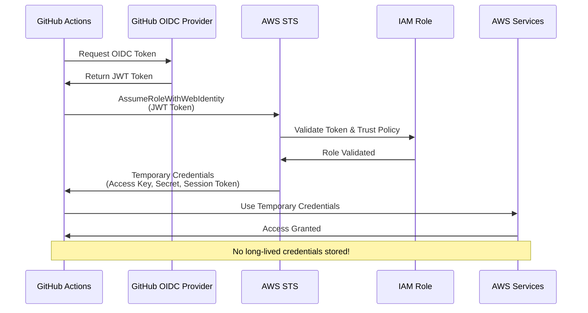

---

## Component Interactions

### Application Build Flow

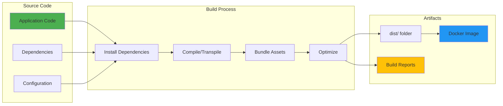

### Test Execution Flow

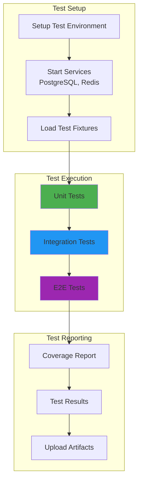

### Docker Build Process

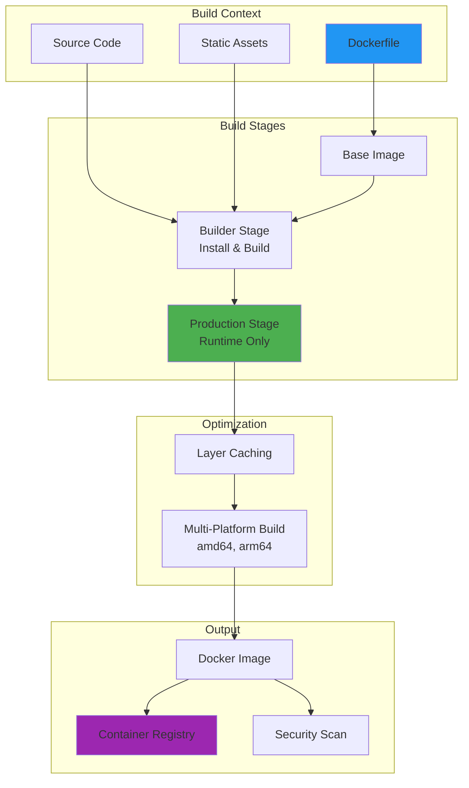

---

## Summary

### Architecture Highlights

| Component | Technology | Purpose |
|-----------|-----------|---------|
| **CI/CD Platform** | GitHub Actions | Workflow automation |
| **Container Registry** | GHCR, Docker Hub | Image storage |
| **Orchestration** | Kubernetes | Container management |
| **Security Scanning** | Snyk, Trivy | Vulnerability detection |
| **Testing** | Jest, Pytest, Playwright | Quality assurance |
| **Notifications** | Slack | Team communication |
| **Secrets** | GitHub Secrets, OIDC | Secure credential management |

### Key Architectural Principles

1. **Progressive Deployment**: Dev → Staging → Production with gates
2. **Security First**: OIDC, scanning, minimal permissions
3. **Fail Fast**: Early detection of issues
4. **Automatic Rollback**: Safety net for production
5. **Parallel Execution**: Optimize pipeline speed
6. **Caching**: Reduce build times
7. **Multi-Environment**: Isolated testing environments

### File Organization Benefits

- **Modular Documentation**: Easy to navigate and update
- **Separation of Concerns**: Workflows, examples, manifests separated
- **Reusable Components**: Examples can be copied directly
- **Clear Structure**: Logical grouping of related files

---

> [!TIP]
> This architecture is designed to be scalable, secure, and maintainable. Each component can be modified independently without affecting others.
