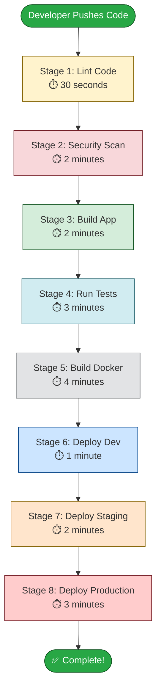
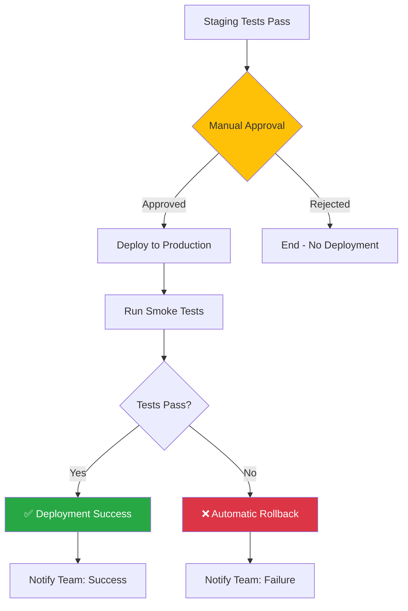

# GitHub Actions CI/CD - Step-by-Step Guide with Diagrams

## 📖 Complete Beginner-Friendly Guide

This guide breaks down the entire GitHub Actions CI/CD system into simple, easy-to-understand steps with visual diagrams and detailed explanations.

---

## Table of Contents

1. [Understanding the Big Picture](#understanding-the-big-picture)
2. [Step-by-Step Pipeline Execution](#step-by-step-pipeline-execution)
3. [File Organization Explained](#file-organization-explained)
4. [How Each Component Works](#how-each-component-works)
5. [Deployment Flow Explained](#deployment-flow-explained)
6. [Security Flow Explained](#security-flow-explained)

---

## Understanding the Big Picture

### What Happens When You Push Code?

```
┌─────────────────────────────────────────────────────────────────┐
│  STEP 1: Developer Pushes Code to GitHub                        │
└─────────────────────────────────────────────────────────────────┘
                            ↓
┌─────────────────────────────────────────────────────────────────┐
│  STEP 2: GitHub Actions Automatically Starts                    │
└─────────────────────────────────────────────────────────────────┘
                            ↓
┌─────────────────────────────────────────────────────────────────┐
│  STEP 3: Code is Checked, Built, and Tested                     │
└─────────────────────────────────────────────────────────────────┘
                            ↓
┌─────────────────────────────────────────────────────────────────┐
│  STEP 4: Docker Image is Created                                │
└─────────────────────────────────────────────────────────────────┘
                            ↓
┌─────────────────────────────────────────────────────────────────┐
│  STEP 5: Application is Deployed to Servers                     │
└─────────────────────────────────────────────────────────────────┘
                            ↓
┌─────────────────────────────────────────────────────────────────┐
│  STEP 6: You Get Notified (Success or Failure)                  │
└─────────────────────────────────────────────────────────────────┘
```

### Simple Explanation

| What | Why | Example |
|------|-----|---------|
| **Push Code** | You made changes and want to deploy | `git push origin main` |
| **Automatic Start** | GitHub detects the push | Workflow file triggers |
| **Check & Build** | Make sure code works | Run tests, compile code |
| **Create Image** | Package app in container | Docker builds image |
| **Deploy** | Put app on servers | Kubernetes updates pods |
| **Notify** | Tell you what happened | Slack message or email |

---

## Step-by-Step Pipeline Execution

### The 8 Stages Explained



### Detailed Stage Breakdown

#### Stage 1: Code Quality Check (Lint)

**What Happens:**
```
Your Code → ESLint → Prettier → Code Standards Check
```

**Purpose:** Make sure code follows best practices

**Tools Used:**
- **ESLint**: Finds JavaScript errors
- **Prettier**: Checks code formatting
- **Code Standards**: Ensures consistency

**Example Output:**
```
✅ No linting errors found
✅ Code is properly formatted
✅ All standards met
```

**If It Fails:**
```
❌ Found 3 linting errors
   - Line 45: Unused variable 'data'
   - Line 67: Missing semicolon
   - Line 89: Inconsistent indentation
```

---

#### Stage 2: Security Scanning

**What Happens:**
```
Dependencies → Snyk Scan → Trivy Scan → npm audit → Report
```

**Purpose:** Find security vulnerabilities before deployment

**Tools Used:**

| Tool | What It Scans | Example Finding |
|------|---------------|-----------------|
| **Snyk** | Code vulnerabilities | "SQL injection risk in line 45" |
| **Trivy** | Container images | "Outdated base image with CVE-2023-1234" |
| **npm audit** | Package dependencies | "lodash 4.17.0 has critical vulnerability" |

**Example Output:**
```
🔒 Security Scan Results:
   ✅ No critical vulnerabilities
   ⚠️  2 medium severity issues found
   📊 Full report uploaded to GitHub Security
```

---

#### Stage 3: Build Application

**What Happens:**
```
Source Code → Install Dependencies → Compile → Create Build Files
```

**Purpose:** Turn source code into runnable application

**Steps in Detail:**

1. **Install Dependencies**
   ```bash
   npm install
   # Downloads: express, react, etc.
   ```

2. **Compile Code**
   ```bash
   npm run build
   # TypeScript → JavaScript
   # SCSS → CSS
   ```

3. **Create Artifacts**
   ```bash
   dist/
   ├── index.js
   ├── styles.css
   └── assets/
   ```

**Caching Magic:**
```
First Build:  ⏱️ 3 minutes (download everything)
Second Build: ⏱️ 30 seconds (use cached dependencies)
```

---

#### Stage 4: Run Tests

**What Happens:**
```
Built App → Unit Tests → Integration Tests → Coverage Report
```

**Purpose:** Verify everything works correctly

**Test Types Explained:**

| Test Type | What It Tests | Example |
|-----------|---------------|---------|
| **Unit Tests** | Individual functions | "Does `add(2, 3)` return 5?" |
| **Integration Tests** | Multiple components together | "Does login → dashboard work?" |
| **E2E Tests** | Full user workflows | "Can user complete checkout?" |

**Visual Test Flow:**
```
┌──────────────┐
│  Unit Tests  │ → Test 1: ✅ Pass
│   (50 tests) │ → Test 2: ✅ Pass
└──────┬───────┘ → Test 3: ✅ Pass
       │
       ▼
┌──────────────────┐
│ Integration Tests│ → Test 1: ✅ Pass
│    (20 tests)    │ → Test 2: ❌ Fail (stops here!)
└──────────────────┘
```

**Coverage Report:**
```
Coverage Summary:
  Lines:      85% (850/1000)
  Functions:  90% (45/50)
  Branches:   80% (160/200)
  
✅ Meets minimum threshold (80%)
```

---

#### Stage 5: Build Docker Image

**What Happens:**
```
Dockerfile → Build Image → Scan for Vulnerabilities → Push to Registry
```

**Purpose:** Package app into portable container

**Docker Build Process:**

```
Step 1: Start with Base Image
┌─────────────────────┐
│  node:20-alpine     │ ← Lightweight Linux + Node.js
└─────────────────────┘

Step 2: Copy Application Files
┌─────────────────────┐
│  node:20-alpine     │
│  + package.json     │
│  + src/             │
└─────────────────────┘

Step 3: Install Dependencies
┌─────────────────────┐
│  node:20-alpine     │
│  + package.json     │
│  + src/             │
│  + node_modules/    │
└─────────────────────┘

Step 4: Final Image
┌─────────────────────┐
│  myapp:v1.0.0       │ ← Ready to deploy!
└─────────────────────┘
```

**Multi-Platform Build:**
```
One Dockerfile → Builds for:
  ✅ Linux (amd64) - Intel/AMD servers
  ✅ Linux (arm64) - ARM servers (AWS Graviton)
```

---

#### Stage 6: Deploy to Development

**What Happens:**
```
Docker Image → Kubernetes Dev Cluster → Update Pods → Smoke Test
```

**Purpose:** Test in environment similar to production

**Deployment Steps:**

1. **Connect to Kubernetes**
   ```bash
   kubectl config use-context dev-cluster
   ```

2. **Update Deployment**
   ```bash
   kubectl set image deployment/myapp myapp=myapp:v1.0.0
   ```

3. **Wait for Rollout**
   ```
   Waiting for deployment "myapp" rollout to finish:
   1 old replicas are pending termination...
   1 of 3 updated replicas are available...
   2 of 3 updated replicas are available...
   ✅ deployment "myapp" successfully rolled out
   ```

4. **Run Smoke Test**
   ```bash
   curl https://dev.myapp.com/health
   → {"status": "healthy"}
   ```

**Visual Deployment:**
```
Before:                After:
┌────────┐            ┌────────┐
│ Pod v1 │            │ Pod v2 │ ← New version
├────────┤            ├────────┤
│ Pod v1 │     →      │ Pod v2 │ ← New version
├────────┤            ├────────┤
│ Pod v1 │            │ Pod v2 │ ← New version
└────────┘            └────────┘
```

---

#### Stage 7: Deploy to Staging

**What Happens:**
```
Docker Image → Kubernetes Staging → Update Pods → E2E Tests
```

**Purpose:** Final testing before production

**Additional Testing:**
```
Smoke Tests (Dev):     Quick health checks
E2E Tests (Staging):   Full user workflows
                       ↓
                    Takes longer but more thorough
```

**E2E Test Examples:**
- User can register account
- User can login
- User can make purchase
- User can view order history

---

#### Stage 8: Deploy to Production

**What Happens:**
```
Manual Approval → Deploy → Smoke Tests → Success/Rollback → Notify Team
```

**Purpose:** Safely deploy to live users

**Production Deployment Flow:**



**Rollback Example:**
```
Deployment Started:  myapp:v2.0.0
Smoke Test Failed:   Health check returned 500 error
Action Taken:        Rollback to myapp:v1.9.0
Time to Rollback:    45 seconds
Result:              ✅ Service restored
```

---

## File Organization Explained

### Directory Structure with Purpose

```
lab-4.1/
│
├── 📂 .github/workflows/          ← WHERE: GitHub Actions looks here
│   └── ci-cd.yml                  ← WHAT: Your pipeline definition
│                                  ← WHY: Tells GitHub what to do
│
├── 📂 docs/                       ← WHERE: All documentation
│   ├── 01-introduction.md         ← WHAT: Learn GitHub Actions basics
│   ├── 02-build-stage.md          ← WHAT: How to build apps
│   ├── 03-test-stage.md           ← WHAT: How to test apps
│   ├── 04-deployment-stage.md     ← WHAT: How to deploy apps
│   ├── ARCHITECTURE.md            ← WHAT: System diagrams
│   └── QUICK-REFERENCE.md         ← WHAT: Quick cheat sheet
│                                  ← WHY: Learn and reference
│
├── 📂 examples/                   ← WHERE: Sample applications
│   ├── nodejs/                    ← WHAT: Node.js example
│   │   ├── index.js               ← WHY: See how to structure code
│   │   ├── package.json           ← WHY: See dependencies
│   │   └── Dockerfile             ← WHY: See how to containerize
│   │
│   └── python/                    ← WHAT: Python example
│       ├── main.py                ← WHY: See FastAPI structure
│       ├── requirements.txt       ← WHY: See Python dependencies
│       └── Dockerfile             ← WHY: See Python containerization
│
└── 📂 k8s-manifests/              ← WHERE: Kubernetes configs
    ├── deployment.yaml            ← WHAT: How to run app in K8s
    ├── service.yaml               ← WHAT: How to expose app
    └── ingress.yaml               ← WHAT: How to route traffic
                                   ← WHY: Deploy to Kubernetes
```

### File Purpose Table

| File/Folder | What It Does | When You Need It | Example Use |
|-------------|--------------|------------------|-------------|
| **`.github/workflows/ci-cd.yml`** | Defines automation pipeline | Every project | "Run tests on every push" |
| **`docs/`** | Explains how everything works | Learning, reference | "How do I deploy to AWS?" |
| **`examples/nodejs/`** | Shows working Node.js app | Starting Node.js project | "Copy this structure" |
| **`examples/python/`** | Shows working Python app | Starting Python project | "Copy this structure" |
| **`k8s-manifests/`** | Kubernetes deployment configs | Deploying to K8s | "kubectl apply -f k8s-manifests/" |
| **`Dockerfile`** | Instructions to build container | Containerizing app | "docker build -t myapp ." |

---

## How Each Component Works

### Component Interaction Diagram


### Detailed Component Explanation

#### 1. GitHub Repository

**What It Is:**
- Storage for your code
- Version control system
- Collaboration platform

**What It Contains:**
```
Repository
├── Source code (.js, .py, .java files)
├── Configuration files (package.json, requirements.txt)
├── Workflow files (.github/workflows/*.yml)
└── Documentation (README.md, docs/)
```

**Example:**
```
Repository: mycompany/myapp
Branches:
  - main (production code)
  - develop (development code)
  - feature/new-login (new feature)
```

---

#### 2. GitHub Actions Runner

**What It Is:**
- Virtual machine that runs your workflow
- Provided by GitHub (or self-hosted)
- Fresh environment for each run

**Specifications:**
```
Operating System: Ubuntu Linux 22.04
CPU: 2 cores
RAM: 7 GB
Disk: 14 GB SSD
```

**What It Does:**
1. Checks out your code
2. Runs commands you specify
3. Reports results back to GitHub

---

#### 3. Build Process

**Input:**
```
Source Code:
├── src/index.js
├── src/utils.js
└── package.json
```

**Process:**
```bash
Step 1: npm install    # Install dependencies
Step 2: npm run build  # Compile/bundle code
Step 3: npm run lint   # Check code quality
```

**Output:**
```
Build Artifacts:
├── dist/index.js      # Compiled code
├── dist/styles.css    # Processed styles
└── dist/assets/       # Optimized images
```

---

#### 4. Test Process

**Test Pyramid:**
```
         /\
        /  \       ← E2E Tests (Few, Slow, Expensive)
       /────\
      /      \     ← Integration Tests (Some, Medium Speed)
     /────────\
    /          \   ← Unit Tests (Many, Fast, Cheap)
   /────────────\
```

**Example Test Run:**
```
Running tests...

Unit Tests:
  ✅ add(2, 3) returns 5
  ✅ subtract(5, 3) returns 2
  ✅ multiply(2, 3) returns 6
  ✅ divide(6, 3) returns 2

Integration Tests:
  ✅ User can login
  ✅ User can view dashboard
  ❌ User can update profile (FAILED)

Result: Tests failed (1 failure)
```

---

#### 5. Docker Build

**Dockerfile Explained:**

```dockerfile
# Step 1: Choose base image
FROM node:20-alpine
# What: Lightweight Linux with Node.js 20
# Why: Smaller image size, faster downloads

# Step 2: Set working directory
WORKDIR /app
# What: All commands run in /app folder
# Why: Organization and clarity

# Step 3: Copy dependency files
COPY package*.json ./
# What: Copy package.json and package-lock.json
# Why: Install dependencies before copying code (caching)

# Step 4: Install dependencies
RUN npm ci
# What: Install exact versions from package-lock.json
# Why: Reproducible builds

# Step 5: Copy application code
COPY . .
# What: Copy all source code
# Why: Include in final image

# Step 6: Expose port
EXPOSE 3000
# What: Document which port app uses
# Why: Information for deployment

# Step 7: Start application
CMD ["node", "index.js"]
# What: Command to run when container starts
# Why: Start your app
```

**Build Output:**
```
Building image...
[1/7] FROM node:20-alpine          ✅ (cached)
[2/7] WORKDIR /app                 ✅ (0.1s)
[3/7] COPY package*.json ./        ✅ (0.1s)
[4/7] RUN npm ci                   ✅ (cached)
[5/7] COPY . .                     ✅ (0.3s)
[6/7] EXPOSE 3000                  ✅ (0.0s)
[7/7] CMD ["node", "index.js"]     ✅ (0.0s)

Successfully built myapp:v1.0.0
Image size: 145 MB
```

---

#### 6. Container Registry

**What It Is:**
- Storage for Docker images
- Like npm for containers
- Version control for images

**Popular Registries:**

| Registry | URL | Use Case |
|----------|-----|----------|
| **GitHub Container Registry** | ghcr.io | Free, integrated with GitHub |
| **Docker Hub** | hub.docker.com | Most popular, public images |
| **AWS ECR** | AWS account | Private, AWS integration |
| **Google GCR** | GCP account | Private, GCP integration |

**Example:**
```
Image: ghcr.io/mycompany/myapp:v1.0.0
       └─┬─┘ └────┬────┘ └─┬─┘ └──┬──┘
         │        │        │      │
      Registry  Org/Repo  Name  Version
```

---

#### 7. Kubernetes Deployment

**What Kubernetes Does:**
```
You Say:     "Run 3 copies of myapp:v1.0.0"
Kubernetes:  "I'll make sure 3 are always running"

If pod crashes:    Kubernetes restarts it
If server fails:   Kubernetes moves pods to healthy server
If you update:     Kubernetes rolls out gradually
```

**Deployment Process:**

```
Step 1: Create Deployment
┌─────────────────────────┐
│ Deployment: myapp       │
│ Replicas: 3             │
│ Image: myapp:v1.0.0     │
└─────────────────────────┘
         │
         ▼
Step 2: Kubernetes Creates Pods
┌────────┐ ┌────────┐ ┌────────┐
│ Pod 1  │ │ Pod 2  │ │ Pod 3  │
│ myapp  │ │ myapp  │ │ myapp  │
└────────┘ └────────┘ └────────┘
         │
         ▼
Step 3: Service Exposes Pods
┌─────────────────────────┐
│ Service: myapp          │
│ Port: 80 → 3000         │
│ Load balances to pods   │
└─────────────────────────┘
         │
         ▼
Step 4: Ingress Routes Traffic
┌─────────────────────────┐
│ Ingress                 │
│ myapp.com → Service     │
│ TLS/SSL enabled         │
└─────────────────────────┘
```

---

## Deployment Flow Explained

### Three Environments

```
┌──────────────────────────────────────────────────────────┐
│                    DEVELOPMENT                            │
│  Purpose: Quick testing                                   │
│  Auto-deploy: ✅ Yes (on push to develop branch)         │
│  Approval: ❌ No                                          │
│  Tests: Smoke tests only                                  │
│  URL: dev.myapp.com                                       │
└──────────────────────────────────────────────────────────┘
                         ↓
┌──────────────────────────────────────────────────────────┐
│                     STAGING                               │
│  Purpose: Pre-production testing                          │
│  Auto-deploy: ✅ Yes (on push to main branch)            │
│  Approval: ❌ No                                          │
│  Tests: Full E2E test suite                               │
│  URL: staging.myapp.com                                   │
└──────────────────────────────────────────────────────────┘
                         ↓
┌──────────────────────────────────────────────────────────┐
│                    PRODUCTION                             │
│  Purpose: Live users                                      │
│  Auto-deploy: ❌ No                                       │
│  Approval: ✅ Yes (manual approval required)             │
│  Tests: Smoke tests + monitoring                          │
│  URL: myapp.com                                           │
└──────────────────────────────────────────────────────────┘
```

### Environment Comparison Table

| Feature | Development | Staging | Production |
|---------|-------------|---------|------------|
| **Purpose** | Developer testing | QA testing | Live users |
| **Data** | Fake/test data | Copy of production | Real user data |
| **Speed** | Fast deploys | Medium | Careful deploys |
| **Approval** | None | None | Required |
| **Rollback** | Not critical | Important | Critical |
| **Monitoring** | Basic | Detailed | Comprehensive |
| **Cost** | Low (small servers) | Medium | High (scaled) |

---

## Security Flow Explained

### Multi-Layer Security

```
Layer 1: Code Security
┌─────────────────────────────────────────┐
│ ✅ ESLint catches common bugs           │
│ ✅ Prettier enforces consistent style   │
│ ✅ Code review required                 │
└─────────────────────────────────────────┘
                 ↓
Layer 2: Dependency Security
┌─────────────────────────────────────────┐
│ ✅ Snyk scans for vulnerabilities        │
│ ✅ npm audit checks packages             │
│ ✅ Dependabot updates dependencies       │
└─────────────────────────────────────────┘
                 ↓
Layer 3: Container Security
┌─────────────────────────────────────────┐
│ ✅ Trivy scans Docker images             │
│ ✅ Non-root user in containers           │
│ ✅ Minimal base images (Alpine)          │
└─────────────────────────────────────────┘
                 ↓
Layer 4: Secrets Management
┌─────────────────────────────────────────┐
│ ✅ GitHub Secrets (encrypted)            │
│ ✅ OIDC (no long-lived credentials)      │
│ ✅ Environment-specific secrets          │
└─────────────────────────────────────────┘
                 ↓
Layer 5: Runtime Security
┌─────────────────────────────────────────┐
│ ✅ Kubernetes security context           │
│ ✅ Network policies                      │
│ ✅ Pod security standards                │
└─────────────────────────────────────────┘
```

### Secrets Management Example

**❌ WRONG WAY:**
```yaml
# Never do this!
env:
  DATABASE_PASSWORD: "mypassword123"  # Visible in code!
```

**✅ RIGHT WAY:**
```yaml
# Store in GitHub Secrets
env:
  DATABASE_PASSWORD: ${{ secrets.DB_PASSWORD }}  # Encrypted!
```

**How to Set Secrets:**
1. Go to GitHub repository
2. Click **Settings** → **Secrets and variables** → **Actions**
3. Click **New repository secret**
4. Name: `DB_PASSWORD`
5. Value: `your-actual-password`
6. Click **Add secret**

**In Logs:**
```
Connecting to database...
Password: ***  ← Automatically masked!
Connection successful
```

---

## Quick Reference Tables

### Pipeline Timing

| Stage | Duration | Can Fail? | Stops Pipeline? |
|-------|----------|-----------|-----------------|
| Lint | 30s | Yes | ✅ Yes |
| Security Scan | 2m | Yes | ✅ Yes |
| Build | 2m | Yes | ✅ Yes |
| Test | 3m | Yes | ✅ Yes |
| Docker Build | 4m | Yes | ✅ Yes |
| Deploy Dev | 1m | Yes | ✅ Yes |
| Deploy Staging | 2m | Yes | ✅ Yes |
| Deploy Production | 3m | Yes | ✅ Yes (with rollback) |
| **Total** | **~17m** | - | - |

### Common Commands

| Task | Command | Where to Run |
|------|---------|--------------|
| **View project structure** | `tree -L 2` | Project root |
| **Validate workflow** | `yamllint .github/workflows/ci-cd.yml` | Project root |
| **Test locally** | `act -j build` | Project root |
| **View runs** | `gh run list` | Project root |
| **Build Docker** | `docker build -t myapp .` | Where Dockerfile is |
| **Run container** | `docker run -p 3000:3000 myapp` | Anywhere |
| **Deploy to K8s** | `kubectl apply -f k8s-manifests/` | Where manifests are |
| **Check pods** | `kubectl get pods` | Anywhere |

### Troubleshooting Quick Guide

| Problem | Likely Cause | Solution |
|---------|--------------|----------|
| Workflow not triggering | Wrong file location | Move to `.github/workflows/` |
| Tests failing | Code has bugs | Check test output, fix code |
| Docker build slow | No caching | Use `cache-from: type=gha` |
| Deployment fails | Wrong credentials | Check GitHub Secrets |
| Pods crashing | App error | Check logs: `kubectl logs <pod>` |
| Can't access app | Service/Ingress issue | Check: `kubectl get svc,ing` |

---

## Summary

### What You Learned

✅ **Big Picture**: Code push → Automated pipeline → Deployed app  
✅ **8 Stages**: Lint → Security → Build → Test → Docker → Dev → Staging → Prod  
✅ **File Organization**: Where everything goes and why  
✅ **Components**: How each piece works together  
✅ **Deployment**: Three environments with different purposes  
✅ **Security**: Multiple layers of protection  

### Next Steps

1. **Start Simple**: Copy one workflow file
2. **Test It**: Push code and watch it run
3. **Customize**: Adapt to your needs
4. **Expand**: Add more stages as needed
5. **Monitor**: Watch for failures and improve

### Key Takeaways

| Concept | Remember This |
|---------|---------------|
| **Automation** | Push code → Everything else happens automatically |
| **Safety** | Multiple checks before production |
| **Speed** | Caching makes subsequent runs faster |
| **Security** | Never commit secrets, use GitHub Secrets |
| **Rollback** | Always have a way to undo deployments |

---

**For more details, see:**
- [ARCHITECTURE.md](ARCHITECTURE.md) - Detailed diagrams
- [QUICK-REFERENCE.md](QUICK-REFERENCE.md) - Command cheat sheet
- [README.md](../README.md) - Main documentation

