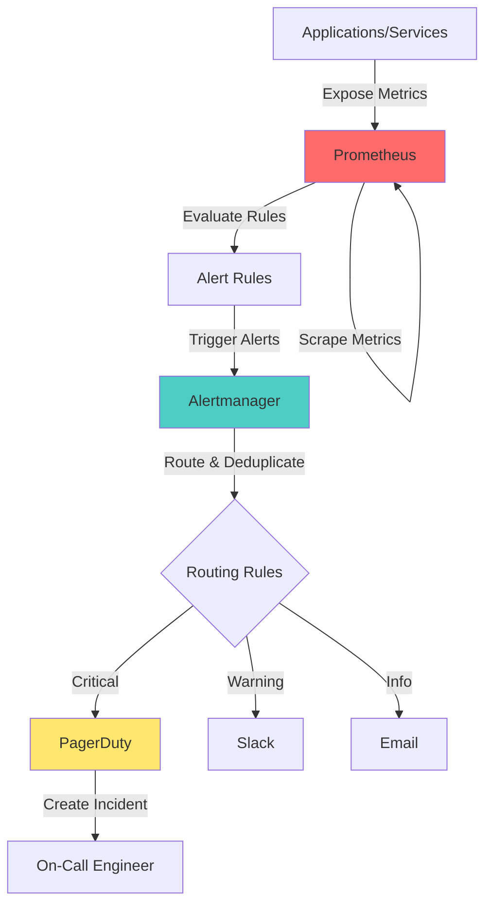

# Alert Management System - Complete Guide

## 📋 Table of Contents
- [Overview](#overview)
- [Architecture](#architecture)
- [Prerequisites](#prerequisites)
- [Project Structure](#project-structure)
- [Quick Start](#quick-start)
- [Detailed Implementation](#detailed-implementation)
- [Integration Guide](#integration-guide)
- [Troubleshooting](#troubleshooting)
- [Best Practices](#best-practices)

---

## 🎯 Overview

This is a **production-ready Alert Management System** that integrates:
- **Prometheus** - Metrics collection and monitoring
- **Alertmanager** - Alert routing and deduplication
- **PagerDuty** - Incident management and on-call scheduling

### What This System Does

1. **Collects Metrics**: Prometheus scrapes metrics from your applications and infrastructure
2. **Evaluates Rules**: Prometheus evaluates alert rules based on metric thresholds
3. **Routes Alerts**: Alertmanager receives alerts and routes them based on severity
4. **Notifies Teams**: Sends notifications via PagerDuty, Email, Slack, etc.
5. **Manages Incidents**: PagerDuty creates incidents and notifies on-call engineers

---

## 🏗️ Architecture



### Component Breakdown

| Component | Purpose | Port |
|-----------|---------|------|
| **Prometheus** | Metrics collection & storage | 9090 |
| **Alertmanager** | Alert routing & management | 9093 |
| **Node Exporter** | System metrics exporter | 9100 |
| **Blackbox Exporter** | Endpoint monitoring | 9115 |

---

## ✅ Prerequisites

### Required Software
```bash
# Docker & Docker Compose
docker --version  # >= 20.10
docker-compose --version  # >= 1.29

# Optional: For local testing
curl --version
jq --version
```

### Required Accounts
- **PagerDuty Account** (Free trial available)
- **Slack Workspace** (Optional, for Slack notifications)

### System Requirements
- **CPU**: 2+ cores
- **RAM**: 4GB minimum (8GB recommended)
- **Disk**: 20GB available space
- **OS**: Linux, macOS, or Windows with WSL2

---

## 📁 Project Structure

```
alert-management-system/
├── README.md                          # This file
├── docker/
│   ├── docker-compose.yml            # Main orchestration file
│   ├── .env.example                  # Environment variables template
│   └── .env                          # Your actual environment variables
├── prometheus/
│   ├── prometheus.yml                # Prometheus configuration
│   ├── rules/
│   │   ├── node_alerts.yml          # System-level alerts
│   │   ├── application_alerts.yml   # Application alerts
│   │   └── custom_alerts.yml        # Custom alert rules
│   └── targets/
│       └── targets.json             # Service discovery targets
├── alertmanager/
│   ├── alertmanager.yml             # Alertmanager configuration
│   ├── templates/
│   │   ├── email.tmpl               # Email notification template
│   │   ├── slack.tmpl               # Slack notification template
│   │   └── pagerduty.tmpl           # PagerDuty template
│   └── config/
│       └── routing.yml              # Advanced routing rules
├── pagerduty/
│   ├── integration-guide.md         # PagerDuty setup guide
│   ├── escalation-policies.md       # Escalation policy examples
│   └── api-examples.sh              # PagerDuty API examples
├── scripts/
│   ├── setup.sh                     # Initial setup script
│   ├── test-alerts.sh               # Alert testing script
│   ├── backup.sh                    # Backup configuration
│   └── health-check.sh              # System health check
├── docs/
│   ├── ARCHITECTURE.md              # Detailed architecture
│   ├── CONFIGURATION.md             # Configuration guide
│   ├── TROUBLESHOOTING.md           # Common issues & solutions
│   └── BEST_PRACTICES.md            # Production best practices
└── examples/
    ├── sample-app/                  # Sample application with metrics
    ├── alert-scenarios/             # Example alert scenarios
    └── dashboards/                  # Grafana dashboard JSONs
```

---

## 🚀 Quick Start

### Step 1: Clone and Setup

```bash
# Navigate to your project directory
cd /home/rk/Documents/labs/lab-7/alert-management-system

# Copy environment template
cp docker/.env.example docker/.env

# Edit environment variables
nano docker/.env
```

### Step 2: Configure PagerDuty

1. **Create PagerDuty Account**: Sign up at https://www.pagerduty.com
2. **Create Integration Key**:
   - Go to Services → Service Directory
   - Click "New Service"
   - Select "Prometheus" integration
   - Copy the **Integration Key**
3. **Update `.env` file**:
   ```bash
   PAGERDUTY_INTEGRATION_KEY=your_integration_key_here
   ```

### Step 3: Start the System

```bash
# Make scripts executable
chmod +x scripts/*.sh

# Run setup script
./scripts/setup.sh

# Start all services
cd docker
docker-compose up -d

# Verify services are running
docker-compose ps
```

### Step 4: Access Web Interfaces

| Service | URL | Default Credentials |
|---------|-----|---------------------|
| Prometheus | http://localhost:9090 | None |
| Alertmanager | http://localhost:9093 | None |
| Node Exporter | http://localhost:9100/metrics | None |

### Step 5: Test Alerts

```bash
# Send a test alert
./scripts/test-alerts.sh

# Check Alertmanager UI
# Visit: http://localhost:9093/#/alerts

# Check PagerDuty for incident
# Visit: https://your-subdomain.pagerduty.com/incidents
```

---

## 📖 Detailed Implementation

### Understanding Prometheus Configuration

**File**: `prometheus/prometheus.yml`

```yaml
global:
  scrape_interval: 15s      # How often to scrape targets
  evaluation_interval: 15s   # How often to evaluate rules
  
  external_labels:
    cluster: 'production'    # Labels added to all metrics
    environment: 'prod'
```

**Key Concepts**:
- **Scrape Interval**: Balance between data freshness and resource usage
- **Evaluation Interval**: How quickly alerts fire after threshold breach
- **External Labels**: Useful for multi-cluster setups

### Understanding Alert Rules

**File**: `prometheus/rules/node_alerts.yml`

```yaml
groups:
  - name: node_alerts
    interval: 30s
    rules:
      - alert: HighCPUUsage
        expr: 100 - (avg by(instance) (rate(node_cpu_seconds_total{mode="idle"}[5m])) * 100) > 80
        for: 5m
        labels:
          severity: warning
          component: system
        annotations:
          summary: "High CPU usage on {{ $labels.instance }}"
          description: "CPU usage is {{ $value }}% on {{ $labels.instance }}"
```

**Breakdown**:
1. **expr**: PromQL query that defines the alert condition
2. **for**: Duration condition must be true before firing
3. **labels**: Metadata for routing decisions
4. **annotations**: Human-readable information

### Understanding Alertmanager Routing

**File**: `alertmanager/alertmanager.yml`

```yaml
route:
  receiver: 'default'
  group_by: ['alertname', 'cluster']
  group_wait: 10s
  group_interval: 10s
  repeat_interval: 12h
  
  routes:
    - match:
        severity: critical
      receiver: pagerduty-critical
      continue: true
```

**Routing Logic**:
1. **group_by**: Groups similar alerts together
2. **group_wait**: Wait time before sending first notification
3. **group_interval**: Wait time between grouped notifications
4. **repeat_interval**: How often to resend unresolved alerts

---

## 🔗 Integration Guide

### PagerDuty Integration

#### Step-by-Step Setup

**1. Create Service in PagerDuty**
```bash
# Via Web UI:
# Services → Service Directory → New Service
# Name: "Production Alerts"
# Integration: Prometheus
```

**2. Configure Escalation Policy**
```bash
# Services → Escalation Policies → New Escalation Policy
# Level 1: Notify "On-Call Engineer" immediately
# Level 2: Escalate to "Team Lead" after 15 minutes
# Level 3: Escalate to "Engineering Manager" after 30 minutes
```

**3. Update Alertmanager Configuration**
```yaml
receivers:
  - name: 'pagerduty-critical'
    pagerduty_configs:
      - service_key: 'YOUR_INTEGRATION_KEY'
        severity: 'critical'
        description: '{{ .CommonAnnotations.summary }}'
        details:
          firing: '{{ .Alerts.Firing | len }}'
          resolved: '{{ .Alerts.Resolved | len }}'
          cluster: '{{ .CommonLabels.cluster }}'
```

### Slack Integration (Optional)

**1. Create Slack Webhook**
```bash
# Slack → Apps → Incoming Webhooks
# Add to Workspace → Select Channel
# Copy Webhook URL
```

**2. Add to Alertmanager**
```yaml
receivers:
  - name: 'slack-warnings'
    slack_configs:
      - api_url: 'YOUR_WEBHOOK_URL'
        channel: '#alerts'
        title: 'Alert: {{ .GroupLabels.alertname }}'
        text: '{{ range .Alerts }}{{ .Annotations.description }}{{ end }}'
```

---

## 🔧 Troubleshooting

### Common Issues

#### 1. Alerts Not Firing

**Symptoms**: No alerts appear in Alertmanager

**Diagnosis**:
```bash
# Check Prometheus targets
curl http://localhost:9090/api/v1/targets | jq

# Check alert rules
curl http://localhost:9090/api/v1/rules | jq

# Check Prometheus logs
docker-compose logs prometheus
```

**Solutions**:
- Verify scrape targets are UP
- Check PromQL syntax in alert rules
- Ensure evaluation_interval is set

#### 2. PagerDuty Not Receiving Alerts

**Symptoms**: Alerts in Alertmanager but no PagerDuty incidents

**Diagnosis**:
```bash
# Test PagerDuty integration
curl -X POST https://events.pagerduty.com/v2/enqueue \
  -H 'Content-Type: application/json' \
  -d '{
    "routing_key": "YOUR_KEY",
    "event_action": "trigger",
    "payload": {
      "summary": "Test Alert",
      "severity": "critical",
      "source": "test"
    }
  }'
```

**Solutions**:
- Verify integration key is correct
- Check Alertmanager logs for errors
- Ensure network connectivity to PagerDuty

#### 3. Alert Fatigue

**Symptoms**: Too many alerts, team ignoring notifications

**Solutions**:
- Increase `for` duration in alert rules
- Adjust thresholds to reduce false positives
- Use `group_wait` and `group_interval` effectively
- Implement alert suppression during maintenance

---

## 🎯 Best Practices

### 1. Alert Design Principles

✅ **DO**:
- Create actionable alerts only
- Include context in annotations
- Use appropriate severity levels
- Test alerts before deploying

❌ **DON'T**:
- Alert on symptoms, not causes
- Create alerts without clear remediation
- Use vague descriptions
- Set overly sensitive thresholds

### 2. Severity Levels

| Severity | When to Use | Response Time | Example |
|----------|-------------|---------------|---------|
| **Critical** | Service down, data loss | Immediate | Database unreachable |
| **Warning** | Degraded performance | 30 minutes | High CPU usage |
| **Info** | Notable events | Next business day | Deployment completed |

### 3. Alert Naming Convention

```
<Component>_<Metric>_<Condition>

Examples:
- Database_Connection_Failed
- API_Response_Time_High
- Disk_Space_Low
```

### 4. Maintenance Windows

```yaml
# Silence alerts during maintenance
inhibit_rules:
  - source_match:
      alertname: 'MaintenanceMode'
    target_match_re:
      severity: 'warning|critical'
    equal: ['cluster']
```

---

## 📚 Next Steps

1. **Customize Alert Rules**: Edit `prometheus/rules/*.yml` for your use case
2. **Add More Exporters**: Monitor databases, applications, etc.
3. **Create Dashboards**: Use Grafana for visualization
4. **Implement SLOs**: Define Service Level Objectives
5. **Automate Runbooks**: Link alerts to remediation procedures

---

## 📞 Support & Resources

- **Prometheus Docs**: https://prometheus.io/docs/
- **Alertmanager Docs**: https://prometheus.io/docs/alerting/latest/alertmanager/
- **PagerDuty Docs**: https://support.pagerduty.com/
- **PromQL Guide**: https://prometheus.io/docs/prometheus/latest/querying/basics/

---

## 📝 License

This project is provided as-is for educational and production use.

---

**Created by**: DevOps Team  
**Last Updated**: 2025-11-27  
**Version**: 1.0.0
