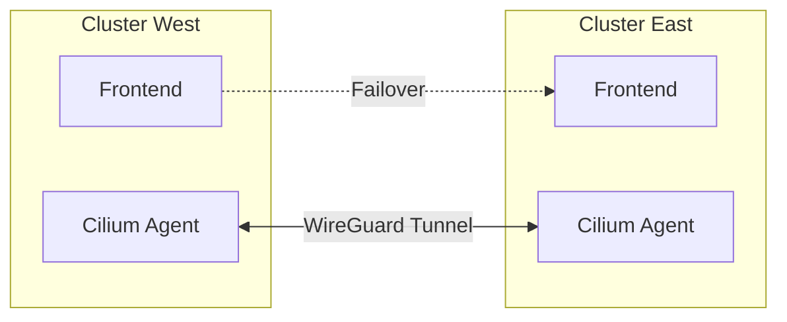

# Production Readiness Guide

This guide outlines the steps and configurations required to take the DevOps lab environment from a "proof of concept" to a "production-ready" platform.

## 1. High Availability (HA) Architecture

In production, single points of failure are unacceptable.

### A. Prometheus & Thanos HA
Instead of a single Prometheus server, we deploy pairs.

```mermaid
graph TD
    subgraph "Cluster A"
        Prom1[Prometheus Replica 1]
        Prom2[Prometheus Replica 2]
        Sidecar1[Thanos Sidecar 1]
        Sidecar2[Thanos Sidecar 2]
        
        Prom1 --- Sidecar1
        Prom2 --- Sidecar2
    end
    
    subgraph "Object Storage"
        S3[(S3 / MinIO)]
    end
    
    subgraph "Global View"
        Querier[Thanos Querier]
    end
    
    Sidecar1 -->|Upload Blocks| S3
    Sidecar2 -->|Upload Blocks| S3
    
    Querier -->|gRPC (Real-time)| Sidecar1
    Querier -->|gRPC (Real-time)| Sidecar2
    Querier -->|Read History| S3
```
*   **Deduplication**: The Thanos Querier handles deduplication of data from Prom1 and Prom2.
*   **Storage**: Long-term retention is offloaded to S3, keeping local disk usage low.

### B. Multi-Cluster Architecture (Cilium Mesh)
Connecting multiple clusters for failover.



## 2. Security Hardening

### A. Network Policies (Zero Trust)
By default, K8s allows all traffic. In production, lock it down.

**Default Deny Policy**:
```yaml
apiVersion: networking.k8s.io/v1
kind: NetworkPolicy
metadata:
  name: default-deny-all
spec:
  podSelector: {}
  policyTypes:
  - Ingress
  - Egress
```
*Then, explicitly allow only needed traffic (e.g., Ingress -> Frontend -> Backend -> DB).*

### B. Pod Security Standards (PSS)
Enforce `Restricted` or `Baseline` standards.
*   **No Root**: Containers must not run as root.
*   **Read-Only Root FS**: Attackers cannot modify system files.
*   **Drop Capabilities**: Drop `ALL` capabilities, add back only what's needed (e.g., `NET_BIND_SERVICE`).

### C. Secrets Management
*   **Never** commit secrets to Git.
*   Use **External Secrets Operator** to fetch from Vault/AWS Secrets Manager.
*   Enable **Encryption at Rest** for etcd.

## 3. Scaling & Resource Management

### A. Quality of Service (QoS)
Ensure critical pods are not evicted.
*   **Guaranteed**: `requests` == `limits` (CPU & Memory).
*   **Burstable**: `requests` < `limits`.
*   **BestEffort**: No requests/limits (First to be killed).

**Production Recommendation**: Use **Guaranteed** QoS for stateful sets (DBs, Prometheus) and critical control plane components.

### B. Pod Disruption Budgets (PDB)
Protect against voluntary disruptions (e.g., node drains for upgrades).
```yaml
apiVersion: policy/v1
kind: PodDisruptionBudget
metadata:
  name: app-pdb
spec:
  minAvailable: 1  # Always keep at least 1 pod running
  selector:
    matchLabels:
      app: my-app
```

### C. Autoscaling
*   **HPA (Horizontal)**: Scale pods based on CPU/Memory/Custom Metrics (KEDA).
*   **VPA (Vertical)**: Resize pods based on historical usage (good for "right-sizing").
*   **Cluster Autoscaler**: Add nodes when pods are pending.

## 4. Day 2 Operations

### A. Upgrades
*   **Blue/Green Control Plane**: Upgrade one master at a time.
*   **GitOps**: Upgrade apps by changing the image tag in Git. Argo CD handles the sync.

### B. Certificate Rotation
*   Use **cert-manager** to automatically rotate TLS certificates before they expire.
*   Monitor certificate expiry with **Blackbox Exporter**.

### C. Disaster Recovery Drills
*   **Chaos Engineering**: Use a tool (like Chaos Mesh) to kill pods/nodes randomly.
*   **Restore Test**: Regularly test restoring backups from Velero to a *new* cluster.
