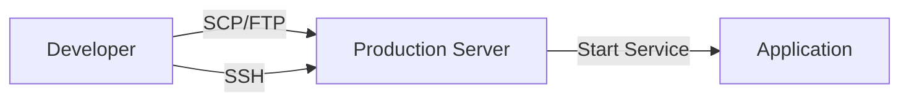
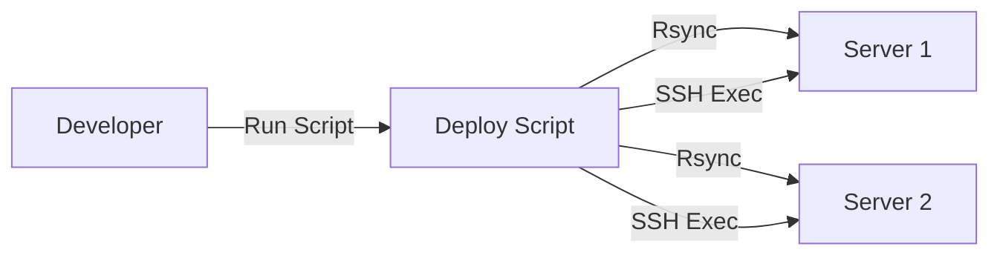
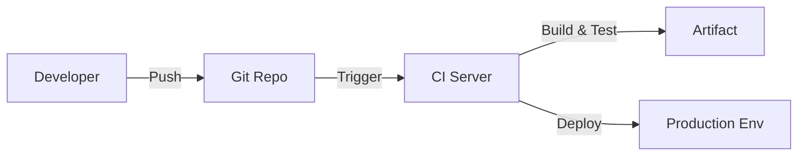
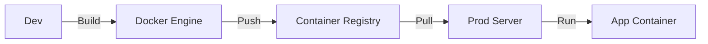
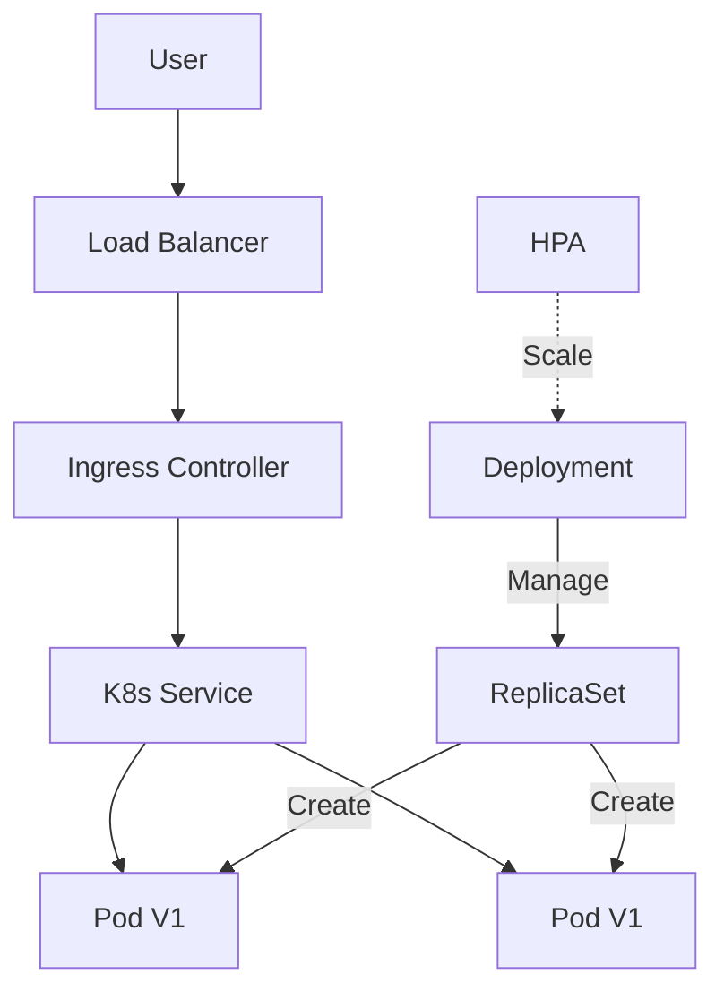
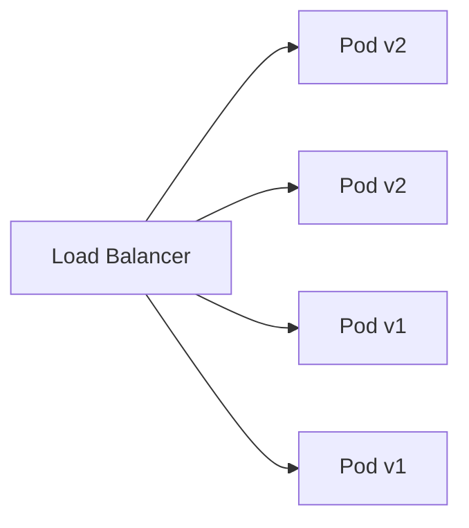
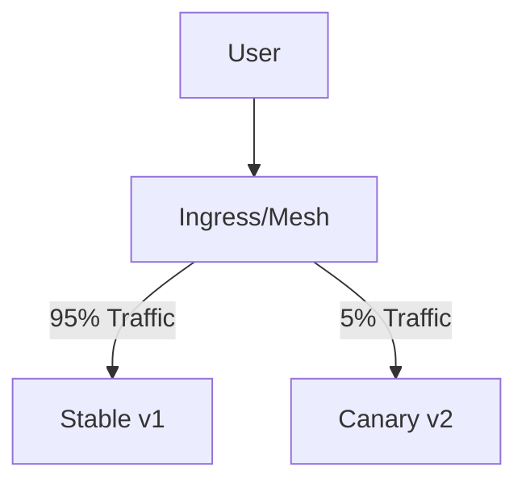
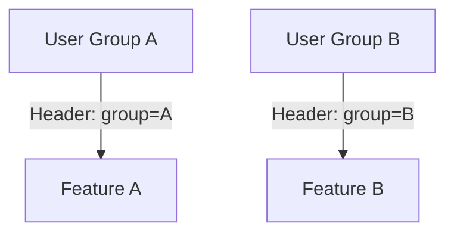
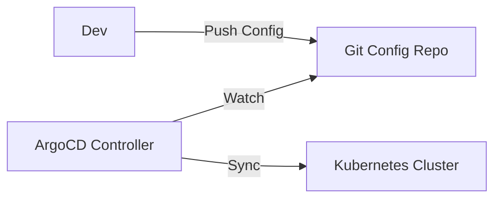

# Comprehensive Deployment Guide

This document serves as the central knowledge base for all deployment strategies implemented in this repository.

---

## Table of Contents
1. [Manual Deployment](#1-manual-deployment)
2. [Scripted Deployment](#2-scripted-deployment)
3. [CI/CD Automated Deployment](#3-cicd-automated-deployment)
4. [Container-based Deployment](#4-container-based-deployment)
5. [Kubernetes-based Deployment](#5-kubernetes-based-deployment)
6. [Blue-Green Deployment](#6-blue-green-deployment)
7. [Rolling Deployment](#7-rolling-deployment)
8. [Canary Deployment](#8-canary-deployment)
9. [Recreate Deployment](#9-recreate-deployment)
10. [Shadow Deployment](#10-shadow-deployment)
11. [A/B Testing Deployment](#11-ab-testing-deployment)
12. [Cloud Deployments (AWS/GCP/Azure)]( #12-cloud-deployments)
13. [Serverless Deployment](#13-serverless-deployment)
14. [GitOps Deployment](#14-gitops-deployment)
15. [Infrastructure Deployment](#15-infrastructure-deployment)

---

## 1. Manual Deployment

### Explanation
The most basic form of deployment where an engineer manually executes commands on a server to transfer files, install dependencies, and start services.

### Architecture


### Workflow
1. Developer builds the artifact locally.
2. Connects to the server via SSH.
3. Transfers files using SCP or FTP.
4. Installs dependencies manually.
5. Restarts the application service.
6. Verifies the application is running.

### Pros & Cons
- **Pros**: Simple, low overhead, total control.
- **Cons**: Error-prone, not scalable, slow, lack of audit trail.

### Real-World Use Case
- **Legacy Systems**: Updating a legacy monolithic application on a single on-premise server.
- **Proof of Concept**: Quickly deploying a prototype for internal demo.

### Implementation
See [01-manual-deployment/deploy-manual.sh](./01-manual-deployment/deploy-manual.sh) for the implementation script.

---

## 2. Scripted Deployment

### Explanation
Automation of manual steps using shell scripts (Bash) or programming languages (Python). This ensures consistency and reduces human error.

### Architecture


### Workflow
1. Developer runs `./deploy.sh`.
2. Script builds the application.
3. Script loops through target servers.
4. Uses `rsync` to transfer files efficiently.
5. Uses `ssh` to restart services remotely.
6. Script checks health endpoints.

### Pros & Cons
- **Pros**: Consistent, faster than manual, version controllable.
- **Cons**: Hard to maintain as complexity grows, limited error handling compared to proper tools.

### Real-World Use Case
- **Small Startups**: Managing a fleet of 5-10 web servers before moving to orchestration.
- **Data Processing Jobs**: Deploying scripts to cron servers.

### Implementation
See [02-scripted-deployment/](./02-scripted-deployment/) for Bash and Python examples.

---

## 3. CI/CD Automated Deployment

### Explanation
Deployment triggered automatically by code changes. Uses platforms like GitHub Actions, GitLab CI, or Jenkins to build, test, and deploy.

### Architecture


### Workflow
1. Code is pushed to `main` branch.
2. CI pipeline triggers.
3. **Build Stage**: Compiles code, builds docker images.
4. **Test Stage**: Runs unit and integration tests.
5. **Deploy Stage**: Pushes artifacts to registry and updates infrastructure.

### Pros & Cons
- **Pros**: Fast feedback, high velocity, audit trails, automated testing.
- **Cons**: Complex setup, requires maintenance of CI infrastructure.

### Real-World Use Case
- **SaaS Platforms**: Continuous delivery of features to users multiple times a day.
- **Mobile Apps**: Automated build and release to App Stores.

### Implementation
See [03-cicd-deployment/](./03-cicd-deployment/) for pipeline configurations (GitHub, GitLab, Jenkins, Azure, Bitbucket).

---

## 4. Container-based Deployment

### Explanation
Packaging applications with all dependencies into a standardized unit (container) using Docker. Guarantees "works on my machine" translates to production.

### Architecture


### Workflow
1. Write `Dockerfile`.
2. Build image: `docker build -t myapp:v1 .`.
3. Push to registry: `docker push myregistry/myapp:v1`.
4. On server, pull and run: `docker run -d myregistry/myapp:v1`.

### Pros & Cons
- **Pros**: Portability, isolation, efficiency, rapid startup.
- **Cons**: Learning curve, security management of images, orchestration complexity.

### Real-World Use Case
- **Microservices**: Deploying polyglot services (Node, Python, Go) uniformly.
- **Dev Environments**: Replicating prod stack locally with Docker Compose.

### Implementation
See [04-container-deployment/](./04-container-deployment/) for Dockerfile and Compose examples.

---

## 5. Kubernetes-based Deployment

### Explanation
Using Kubernetes to orchestrate container deployments. Handles scaling, self-healing, and rolling updates automatically.

### Architecture


### Workflow
1. Define `deployment.yaml`, `service.yaml`, `ingress.yaml`.
2. Apply manifests: `kubectl apply -f k8s/`.
3. Kubernetes Controller Manager ensures desired state matches actual state.

### Pros & Cons
- **Pros**: High availability, autoscaling, declarative config, ecosystem.
- **Cons**: High complexity, steep learning curve, resource overhead.

### Real-World Use Case
- **Enterprise Platforms**: Running hundreds of microservices at scale (e.g., Netflix, Spotify).
- **Big Data**: Running Spark/Flink jobs on K8s.

### Implementation
See [05-kubernetes-deployment/](./05-kubernetes-deployment/) for complete K8s manifests.

---

## 6. Blue-Green Deployment

### Explanation
Two identical environments (Blue and Green). Blue is live. New version is deployed to Green. Once tested, traffic is switched to Green.

### Architecture
```mermaid
graph TD
    User --> LB[Load Balancer]
    LB -->|Active| Blue[Blue Env (v1)]
    LB -.->|Idle| Green[Green Env (v2)]
    
    subgraph Switch
    Blue
    Green
    end
```

### Workflow
1. Current Live: Blue (v1).
2. Deploy v2 to Green.
3. Run smoke tests on Green.
4. Update Load Balancer/Service to point to Green.
5. Green becomes Live. Blue becomes idle (backup).

### Pros & Cons
- **Pros**: Zero downtime, instant rollback (switch back).
- **Cons**: Double resource cost (need 2x infrastructure).

### Real-World Use Case
- **Banking Systems**: Critical updates where downtime is unacceptable and rollback must be instant.
- **E-commerce**: Black Friday updates.

### Implementation
See [06-blue-green-deployment/](./06-blue-green-deployment/) for K8s and NGINX configs.

---

## 7. Rolling Deployment

### Explanation
Gradually replacing instances of the old version with the new version. Default strategy in Kubernetes.

### Architecture


### Workflow
1. Deployment starts.
2. A new pod (v2) is created.
3. Once ready, an old pod (v1) is terminated.
4. Repeat until all pods are v2.
5. Controlled by `maxSurge` and `maxUnavailable`.

### Pros & Cons
- **Pros**: No downtime, no extra infrastructure cost.
- **Cons**: Slow rollout, mixed versions running simultaneously during update.

### Real-World Use Case
- **Standard Web Apps**: Routine bug fixes and minor feature updates.

### Implementation
See [07-rolling-deployment/](./07-rolling-deployment/) for configuration.

---

## 8. Canary Deployment

### Explanation
Releasing a new version to a small subset of users (e.g., 5%) to validate it before a full rollout.

### Architecture


### Workflow
1. Deploy v2 to a small number of instances.
2. Route 5% of traffic to v2.
3. Monitor metrics (errors, latency).
4. If healthy, increase traffic (10% -> 50% -> 100%).
5. If unhealthy, rollback immediately.

### Pros & Cons
- **Pros**: Risk mitigation, test in production with real traffic.
- **Cons**: Complex routing setup (needs Istio/Linkerd or specialized Ingress).

### Real-World Use Case
- **Social Media Feeds**: Testing new algorithms on a small user base.
- **API Updates**: Verifying backward compatibility.

### Implementation
See [08-canary-deployment/](./08-canary-deployment/) for Istio/K8s configs.

---

## 9. Recreate Deployment

### Explanation
Shut down all old instances completely, then start all new instances.

### Architecture
```mermaid
graph TD
    Step1[Step 1: v1 Running]
    Step2[Step 2: v1 Terminated (Downtime)]
    Step3[Step 3: v2 Starting]
    Step1 --> Step2 --> Step3
```

### Workflow
1. Scale v1 deployment to 0.
2. Wait for termination.
3. Scale v2 deployment to N.

### Pros & Cons
- **Pros**: Simple, no version mismatch (never have v1 and v2 running together).
- **Cons**: **Downtime** exists between shutdown and startup.

### Real-World Use Case
- **Development Environments**: Where downtime doesn't matter.
- **Database Schema Changes**: Where app cannot handle mixed versions accessing the DB.

### Implementation
See [09-recreate-deployment/](./09-recreate-deployment/).

---

## 10. Shadow Deployment

### Explanation
Deploy v2 alongside v1. Mirror (duplicate) real traffic to v2, but discard the response. v2 processes real requests for testing but doesn't affect users.

### Architecture
```mermaid
graph TD
    User --> Gateway
    Gateway -->|Request| v1[Service v1]
    Gateway -.->|Mirror| v2[Service v2 (Shadow)]
    v1 -->|Response| User
    v2 -->|Discard| Null
```

### Workflow
1. Deploy v2.
2. Configure Gateway (Envoy/NGINX) to mirror traffic.
3. Compare metrics/logs of v1 and v2.
4. If v2 performs well, promote to live.

### Pros & Cons
- **Pros**: Zero risk to users, tests with actual production load.
- **Cons**: Double resource usage, side effects (e.g., v2 writing to DB) must be handled carefully.

### Real-World Use Case
- **Payment Gateways**: verifying a new payment processor integration without charging cards.
- **Search Engines**: Testing new ranking algorithms.

### Implementation
See [10-shadow-deployment/](./10-shadow-deployment/).

---

## 11. A/B Testing Deployment

### Explanation
Routing specific users to different versions to test features or UX, often based on user ID, location, or cookies.

### Architecture


### Workflow
1. Deploy both versions.
2. Configure routing rules (e.g., HTTP headers).
3. Analyze business metrics (conversion rate, engagement).
4. Pick the winner.

### Pros & Cons
- **Pros**: Data-driven decisions, business value optimization.
- **Cons**: Complexity in analysis and routing.

### Real-World Use Case
- **E-commerce**: Testing two different checkout flows.
- **UI Changes**: Testing Dark Mode vs Light Mode engagement.

### Implementation
See [11-ab-testing-deployment/](./11-ab-testing-deployment/).

---

## 12. Cloud Deployments

### Explanation
Native deployment methods for major cloud providers (AWS, GCP, Azure).

### Implementations Covered
- **AWS**: EC2 (User Data), ECS (Fargate), EKS, Lambda.
- **GCP**: Compute Engine, GKE, Cloud Run.
- **Azure**: VM, AKS, Azure Functions.

### Implementation
See [12-cloud-deployments/](./12-cloud-deployments/).

---

## 13. Serverless Deployment

### Explanation
Deploying functions (FaaS) where the cloud provider manages the server.

### Workflow
1. Write function code.
2. Define `serverless.yml` or cloud-specific config.
3. Deploy via CLI.

### Pros & Cons
- **Pros**: No server management, pay-per-use, auto-scaling.
- **Cons**: Cold starts, vendor lock-in, execution time limits.

### Implementation
See [13-serverless-deployment/](./13-serverless-deployment/).

---

## 14. GitOps Deployment

### Explanation
Using Git as the single source of truth for infrastructure and applications. Changes are pulled by an operator (ArgoCD/Flux) rather than pushed by CI.

### Architecture


### Workflow
1. Developer pushes K8s manifest change to Git.
2. ArgoCD detects drift between Git and Cluster.
3. ArgoCD syncs the cluster to match Git.

### Pros & Cons
- **Pros**: High security (cluster doesn't need external access), automatic drift correction, easy rollback.
- **Cons**: Complexity of GitOps tools.

### Real-World Use Case
- **FinTech/Banking**: Strict compliance and audit requirements.
- **Large Scale K8s**: Managing 100+ clusters.

### Implementation
See [14-gitops-deployment/](./14-gitops-deployment/).

---

## 15. Infrastructure Deployment (IaC)

### Explanation
Provisioning the underlying infrastructure (VMs, VPCs, Clusters) using code (Terraform, Ansible).

### Workflow
1. Define `main.tf`.
2. `terraform plan` to preview changes.
3. `terraform apply` to provision.
4. Use Ansible to configure the OS/Software on provisioned resources.

### Implementation
See [15-infrastructure-deployment/](./15-infrastructure-deployment/).

---

## 16. Modern CI/CD Patterns (Advanced)

### Explanation
Moving beyond simple "build & deploy" pipelines to robust, secure, and efficient workflows used by top-tier tech organizations.

### Key Concepts

#### 1. Shift-Left Security (DevSecOps)
Integrating security scans early in the pipeline (Pull Request stage) rather than waiting for a security audit before production.
- **SAST (Static Application Security Testing)**: Scanning source code for vulnerabilities (e.g., SonarQube).
- **Container Scanning**: Scanning Docker images for CVEs (e.g., Trivy, Clair).
- **Secret Detection**: Preventing API keys from being committed (e.g., Gitleaks).

#### 2. Ephemeral Environments (Preview Apps)
Automatically creating a temporary, isolated environment for every Pull Request.
- **Workflow**: Developer opens PR -> CI deploys app to `pr-123.example.com` -> QA/Product Owner reviews -> PR merged -> Environment destroyed.
- **Benefits**: Faster feedback loop, no "staging" bottleneck.

#### 3. Pipeline Efficiency
- **Caching**: Reusing dependencies (node_modules, pip cache) between builds to save time.
- **Matrix Builds**: Running tests in parallel across multiple language versions or OSs.
- **Concurrency Groups**: Automatically cancelling out-of-date builds when a new commit is pushed to the same branch.

#### 4. GitOps Integration
CI pipelines should **not** run `kubectl apply` directly in production. Instead, they should update a Git repository (Config Repo) which triggers a GitOps operator (ArgoCD).
- **CI Responsibility**: Build, Test, Scan, Push Image, Update Manifest in Git.
- **CD Responsibility**: ArgoCD detects change in Git and syncs cluster.

### Implementations
- **GitHub Actions**: [03-cicd-deployment/github-actions-advanced/](./03-cicd-deployment/github-actions-advanced/)
- **GitLab CI**: [03-cicd-deployment/gitlab-ci-advanced/](./03-cicd-deployment/gitlab-ci-advanced/)
- **Jenkins**: [03-cicd-deployment/jenkins-advanced/](./03-cicd-deployment/jenkins-advanced/)
