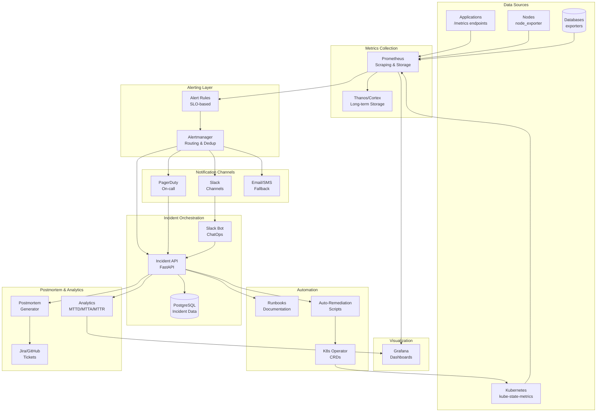
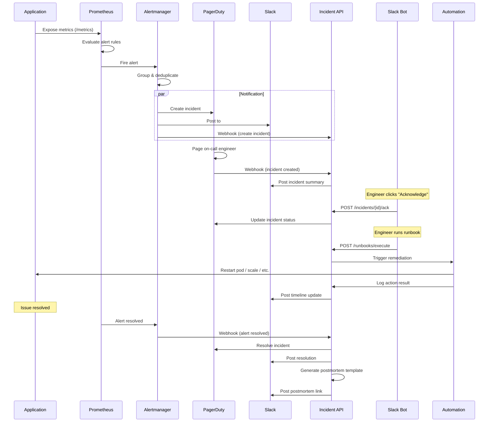

# Incident Management & Alerting System - Architecture

## System Overview

This document describes the architecture of a production-ready incident management and alerting platform designed to detect, notify, act, track, and review incidents with minimal manual intervention.

## Architecture Diagram



## Component Details

### 1. Data Sources Layer

**Purpose**: Expose metrics from all monitored systems.

| Component | Purpose | Metrics Exposed |
|-----------|---------|-----------------|
| **Application /metrics** | Custom app metrics | Request rate, latency, errors, business metrics |
| **kube-state-metrics** | K8s object state | Pod status, deployments, replica counts |
| **node_exporter** | Node-level metrics | CPU, memory, disk, network |
| **Database exporters** | DB-specific metrics | Connections, query latency, replication lag |

**Key Decisions**:
- All apps must expose `/metrics` in Prometheus format
- Use standard exporters where possible (avoid custom scrapers)
- Metrics labeled with `service`, `environment`, `team` for routing

---

### 2. Metrics Collection Layer

**Prometheus Configuration**:
```yaml
global:
  scrape_interval: 15s
  evaluation_interval: 15s
  external_labels:
    cluster: 'production'
    region: 'us-east-1'

scrape_configs:
  - job_name: 'kubernetes-pods'
    kubernetes_sd_configs:
      - role: pod
    relabel_configs:
      - source_labels: [__meta_kubernetes_pod_annotation_prometheus_io_scrape]
        action: keep
        regex: true
```

**Thanos/Cortex** (optional, Phase 7):
- Long-term metrics retention (90+ days)
- Multi-cluster aggregation
- Downsampling for cost efficiency

---

### 3. Alerting Layer

**Alert Rule Structure**:
```yaml
groups:
  - name: service_availability
    interval: 30s
    rules:
      - alert: ServiceDown
        expr: up{job="my-service"} == 0
        for: 2m
        labels:
          severity: page
          team: platform
        annotations:
          summary: "Service {{ $labels.job }} is down"
          runbook_url: "https://runbooks.example.com/service-down"
```

**Alertmanager Routing**:
```yaml
route:
  receiver: 'default'
  group_by: ['alertname', 'cluster', 'service']
  group_wait: 10s
  group_interval: 5m
  repeat_interval: 4h
  
  routes:
    - match:
        severity: page
      receiver: pagerduty
      continue: true
    
    - match:
        severity: critical
      receiver: slack-critical
    
    - match:
        severity: warning
      receiver: slack-warnings
```

---

### 4. Notification Channels

| Channel | Use Case | Severity | Response SLA |
|---------|----------|----------|--------------|
| **PagerDuty** | On-call escalation | `page` | 15 min acknowledge |
| **Slack (critical)** | Team awareness | `critical` | 30 min review |
| **Slack (warnings)** | Informational | `warning` | Best effort |
| **Email/SMS** | Fallback | All | N/A |

**PagerDuty Integration**:
- Uses Events API v2
- Auto-creates incidents with context
- Supports escalation policies
- Bi-directional sync with Incident API

---

### 5. Incident Orchestration

**Incident API Schema**:
```python
class Incident(Base):
    id = Column(UUID, primary_key=True)
    title = Column(String, nullable=False)
    severity = Column(Enum('P0', 'P1', 'P2', 'P3', 'P4'))
    status = Column(Enum('open', 'acknowledged', 'investigating', 'resolved'))
    owner_id = Column(String)
    created_at = Column(DateTime)
    acknowledged_at = Column(DateTime)
    resolved_at = Column(DateTime)
    
    # Relationships
    timeline_events = relationship("TimelineEvent")
    runbook_executions = relationship("RunbookExecution")
```

**API Endpoints**:
```
POST   /api/v1/incidents              # Create incident
GET    /api/v1/incidents              # List incidents
GET    /api/v1/incidents/{id}         # Get incident details
PATCH  /api/v1/incidents/{id}         # Update incident
POST   /api/v1/incidents/{id}/ack     # Acknowledge
POST   /api/v1/incidents/{id}/resolve # Resolve
POST   /api/v1/incidents/{id}/timeline # Add timeline event

POST   /api/v1/webhooks/alertmanager  # Alertmanager webhook
POST   /api/v1/webhooks/pagerduty     # PagerDuty webhook
```

---

### 6. Slack Bot (ChatOps)

**Slash Commands**:
```
/incident list                    # List active incidents
/incident show INC-123            # Show incident details
/incident ack INC-123             # Acknowledge incident
/incident assign INC-123 @user    # Assign to user
/incident resolve INC-123         # Resolve incident

/runbook list                     # List available runbooks
/runbook run high-error-rate      # Execute runbook
/runbook show high-error-rate     # Display runbook content
```

**Interactive Components**:
- Incident creation modal
- Runbook execution confirmation
- Status update buttons
- Timeline event forms

---

### 7. Automation & Runbooks

**Runbook Structure**:
```markdown
# High Error Rate - Service A

## Symptoms
- P95 latency > 500ms
- 5xx error rate > 2%
- Duration: 5+ minutes

## Immediate Checks
1. Check pod status: `kubectl get pods -n service-a`
2. View recent logs: `kubectl logs -n service-a deployment/service-a --tail=200`
3. Check dependencies: Database, Redis, external APIs

## Automated Actions
- ✅ Auto-restart enabled (max 3 times/hour)
- ✅ Scale-up trigger at 80% CPU
- ❌ Rollback disabled (requires manual approval)

## Manual Remediation
1. If pod crashloop: `kubectl rollout restart deployment/service-a -n service-a`
2. If DB slow: Check slow query log, consider read replica
3. If external API down: Enable circuit breaker

## Escalation
- Primary: @platform-team
- Secondary: @database-team (if DB-related)
- Escalate after: 15 minutes

## Links
- [Dashboard](https://grafana.example.com/d/service-a)
- [Logs](https://kibana.example.com/app/discover#/service-a)
- [Runbook Execution History](https://incidents.example.com/runbooks/high-error-rate)
```

**Auto-Remediation Safety**:
```python
class RemediationPolicy:
    max_executions_per_hour = 3
    require_approval_for = ['rollback', 'database_restart']
    allowed_actions = ['pod_restart', 'scale_up', 'clear_cache']
    
    def can_execute(self, action: str, incident_id: str) -> bool:
        # Check rate limits
        # Check approval requirements
        # Log decision
        pass
```

---

### 8. Postmortem & Analytics

**Postmortem Template**:
```markdown
# Incident Postmortem: [INC-123] High Error Rate - Service A

**Date**: 2025-12-01  
**Duration**: 45 minutes  
**Severity**: P1  
**Owner**: @platform-team

## Impact
- **Users Affected**: ~5,000 users
- **Revenue Impact**: Estimated $2,000
- **Services Affected**: Service A, downstream Service B

## Timeline
| Time | Event |
|------|-------|
| 14:00 | Alert triggered: High error rate detected |
| 14:02 | Incident created, PagerDuty page sent |
| 14:05 | On-call acknowledged |
| 14:10 | Investigation started, logs reviewed |
| 14:20 | Root cause identified: Database connection pool exhausted |
| 14:25 | Mitigation applied: Increased pool size |
| 14:35 | Error rate returned to normal |
| 14:45 | Incident resolved |

## Root Cause
Database connection pool size was insufficient for peak traffic. A recent code change introduced a connection leak.

## Resolution
1. Increased connection pool size from 20 to 50
2. Deployed hotfix to close connections properly
3. Added connection pool metrics to dashboard

## Action Items
- [ ] Add connection pool monitoring alert (@platform-team, due: 2025-12-05)
- [ ] Review all services for similar connection leaks (@dev-team, due: 2025-12-08)
- [ ] Update runbook with connection pool troubleshooting (@sre-team, due: 2025-12-03)

## Lessons Learned
- Need better pre-deployment load testing
- Connection pool metrics should be standard for all services
- Runbook was helpful but lacked DB-specific troubleshooting
```

**KPI Dashboard Metrics**:
```python
# MTTD (Mean Time to Detect)
mttd = incident.created_at - actual_issue_start_time

# MTTA (Mean Time to Acknowledge)
mtta = incident.acknowledged_at - incident.created_at

# MTTR (Mean Time to Resolve)
mttr = incident.resolved_at - incident.created_at

# Alert Noise
false_positive_rate = false_positives / total_alerts

# Auto-Remediation Success
auto_success_rate = successful_auto_remediations / total_auto_attempts
```

---

## Data Flow: Alert to Resolution



---

## Security & Compliance

### Authentication & Authorization

| Component | Auth Method | RBAC |
|-----------|-------------|------|
| **Incident API** | OAuth2 / OIDC | Role-based (viewer, responder, admin) |
| **Grafana** | SSO (Okta/Google) | Team-based access |
| **Slack Bot** | Slack OAuth | Channel-based permissions |
| **Automation** | K8s ServiceAccount | Least-privilege roles |

### Secrets Management

```yaml
# Using AWS Secrets Manager
secrets:
  pagerduty_api_key: aws-secretsmanager://prod/pagerduty/api-key
  slack_bot_token: aws-secretsmanager://prod/slack/bot-token
  database_url: aws-secretsmanager://prod/postgres/connection-string
```

### Audit Logging

```python
class AuditLog(Base):
    id = Column(UUID, primary_key=True)
    timestamp = Column(DateTime, nullable=False)
    user_id = Column(String, nullable=False)
    action = Column(String, nullable=False)  # 'runbook_execute', 'incident_resolve'
    resource_type = Column(String)  # 'incident', 'runbook'
    resource_id = Column(String)
    details = Column(JSONB)
    ip_address = Column(String)
```

---

## High Availability & Disaster Recovery

### Prometheus HA
- Multiple Prometheus replicas with identical config
- Thanos/Cortex for deduplication
- Remote write to long-term storage

### Alertmanager HA
- Clustered Alertmanager instances
- Gossip protocol for state sharing
- Multi-region deployment

### Incident API HA
- Kubernetes deployment with 3+ replicas
- PostgreSQL with read replicas
- Redis for session/cache (optional)

### Backup Strategy
- Daily PostgreSQL backups (7-day retention)
- Prometheus snapshots to S3 (30-day retention)
- Configuration stored in Git (version controlled)

---

## Monitoring the Monitoring System

**Meta-Alerts**:
```yaml
- alert: PrometheusDown
  expr: up{job="prometheus"} == 0
  for: 5m
  
- alert: AlertmanagerDown
  expr: up{job="alertmanager"} == 0
  for: 5m

- alert: IncidentAPIDown
  expr: up{job="incident-api"} == 0
  for: 2m
  
- alert: AlertDeliveryFailure
  expr: rate(alertmanager_notifications_failed_total[5m]) > 0
```

---

## Scalability Considerations

| Component | Current Scale | Max Scale | Scaling Strategy |
|-----------|---------------|-----------|------------------|
| **Prometheus** | 1M active series | 10M series | Sharding, federation |
| **Alertmanager** | 1K alerts/min | 10K alerts/min | Horizontal scaling |
| **Incident API** | 100 req/s | 1K req/s | Auto-scaling pods |
| **PostgreSQL** | 1K incidents/day | 10K incidents/day | Read replicas, partitioning |

---

## Cost Optimization

1. **Metrics Retention**: 15 days in Prometheus, 90 days in Thanos (downsampled)
2. **Alert Deduplication**: Reduce duplicate notifications by 80%
3. **Auto-Remediation**: Reduce manual on-call interventions by 50%
4. **Resource Rightsizing**: Monitor actual usage, adjust requests/limits

---

## Future Enhancements

- [ ] Machine learning for anomaly detection
- [ ] Predictive alerting (alert before SLO breach)
- [ ] Auto-generated runbooks from incident patterns
- [ ] Integration with APM tools (Datadog, New Relic)
- [ ] Mobile app for incident management
- [ ] Voice-activated incident response (Alexa/Google Home)
