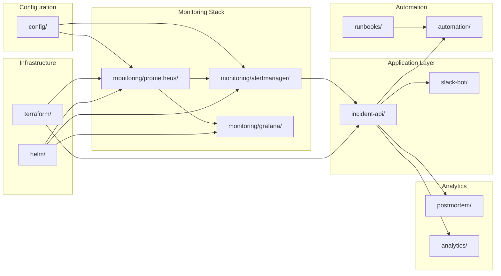

# Project Structure Overview

This document provides a visual representation of the complete project structure with explanations for each component.

## Directory Tree

```
lab-incident-management/
│
├── 📋 config/                                    # Centralized configuration
│   ├── slo_definitions.yaml                      # Service Level Objectives for all services
│   ├── severity_matrix.yaml                      # Incident severity classification (P0-P4)
│   ├── on_call_schedule.yaml                     # On-call rotation and escalation policies
│   └── service_catalog.yaml                      # Service inventory with owners and teams
│
├── 📊 monitoring/                                # Monitoring stack configuration
│   │
│   ├── prometheus/                               # Prometheus configuration
│   │   ├── prometheus.yml                        # Main config: scrape targets, retention
│   │   ├── alerts/                               # Alert rule definitions
│   │   │   ├── service_availability.yaml         # Service uptime alerts
│   │   │   ├── error_rate.yaml                   # HTTP error rate thresholds
│   │   │   ├── latency.yaml                      # P95/P99 latency alerts
│   │   │   ├── infrastructure.yaml               # Node, pod, cluster alerts
│   │   │   └── database.yaml                     # Database-specific alerts
│   │   └── recording_rules.yaml                  # Pre-computed metrics for efficiency
│   │
│   ├── alertmanager/                             # Alertmanager configuration
│   │   ├── config.yml                            # Routing to PagerDuty, Slack, Email
│   │   ├── templates/                            # Custom notification templates
│   │   │   ├── slack.tmpl                        # Slack message formatting
│   │   │   └── pagerduty.tmpl                    # PagerDuty event formatting
│   │   ├── silence_rules.yaml                    # Maintenance window silences
│   │   └── inhibition_rules.yaml                 # Alert suppression logic
│   │
│   └── grafana/                                  # Grafana dashboards
│       ├── dashboards/                           # JSON dashboard definitions
│       │   ├── service_overview.json             # Service health overview
│       │   ├── slo_tracking.json                 # SLO compliance tracking
│       │   ├── incident_metrics.json             # MTTD/MTTA/MTTR metrics
│       │   └── alert_review.json                 # Alert noise analysis
│       ├── datasources/                          # Datasource configurations
│       │   └── prometheus.yaml
│       └── provisioning/                         # Auto-provisioning configs
│
├── 🔧 incident-api/                              # FastAPI incident orchestration service
│   ├── main.py                                   # Application entry point
│   ├── models.py                                 # SQLAlchemy database models
│   ├── schemas.py                                # Pydantic request/response schemas
│   ├── database.py                               # Database connection & session
│   ├── config.py                                 # Configuration management
│   ├── requirements.txt                          # Python dependencies
│   ├── Dockerfile                                # Multi-stage Docker build
│   │
│   ├── routers/                                  # API route handlers
│   │   ├── incidents.py                          # CRUD operations for incidents
│   │   ├── timeline.py                           # Timeline event management
│   │   ├── webhooks.py                           # Alertmanager/PagerDuty webhooks
│   │   └── health.py                             # Health check endpoints
│   │
│   ├── services/                                 # Business logic layer
│   │   ├── incident_service.py                   # Incident lifecycle management
│   │   ├── notification_service.py               # Multi-channel notifications
│   │   ├── pagerduty_service.py                  # PagerDuty API integration
│   │   ├── slack_service.py                      # Slack Bot API integration
│   │   └── runbook_service.py                    # Runbook execution engine
│   │
│   ├── migrations/                               # Alembic database migrations
│   │   ├── env.py                                # Migration environment
│   │   └── versions/                             # Migration scripts
│   │       ├── 001_initial_schema.py
│   │       └── 002_add_audit_log.py
│   │
│   └── k8s/                                      # Kubernetes manifests
│       ├── deployment.yaml                       # API deployment
│       ├── service.yaml                          # Service exposure
│       ├── configmap.yaml                        # Configuration data
│       ├── secrets.yaml                          # Secrets (template)
│       └── ingress.yaml                          # External access
│
├── 💬 slack-bot/                                 # Slack bot for ChatOps
│   ├── bot.py                                    # Slack Bolt app with event handlers
│   ├── commands.py                               # Slash command implementations
│   ├── blocks.py                                 # Slack Block Kit UI builders
│   ├── config.py                                 # Bot configuration
│   ├── requirements.txt                          # Python dependencies
│   ├── Dockerfile                                # Container image
│   │
│   └── handlers/                                 # Event and command handlers
│       ├── incident_commands.py                  # /incident command handlers
│       ├── runbook_commands.py                   # /runbook command handlers
│       ├── interactive_handlers.py               # Button/modal interactions
│       └── webhook_handlers.py                   # Incoming webhook processing
│
├── 📖 runbooks/                                  # Runbook documentation
│   ├── template.md                               # Standard runbook template
│   ├── high_error_rate.md                        # High error rate investigation
│   ├── pod_crashloop.md                          # Pod crash loop remediation
│   ├── high_latency.md                           # Latency spike debugging
│   ├── database_slow.md                          # Database performance issues
│   ├── disk_pressure.md                          # Node disk pressure response
│   └── memory_leak.md                            # Memory leak investigation
│
├── 🤖 automation/                                # Automated remediation
│   ├── restart_deployment.py                     # Safe deployment restart
│   ├── scale_deployment.py                       # Auto-scaling based on metrics
│   ├── clear_cache.py                            # Redis/Memcached cache clearing
│   ├── run_diagnostics.py                        # Automated diagnostic collection
│   ├── rollback_deployment.py                    # Automated rollback
│   │
│   └── k8s-operator/                             # Kubernetes operator
│       ├── main.py                               # Operator main loop
│       ├── controllers/                          # Custom resource controllers
│       ├── crds/                                 # Custom Resource Definitions
│       └── Dockerfile                            # Operator container image
│
├── 📝 postmortem/                                # Postmortem automation
│   ├── generator.py                              # Template-based generator
│   ├── templates/                                # Postmortem templates
│   │   └── postmortem_template.md
│   ├── jira_integration.py                       # Jira ticket creation
│   └── github_integration.py                     # GitHub issue creation
│
├── 📈 analytics/                                 # Metrics & reporting
│   ├── kpi_calculator.py                         # MTTD/MTTA/MTTR calculations
│   ├── alert_noise_analyzer.py                   # False positive detection
│   ├── weekly_report.py                          # Automated weekly reports
│   └── dashboards/                               # Custom analytics dashboards
│
├── 🏗️ terraform/                                 # Infrastructure as Code
│   ├── main.tf                                   # Main Terraform configuration
│   ├── variables.tf                              # Input variables
│   ├── outputs.tf                                # Output values
│   ├── providers.tf                              # Provider configurations
│   ├── kubernetes.tf                             # K8s cluster setup
│   └── secrets.tf                                # Secrets Manager integration
│
├── ⎈ helm/                                       # Helm charts
│   ├── prometheus/                               # Prometheus chart
│   │   └── values.yaml
│   ├── grafana/                                  # Grafana chart
│   │   └── values.yaml
│   └── alertmanager/                             # Alertmanager chart
│       └── values.yaml
│
├── 🔨 scripts/                                   # Setup & utility scripts
│   ├── setup.sh                                  # Initial environment setup
│   ├── deploy_monitoring.sh                      # Deploy monitoring stack
│   ├── deploy_incident_api.sh                    # Deploy incident service
│   ├── test_alerts.sh                            # Fire test alerts
│   └── backup_config.sh                          # Configuration backup
│
├── 🧪 tests/                                     # Test suites
│   ├── test_alert_rules.py                       # Prometheus alert validation
│   ├── test_incident_api.py                      # API endpoint tests
│   ├── test_notifications.py                     # Notification delivery tests
│   ├── test_automation.py                        # Remediation script tests
│   └── integration/                              # End-to-end tests
│       ├── test_alert_to_incident.py
│       └── test_runbook_execution.py
│
├── 📚 docs/                                      # Documentation
│   ├── README.md                                 # Project overview
│   ├── ARCHITECTURE.md                           # System architecture
│   ├── SETUP.md                                  # Setup instructions
│   ├── OPERATIONS.md                             # Operational procedures
│   ├── TROUBLESHOOTING.md                        # Common issues
│   ├── ADR/                                      # Architecture Decision Records
│   │   ├── 001-prometheus-vs-datadog.md
│   │   ├── 002-pagerduty-integration.md
│   │   └── 003-postgres-for-incidents.md
│   └── diagrams/                                 # Architecture diagrams
│       ├── architecture.png
│       ├── alert_flow.png
│       └── incident_lifecycle.png
│
├── 🔄 .github/workflows/                         # CI/CD pipelines
│   ├── ci.yml                                    # Continuous integration
│   ├── deploy_monitoring.yml                     # Deploy monitoring stack
│   ├── deploy_incident_api.yml                   # Deploy incident service
│   └── test_alerts.yml                           # Automated alert testing
│
├── 🐳 docker-compose.yml                         # Local development setup
├── 📄 .env.example                               # Environment variables template
├── 📋 .gitignore                                 # Git ignore rules
└── 📖 README.md                                  # Main documentation
```

## Component Relationships



## Key Files by Purpose

### 🔧 Configuration Files
- `config/slo_definitions.yaml` - Defines SLOs for all services
- `config/severity_matrix.yaml` - Incident severity levels (P0-P4) with SLAs
- `monitoring/prometheus/prometheus.yml` - Prometheus scrape configuration
- `monitoring/alertmanager/config.yml` - Alert routing rules

### 🚨 Alert Definitions
- `monitoring/prometheus/alerts/service_availability.yaml` - Service uptime alerts
- `monitoring/prometheus/alerts/error_rate.yaml` - Error rate thresholds
- `monitoring/prometheus/alerts/latency.yaml` - Latency SLO alerts
- `monitoring/prometheus/alerts/infrastructure.yaml` - Infrastructure alerts

### 🔌 API Endpoints
- `incident-api/routers/incidents.py` - Incident CRUD operations
- `incident-api/routers/webhooks.py` - Webhook receivers (Alertmanager, PagerDuty)
- `incident-api/routers/timeline.py` - Incident timeline management

### 🤖 Automation Scripts
- `automation/restart_deployment.py` - Safe pod restart with rate limiting
- `automation/scale_deployment.py` - Auto-scaling based on metrics
- `automation/run_diagnostics.py` - Automated diagnostic collection

### 📊 Dashboards
- `monitoring/grafana/dashboards/service_overview.json` - Service health
- `monitoring/grafana/dashboards/slo_tracking.json` - SLO compliance
- `monitoring/grafana/dashboards/incident_metrics.json` - MTTD/MTTA/MTTR

### 🧪 Tests
- `tests/test_alert_rules.py` - Validate Prometheus alert rules
- `tests/test_incident_api.py` - API endpoint tests
- `tests/integration/test_alert_to_incident.py` - End-to-end alert flow

## File Naming Conventions

- **Configuration**: `snake_case.yaml`
- **Python modules**: `snake_case.py`
- **Kubernetes manifests**: `kebab-case.yaml`
- **Documentation**: `UPPERCASE.md` for main docs, `lowercase.md` for runbooks
- **Dashboards**: `snake_case.json`
- **Scripts**: `snake_case.sh`

## Environment-Specific Files

```
config/
├── slo_definitions.yaml           # Shared across environments
├── severity_matrix.yaml           # Shared across environments
│
└── environments/
    ├── dev/
    │   ├── prometheus.yml
    │   └── alertmanager.yml
    ├── staging/
    │   ├── prometheus.yml
    │   └── alertmanager.yml
    └── production/
        ├── prometheus.yml
        └── alertmanager.yml
```

## Next Steps

1. Review the [Implementation Plan](../implementation_plan.md)
2. Set up your development environment using [SETUP.md](SETUP.md)
3. Understand the architecture in [ARCHITECTURE.md](ARCHITECTURE.md)
4. Start with Phase 1: Core Telemetry & Dashboards
