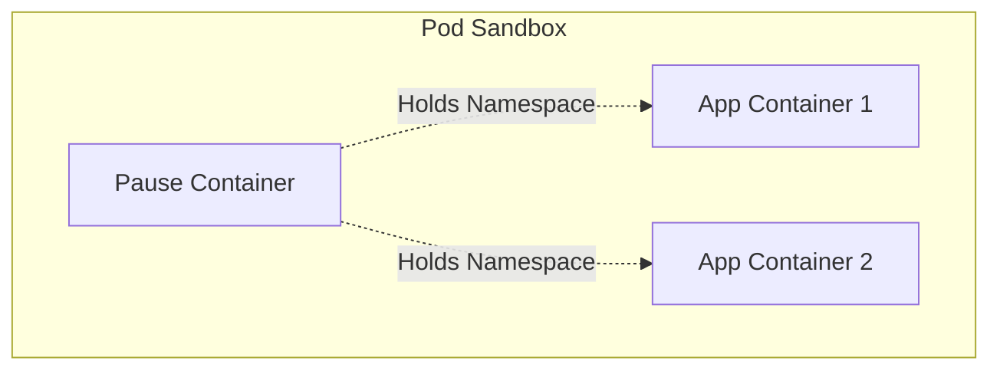

# Pods Deep Dive

This document provides a detailed technical deep dive into Kubernetes Pods, their lifecycle, networking, and resource management.

## 1. Pod Internals

A Pod is not a process; it is an environment for processes.

### The Pause Container
Every Pod has a hidden "pause" container (also known as the sandbox container).
- **Role**: Holds the network namespace and IPC namespace.
- **Lifecycle**: Starts first, stops last.
- **Benefit**: Allows application containers to restart without losing the Pod's IP address.

## 2. Pod Lifecycle

The `status.phase` field describes the lifecycle phase:

| Phase | Description |
|-------|-------------|
| **Pending** | Accepted by API, but container images not yet created. Includes scheduling time and image download. |
| **Running** | Bound to a node, all containers created. At least one is running or starting. |
| **Succeeded** | All containers terminated successfully (exit code 0). |
| **Failed** | All containers terminated, at least one with failure (non-zero exit code). |
| **Unknown** | State cannot be obtained (usually node communication error). |

### Container States
- **Waiting**: Pulling image, applying config.
- **Running**: Executing process.
- **Terminated**: Completed execution.

## 3. Resource Management (QoS Classes)

Kubernetes assigns a Quality of Service (QoS) class to each Pod based on resource requests and limits.

### Guaranteed
- **Criteria**: Every container has memory/cpu limits and requests, and limits == requests.
- **Behavior**: Top priority. Last to be killed (OOMKilled).

### Burstable
- **Criteria**: At least one container has requests/limits, but not meeting "Guaranteed".
- **Behavior**: Can use more resources if available. Killed before Guaranteed pods if node is under pressure.

### BestEffort
- **Criteria**: No requests or limits set.
- **Behavior**: Lowest priority. First to be killed when node is out of resources.

## 4. Pod Networking

- **IP-per-Pod**: Every pod gets a unique IP.
- **Flat Network**: All pods can communicate with all other pods (unless NetworkPolicies restrict).
- **DNS**: Pods can be found via DNS (e.g., `pod-ip-address.my-namespace.pod.cluster.local`).

## 5. Termination Process

When a Pod is deleted:
1.  **Terminating State**: API server marks Pod as Terminating.
2.  **PreStop Hook**: If defined, `preStop` hook runs.
3.  **SIGTERM**: Sent to main process (PID 1).
4.  **Grace Period**: Kubelet waits (default 30s).
5.  **SIGKILL**: If process still running, it is forcibly killed.

> **Best Practice**: Handle SIGTERM in your application to ensure graceful shutdown (close connections, finish requests).
