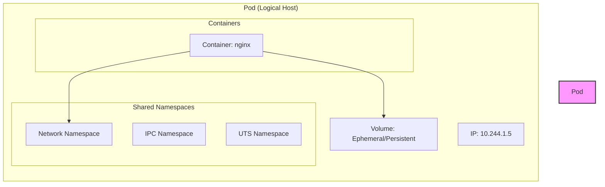
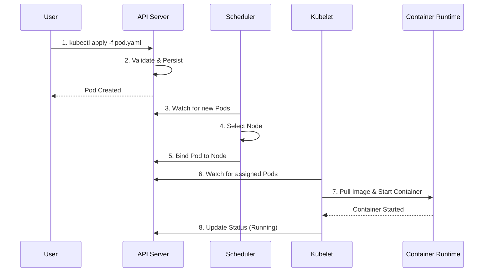

# Lab 1: Your First Pod

## Objectives

By the end of this lab, you will be able to:
- Create a basic pod using YAML
- View pod status and details
- Access pod logs
- Execute commands inside a pod
- Delete a pod

## Pod Design & Architecture

Before we begin, let's understand what we are building.

### The Pod Abstraction

A Pod is a logical host for one or more containers. It models an application-specific "logical host" in a containerized environment.



### Pod Creation Flow

When you run `kubectl apply`, the following sequence occurs:



## Prerequisites

- Kubernetes cluster running (Minikube, K3d, or cloud provider)
- `kubectl` installed and configured
- Basic understanding of YAML syntax

## Estimated Time

15-20 minutes

## Lab Steps

### Step 1: Create Your First Pod

Create a file named `my-first-pod.yaml`:

```yaml
apiVersion: v1
kind: Pod
metadata:
  name: my-first-pod
  labels:
    app: nginx
    environment: learning
spec:
  containers:
  - name: nginx
    image: nginx:1.25-alpine
    ports:
    - containerPort: 80
```

**Apply the configuration:**

```bash
kubectl apply -f my-first-pod.yaml
```

**Expected output:**
```
pod/my-first-pod created
```

### Step 2: View Pod Status

**Check if the pod is running:**

```bash
kubectl get pods
```

**Expected output:**
```
NAME           READY   STATUS    RESTARTS   AGE
my-first-pod   1/1     Running   0          10s
```

**Get more detailed information:**

```bash
kubectl get pods -o wide
```

This shows additional information like the node where the pod is running and its IP address.

### Step 3: Describe the Pod

**View detailed information about the pod:**

```bash
kubectl describe pod my-first-pod
```

**Observe the following sections:**
- **Events**: Shows the pod creation timeline
- **Containers**: Container specifications
- **Conditions**: Pod readiness status
- **IP Address**: Pod's cluster IP

### Step 4: View Pod Logs

**View the nginx access logs:**

```bash
kubectl logs my-first-pod
```

**Follow logs in real-time:**

```bash
kubectl logs my-first-pod -f
```

Press `Ctrl+C` to stop following logs.

### Step 5: Execute Commands in the Pod

**Get a shell inside the pod:**

```bash
kubectl exec -it my-first-pod -- /bin/sh
```

**Inside the pod, run these commands:**

```bash
# Check nginx is running
ps aux | grep nginx

# View nginx configuration
cat /etc/nginx/nginx.conf

# Check the hostname
hostname

# Exit the pod
exit
```

**Execute a single command without interactive shell:**

```bash
kubectl exec my-first-pod -- ls -la /usr/share/nginx/html
```

### Step 6: Port Forwarding

**Forward local port to pod port:**

```bash
kubectl port-forward my-first-pod 8080:80
```

**In another terminal, test the connection:**

```bash
curl http://localhost:8080
```

You should see the nginx welcome page HTML.

Press `Ctrl+C` to stop port forwarding.

### Step 7: View Pod YAML

**Get the complete pod specification:**

```bash
kubectl get pod my-first-pod -o yaml
```

**Get just specific fields:**

```bash
# Get pod IP
kubectl get pod my-first-pod -o jsonpath='{.status.podIP}'

# Get container image
kubectl get pod my-first-pod -o jsonpath='{.spec.containers[0].image}'
```

### Step 8: Delete the Pod

**Delete the pod:**

```bash
kubectl delete pod my-first-pod
```

**Or delete using the file:**

```bash
kubectl delete -f my-first-pod.yaml
```

**Verify deletion:**

```bash
kubectl get pods
```

## Verification

✅ You successfully created a pod  
✅ You viewed pod status and details  
✅ You accessed pod logs  
✅ You executed commands inside the pod  
✅ You port-forwarded to access the pod  
✅ You deleted the pod

## Common Issues and Solutions

### Issue: Pod stuck in "Pending" state

**Check events:**
```bash
kubectl describe pod my-first-pod
```

**Common causes:**
- Insufficient resources on nodes
- Image pull errors
- Node selector constraints

### Issue: Pod in "ImagePullBackOff" state

**Check events:**
```bash
kubectl describe pod my-first-pod
```

**Common causes:**
- Incorrect image name
- Private registry without credentials
- Network issues

### Issue: Pod in "CrashLoopBackOff" state

**Check logs:**
```bash
kubectl logs my-first-pod
kubectl logs my-first-pod --previous  # Logs from previous crash
```

**Common causes:**
- Application error
- Missing configuration
- Resource constraints

## Challenge Exercises

1. **Modify the pod** to use a different nginx version (e.g., `nginx:1.24-alpine`)
2. **Add environment variables** to the pod
3. **Add resource requests and limits**
4. **Add labels** and use `kubectl get pods --selector` to filter

## Solution to Challenges

### Challenge 1: Different nginx version

```yaml
apiVersion: v1
kind: Pod
metadata:
  name: my-first-pod
spec:
  containers:
  - name: nginx
    image: nginx:1.24-alpine  # Changed version
    ports:
    - containerPort: 80
```

### Challenge 2: Add environment variables

```yaml
apiVersion: v1
kind: Pod
metadata:
  name: my-first-pod
spec:
  containers:
  - name: nginx
    image: nginx:1.25-alpine
    env:
    - name: ENVIRONMENT
      value: "development"
    - name: LOG_LEVEL
      value: "info"
    ports:
    - containerPort: 80
```

### Challenge 3: Add resource limits

```yaml
apiVersion: v1
kind: Pod
metadata:
  name: my-first-pod
spec:
  containers:
  - name: nginx
    image: nginx:1.25-alpine
    resources:
      requests:
        memory: "64Mi"
        cpu: "100m"
      limits:
        memory: "128Mi"
        cpu: "200m"
    ports:
    - containerPort: 80
```

### Challenge 4: Add labels and filter

```yaml
apiVersion: v1
kind: Pod
metadata:
  name: my-first-pod
  labels:
    app: nginx
    tier: frontend
    environment: dev
spec:
  containers:
  - name: nginx
    image: nginx:1.25-alpine
    ports:
    - containerPort: 80
```

**Filter by labels:**
```bash
kubectl get pods --selector app=nginx
kubectl get pods --selector tier=frontend
kubectl get pods -l environment=dev
```

## Key Takeaways

- Pods are the smallest deployable units in Kubernetes
- A pod can contain one or more containers
- `kubectl apply` creates resources from YAML files
- `kubectl describe` shows detailed information and events
- `kubectl exec` allows running commands inside containers
- `kubectl logs` displays container logs
- `kubectl port-forward` enables local access to pods

## Next Steps

- Proceed to [Lab 2: Multi-Container Pods](lab-02-multi-container-pods.md)
- Explore [Pod Examples](../examples/01-basic-pods/)
- Read [Pods Deep Dive Documentation](../documentation/pods-deep-dive.md)

## Additional Resources

- [Kubernetes Pods Documentation](https://kubernetes.io/docs/concepts/workloads/pods/)
- [kubectl Cheat Sheet](https://kubernetes.io/docs/reference/kubectl/cheatsheet/)
- [Pod Lifecycle](https://kubernetes.io/docs/concepts/workloads/pods/pod-lifecycle/)
