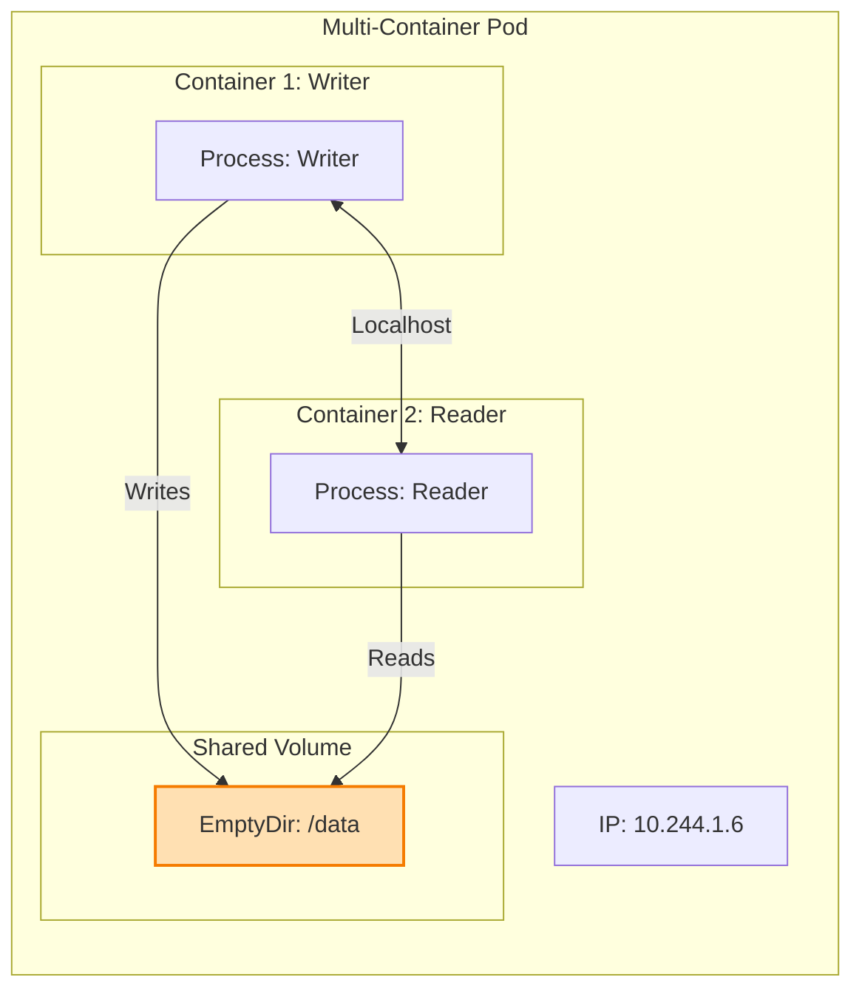
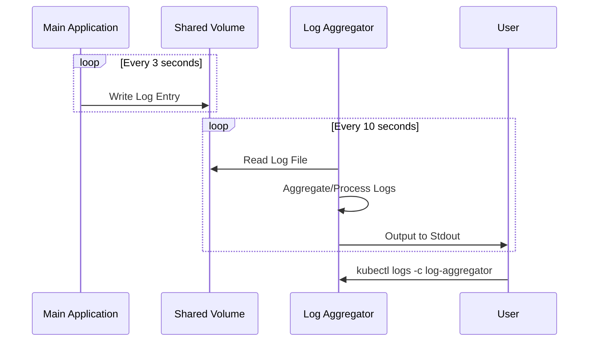

# Lab 2: Multi-Container Pods

## Objectives

By the end of this lab, you will be able to:
- Create pods with multiple containers
- Understand container communication within a pod
- Share volumes between containers
- View logs from specific containers
- Execute commands in specific containers

## Multi-Container Architecture

### Shared Context

Containers in a Pod share the same **Network Namespace** (IP address) and can share **Storage Volumes**.



### Sidecar Pattern Flow

In this lab, we implement a logging sidecar. Here is how the data flows:



## Prerequisites

- Completed [Lab 1: Your First Pod](lab-01-your-first-pod.md)
- Understanding of basic pod concepts
- Kubernetes cluster running

## Estimated Time

25-30 minutes

## Concepts

### Why Multi-Container Pods?

Containers in the same pod:
- Share the same network namespace (can communicate via localhost)
- Share the same IPC namespace
- Can share volumes
- Are scheduled on the same node
- Are scaled together

### Common Patterns

1. **Sidecar**: Helper container (logging, monitoring)
2. **Ambassador**: Proxy container
3. **Adapter**: Transform output/input

## Lab Steps

### Step 1: Create a Multi-Container Pod

Create `multi-container-pod.yaml`:

```yaml
apiVersion: v1
kind: Pod
metadata:
  name: multi-container-demo
  labels:
    app: demo
spec:
  # Shared volume between containers
  volumes:
  - name: shared-data
    emptyDir: {}
  
  containers:
  # Container 1: Writer
  - name: writer
    image: busybox:1.36
    command:
    - 'sh'
    - '-c'
    - 'while true; do echo "$(date) - Hello from writer" >> /data/log.txt; sleep 5; done'
    volumeMounts:
    - name: shared-data
      mountPath: /data
  
  # Container 2: Reader
  - name: reader
    image: busybox:1.36
    command:
    - 'sh'
    - '-c'
    - 'tail -f /data/log.txt'
    volumeMounts:
    - name: shared-data
      mountPath: /data
```

**Apply the configuration:**

```bash
kubectl apply -f multi-container-pod.yaml
```

### Step 2: View Pod Status

**Check pod status:**

```bash
kubectl get pods multi-container-demo
```

**Expected output:**
```
NAME                   READY   STATUS    RESTARTS   AGE
multi-container-demo   2/2     Running   0          10s
```

Notice `READY` shows `2/2` - both containers are running.

### Step 3: View Logs from Specific Containers

**View logs from the writer container:**

```bash
kubectl logs multi-container-demo -c writer
```

**View logs from the reader container:**

```bash
kubectl logs multi-container-demo -c reader
```

**Follow logs from reader:**

```bash
kubectl logs multi-container-demo -c reader -f
```

Press `Ctrl+C` to stop.

### Step 4: Execute Commands in Specific Containers

**Check the shared file in writer container:**

```bash
kubectl exec multi-container-demo -c writer -- cat /data/log.txt
```

**Check the same file in reader container:**

```bash
kubectl exec multi-container-demo -c reader -- cat /data/log.txt
```

Both containers see the same file!

### Step 5: Network Communication Between Containers

Create `network-demo-pod.yaml`:

```yaml
apiVersion: v1
kind: Pod
metadata:
  name: network-demo
spec:
  containers:
  # Container 1: Web server
  - name: nginx
    image: nginx:1.25-alpine
    ports:
    - containerPort: 80
  
  # Container 2: Client that accesses nginx via localhost
  - name: client
    image: curlimages/curl:8.4.0
    command:
    - 'sh'
    - '-c'
    - 'while true; do curl -s http://localhost:80 > /dev/null && echo "$(date) - Successfully connected to nginx"; sleep 10; done'
```

**Apply and check logs:**

```bash
kubectl apply -f network-demo-pod.yaml

# Wait a few seconds, then check client logs
kubectl logs network-demo -c client
```

You should see successful connection messages.

### Step 6: Sidecar Pattern - Logging

Create `sidecar-logging.yaml`:

```yaml
apiVersion: v1
kind: Pod
metadata:
  name: sidecar-logging
spec:
  volumes:
  - name: logs
    emptyDir: {}
  
  containers:
  # Main application
  - name: app
    image: busybox:1.36
    command:
    - 'sh'
    - '-c'
    - |
      while true; do
        echo "$(date) - Application log entry" >> /var/log/app.log
        echo "$(date) - Error log entry" >> /var/log/error.log
        sleep 3
      done
    volumeMounts:
    - name: logs
      mountPath: /var/log
  
  # Sidecar: Log aggregator
  - name: log-aggregator
    image: busybox:1.36
    command:
    - 'sh'
    - '-c'
    - |
      while true; do
        if [ -f /var/log/app.log ]; then
          echo "=== Application Logs ==="
          tail -n 5 /var/log/app.log
        fi
        if [ -f /var/log/error.log ]; then
          echo "=== Error Logs ==="
          tail -n 5 /var/log/error.log
        fi
        echo "---"
        sleep 10
      done
    volumeMounts:
    - name: logs
      mountPath: /var/log
      readOnly: true
```

**Apply and view logs:**

```bash
kubectl apply -f sidecar-logging.yaml

# View aggregated logs from sidecar
kubectl logs sidecar-logging -c log-aggregator -f
```

### Step 7: Resource Management in Multi-Container Pods

Create `resources-demo.yaml`:

```yaml
apiVersion: v1
kind: Pod
metadata:
  name: resources-demo
spec:
  containers:
  - name: container1
    image: nginx:1.25-alpine
    resources:
      requests:
        memory: "64Mi"
        cpu: "100m"
      limits:
        memory: "128Mi"
        cpu: "200m"
  
  - name: container2
    image: busybox:1.36
    command: ['sh', '-c', 'sleep 3600']
    resources:
      requests:
        memory: "32Mi"
        cpu: "50m"
      limits:
        memory: "64Mi"
        cpu: "100m"
```

**Apply and check resources:**

```bash
kubectl apply -f resources-demo.yaml

# View resource usage (requires metrics-server)
kubectl top pod resources-demo --containers
```

## Verification

✅ Created multi-container pods  
✅ Shared volumes between containers  
✅ Viewed logs from specific containers  
✅ Executed commands in specific containers  
✅ Demonstrated network communication via localhost  
✅ Implemented sidecar pattern

## Common Issues and Solutions

### Issue: Container stuck in "Waiting" state

**Check which container:**
```bash
kubectl describe pod multi-container-demo
```

Look for the container with issues in the "Containers" section.

### Issue: Cannot access shared volume

**Verify volume mounts:**
```bash
kubectl describe pod multi-container-demo
```

Check that both containers have the volume mounted at the correct path.

### Issue: Containers cannot communicate via localhost

**Verify both containers are in the same pod:**
```bash
kubectl get pod network-demo -o jsonpath='{.spec.containers[*].name}'
```

## Challenge Exercises

1. **Create a pod with three containers** that all share a volume
2. **Implement an adapter pattern** that converts log format
3. **Add resource limits** to all containers
4. **Create a pod** where one container depends on another (use init containers)

## Solutions to Challenges

### Challenge 1: Three-container pod

```yaml
apiVersion: v1
kind: Pod
metadata:
  name: three-containers
spec:
  volumes:
  - name: shared
    emptyDir: {}
  
  containers:
  - name: writer1
    image: busybox:1.36
    command: ['sh', '-c', 'while true; do echo "Writer 1: $(date)" >> /shared/data.txt; sleep 5; done']
    volumeMounts:
    - name: shared
      mountPath: /shared
  
  - name: writer2
    image: busybox:1.36
    command: ['sh', '-c', 'while true; do echo "Writer 2: $(date)" >> /shared/data.txt; sleep 7; done']
    volumeMounts:
    - name: shared
      mountPath: /shared
  
  - name: reader
    image: busybox:1.36
    command: ['sh', '-c', 'tail -f /shared/data.txt']
    volumeMounts:
    - name: shared
      mountPath: /shared
      readOnly: true
```

### Challenge 4: Init container dependency

```yaml
apiVersion: v1
kind: Pod
metadata:
  name: init-demo
spec:
  volumes:
  - name: config
    emptyDir: {}
  
  initContainers:
  - name: setup
    image: busybox:1.36
    command:
    - 'sh'
    - '-c'
    - 'echo "Configuration initialized" > /config/app.conf'
    volumeMounts:
    - name: config
      mountPath: /config
  
  containers:
  - name: app
    image: busybox:1.36
    command:
    - 'sh'
    - '-c'
    - 'cat /config/app.conf && sleep 3600'
    volumeMounts:
    - name: config
      mountPath: /config
      readOnly: true
```

## Key Takeaways

- Multiple containers in a pod share network and IPC namespaces
- Containers communicate via `localhost`
- Volumes can be shared between containers
- Each container can have its own resource limits
- Use `-c` flag to specify container for logs and exec
- Common patterns: sidecar, ambassador, adapter

## Cleanup

```bash
kubectl delete pod multi-container-demo
kubectl delete pod network-demo
kubectl delete pod sidecar-logging
kubectl delete pod resources-demo
kubectl delete pod three-containers
kubectl delete pod init-demo
```

## Next Steps

- Proceed to [Lab 3: Init Containers](lab-03-init-containers.md)
- Explore [Sidecar Pattern Examples](../examples/03-sidecar-patterns/)
- Read about [Container Design Patterns](https://kubernetes.io/blog/2015/06/the-distributed-system-toolkit-patterns/)

## Additional Resources

- [Multi-Container Pod Patterns](https://kubernetes.io/blog/2015/06/the-distributed-system-toolkit-patterns/)
- [Shared Volumes](https://kubernetes.io/docs/concepts/storage/volumes/)
- [Container Lifecycle](https://kubernetes.io/docs/concepts/containers/container-lifecycle-hooks/)
