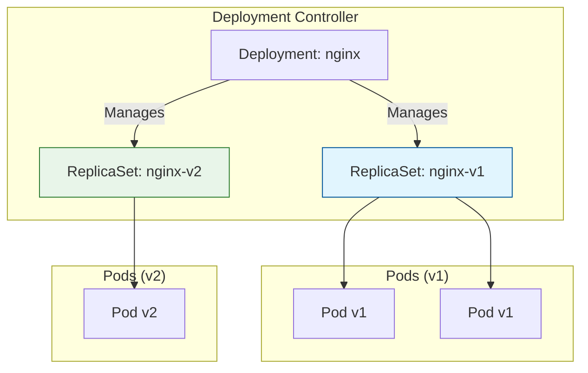

# Lab 1: Deployments & Rolling Updates

## Objectives

By the end of this lab, you will be able to:
- Create a Deployment
- Scale a Deployment
- Perform a Rolling Update
- Rollback a Deployment
- Understand Deployment strategies

## Deployment Architecture

Deployments manage ReplicaSets, which in turn manage Pods. This abstraction allows for declarative updates.



## Prerequisites

- Kubernetes cluster running
- `kubectl` configured

## Lab Steps

### Step 1: Create a Deployment

Create `nginx-deployment.yaml`:

```yaml
apiVersion: apps/v1
kind: Deployment
metadata:
  name: nginx-deployment
  labels:
    app: nginx
spec:
  replicas: 3
  selector:
    matchLabels:
      app: nginx
  template:
    metadata:
      labels:
        app: nginx
    spec:
      containers:
      - name: nginx
        image: nginx:1.24-alpine
        ports:
        - containerPort: 80
```

**Apply and Verify:**

```bash
kubectl apply -f nginx-deployment.yaml
kubectl get deployments
kubectl get rs
kubectl get pods --show-labels
```

### Step 2: Scale the Deployment

**Scale up to 5 replicas:**

```bash
kubectl scale deployment nginx-deployment --replicas=5
```

**Verify scaling:**

```bash
kubectl get pods
```

### Step 3: Perform a Rolling Update

**Update the image to a newer version:**

```bash
kubectl set image deployment/nginx-deployment nginx=nginx:1.25-alpine
```

**Watch the rollout status:**

```bash
kubectl rollout status deployment/nginx-deployment
```

**Observe the process:**
1.  New ReplicaSet created
2.  New pods scaled up
3.  Old pods scaled down

### Step 4: Rollback

**Simulate a bad update (invalid image):**

```bash
kubectl set image deployment/nginx-deployment nginx=nginx:invalid-tag
```

**Check status (will hang):**

```bash
kubectl rollout status deployment/nginx-deployment
```

**View rollout history:**

```bash
kubectl rollout history deployment/nginx-deployment
```

**Undo the deployment:**

```bash
kubectl rollout undo deployment/nginx-deployment
```

**Verify recovery:**

```bash
kubectl get pods
```

## Key Takeaways
- Deployments enable declarative updates
- Rolling updates ensure zero downtime
- Rollbacks allow quick recovery from failures
