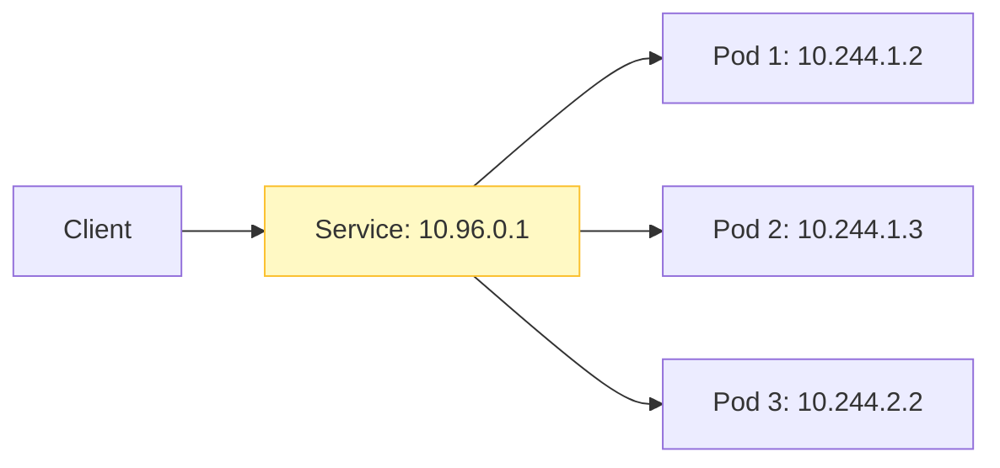

# Lab 1: Services & Networking

## Objectives

By the end of this lab, you will be able to:
- Expose Pods using Services
- Understand ClusterIP vs NodePort vs LoadBalancer
- Test Service discovery via DNS
- Implement basic Network Policies

## Service Architecture

Services provide a stable IP and DNS name for a set of Pods.



## Lab Steps

### Step 1: Create a Deployment

Create `webapp.yaml`:

```yaml
apiVersion: apps/v1
kind: Deployment
metadata:
  name: webapp
spec:
  replicas: 2
  selector:
    matchLabels:
      app: webapp
  template:
    metadata:
      labels:
        app: webapp
    spec:
      containers:
      - name: nginx
        image: nginx:alpine
        ports:
        - containerPort: 80
```

```bash
kubectl apply -f webapp.yaml
```

### Step 2: Create a ClusterIP Service

Create `webapp-service.yaml`:

```yaml
apiVersion: v1
kind: Service
metadata:
  name: webapp-svc
spec:
  type: ClusterIP
  selector:
    app: webapp
  ports:
  - port: 80
    targetPort: 80
```

```bash
kubectl apply -f webapp-service.yaml
```

### Step 3: Test Service Discovery

**Run a temporary pod to test access:**

```bash
kubectl run test-pod --rm -it --image=curlimages/curl -- sh
```

**Inside the pod:**

```bash
# Test by IP
nslookup webapp-svc
curl http://webapp-svc

# Test by FQDN
curl http://webapp-svc.default.svc.cluster.local
```

### Step 4: NodePort Service

**Edit the service to be NodePort:**

```bash
kubectl patch svc webapp-svc -p '{"spec": {"type": "NodePort"}}'
```

**Get the NodePort:**

```bash
kubectl get svc webapp-svc
```

**Access from your machine (if using Minikube):**

```bash
minikube service webapp-svc --url
```

### Step 5: Network Policy

**Deny all traffic to webapp:**

```yaml
apiVersion: networking.k8s.io/v1
kind: NetworkPolicy
metadata:
  name: deny-webapp
spec:
  podSelector:
    matchLabels:
      app: webapp
  policyTypes:
  - Ingress
```

**Apply and test (should fail):**

```bash
kubectl apply -f deny-webapp.yaml
kubectl run test-pod-2 --rm -it --image=curlimages/curl -- curl --connect-timeout 2 http://webapp-svc
```

## Key Takeaways
- Services provide stable endpoints
- ClusterIP is for internal access
- NodePort/LoadBalancer is for external access
- Network Policies secure traffic
