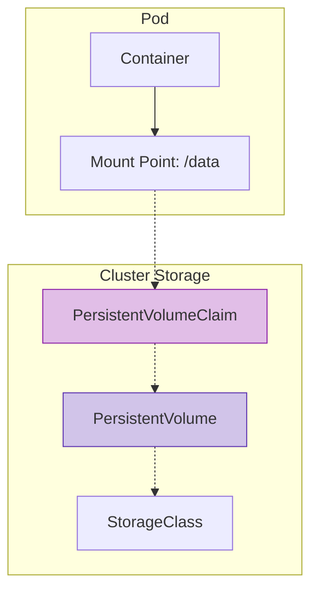

# Lab 1: Storage & Volumes

## Objectives

By the end of this lab, you will be able to:
- Use emptyDir for temporary storage
- Create PersistentVolumeClaims (PVC)
- Mount PVCs to Pods
- Understand data persistence

## Storage Architecture

Decoupling storage from Pods using PV/PVC.



## Lab Steps

### Step 1: Create a PVC

Create `my-pvc.yaml`:

```yaml
apiVersion: v1
kind: PersistentVolumeClaim
metadata:
  name: task-pvc-volume
spec:
  accessModes:
    - ReadWriteOnce
  resources:
    requests:
      storage: 1Gi
  storageClassName: standard # or hostpath for minikube
```

```bash
kubectl apply -f my-pvc.yaml
kubectl get pvc
```

### Step 2: Create a Pod with PVC

Create `task-pv-pod.yaml`:

```yaml
apiVersion: v1
kind: Pod
metadata:
  name: task-pv-pod
spec:
  containers:
    - name: task-pv-container
      image: nginx
      ports:
        - containerPort: 80
          name: "http-server"
      volumeMounts:
        - mountPath: "/usr/share/nginx/html"
          name: task-pv-storage
  volumes:
    - name: task-pv-storage
      persistentVolumeClaim:
        claimName: task-pvc-volume
```

```bash
kubectl apply -f task-pv-pod.yaml
```

### Step 3: Verify Persistence

**Write data to the volume:**

```bash
kubectl exec task-pv-pod -- sh -c "echo 'Hello from Persistent Storage' > /usr/share/nginx/html/index.html"
```

**Delete the Pod:**

```bash
kubectl delete pod task-pv-pod
```

**Recreate the Pod:**

```bash
kubectl apply -f task-pv-pod.yaml
```

**Verify data still exists:**

```bash
kubectl exec task-pv-pod -- cat /usr/share/nginx/html/index.html
```

## Key Takeaways
- `emptyDir` is lost when Pod is deleted
- `PVC` persists data beyond Pod lifecycle
- `StorageClass` handles dynamic provisioning
