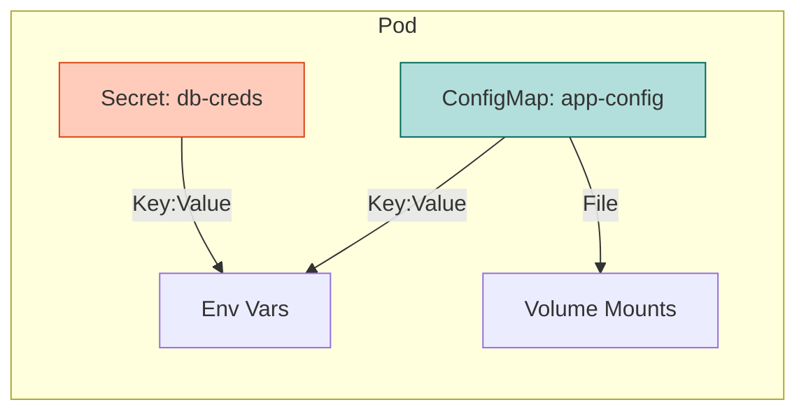

# Lab 1: ConfigMaps & Secrets

## Objectives

By the end of this lab, you will be able to:
- Create ConfigMaps and Secrets
- Inject configuration via Environment Variables
- Mount configuration as Volumes
- Update configuration dynamically

## Configuration Flow



## Lab Steps

### Step 1: Create ConfigMap and Secret

```bash
# Create ConfigMap
kubectl create configmap game-config --from-literal=lives=3 --from-literal=level=easy

# Create Secret
kubectl create secret generic game-secret --from-literal=password=s3cr3t
```

### Step 2: Create Pod

Create `game-pod.yaml`:

```yaml
apiVersion: v1
kind: Pod
metadata:
  name: game-pod
spec:
  containers:
  - name: game
    image: busybox
    command: ["sh", "-c", "env; sleep 3600"]
    env:
    - name: LIVES
      valueFrom:
        configMapKeyRef:
          name: game-config
          key: lives
    - name: PASSWORD
      valueFrom:
        secretKeyRef:
          name: game-secret
          key: password
```

```bash
kubectl apply -f game-pod.yaml
```

### Step 3: Verify Configuration

```bash
kubectl logs game-pod | grep LIVES
kubectl logs game-pod | grep PASSWORD
```

### Step 4: Volume Mounts

Create `config-vol-pod.yaml`:

```yaml
apiVersion: v1
kind: Pod
metadata:
  name: config-vol-pod
spec:
  containers:
  - name: app
    image: busybox
    command: ["sh", "-c", "ls /etc/config; cat /etc/config/lives; sleep 3600"]
    volumeMounts:
    - name: config-vol
      mountPath: /etc/config
  volumes:
  - name: config-vol
    configMap:
      name: game-config
```

```bash
kubectl apply -f config-vol-pod.yaml
kubectl logs config-vol-pod
```

## Key Takeaways
- Use ConfigMaps for non-sensitive data
- Use Secrets for sensitive data
- Env vars are set at startup
- Volume mounts update automatically (eventually)
