# GitOps Lab Architecture & Design

## System Architecture Overview

### High-Level Architecture

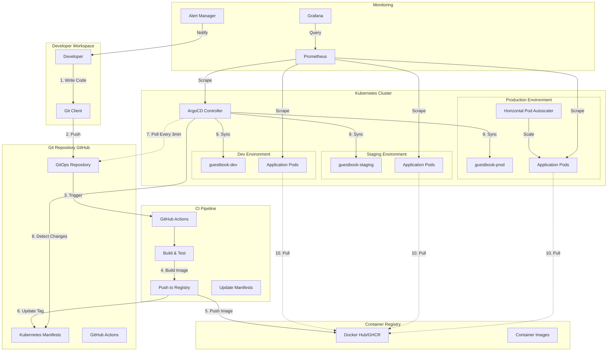

## GitOps Flow Detailed

### 1. Development Workflow

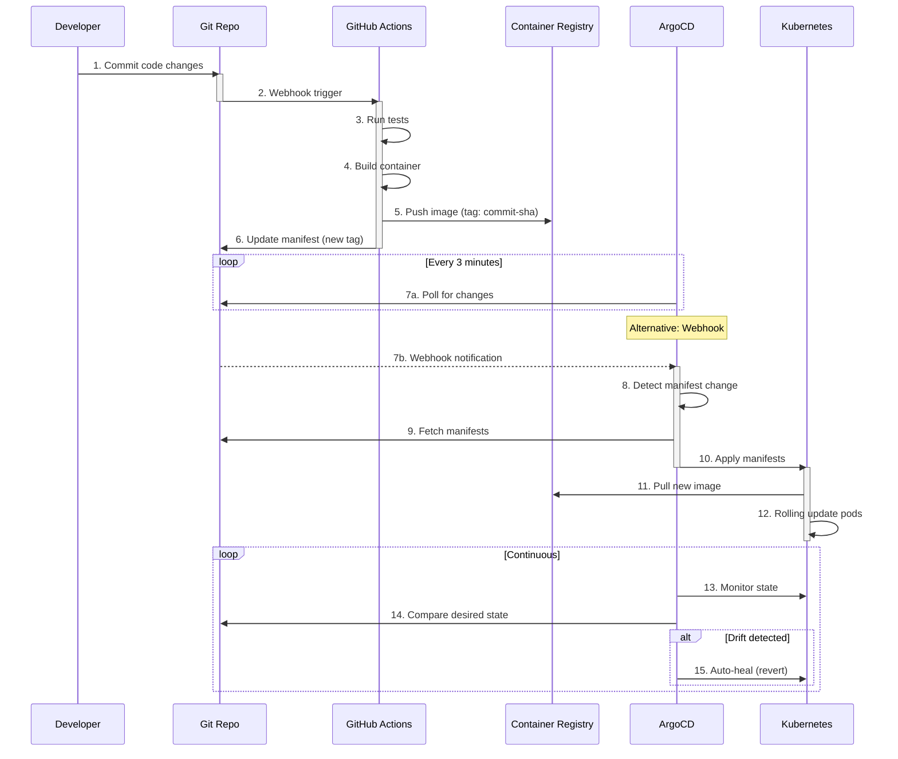

### 2. Multi-Environment Strategy

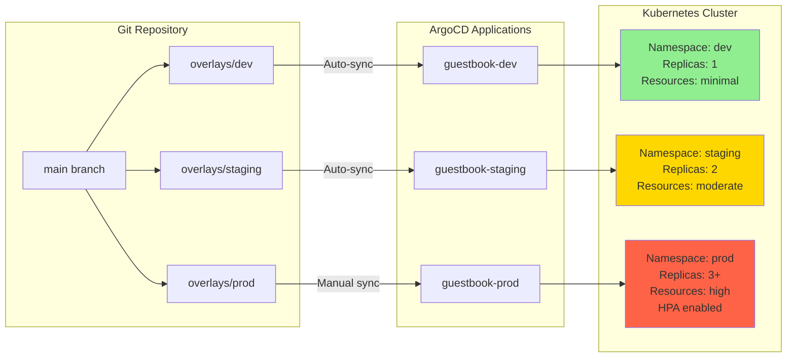

## Directory Structure

### Complete Lab Structure

```
04-gitops/
├── README.md                          # Main entry point
├── CONCEPTS.md                        # GitOps concepts
├── BENEFITS.md                        # Business case
├── ARCHITECTURE.md                    # This file
│
├── documentation/                     # Complete guides
│   ├── 01-prerequisites-setup.md      # System setup
│   ├── 02-argocd-installation.md      # ArgoCD install
│   ├── 03-repository-structure.md     # Repo design
│   ├── 04-gitops-concepts.md          # Core concepts
│   ├── 05-sample-applications.md      # App explanations
│   ├── 06-cicd-integration.md         # CI/CD pipelines
│   ├── 07-monitoring-observability.md # Monitoring
│   ├── 08-advanced-scenarios.md       # Advanced patterns
│   ├── 09-troubleshooting.md          # Common issues
│   └── 10-cleanup.md                  # Cleanup guide
│
├── examples/                          # Sample applications
│   ├── guestbook/                     # Multi-tier app
│   │   ├── base/
│   │   │   ├── deployment.yaml        # Base deployments
│   │   │   ├── service.yaml           # Base services
│   │   │   └── kustomization.yaml     # Base kustomize
│   │   └── overlays/
│   │       ├── dev/
│   │       │   └── kustomization.yaml # Dev config
│   │       ├── staging/
│   │       │   └── kustomization.yaml # Staging config
│   │       └── prod/
│   │           ├── kustomization.yaml # Prod config
│   │           └── hpa.yaml           # Production HPA
│   │
│   ├── wordpress/                     # StatefulSet example
│   │   └── (similar structure)
│   │
│   ├── argocd-apps/                   # ArgoCD Applications
│   │   ├── guestbook-dev.yaml
│   │   ├── guestbook-staging.yaml
│   │   ├── guestbook-prod.yaml
│   │   ├── app-of-apps.yaml
│   │   └── applicationset.yaml
│   │
│   ├── github-actions/                # CI/CD workflows
│   │   ├── build-push.yaml
│   │   ├── update-manifests.yaml
│   │   └── promote-to-staging.yaml
│   │
│   └── monitoring/                    # Monitoring configs
│       ├── prometheus-values.yaml
│       ├── grafana-dashboards/
│       │   └── argocd-dashboard.json
│       └── alerts/
│           └── argocd-alerts.yaml
│
├── labs/                              # Hands-on exercises
│   ├── lab-01-first-deployment.md
│   ├── lab-02-environment-promotion.md
│   ├── lab-03-rollback.md
│   ├── lab-04-drift-detection.md
│   └── lab-05-multi-app-management.md
│
├── scripts/                           # Automation scripts
│   ├── setup-cluster.sh               # Cluster setup
│   ├── install-argocd.sh              # ArgoCD install
│   ├── deploy-samples.sh              # Deploy apps
│   ├── cleanup.sh                     # Cleanup
│   └── validate-manifests.sh          # YAML validation
│
└── setup/                             # Base configurations
    ├── argocd-values.yaml
    └── app-of-apps.yaml
```

## Application Architecture

### Guestbook Application

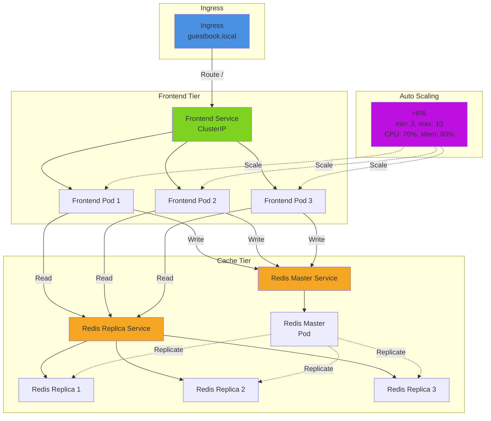

## ArgoCD Architecture

### ArgoCD Components

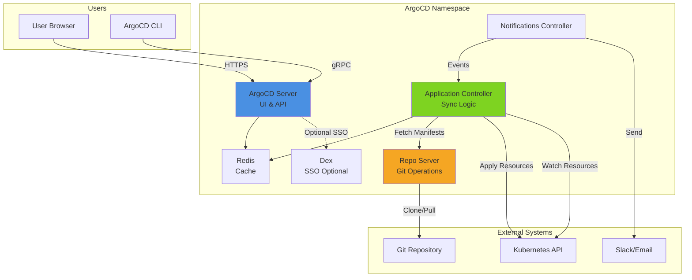

## Sync Strategies

### Automated Sync (Dev Environment)

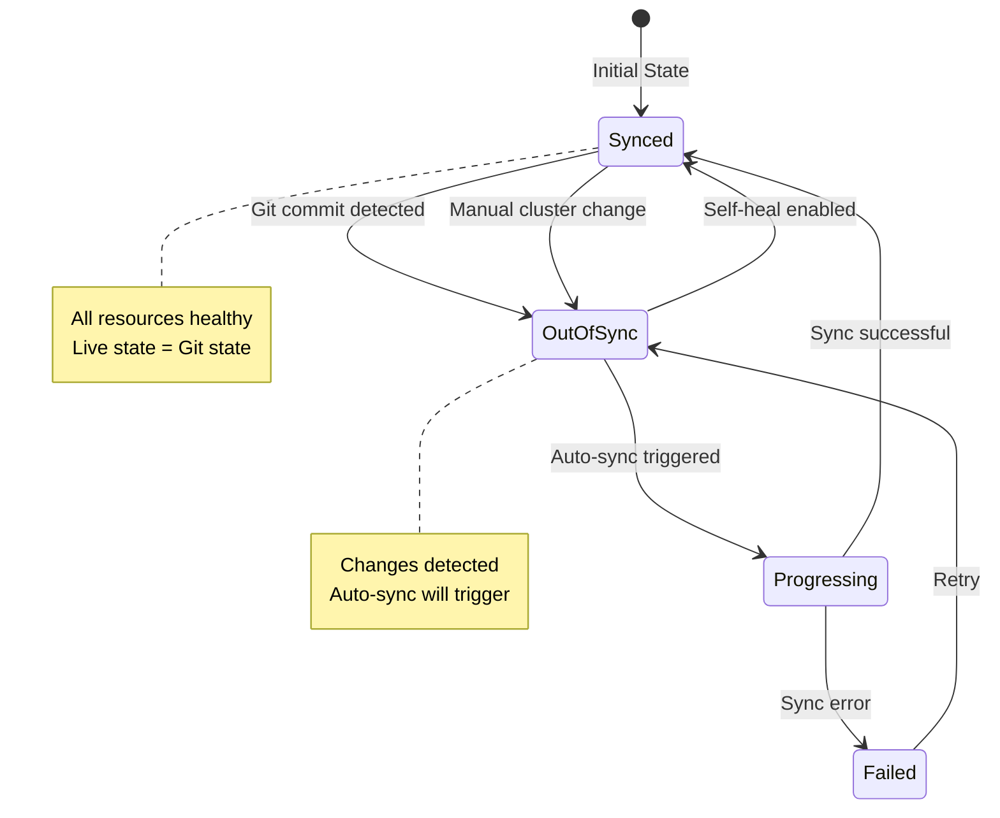

### Manual Sync (Production Environment)

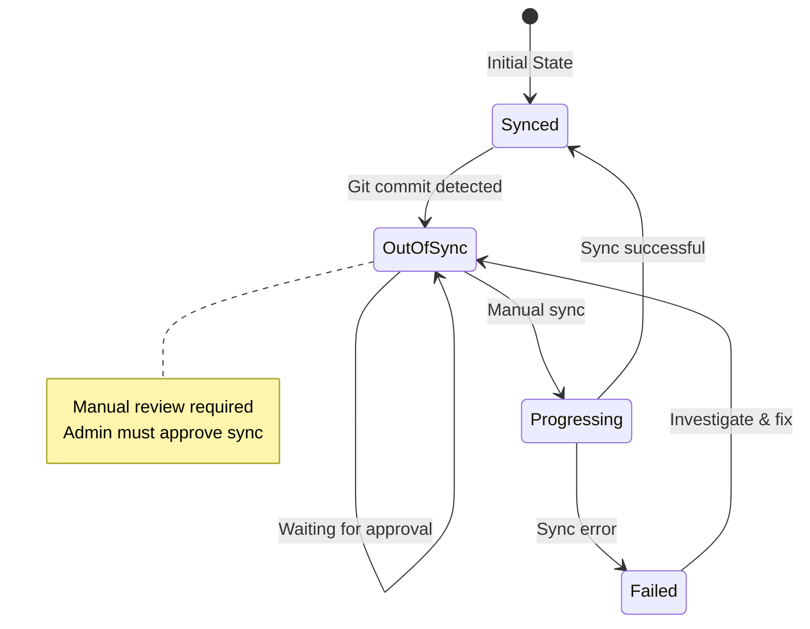

## Resource Management Strategy

### Environment Resource Allocation

| Resource | Dev | Staging | Production |
|----------|-----|---------|------------|
| **Frontend Replicas** | 1 | 2 | 3-10 (HPA) |
| **Redis Replicas** | 1 | 2 | 3 |
| **CPU Request** | 50m | 100m | 200m |
| **CPU Limit** | 100m | 250m | 500m |
| **Memory Request** | 64Mi | 128Mi | 256Mi |
| **Memory Limit** | 128Mi | 256Mi | 512Mi |
| **Auto-Scaling** | ❌ | ❌ | ✅ |
| **Sync Policy** | Auto | Auto | Manual |
| **Self-Heal** | ✅ | ❌ | ❌ |

## GitOps Best Practices Applied

### 1. Separation of Concerns

```
Application Repository (Code)
    ↓
CI Pipeline builds image
    ↓
GitOps Repository (Config)
    ↓
ArgoCD deploys
    ↓
Kubernetes Cluster
```

### 2. Progressive Delivery

```
Commit → Dev → Tests → Staging → Validation → Production
  ↓        ↓            ↓                        ↓
Auto    Auto         Auto                    Manual
```

### 3. Drift Detection & Remediation

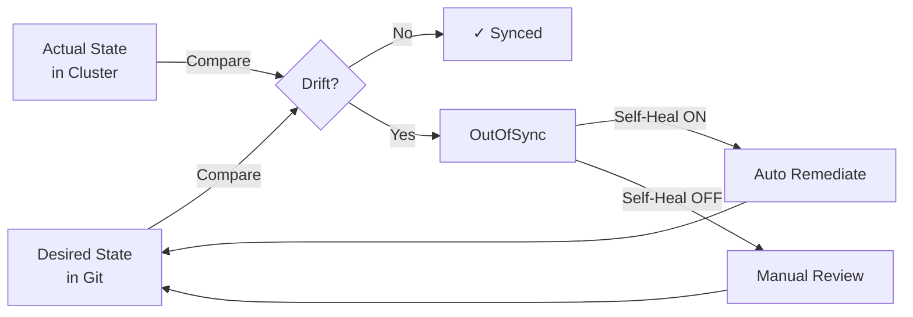

## Security Architecture

### RBAC Strategy

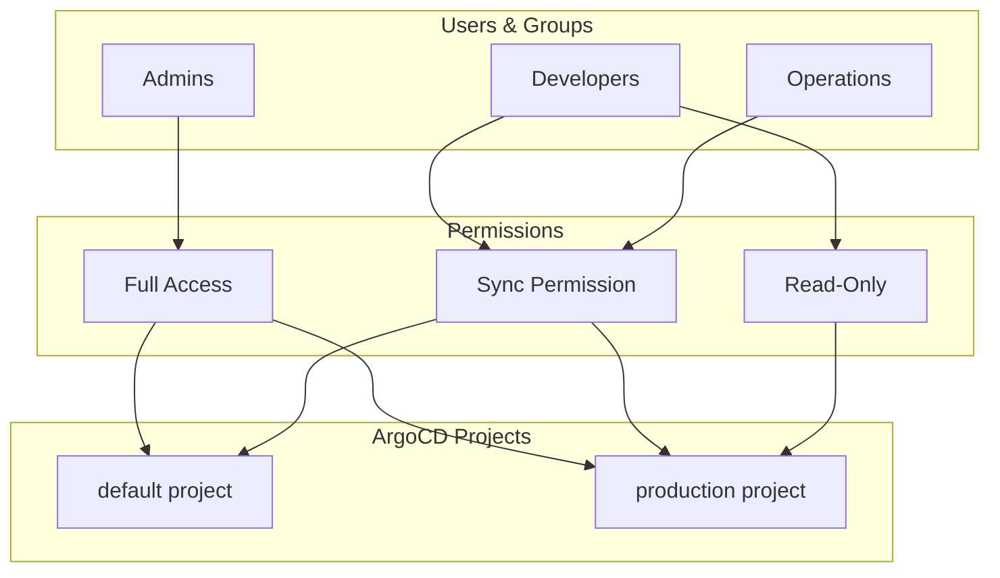

### Secret Management Flow

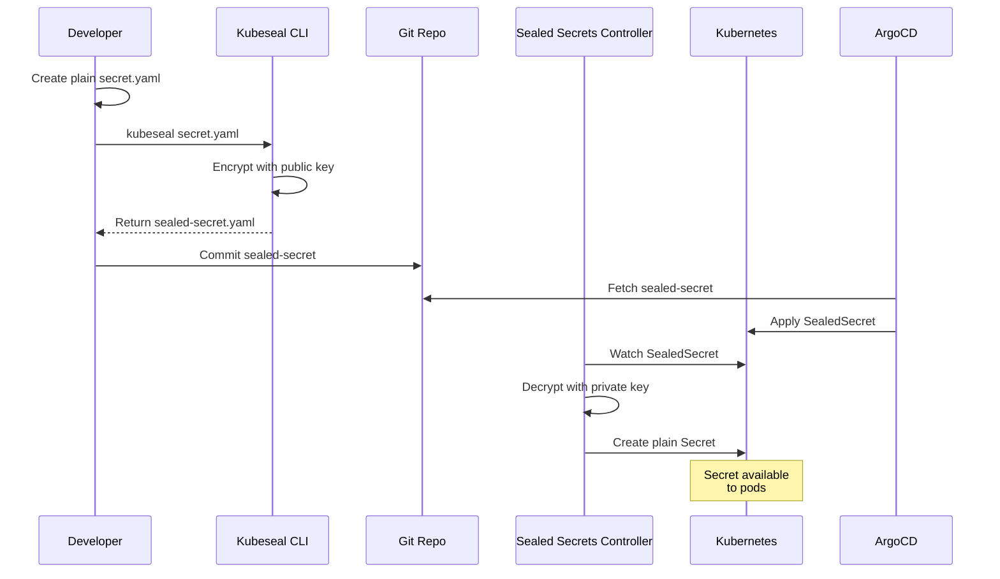

## Monitoring & Observability

### Metrics Collection

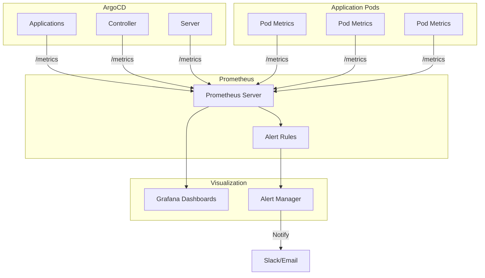

### Key Metrics Tracked

1. **ArgoCD Metrics**
   - Application sync status
   - Sync operation duration
   - Repository fetch time
   - Number of applications per state

2. **Application Metrics**
   - Pod CPU/Memory usage
   - Request rate
   - Error rate
   - Latency (p50, p95, p99)

3. **DORA Metrics**
   - Deployment frequency
   - Lead time for changes
   - Mean time to recovery (MTTR)
   - Change failure rate

## Disaster Recovery

### Backup Strategy

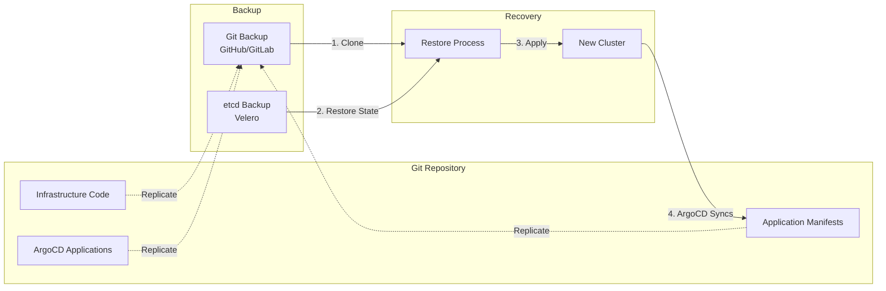

## Scaling Considerations

### Horizontal Scaling

- **Dev**: Single replica, minimal resources
- **Staging**: Multiple replicas for testing
- **Production**: HPA-managed, auto-scales 3-10 pods

### ArgoCD Scaling

For large deployments (100+ applications):
- Increase controller replicas
- Shard applications across controllers
- Adjust sync timeout and reconciliation interval
- Use ApplicationSets for templating

## Technology Stack

| Component | Technology | Purpose |
|-----------|-----------|---------|
| **Orchestration** | Kubernetes 1.28+ | Container orchestration |
| **GitOps** | ArgoCD 2.9+ | Continuous deployment |
| **Templating** | Kustomize | Environment management |
| **CI/CD** | GitHub Actions | Build & test |
| **Registry** | Docker Hub/GHCR | Image storage |
| **Monitoring** | Prometheus | Metrics collection |
| **Visualization** | Grafana | Dashboards |
| **Secrets** | Sealed Secrets | Secret encryption |
| **Local Cluster** | Minikube/Kind/K3d | Development clusters |

## Next Steps

1. **Setup**: Follow [Quick Start](../README.md#quick-start-30-minutes)
2. **Learn**: Complete [Lab 01](../labs/lab-01-first-deployment.md)
3. **Practice**: Try all 5 hands-on labs
4. **Explore**: Read [Advanced Scenarios](08-advanced-scenarios.md)
5. **Monitor**: Setup [Monitoring Stack](07-monitoring-observability.md)

---

**This architecture provides a production-ready GitOps foundation that scales from development to enterprise deployments.**
