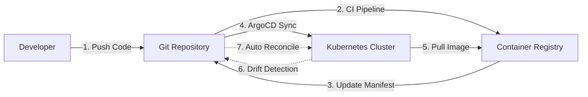

# GitOps Complete Lab Environment 🚀

> A comprehensive, hands-on lab for learning and practicing GitOps principles using Kubernetes and ArgoCD

[](https://argo-cd.readthedocs.io/)
[](https://kubernetes.io/)
[](../../LICENSE)

## 📋 Table of Contents

- [Overview](#overview)
- [What You'll Learn](#what-youll-learn)
- [Quick Start (30 Minutes)](#quick-start-30-minutes)
- [Lab Structure](#lab-structure)
- [Prerequisites](#prerequisites)
- [Documentation](#documentation)
- [Sample Applications](#sample-applications)
- [Hands-On Labs](#hands-on-labs)
- [Advanced Scenarios](#advanced-scenarios)
- [Troubleshooting](#troubleshooting)
- [Cleanup](#cleanup)
- [Resources](#resources)

## 🎯 Overview

This lab provides a **complete, production-ready GitOps learning environment** where you'll practice:

- ✅ Declarative infrastructure and application management
- ✅ Git as the single source of truth
- ✅ Automated synchronization and self-healing
- ✅ Multi-environment deployments (dev, staging, prod)
- ✅ CI/CD integration with GitHub Actions
- ✅ Drift detection and reconciliation
- ✅ Rollback strategies and disaster recovery
- ✅ Monitoring and observability for GitOps workflows

**GitOps Workflow:**



## 🎓 What You'll Learn

### Core GitOps Concepts
- Declarative vs imperative configuration
- Pull vs push deployment models
- Continuous reconciliation and drift detection
- Git as single source of truth

### Practical Skills
- Set up local Kubernetes clusters (Minikube/Kind)
- Install and configure ArgoCD
- Structure GitOps repositories
- Manage multiple environments with Kustomize
- Build CI/CD pipelines with GitHub Actions
- Handle secret management
- Monitor GitOps workflows
- Troubleshoot common issues

### Production Patterns
- Multi-cluster management
- Progressive delivery (canary, blue-green)
- ApplicationSet for templating
- Sync waves and hooks
- Disaster recovery procedures

## ⚡ Quick Start (30 Minutes)

Get a working GitOps environment in 30 minutes:

### 1. Prerequisites Check

```bash
# Verify you have the required tools
docker --version      # Docker 20.10+
kubectl version       # kubectl 1.28+
helm version         # Helm 3.0+
git --version        # Git 2.0+
```

### 2. Set Up Kubernetes Cluster

```bash
cd /home/rk/Documents/labs/lab-k8s/04-tools-ecosystem/04-gitops

# Run automated setup script
./scripts/setup-cluster.sh

# Verify cluster is running
kubectl get nodes
```

### 3. Install ArgoCD

```bash
# Run ArgoCD installation script
./scripts/install-argocd.sh

# Access ArgoCD UI (in a new terminal)
kubectl port-forward svc/argocd-server -n argocd 8080:443

# Get admin password
kubectl -n argocd get secret argocd-initial-admin-secret -o jsonpath="{.data.password}" | base64 -d
echo
```

Open browser: https://localhost:8080
- Username: `admin`
- Password: (from command above)

### 4. Deploy Your First Application

```bash
# Deploy the guestbook sample app
kubectl apply -f examples/argocd-apps/guestbook-dev.yaml

# Watch ArgoCD sync the application
kubectl get applications -n argocd -w

# Access the guestbook app (in another terminal)
kubectl port-forward svc/guestbook-ui 8081:80 -n guestbook-dev

# Open browser: http://localhost:8081
```

🎉 **Congratulations!** You've deployed your first GitOps application!

## 📁 Lab Structure

```
04-gitops/
├── README.md                          # This file
├── CONCEPTS.md                        # GitOps concepts deep dive
├── BENEFITS.md                        # Business case for GitOps
│
├── documentation/                     # Complete guides
│   ├── 01-prerequisites-setup.md      # System requirements & tools
│   ├── 02-argocd-installation.md      # ArgoCD setup guide
│   ├── 03-repository-structure.md     # GitOps repo design
│   ├── 04-gitops-concepts.md          # Core concepts explained
│   ├── 05-sample-applications.md      # Sample apps guide
│   ├── 06-cicd-integration.md         # CI/CD pipelines
│   ├── 07-monitoring-observability.md # Monitoring setup
│   ├── 08-advanced-scenarios.md       # Advanced patterns
│   ├── 09-troubleshooting.md          # Common issues & fixes
│   └── 10-cleanup.md                  # Cleanup procedures
│
├── examples/                          # Sample applications
│   ├── guestbook/                     # Multi-tier app
│   │   ├── base/                      # Base manifests
│   │   └── overlays/                  # Environment overlays
│   │       ├── dev/
│   │       ├── staging/
│   │       └── prod/
│   ├── wordpress/                     # StatefulSet example
│   ├── nginx-demo/                    # Simple app
│   ├── argocd-apps/                   # ArgoCD Applications
│   ├── github-actions/                # CI/CD workflows
│   └── monitoring/                    # Monitoring configs
│
├── labs/                              # Hands-on exercises
│   ├── lab-01-first-deployment.md
│   ├── lab-02-environment-promotion.md
│   ├── lab-03-rollback.md
│   ├── lab-04-drift-detection.md
│   └── lab-05-multi-app-management.md
│
├── scripts/                           # Automation scripts
│   ├── setup-cluster.sh               # Cluster setup
│   ├── install-argocd.sh              # ArgoCD installation
│   ├── deploy-samples.sh              # Deploy all samples
│   └── cleanup.sh                     # Cleanup resources
│
└── setup/                             # Base configurations
    ├── argocd-values.yaml
    └── app-of-apps.yaml
```

## 📋 Prerequisites

### System Requirements
- **CPU**: 4 cores minimum (8 recommended)
- **RAM**: 8GB minimum (16GB recommended)
- **Disk**: 20GB free space
- **OS**: Linux, macOS, or Windows (WSL2)

### Required Tools
- **Docker** 20.10+ or Podman
- **kubectl** 1.28+
- **Helm** 3.0+
- **Git** 2.0+
- **curl** or **wget**

### Optional Tools
- **k9s** - Kubernetes CLI UI
- **stern** - Multi-pod log tailing
- **kubectx/kubens** - Context switching
- **argocd CLI** - ArgoCD command-line tool

📖 See [01-prerequisites-setup.md](documentation/01-prerequisites-setup.md) for detailed installation instructions.

## 📚 Documentation

### Getting Started
1. **[Prerequisites & Setup](documentation/01-prerequisites-setup.md)** - System requirements and tool installation
2. **[ArgoCD Installation](documentation/02-argocd-installation.md)** - Complete ArgoCD setup guide
3. **[Repository Structure](documentation/03-repository-structure.md)** - GitOps repository design patterns

### Core Concepts
4. **[GitOps Concepts](documentation/04-gitops-concepts.md)** - Deep dive into GitOps principles
5. **[Sample Applications](documentation/05-sample-applications.md)** - Understanding the sample apps

### Advanced Topics
6. **[CI/CD Integration](documentation/06-cicd-integration.md)** - GitHub Actions workflows
7. **[Monitoring & Observability](documentation/07-monitoring-observability.md)** - Prometheus, Grafana setup
8. **[Advanced Scenarios](documentation/08-advanced-scenarios.md)** - Multi-cluster, canary deployments

### Operations
9. **[Troubleshooting](documentation/09-troubleshooting.md)** - Common issues and solutions
10. **[Cleanup](documentation/10-cleanup.md)** - Resource cleanup procedures

## 🎯 Sample Applications

### 1. Guestbook (Multi-tier Application)
- **Frontend**: React UI
- **Backend**: Go REST API
- **Database**: Redis
- **Environments**: dev, staging, prod with Kustomize overlays

```bash
kubectl apply -f examples/argocd-apps/guestbook-dev.yaml
```

### 2. WordPress + MySQL (StatefulSet Example)
- **WordPress**: PHP application
- **MySQL**: StatefulSet with persistent storage
- **Demonstrates**: Secret management, PVCs, StatefulSets

```bash
kubectl apply -f examples/argocd-apps/wordpress.yaml
```

### 3. Nginx Demo (Quick Test)
- Simple nginx deployment for rapid testing
- Minimal resources required
- Great for learning ArgoCD basics

📖 See [05-sample-applications.md](documentation/05-sample-applications.md) for detailed application guides.

## 🔬 Hands-On Labs

### Lab 01: First GitOps Deployment
**Duration**: 30 minutes  
**Difficulty**: Beginner

Deploy your first application using GitOps, watch ArgoCD sync, and verify the deployment.

[Start Lab 01](labs/lab-01-first-deployment.md)

### Lab 02: Environment Promotion
**Duration**: 45 minutes  
**Difficulty**: Intermediate

Promote changes from dev → staging → production using Git workflows.

[Start Lab 02](labs/lab-02-environment-promotion.md)

### Lab 03: Rollback Procedures
**Duration**: 30 minutes  
**Difficulty**: Intermediate

Practice rolling back to previous versions using Git and ArgoCD.

[Start Lab 03](labs/lab-03-rollback.md)

### Lab 04: Drift Detection & Remediation
**Duration**: 45 minutes  
**Difficulty**: Intermediate

Make manual changes to cluster, detect drift, and auto-remediate.

[Start Lab 04](labs/lab-04-drift-detection.md)

### Lab 05: Multi-Application Management
**Duration**: 60 minutes  
**Difficulty**: Advanced

Manage multiple applications with dependencies using sync waves.

[Start Lab 05](labs/lab-05-multi-app-management.md)

## 🚀 Advanced Scenarios

### Multi-Cluster Management
Manage multiple Kubernetes clusters from a single ArgoCD instance.

### Canary Deployments with Argo Rollouts
Progressive delivery with automated rollout and rollback.

### ApplicationSets
Templating for managing multiple similar applications.

### Sync Waves & Hooks
Control deployment ordering and run pre/post-sync jobs.

### Disaster Recovery
Backup ArgoCD configurations and restore procedures.

📖 See [08-advanced-scenarios.md](documentation/08-advanced-scenarios.md) for implementation details.

## 🔧 Troubleshooting

### Common Issues

| Issue | Symptoms | Solution |
|-------|----------|----------|
| OutOfSync Status | Application shows OutOfSync | [Troubleshooting Guide](documentation/09-troubleshooting.md#outoffsync-status) |
| ImagePullBackOff | Pods can't pull images | [Image Pull Errors](documentation/09-troubleshooting.md#image-pull-errors) |
| Sync Failures | ArgoCD can't sync application | [Sync Failures](documentation/09-troubleshooting.md#sync-failures) |
| Slow Syncs | Reconciliation takes too long | [Performance Issues](documentation/09-troubleshooting.md#performance-issues) |

### Quick Debug Commands

```bash
# Check application status
argocd app get <app-name>

# View sync history
argocd app history <app-name>

# Get resource tree
argocd app resources <app-name>

# View ArgoCD controller logs
kubectl logs -n argocd -l app.kubernetes.io/name=argocd-application-controller

# Check events in namespace
kubectl get events -n <namespace> --sort-by='.lastTimestamp'
```

📖 See [09-troubleshooting.md](documentation/09-troubleshooting.md) for comprehensive troubleshooting guide.

## 🧹 Cleanup

### Quick Cleanup

```bash
# Run cleanup script
./scripts/cleanup.sh

# This will remove:
# - All ArgoCD applications
# - ArgoCD installation
# - Sample applications
# - Optionally the Kubernetes cluster
```

### Manual Cleanup

```bash
# Delete applications
kubectl delete applications --all -n argocd

# Delete ArgoCD
kubectl delete namespace argocd

# Delete sample app namespaces
kubectl delete namespace guestbook-dev guestbook-staging guestbook-prod
kubectl delete namespace wordpress

# Delete cluster (if using kind)
kind delete cluster --name gitops-lab
```

📖 See [10-cleanup.md](documentation/10-cleanup.md) for detailed cleanup procedures.

## 📖 Resources

### Official Documentation
- [ArgoCD Documentation](https://argo-cd.readthedocs.io/)
- [Kustomize Documentation](https://kustomize.io/)
- [Kubernetes Documentation](https://kubernetes.io/docs/)

### Additional Learning
- [CONCEPTS.md](CONCEPTS.md) - Deep dive into GitOps concepts
- [BENEFITS.md](BENEFITS.md) - Business case for GitOps
- [GitOps Working Group](https://opengitops.dev/)

### Related Labs in K8s Master Lab
- [CI/CD Tools](../03-ci-cd/) - Jenkins, Tekton, GitHub Actions
- [Monitoring](../01-monitoring/) - Prometheus, Grafana
- [Service Mesh](../05-service-mesh/) - Istio, Linkerd

## 🤝 Contributing

Found an issue or have suggestions? Check out the main [CONTRIBUTING.md](../../CONTRIBUTING.md) guide.

## 📊 DORA Metrics

This lab helps you practice improving these key metrics:

- **Deployment Frequency**: Git commits trigger immediate deployments
- **Lead Time for Changes**: Automated pipelines reduce time to production
- **Mean Time to Recovery (MTTR)**: Quick rollbacks via Git revert
- **Change Failure Rate**: Declarative config reduces errors

---

**Next Steps:**
1. ✅ Complete the [Quick Start](#quick-start-30-minutes)
2. 📖 Read [GitOps Concepts](documentation/04-gitops-concepts.md)
3. 🔬 Try [Lab 01 - First Deployment](labs/lab-01-first-deployment.md)
4. 🚀 Explore [Advanced Scenarios](documentation/08-advanced-scenarios.md)

**Happy Learning! 🎉**

*Part of the [K8s Master Lab](../../README.md) ecosystem*
