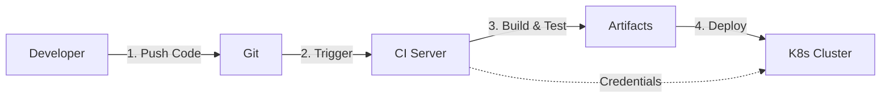
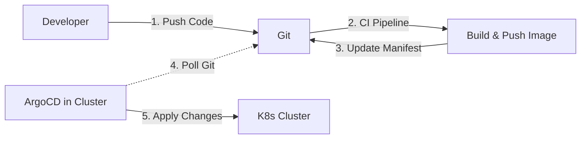
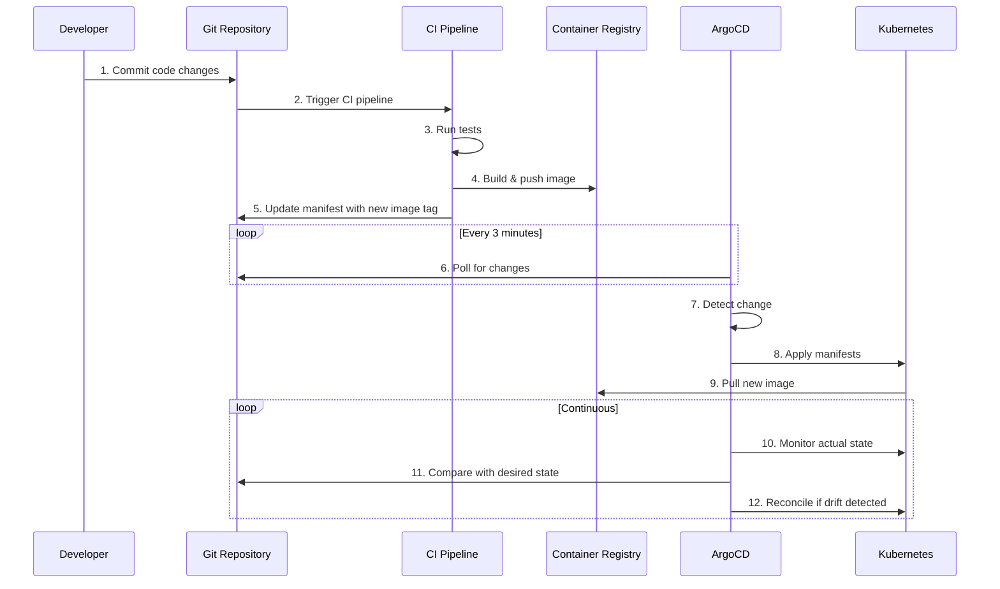
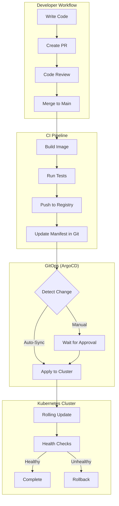

# GitOps Concepts Deep Dive

## What is GitOps?

**GitOps** is a paradigm for managing infrastructure and applications where **Git serves as the single source of truth** for declarative infrastructure and applications. Changes to infrastructure and applications are made through Git commits, and automated processes ensure the live system matches the desired state defined in Git.

## Core Principles

### 1. Declarative Configuration

Instead of telling the system **how** to reach a desired state (imperative), you declare **what** the desired state should be (declarative).

**Analogy:** Think of ordering food at a restaurant
- **Imperative**: "Go to the kitchen, turn on the stove, heat oil to 180°C, add chicken..." (you specify each step)
- **Declarative**: "I want chicken tikka masala" (you specify the end result)

**Example:**

```yaml
# Declarative: What you want
apiVersion: apps/v1
kind: Deployment
metadata:
  name: nginx
spec:
  replicas: 3
  template:
    spec:
      containers:
      - name: nginx
        image: nginx:1.21
```

vs

```bash
# Imperative: How to do it
kubectl create deployment nginx --image=nginx:1.21
kubectl scale deployment nginx --replicas=3
```

### 2. Git as Single Source of Truth

All desired state is stored in Git repositories. The Git history becomes an audit trail of all changes.

**Benefits:**
- ✅ Version control for infrastructure
- ✅ Complete audit trail
- ✅ Easy rollbacks (git revert)
- ✅ Collaboration via pull requests
- ✅ Code review for infrastructure changes

**Analogy:** Git is like the architectural blueprint for a building. The actual building (Kubernetes cluster) should always match the blueprint. If someone makes unauthorized changes to the building, you can refer to the blueprint and restore it to the correct state.

### 3. Automated Synchronization

Automated agents (like ArgoCD) continuously monitor Git and ensure the live system matches the desired state.

**Pull vs Push Model:**

#### Traditional CI/CD (Push Model)


**Problem:** CI server needs write access to production cluster (security risk)

#### GitOps (Pull Model)


**Benefit:** No external system needs write access to the cluster

**Analogy:** ArgoCD is like a loyal butler who:
- Regularly checks the blueprint (Git repo)
- Compares blueprint with the actual house (cluster)
- Makes necessary adjustments to match the blueprint
- Reports any discrepancies

### 4. Continuous Reconciliation

The system continuously compares desired state (Git) vs actual state (cluster) and reconciles differences.

**Self-Healing:**
- If someone manually changes a deployment, ArgoCD detects drift
- ArgoCD automatically reverts to the state defined in Git
- This ensures consistency and prevents configuration drift

**Analogy:** Like a thermostat that continuously monitors room temperature and adjusts heating/cooling to maintain the desired temperature.

## GitOps Workflow

### Complete Flow



### Step-by-Step Example

**Scenario:** Updating an application from v1.0.0 to v1.1.0

1. **Developer makes code changes**
   ```bash
   git checkout -b feature/new-feature
   # Make changes to code
   git commit -m "Add new feature"
   git push origin feature/new-feature
   ```

2. **Create Pull Request**
   - PR triggers automated tests
   - Code review by team
   - Merge to main branch

3. **CI Pipeline Executes**
   ```yaml
   # .github/workflows/ci.yaml
   - name: Build and push image
     run: |
       docker build -t myapp:v1.1.0 .
       docker push myapp:v1.1.0
   
   - name: Update manifest
     run: |
       git clone $GITOPS_REPO
       cd gitops-repo/apps/myapp
       kustomize edit set image myapp:v1.1.0
       git commit -am "Update myapp to v1.1.0"
       git push
   ```

4. **ArgoCD Detects Change**
   - ArgoCD polls Git repository (default: every 3 minutes)
   - Detects new commit with image update
   - Shows application as "OutOfSync"

5. **Sync (Automated or Manual)**
   ```bash
   # Manual sync
   argocd app sync myapp
   
   # Or auto-sync (if enabled)
   # ArgoCD automatically applies changes
   ```

6. **Kubernetes Updates**
   - New ReplicaSet created with v1.1.0
   - Rolling update replaces pods
   - Old ReplicaSet scaled down

7. **Continuous Monitoring**
   - ArgoCD monitors pod health
   - If drift detected, auto-heals to Git state

## Key Concepts

### Desired State vs Actual State

- **Desired State**: What's defined in Git
- **Actual State**: What's running in the cluster
- **Drift**: When actual state differs from desired state

**Example of Drift:**
```bash
# Desired state in Git: 3 replicas
# Someone manually scales: kubectl scale deployment myapp --replicas=5
# ArgoCD detects drift → auto-heals back to 3 replicas
```

### Sync Status

| Status | Meaning | Action |
|--------|---------|--------|
| **Synced** | Actual state matches desired state | None needed |
| **OutOfSync** | States differ | Sync required |
| **Progressing** | Sync in progress | Wait |
| **Degraded** | Resources unhealthy | Investigate |

### Health Status

| Status | Meaning |
|--------|---------|
| **Healthy** | All resources running correctly |
| **Progressing** | Resources being created/updated |
| **Degraded** | Some resources failed |
| **Missing** | Resources not found |
| **Suspended** | Resources intentionally paused |

### Sync Strategies

#### 1. Manual Sync
- Changes detected but not applied automatically
- Admin must manually click "Sync" or run CLI command
- **Use case**: Production environments requiring approval

#### 2. Auto-Sync
- Changes automatically applied when detected
- **Use case**: Development environments

#### 3. Self-Heal
- Automatically reverts manual changes to cluster
- Ensures Git remains source of truth
- **Use case**: Preventing configuration drift

```yaml
# ArgoCD Application with auto-sync
apiVersion: argoproj.io/v1alpha1
kind: Application
metadata:
  name: myapp
spec:
  syncPolicy:
    automated:
      prune: true        # Delete resources not in Git
      selfHeal: true     # Revert manual changes
      allowEmpty: false  # Don't sync if manifests are empty
```

## GitOps vs Traditional CI/CD

| Aspect | Traditional CI/CD | GitOps |
|--------|------------------|--------|
| **Deployment** | Push-based | Pull-based |
| **Credentials** | CI server has cluster access | Agent runs inside cluster |
| **Audit Trail** | Pipeline logs | Git history |
| **Rollback** | Re-run old pipeline | `git revert` |
| **Drift Detection** | Manual | Automatic |
| **Configuration** | Often manual | Fully declarative |
| **Security** | External access needed | No external access |

## Benefits of GitOps

### For Developers

1. **Familiar Workflow**: Use Git like you use for code
2. **Faster Deployments**: Automated sync reduces deploy time
3. **Easy Rollbacks**: `git revert` to roll back
4. **Self-Service**: Deploy without DevOps tickets

### For Operations

1. **Consistency**: Same deployment process everywhere
2. **Observability**: Clear audit trail in Git
3. **Disaster Recovery**: Cluster can be rebuilt from Git
4. **Reduced Errors**: Declarative config reduces mistakes

### For Organizations

1. **Compliance**: Every change tracked and auditable
2. **Security**: No external credentials needed
3. **Standardization**: Consistent practices across teams
4. **Velocity**: Faster time to market

## Common Patterns

### Environment Separation

```
gitops-repo/
├── apps/
│   └── myapp/
│       ├── base/           # Common config
│       └── overlays/
│           ├── dev/        # Dev overrides
│           ├── staging/    # Staging overrides
│           └── prod/       # Prod overrides
```

### App of Apps Pattern

One "root" application manages other applications:

```yaml
# Root app
apiVersion: argoproj.io/v1alpha1
kind: Application
metadata:
  name: root-app
spec:
  source:
    path: apps/
  # This will deploy all apps in apps/ directory
```

### Progressive Delivery

1. Deploy to dev → Automated tests
2. Deploy to staging → Manual approval
3. Deploy to prod → Gradual rollout (canary)

## Visual: GitOps in Action



## Key Takeaways

✅ **Declarative**: Define what you want, not how to get there  
✅ **Git as Truth**: All config lives in Git  
✅ **Pull Model**: Agents pull changes from Git  
✅ **Continuous Sync**: Automatic reconciliation  
✅ **Observable**: Complete audit trail  
✅ **Secure**: No external cluster access needed  

## Next Steps

- [ArgoCD Installation](02-argocd-installation.md)
- [Repository Structure Best Practices](03-repository-structure.md)
- [Hands-on Lab 01](../labs/lab-01-first-deployment.md)
