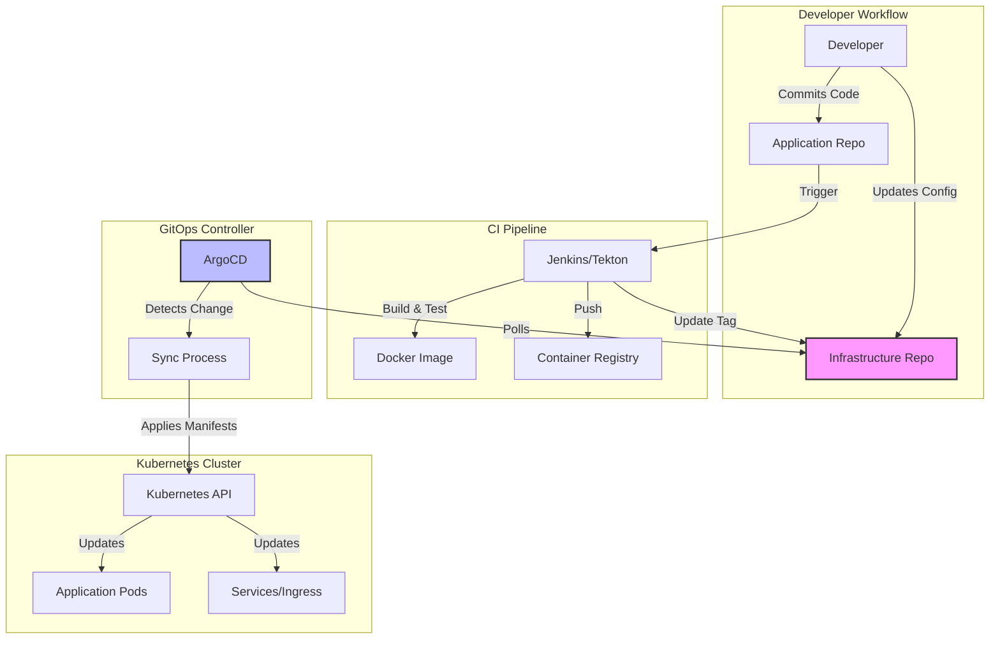

```mermaid
graph TD
    subgraph Developer Workflow
        Dev[Developer] -->|Commits Code| AppRepo[Application Repo]
        Dev -->|Updates Config| InfraRepo[Infrastructure Repo]
    end

    subgraph CI Pipeline
        AppRepo -->|Trigger| CI[Jenkins/Tekton]
        CI -->|Build & Test| DockerImage[Docker Image]
        CI -->|Push| Registry[Container Registry]
        CI -->|Update Tag| InfraRepo
    end

    subgraph GitOps Controller
        ArgoCD[ArgoCD] -->|Polls| InfraRepo
        ArgoCD -->|Detects Change| Sync[Sync Process]
    end

    subgraph Kubernetes Cluster
        Sync -->|Applies Manifests| K8sAPI[Kubernetes API]
        K8sAPI -->|Updates| Pods[Application Pods]
        K8sAPI -->|Updates| Svc[Services/Ingress]
    end

    style InfraRepo fill:#f9f,stroke:#333,stroke-width:2px
    style ArgoCD fill:#bbf,stroke:#333,stroke-width:2px
```
