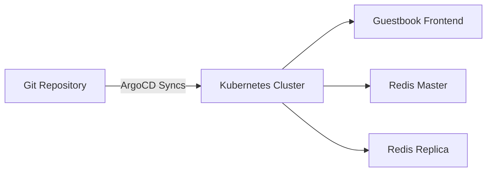

# Lab 01: Your First GitOps Deployment

## Objectives

By the end of this lab, you will:
- ✅ Deploy your first application using GitOps
- ✅ Understand ArgoCD sync process
- ✅ Make changes via Git and watch automatic deployment
- ✅ Verify application health and sync status

**Duration**: 30 minutes  
**Difficulty**: Beginner

## Prerequisites

- ✅ Kubernetes cluster running (completed setup-cluster.sh)
- ✅ ArgoCD installed and accessible (completed install-argocd.sh)
- ✅ kubectl configured
- ✅ Access to ArgoCD UI (port-forward running)

## Lab Architecture



## Part 1: Deploy Guestbook Application

### Step 1: Access ArgoCD UI

```bash
# Ensure port-forward is running
kubectl port-forward svc/argocd-server -n argocd 8080:443

# Open browser: https://localhost:8080
# Login with admin credentials
```

### Step 2: Create Application via UI

1. Click the **"+ NEW APP"** button
2. Fill in the application details:
   - **Application Name**: `guestbook-dev`
   - **Project**: `default`
   - **Sync Policy**: `Automatic` (check the box)
   - **Self Heal**: `Enabled` (check the box)
   - **Repository URL**: `https://github.com/Rajan251/labs.git`
   - **Revision**: `main`
   - **Path**: `lab-k8s/04-tools-ecosystem/04-gitops/examples/guestbook/overlays/dev`
   - **Cluster**: `https://kubernetes.default.svc`
   - **Namespace**: `guestbook-dev`
   - **Create Namespace**: `Enabled` (check the box)

3. Click **"CREATE"**

### Step 3: Watch Synchronization

You'll see the application appear in the UI with status **"OutOfSync"**. Within moments, ArgoCD will:

1. **Fetch** manifests from Git
2. **Apply** them to the cluster
3. **Monitor** resource creation
4. Show **"Synced"** and **"Healthy"** status

**Via CLI**:
```bash
# Watch application status
watch -n 2 'argocd app get guestbook-dev'

# Or use kubectl
kubectl get applications -n argocd
```

### Step 4: Verify Deployment

```bash
# Check namespace was created
kubectl get namespaces | grep guestbook

# Check all resources
kubectl get all -n guestbook-dev

# Check pods are running
kubectl get pods -n guestbook-dev

# Expected output:
# NAME                                      READY   STATUS    RESTARTS   AGE
# dev-guestbook-frontend-xxx                1/1     Running   0          2m
# dev-guestbook-redis-master-xxx            1/1     Running   0          2m
# dev-guestbook-redis-replica-xxx           1/1     Running   0          2m
```

### Step 5: Access the Application

```bash
# Port-forward the frontend service
kubectl port-forward svc/dev-guestbook-frontend -n guestbook-dev 8081:80

# Open browser: http://localhost:8081
```

You should see the Guestbook application! Try adding some messages.

## Part 2: Make Changes via Git

Now we'll simulate making changes through Git (since this is a demo, we'll use kubectl to simulate the change).

### Step 6: Change Replica Count Manually

Let's intentionally create drift:

```bash
# Manually scale frontend to 3 replicas
kubectl scale deployment dev-guestbook-frontend -n guestbook-dev --replicas=3

# Check replicas
kubectl get deployment dev-guestbook-frontend -n guestbook-dev
# You'll see 3/3 replicas
```

### Step 7: Watch Self-Healing

Since we enabled **self-heal**, ArgoCD will detect the drift and revert it:

```bash
# Watch the deployment
watch -n 1 'kubectl get deployment dev-guestbook-frontend -n guestbook-dev'

# Within ~30 seconds, ArgoCD will scale it back to 1 replica
```

**In ArgoCD UI**:
- You'll briefly see the app as **"OutOfSync"**
- ArgoCD automatically syncs
- Status returns to **"Synced"** and **"Healthy"**

This demonstrates **GitOps reconciliation**: the cluster state always matches Git!

## Part 3: Proper Git-Based Changes

### Step 8: View Application Resource Tree

In ArgoCD UI, click on the `guestbook-dev` application. You'll see a visual tree of all resources:

```
Application
├── Namespace (guestbook-dev)
├── Deployment (frontend)
│   └── ReplicaSet
│       └── Pod
├── Deployment (redis-master)
│   └── ReplicaSet
│       └── Pod
├── Deployment (redis-replica)
│   └── ReplicaSet
│       └── Pods (2)
├── Service (frontend)
├── Service (redis-master)
└── Service (redis-replica)
```

### Step 9: Check Sync History

```bash
# View sync history
argocd app history guestbook-dev

# Sample output:
# ID  DATE                REVISION
# 1   2024-01-15 10:30   abc123 (latest)
# 2   2024-01-15 10:25   def456 (self-heal)
```

## Part 4: Understanding ArgoCD Concepts

### Sync Status

| Status | Meaning |
|--------|---------|
| **Synced** | Live state matches Git |
| **OutOfSync** | Live state differs from Git |
| **Unknown** | Unable to determine status |

### Health Status

| Status | Meaning |
|--------|---------|
| **Healthy** | All resources are healthy |
| **Progressing** | Resources being created/updated |
| **Degraded** | Some resources are failing |
| **Missing** | Expected resources not found |

### Sync Options

What we enabled:
- **Auto-Sync**: Automatically applies changes from Git
- **Self-Heal**: Reverts manual changes to cluster
- **Prune**: Deletes resources removed from Git
- **Create Namespace**: Automatically creates target namespace

## Part 5: Cleanup (Optional)

### Step 10: Delete Application

**Via UI**:
1. Click on `guestbook-dev`
2. Click **"DELETE"**
3. Confirm deletion

**Via CLI**:
```bash
# Delete application
argocd app delete guestbook-dev

# Verify deletion
kubectl get all -n guestbook-dev
# Should show "No resources found"
```

## Lab Verification

Check off these items to verify completion:

- [ ] Application created in ArgoCD
- [ ] Application shows "Synced" and "Healthy" status
- [ ] All pods are running in guestbook-dev namespace
- [ ] Accessed guestbook UI in browser
- [ ] Witnessed self-healing (manual change was reverted)
- [ ] Viewed resource tree in ArgoCD UI
- [ ] Checked sync history

## Troubleshooting

### Issue: Application stuck in "OutOfSync"

```bash
# Check if ArgoCD can reach Git repo
argocd repo list

# Check application details
argocd app get guestbook-dev

# View sync errors
argocd app sync guestbook-dev --dry-run
```

### Issue: Pods not starting

```bash
# Check pod status
kubectl get pods -n guestbook-dev

# Describe pod
kubectl describe pod <pod-name> -n guestbook-dev

# Check logs
kubectl logs <pod-name> -n guestbook-dev
```

### Issue: Can't access application

```bash
# Verify service exists
kubectl get svc -n guestbook-dev

# Check port-forward is running
kubectl port-forward svc/dev-guestbook-frontend -n guestbook-dev 8081:80

# Verify in browser: http://localhost:8081
```

## Key Takeaways

✅ **GitOps puts Git front and center**: All changes go through Git  
✅ **ArgoCD ensures consistency**: Cluster state always matches Git  
✅ **Self-healing is powerful**: Manual changes are automatically reverted  
✅ **Visual feedback**: ArgoCD UI provides clear status and resource tree  
✅ **Audit trail**: All changes are tracked in Git history  

## Next Steps

- 📚 Read [GitOps Concepts](../documentation/04-gitops-concepts.md)
- 🧪 Try [Lab 02 - Environment Promotion](lab-02-environment-promotion.md)
- 📖 Learn about [CI/CD Integration](../documentation/06-cicd-integration.md)

## Additional Resources

- [ArgoCD Application Spec](https://argo-cd.readthedocs.io/en/stable/user-guide/application_specification/)
- [Sync Strategies](https://argo-cd.readthedocs.io/en/stable/user-guide/sync-options/)
- [Health Assessment](https://argo-cd.readthedocs.io/en/stable/operator-manual/health/)

---

**Congratulations!** 🎉 You've completed your first GitOps deployment!
