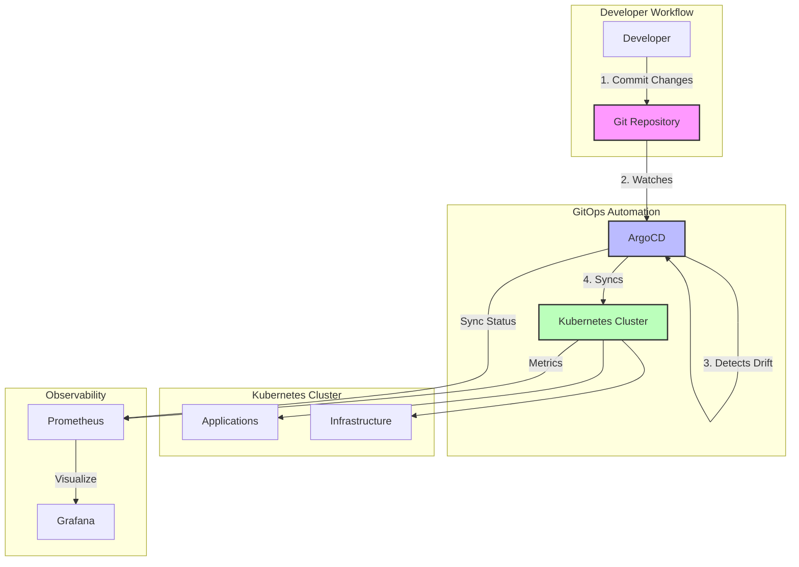

# GitOps Lab Environment

## 🎯 Overview

Welcome to the **GitOps Lab Environment**! This comprehensive, hands-on lab provides everything you need to learn and practice GitOps principles using Kubernetes and ArgoCD. Whether you're new to GitOps or looking to deepen your understanding, this lab offers practical exercises and real-world scenarios.

## 🚀 What You'll Learn

- ✅ GitOps principles and declarative infrastructure management
- ✅ ArgoCD setup, configuration, and best practices
- ✅ Continuous deployment with Git as single source of truth
- ✅ Managing multiple environments (dev, staging, prod)
- ✅ Application and infrastructure deployment patterns
- ✅ Monitoring GitOps workflows with Prometheus and Grafana
- ✅ Advanced scenarios: multi-cluster, canary deployments, secret management
- ✅ Troubleshooting and drift detection

## 📋 Prerequisites

**System Requirements:**
- 8GB RAM minimum (16GB recommended)
- 4 CPU cores
- 50GB disk space
- Docker installed and running

**Tools (will be installed in setup):**
- Kubernetes (Minikube or Kind)
- kubectl
- Helm
- ArgoCD CLI
- Git

## ⚡ Quick Start (30 Minutes)

Get started with a minimal working GitOps environment:

```bash
# 1. Navigate to GitOps lab
cd /home/rk/Documents/labs/lab-k8s/07-gitops

# 2. Run quick setup script
./scripts/quickstart.sh

# 3. Access ArgoCD UI
kubectl port-forward svc/argocd-server -n argocd 8080:443

# 4. Get admin password
kubectl -n argocd get secret argocd-initial-admin-secret -o jsonpath="{.data.password}" | base64 -d

# 5. Open browser to https://localhost:8080
```

See [QUICKSTART.md](QUICKSTART.md) for detailed quick start guide.

## 📚 Lab Structure

```
07-gitops/
├── concepts/              # GitOps principles and theory
├── argocd/               # ArgoCD setup and configuration
├── gitops-repo/          # Sample GitOps repository structure
├── applications/         # Sample applications (Guestbook, WordPress)
├── monitoring/           # Prometheus/Grafana setup
├── advanced-scenarios/   # Multi-cluster, canary, secrets, DR
├── exercises/            # Hands-on practice exercises
├── troubleshooting/      # Common issues and solutions
└── scripts/              # Automation scripts
```

## 🎓 Learning Path

### Beginner Path (4-6 hours)

1. **Understand Concepts** → [concepts/README.md](concepts/README.md)
2. **Setup Environment** → [argocd/prerequisites.md](argocd/prerequisites.md)
3. **Install ArgoCD** → [argocd/installation.md](argocd/installation.md)
4. **First Deployment** → [exercises/01-first-deployment/](exercises/01-first-deployment/)
5. **GitOps Workflow** → [gitops-repo/README.md](gitops-repo/README.md)

### Intermediate Path (8-10 hours)

1. Complete Beginner Path
2. **Deploy Sample Apps** → [applications/](applications/)
3. **Environment Management** → [exercises/02-environment-promotion/](exercises/02-environment-promotion/)
4. **Rollback Practice** → [exercises/03-rollback/](exercises/03-rollback/)
5. **Setup Monitoring** → [monitoring/README.md](monitoring/README.md)
6. **Observability Exercise** → [exercises/05-observability/](exercises/05-observability/)

### Advanced Path (12-15 hours)

1. Complete Intermediate Path
2. **Multi-Cluster Management** → [advanced-scenarios/multi-cluster/](advanced-scenarios/multi-cluster/)
3. **Canary Deployments** → [advanced-scenarios/canary-deployments/](advanced-scenarios/canary-deployments/)
4. **Secret Management** → [advanced-scenarios/secret-management/](advanced-scenarios/secret-management/)
5. **Disaster Recovery** → [advanced-scenarios/disaster-recovery/](advanced-scenarios/disaster-recovery/)

## 🏗️ GitOps Architecture



## 🔧 Key Features

### Sample Applications

- **Guestbook** - Multi-tier application (frontend, backend, Redis)
- **WordPress** - Stateful application with MySQL and persistent storage

### Repository Structure

- **Kustomize overlays** for environment-specific configurations
- **Helm charts** for complex applications
- **ArgoCD Application** manifests with various sync policies
- **GitHub Actions** workflows for CI/CD

### Monitoring & Observability

- **Prometheus** for metrics collection
- **Grafana** dashboards for ArgoCD and applications
- **Alerts** for OutOfSync apps and failures
- **GitOps KPIs** tracking (deployment frequency, MTTR, etc.)

### Advanced Features

- **ApplicationSets** for managing multiple similar apps
- **Sync Waves** for ordered deployments
- **Pre/Post Sync Hooks** for migrations and notifications
- **Custom Health Checks** for databases and external services
- **SealedSecrets** for secure secret management

## 📝 Sample Applications

### Guestbook Application

A multi-tier web application demonstrating:
- Frontend (Node.js/React)
- Backend API (Go/Python)
- Redis database
- Environment-specific configurations
- Health checks and resource limits

```bash
# Deploy guestbook to dev environment
kubectl apply -f gitops-repo/argocd/applications/guestbook-dev.yaml

# Watch deployment
argocd app get guestbook-dev --refresh
```

### WordPress with MySQL

A stateful application demonstrating:
- WordPress deployment
- MySQL StatefulSet
- Persistent storage
- Secret management
- Database initialization hooks

```bash
# Deploy WordPress to staging
kubectl apply -f gitops-repo/argocd/applications/wordpress-staging.yaml
```

## 🔍 Practice Exercises

| Exercise | Topic | Duration | Difficulty |
|----------|-------|----------|------------|
| [01-first-deployment](exercises/01-first-deployment/) | Deploy nginx via GitOps | 30 min | Beginner |
| [02-environment-promotion](exercises/02-environment-promotion/) | Promote app across environments | 45 min | Beginner |
| [03-rollback](exercises/03-rollback/) | Emergency rollback scenario | 30 min | Intermediate |
| [04-multi-app](exercises/04-multi-app/) | Manage microservices dependencies | 60 min | Intermediate |
| [05-observability](exercises/05-observability/) | Setup monitoring and alerts | 45 min | Intermediate |

## 🛠️ Common Operations

### Deploy an Application

```bash
# Create ArgoCD Application
kubectl apply -f gitops-repo/argocd/applications/my-app.yaml

# Verify sync status
argocd app get my-app

# Manual sync if needed
argocd app sync my-app
```

### Update Application

```bash
# Edit manifest in gitops-repo
cd gitops-repo/apps/my-app/overlays/dev
vim kustomization.yaml  # Change image tag

# Commit and push
git add .
git commit -m "Update my-app image to v2.0"
git push

# ArgoCD will auto-sync (if enabled) or manually sync
argocd app sync my-app
```

### Rollback Application

```bash
# View history
argocd app history my-app

# Rollback to previous version
argocd app rollback my-app <REVISION_NUMBER>

# Or revert Git commit
cd gitops-repo
git revert HEAD
git push
```

### Check Sync Status

```bash
# List all applications
argocd app list

# Get detailed app info
argocd app get my-app

# View sync events
kubectl get events -n argocd --sort-by='.lastTimestamp'
```

## 🔥 Troubleshooting

Quick troubleshooting commands:

```bash
# Check ArgoCD controller logs
kubectl logs -n argocd deployment/argocd-application-controller

# Check application sync status
argocd app get <app-name>

# View application resources
argocd app resources <app-name>

# Force refresh from Git
argocd app get <app-name> --refresh

# Hard refresh (ignore cache)
argocd app get <app-name> --hard-refresh
```

See [troubleshooting/README.md](troubleshooting/README.md) for comprehensive troubleshooting guide.

## 📊 Monitoring

Access monitoring dashboards:

```bash
# Port-forward Grafana
kubectl port-forward svc/prometheus-grafana -n monitoring 3000:80

# Open browser to http://localhost:3000
# Login: admin / prom-operator

# Available Dashboards:
# - ArgoCD Application Metrics
# - ArgoCD Sync Status
# - GitOps KPIs (Deployment Frequency, MTTR, etc.)
```

## 🧹 Cleanup

To remove the entire lab environment:

```bash
# Remove all applications
./scripts/cleanup-all.sh

# Or manual cleanup
kubectl delete -f gitops-repo/argocd/applications/
helm uninstall argocd -n argocd
kind delete cluster  # or minikube delete
```

See [CLEANUP.md](CLEANUP.md) for detailed cleanup procedures.

## 📖 Additional Resources

### Documentation
- [GitOps Concepts](concepts/README.md) - Deep dive into GitOps principles
- [GitOps Benefits](concepts/benefits.md) - Business value and ROI
- [Repository Structure](gitops-repo/README.md) - Understanding the GitOps repo

### ArgoCD Resources
- [ArgoCD Official Docs](https://argo-cd.readthedocs.io/)
- [ArgoCD Examples](https://github.com/argoproj/argocd-example-apps)
- [Argo Rollouts](https://argoproj.github.io/argo-rollouts/)

### GitOps Resources
- [GitOps Working Group](https://opengitops.dev/)
- [CNCF GitOps](https://www.cncf.io/blog/2021/08/12/gitops-for-kubernetes/)

## 🤝 Contributing

Found an issue or want to improve the lab? See [CONTRIBUTING.md](../CONTRIBUTING.md) for contribution guidelines.

## 📄 License

This lab is part of the larger Kubernetes Lab repository. See main [README.md](../README.md) for license information.

## 🎯 Next Steps

1. Start with [QUICKSTART.md](QUICKSTART.md) for immediate hands-on experience
2. Read [concepts/README.md](concepts/README.md) to understand GitOps principles
3. Follow the learning path appropriate for your level
4. Practice with exercises and build real projects!

Happy GitOps learning! 🚀
