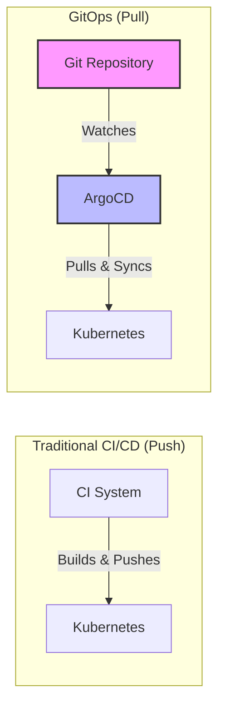
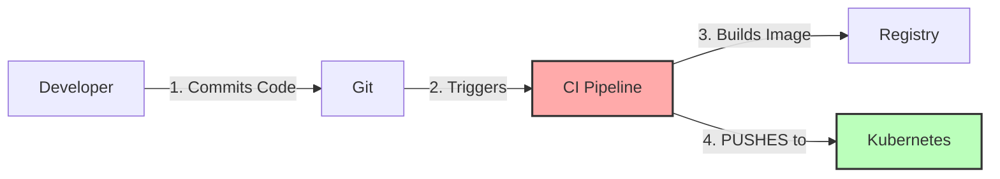
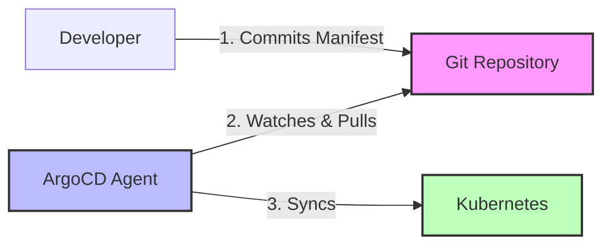
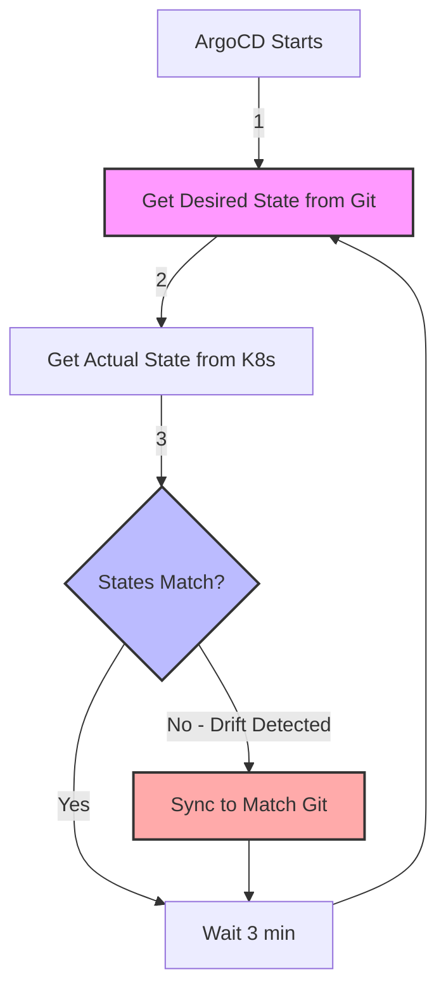
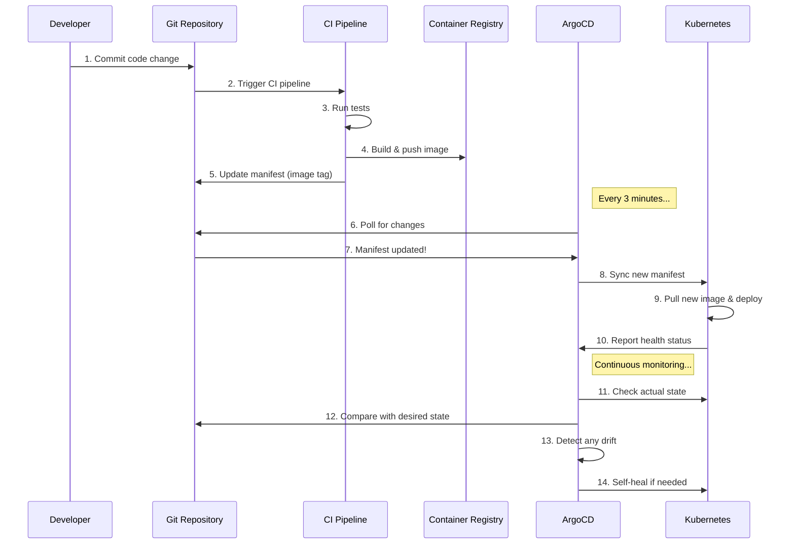
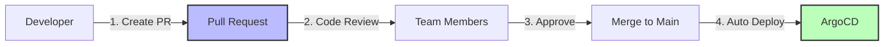

# GitOps Concepts - Understanding the Fundamentals

## 🎯 What is GitOps?

**GitOps** is a modern approach to continuous deployment where **Git is the single source of truth** for declarative infrastructure and applications. Any changes to applications or infrastructure are made via Git commits, and an automated process ensures the actual state matches the desired state defined in Git.

### The Simple Analogy: GitOps as a Thermostat

Think of GitOps like a smart thermostat in your home:

- **Desired State**: You set the temperature to 72°F (like defining config in Git)
- **Actual State**: Current room temperature (your running cluster)
- **Controller**: The thermostat continuously monitors and adjusts (like ArgoCD)
- **Self-Healing**: If the room gets too hot or cold, it automatically corrects (drift detection and reconciliation)

Just as you don't manually turn on/off the heater, you don't manually deploy applications – you just declare the desired state!

## 🔑 Core GitOps Principles

### 1. Declarative Configuration

**What it means**: You describe *WHAT* you want, not *HOW* to achieve it.

**Declarative (GitOps Way):**
```yaml
apiVersion: apps/v1
kind: Deployment
metadata:
  name: nginx
spec:
  replicas: 3
  selector:
    matchLabels:
      app: nginx
  template:
    metadata:
      labels:
        app: nginx
    spec:
      containers:
      - name: nginx
        image: nginx:1.21
```

**Imperative (Traditional Way):**
```bash
kubectl run nginx --image=nginx:1.21
kubectl scale deployment nginx --replicas=3
kubectl expose deployment nginx --port=80
```

**Why Declarative?**
- ✅ Version controlled
- ✅ Self-documenting
- ✅ Repeatable
- ✅ Auditable
- ✅ Easier to understand desired end state

**Analogy**: Describing vs Doing
- **Declarative**: "I want a blue car with 4 doors" (what you want)
- **Imperative**: "Mix these paints, weld these panels, attach these doors" (how to build it)

### 2. Git as Single Source of Truth

**Everything** is stored in Git:
- Application code
- Kubernetes manifests
- Configuration files
- Infrastructure definitions
- Documentation

**Benefits:**
- 🔍 **Audit Trail**: Every change is tracked with who, what, when, why
- 🔄 **Easy Rollback**: Just revert the Git commit
- 👥 **Collaboration**: Use pull requests for review and approval
- 📦 **Version Control**: Tag releases, branch strategies
- 🔒 **Security**: Git permissions control who can deploy

**Traditional vs GitOps:**



### 3. Pull vs Push Deployment

#### Traditional CI/CD (Push Model)



**Issues with Push:**
- ❌ CI system needs cluster credentials (security risk)
- ❌ No drift detection
- ❌ Manual changes not detected
- ❌ Hard to audit who deployed what

#### GitOps (Pull Model)



**Benefits of Pull:**
- ✅ Agent runs in cluster (no external credentials needed)
- ✅ Continuous drift detection
- ✅ Self-healing
- ✅ Complete audit trail in Git

**Analogy**: ArgoCD as a Loyal Butler
- You leave instructions (Git commits) on the butler's desk
- The butler regularly checks the desk for new instructions
- The butler ensures the house matches your instructions
- If something changes without instructions, the butler fixes it back

### 4. Continuous Reconciliation & Drift Detection

**Reconciliation Loop:**



**What is Drift?**

Drift occurs when the actual state differs from the desired state defined in Git.

**Examples of Drift:**
- Someone manually scales a deployment: `kubectl scale deployment nginx --replicas=5`
- Someone edits a ConfigMap directly in the cluster
- A resource is deleted manually
- Image tag changes without updating Git

**How ArgoCD Handles Drift:**

With **auto-sync** enabled:
1. ArgoCD detects drift (every 3 minutes by default)
2. Automatically reverts changes to match Git
3. Logs the sync event
4. Application returns to healthy state

**Analogy**: Auto-Save in Google Docs
- You write a document (desired state in Git)
- Someone else types changes (manual cluster changes = drift)
- Auto-save continuously saves your version (reconciliation)
- Their changes are overwritten by your version (self-healing)

### 5. Automated Deployment

**Sync Policies:**

```yaml
apiVersion: argoproj.io/v1alpha1
kind: Application
spec:
  syncPolicy:
    automated:
      prune: true      # Delete resources not in Git
      selfHeal: true   # Revert manual changes
    syncOptions:
      - CreateNamespace=true
```

**Sync Strategies:**

| Strategy | Description | Use Case |
|----------|-------------|----------|
| **Manual Sync** | Deploy only on manual trigger | Production environments |
| **Auto-Sync** | Deploy automatically on Git changes | Dev/Staging environments |
| **Self-Heal** | Revert manual cluster changes | All environments (recommended) |
| **Prune** | Delete resources removed from Git | Cleanup old resources |

## 🏗️ Complete GitOps Workflow



## 📊 GitOps State Management

### Three States to Understand

1. **Desired State** (in Git)
   - What you *want* your system to look like
   - Defined in YAML manifests
   - Version controlled

2. **Target State** (ArgoCD's view)
   - What ArgoCD *thinks* should be deployed
   - Rendered from Kustomize/Helm
   - May include transformations

3. **Actual State** (in Cluster)
   - What is *actually* running
   - Live resources in Kubernetes
   - Can drift from desired state

**Healthy System:**
```
Desired State (Git) = Target State (ArgoCD) = Actual State (K8s)
```

**Drift Detected:**
```
Desired State (Git) = Target State (ArgoCD) ≠ Actual State (K8s)
                                               ↑
                                         Manual change!
```

**OutOfSync:**
```
Desired State (Git) ≠ Target State (ArgoCD) = Actual State (K8s)
        ↑
    New commit!
```

## 🛡️ Security Benefits

### 1. No Cluster Credentials in CI

**Traditional:**
```yaml
# CI system needs these credentials - SECURITY RISK!
apiVersion: v1
kind: Secret
metadata:
  name: k8s-credentials
data:
  kubeconfig: <base64-encoded-kubeconfig>
```

**GitOps:**
```yaml
# ArgoCD runs IN the cluster - NO external credentials needed!
# CI only needs to push to Git (already secure)
```

### 2. Audit Trail

Every deployment has:
- **Who**: Git commit author
- **What**: Exact changes (Git diff)
- **When**: Commit timestamp
- **Why**: Commit message
- **How to Revert**: `git revert <commit>`

### 3. Change Approval via Pull Requests



## 🎯 Key Concepts Summary

| Concept | Traditional | GitOps |
|---------|------------|--------|
| **Deployment** | CI pushes to cluster | ArgoCD pulls from Git |
| **Source of Truth** | Cluster state | Git repository |
| **Drift Detection** | Manual monitoring | Automatic reconciliation |
| **Rollback** | Complex scripts | `git revert` |
| **Audit** | Limited logs | Complete Git history |
| **Security** | Credentials in CI | No external credentials |
| **Changes** | `kubectl apply` | Git commit |

## 🔄 Reconciliation in Action

**Example Scenario:**

1. **Desired State (Git):**
   ```yaml
   spec:
     replicas: 3
   ```

2. **Someone manually scales:**
   ```bash
   kubectl scale deployment nginx --replicas=5
   ```

3. **Actual State (Cluster):**
   ```yaml
   spec:
     replicas: 5  # DRIFT!
   ```

4. **ArgoCD Detects:**
   ```
   Status: OutOfSync
   Reason: Replicas mismatch (desired: 3, actual: 5)
   Action: Auto-healing in progress...
   ```

5. **ArgoCD Fixes:**
   ```bash
   # ArgoCD automatically runs:
   kubectl scale deployment nginx --replicas=3
   ```

6. **Result:**
   ```
   Status: Synced
   Health: Healthy
   ```

## 📈 GitOps Maturity Model

### Level 1: Basic GitOps
- ✅ Manifests in Git
- ✅ ArgoCD installed
- ✅ Manual sync for deployments

### Level 2: Automated GitOps
- ✅ Auto-sync enabled for non-prod
- ✅ Self-healing configured
- ✅ Environment-specific overlays (Kustomize)

### Level 3: Advanced GitOps
- ✅ Multi-cluster management
- ✅ ApplicationSets for app-of-apps pattern
- ✅ Progressive delivery (canary, blue-green)
- ✅ Automated promotion between environments

### Level 4: Enterprise GitOps
- ✅ Policy enforcement (OPA, Kyverno)
- ✅ Secret management (SealedSecrets, ExternalSecrets)
- ✅ Disaster recovery automation
- ✅ Complete observability and SLOs

## 🧪 Hands-On Example

Let's compare traditional deployment vs GitOps:

### Traditional Deployment

```bash
# Build image
docker build -t myapp:v2.0 .

# Push to registry
docker push myapp:v2.0

# Update deployment (error-prone!)
kubectl set image deployment/myapp myapp=myapp:v2.0

# No audit trail, no rollback plan
```

### GitOps Deployment

```bash
# 1. Update manifest in Git
git clone https://github.com/myorg/myapp-config
cd myapp-config
sed -i 's/myapp:v1.0/myapp:v2.0/g' deployment.yaml

# 2. Commit and push
git add deployment.yaml
git commit -m "Update myapp to v2.0 - fixes #123"
git push origin main

# 3. ArgoCD automatically syncs (or manually trigger)
argocd app sync myapp

# 4. Complete audit trail in Git
git log --oneline

# 5. Easy rollback
git revert HEAD
git push
```

## 💡 Common Misconceptions

### Myth 1: "GitOps is just Infrastructure as Code"
**Truth**: IaC stores infra in code. GitOps adds continuous reconciliation and drift detection.

### Myth 2: "GitOps replaces CI/CD"
**Truth**: GitOps is the **CD** part. You still need CI to build and test.

### Myth 3: "GitOps means no manual operations"
**Truth**: You can still manually intervene for emergencies, but it's tracked and reconciled.

### Myth 4: "GitOps is only for Kubernetes"
**Truth**: While popular with K8s, GitOps principles apply to any declarative system.

## 🎓 Next Steps

Now that you understand GitOps concepts:

1. **Quick Start**: Try [QUICKSTART.md](../QUICKSTART.md) for hands-on experience
2. **Benefits**: Read [benefits.md](benefits.md) to understand business value
3. **Practice**: Complete [exercises/01-first-deployment](../exercises/01-first-deployment/)
4. **Deep Dive**: Explore [gitops-repo/README.md](../gitops-repo/README.md) for repository patterns

## 📚 Further Reading

- [OpenGitOps Principles](https://opengitops.dev/)
- [ArgoCD Documentation](https://argo-cd.readthedocs.io/)
- [CNCF GitOps Working Group](https://github.com/cncf/tag-app-delivery)
- [Weaveworks GitOps Guide](https://www.weave.works/technologies/gitops/)

---

**Remember**: GitOps is not just a tool, it's a **workflow** that brings version control, collaboration, and automation to operations! 🚀
