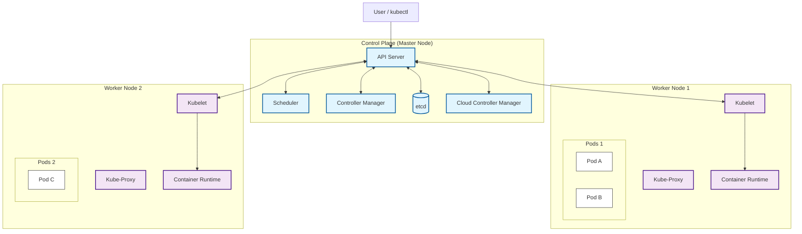
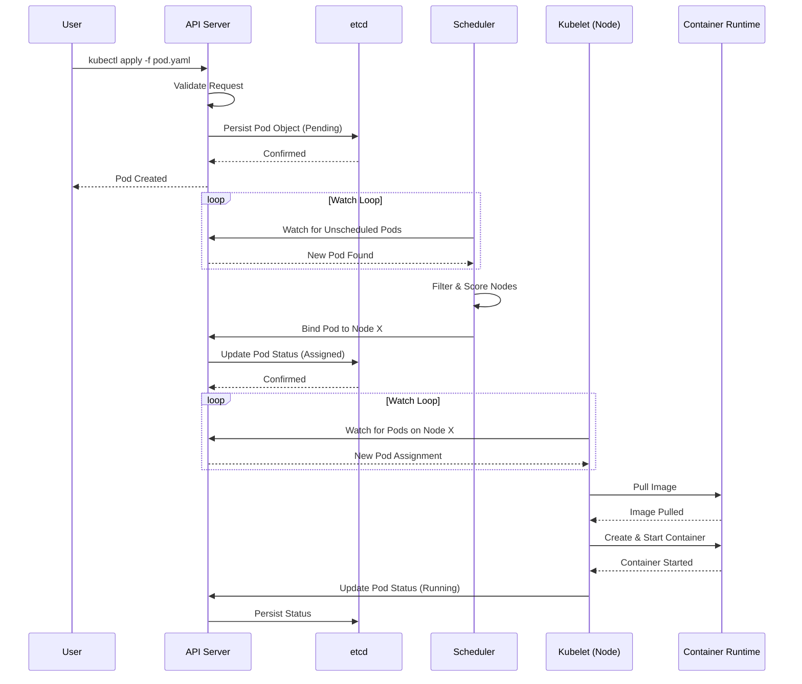

# Kubernetes Architecture Deep Dive

This document provides a visual and detailed explanation of the Kubernetes architecture, illustrating how the Control Plane and Worker Nodes interact to manage containerized applications.

## High-Level Architecture

Kubernetes follows a client-server architecture with a **Control Plane** (Master) and **Worker Nodes**.



## Component Breakdown

### 1. Control Plane Components

The Control Plane makes global decisions about the cluster (e.g., scheduling) and detects/responds to cluster events.

| Component | Description |
|-----------|-------------|
| **kube-apiserver** | The front end of the Kubernetes control plane. It exposes the Kubernetes API and validates/configures data for API objects (pods, services, etc.). |
| **etcd** | Consistent and highly-available key value store used as Kubernetes' backing store for all cluster data. |
| **kube-scheduler** | Watches for newly created Pods with no assigned node, and selects a node for them to run on based on resource requirements, constraints, and affinity specifications. |
| **kube-controller-manager** | Runs controller processes (e.g., Node Controller, Job Controller, EndpointSlice Controller) that regulate the state of the system. |
| **cloud-controller-manager** | Embeds cloud-specific control logic. It lets you link your cluster into your cloud provider's API. |

### 2. Worker Node Components

Worker nodes maintain running pods and provide the Kubernetes runtime environment.

| Component | Description |
|-----------|-------------|
| **kubelet** | An agent that runs on each node. It ensures that containers are running in a Pod. It takes a set of PodSpecs and ensures that the containers described in those PodSpecs are running and healthy. |
| **kube-proxy** | A network proxy that runs on each node. It maintains network rules on nodes, allowing network communication to your Pods from network sessions inside or outside of your cluster. |
| **Container Runtime** | The software that is responsible for running containers (e.g., containerd, CRI-O, Docker Engine). |

## Pod Creation Flow

Understanding how a Pod gets scheduled and started is crucial for debugging.



### Flow Description

1.  **Submission**: User submits a Pod spec to the API Server.
2.  **Persistence**: API Server writes the Pod object to `etcd`.
3.  **Scheduling**: The Scheduler notices a Pod with no `nodeName` set. It evaluates all nodes and selects the best fit.
4.  **Binding**: The Scheduler tells the API Server to bind the Pod to a specific Node.
5.  **Execution**: The Kubelet on the target Node notices the new assignment.
6.  **Runtime**: Kubelet instructs the Container Runtime (CRI) to pull the image and start the container.
7.  **Status Update**: Kubelet reports the status back to the API Server.

## Networking Architecture

How Pods communicate within the cluster.

```mermaid
graph LR
    subgraph "Node 1"
        P1[Pod 1 (10.244.1.2)]
        P2[Pod 2 (10.244.1.3)]
        BR1[cni0 Bridge]
        P1 --- BR1
        P2 --- BR1
    end

    subgraph "Node 2"
        P3[Pod 3 (10.244.2.2)]
        BR2[cni0 Bridge]
        P3 --- BR2
    end

    BR1 --- ETH1[eth0]
    BR2 --- ETH2[eth0]
    
    ETH1 --- NET[Cluster Network / CNI Overlay]
    ETH2 --- NET

    style NET fill:#f9f,stroke:#333,stroke-width:2px
```

### Key Networking Rules
1.  **Pod-to-Pod**: All Pods can communicate with all other Pods without NAT.
2.  **Node-to-Pod**: All Nodes can communicate with all Pods without NAT.
3.  **IP-per-Pod**: Every Pod gets its own IP address.

## Summary

This architecture ensures high availability, scalability, and loose coupling between components. The **Control Plane** manages the desired state, while **Worker Nodes** tirelessly work to match the actual state to the desired state.
