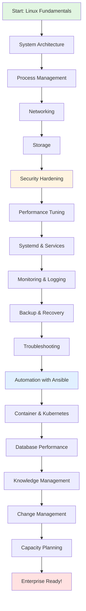
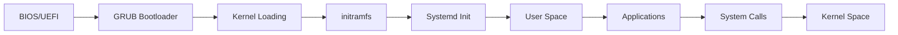
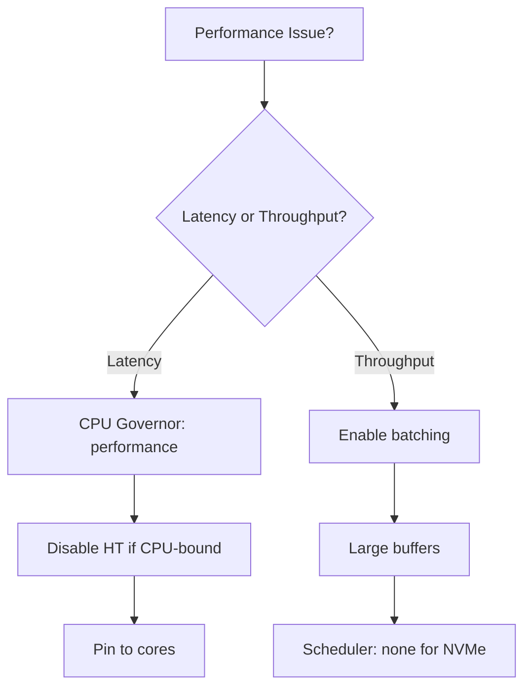
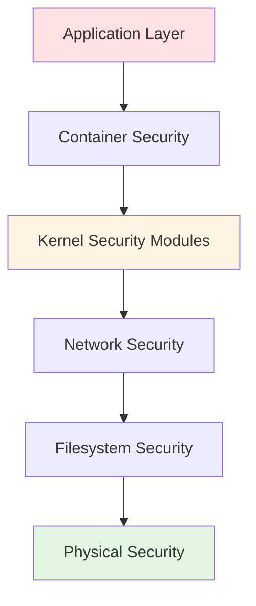
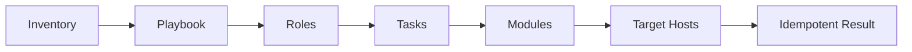
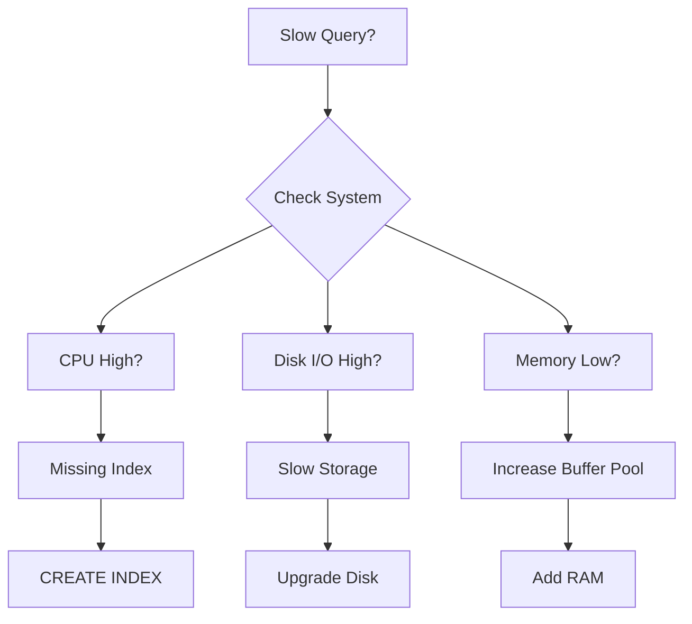
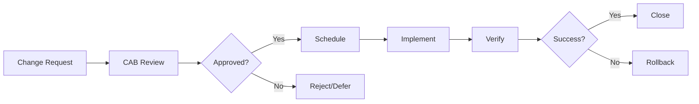

# Linux Administration Complete Guide

A comprehensive enterprise-grade resource covering Linux fundamentals to advanced DevOps practices.

## 📁 Repository Structure

```
linux-lab/
├── README.md (this file)
│
├── 📘 Guides/
│   ├── advanced_file_management.md
│   └── user_management_security.md
│
├── 🔧 Scripts/
│   ├── health_check.sh
│   └── security_hardening.sh
│
└── 📚 Study Notes/
    ├── Core Linux/
    │   ├── system_architecture_notes.md
    │   ├── process_management_notes.md
    │   ├── networking_notes.md
    │   └── storage_architecture_notes.md
    │
    ├── Operations/
    │   ├── systemd_notes.md
    │   ├── performance_tuning_notes.md
    │   ├── monitoring_logging_notes.md
    │   ├── backup_recovery_notes.md
    │   └── troubleshooting_methodology_notes.md
    │
    ├── Security & Compliance/
    │   └── layered_security_notes.md
    │
    ├── Automation & DevOps/
    │   ├── automation_practices_notes.md
    │   └── container_orchestration_notes.md
    │
    ├── Database/
    │   └── database_troubleshooting_notes.md
    │
    └── Management/
        ├── knowledge_management_notes.md
        ├── change_management_notes.md
        └── capacity_planning_notes.md
```

## 🗺️ Learning Path Diagram



## 📖 Content Overview

### 1️⃣ Guides (Beginner to Intermediate)

#### [Advanced File Management](file:///home/rk/Documents/labs/linux-lab/advanced_file_management.md)
- Standard streams (STDIN, STDOUT, STDERR)
- Advanced search with `find` and `grep`
- Archiving with `tar` and `rsync`
- Troubleshooting permissions and disk space

#### [User Management & Security](file:///home/rk/Documents/labs/linux-lab/user_management_security.md)
- Sudoers file management
- Standard and advanced permissions (SetUID, SetGID, Sticky Bit)
- Access Control Lists (ACLs)
- Account recovery procedures

### 2️⃣ Production Scripts

#### [Health Check Script](file:///home/rk/Documents/labs/linux-lab/health_check.sh)
```bash
# Monitors:
# - Load averages & CPU
# - Memory & Swap
# - Disk space & inodes
# - Zombie processes
# - Systemd service failures
# - Failed login attempts
```

#### [Security Hardening Script](file:///home/rk/Documents/labs/linux-lab/security_hardening.sh)
```bash
# Implements:
# - CIS benchmark checks
# - Firewall configuration
# - Auditd rules
# - SSH hardening
# - AIDE integrity monitoring
# - Fail2Ban setup
```

### 3️⃣ Core Linux Study Notes

#### System Architecture Flow


**Topics Covered:**
- [System Architecture](file:///home/rk/Documents/labs/linux-lab/system_architecture_notes.md): Boot process, kernel vs user space, memory management
- [Process Management](file:///home/rk/Documents/labs/linux-lab/process_management_notes.md): States (R, S, D, Z), scheduling, diagnostics
- [Networking](file:///home/rk/Documents/labs/linux-lab/networking_notes.md): TCP/IP stack, namespaces, packet flow
- [Storage](file:///home/rk/Documents/labs/linux-lab/storage_architecture_notes.md): Block layer, filesystems, LVM, RAID

### 4️⃣ Operations & Performance

#### Performance Tuning Decision Tree


**Topics Covered:**
- [Systemd](file:///home/rk/Documents/labs/linux-lab/systemd_notes.md): Unit files, resource control, security
- [Performance Tuning](file:///home/rk/Documents/labs/linux-lab/performance_tuning_notes.md): USE method, CPU/memory/storage/network optimization
- [Monitoring & Logging](file:///home/rk/Documents/labs/linux-lab/monitoring_logging_notes.md): Prometheus, ELK, alerting philosophy
- [Backup & Recovery](file:///home/rk/Documents/labs/linux-lab/backup_recovery_notes.md): 3-2-1 rule, RPO/RTO, PITR
- [Troubleshooting](file:///home/rk/Documents/labs/linux-lab/troubleshooting_methodology_notes.md): 7-step framework, diagnostic tools

### 5️⃣ Security & Compliance

#### Security Layers


**Topics Covered:**
- [Layered Security](file:///home/rk/Documents/labs/linux-lab/layered_security_notes.md): SELinux, PAM, network policies, compliance (PCI, HIPAA, NIST)

### 6️⃣ Automation & DevOps

#### Ansible Workflow


**Topics Covered:**
- [Automation Practices](file:///home/rk/Documents/labs/linux-lab/automation_practices_notes.md): IaC, Ansible, secret management
- [Container & Orchestration](file:///home/rk/Documents/labs/linux-lab/container_orchestration_notes.md): Docker, Kubernetes, pod patterns

### 7️⃣ Database Operations

#### Database Troubleshooting Flow


**Topics Covered:**
- [Database Troubleshooting](file:///home/rk/Documents/labs/linux-lab/database_troubleshooting_notes.md): MySQL, PostgreSQL, MongoDB, Redis performance

### 8️⃣ Management & Planning

#### Change Management Process


**Topics Covered:**
- [Knowledge Management](file:///home/rk/Documents/labs/linux-lab/knowledge_management_notes.md): Documentation hierarchy, knowledge transfer
- [Change Management](file:///home/rk/Documents/labs/linux-lab/change_management_notes.md): CAB, ITIL processes
- [Capacity Planning](file:///home/rk/Documents/labs/linux-lab/capacity_planning_notes.md): Forecasting, trend analysis

## 🎯 Quick Start Guide

### For Beginners
1. Start with [Advanced File Management](file:///home/rk/Documents/labs/linux-lab/advanced_file_management.md)
2. Move to [User Management & Security](file:///home/rk/Documents/labs/linux-lab/user_management_security.md)
3. Study [System Architecture](file:///home/rk/Documents/labs/linux-lab/system_architecture_notes.md)

### For System Administrators
1. Review [Systemd](file:///home/rk/Documents/labs/linux-lab/systemd_notes.md) for service management
2. Implement [Health Check Script](file:///home/rk/Documents/labs/linux-lab/health_check.sh)
3. Study [Troubleshooting Methodology](file:///home/rk/Documents/labs/linux-lab/troubleshooting_methodology_notes.md)

### For DevOps Engineers
1. Master [Automation Practices](file:///home/rk/Documents/labs/linux-lab/automation_practices_notes.md)
2. Learn [Container Orchestration](file:///home/rk/Documents/labs/linux-lab/container_orchestration_notes.md)
3. Implement [Monitoring & Logging](file:///home/rk/Documents/labs/linux-lab/monitoring_logging_notes.md)

### For DBAs
1. Study [Storage Architecture](file:///home/rk/Documents/labs/linux-lab/storage_architecture_notes.md)
2. Master [Database Troubleshooting](file:///home/rk/Documents/labs/linux-lab/database_troubleshooting_notes.md)
3. Implement [Backup & Recovery](file:///home/rk/Documents/labs/linux-lab/backup_recovery_notes.md)

## 📊 Resource Matrix

| Topic | Difficulty | Time to Master | Prerequisites |
|-------|-----------|----------------|---------------|
| File Management | ⭐ Beginner | 1 week | Basic Linux CLI |
| User Management | ⭐⭐ Intermediate | 2 weeks | File Management |
| System Architecture | ⭐⭐⭐ Advanced | 1 month | User Management |
| Networking | ⭐⭐⭐ Advanced | 1 month | System Architecture |
| Performance Tuning | ⭐⭐⭐⭐ Expert | 2 months | All Core Topics |
| Kubernetes | ⭐⭐⭐⭐ Expert | 2 months | Containers, Networking |

## 🔍 Example Use Cases

### Scenario 1: Production Server Slow
```bash
# 1. Run health check
./health_check.sh

# 2. Check specific subsystem
# Refer to: performance_tuning_notes.md
# Refer to: troubleshooting_methodology_notes.md

# 3. Identify bottleneck using USE method
```

### Scenario 2: Database Performance Issue
```bash
# 1. Collect data
# Refer to: database_troubleshooting_notes.md

# 2. Analyze query patterns
SHOW PROCESSLIST;
EXPLAIN SELECT ...;

# 3. Apply fixes (indexes, query optimization)
```

### Scenario 3: Security Hardening
```bash
# 1. Run security hardening script (dry-run first)
./security_hardening.sh

# 2. Review recommendations
# Refer to: layered_security_notes.md

# 3. Apply with --apply flag
./security_hardening.sh --apply
```

## 🏆 Certification Alignment

This resource aligns with:
- ✅ **RHCSA** (Red Hat Certified System Administrator)
- ✅ **RHCE** (Red Hat Certified Engineer)
- ✅ **LFCS** (Linux Foundation Certified System Administrator)
- ✅ **CKA** (Certified Kubernetes Administrator)
- ✅ **ITIL Foundation** (Change/Knowledge Management)

## 📝 Contributing

This is a living document. To update:
1. Edit the relevant `.md` file
2. Update this README if structure changes
3. Keep examples practical and production-focused

## 📄 License

Educational use - Enterprise Linux Administration

---

**Total Resources**: 20 files (2 guides + 2 scripts + 16 study notes)  
**Last Updated**: 2025-12-18  
**Maintained by**: Senior Linux Administrator
