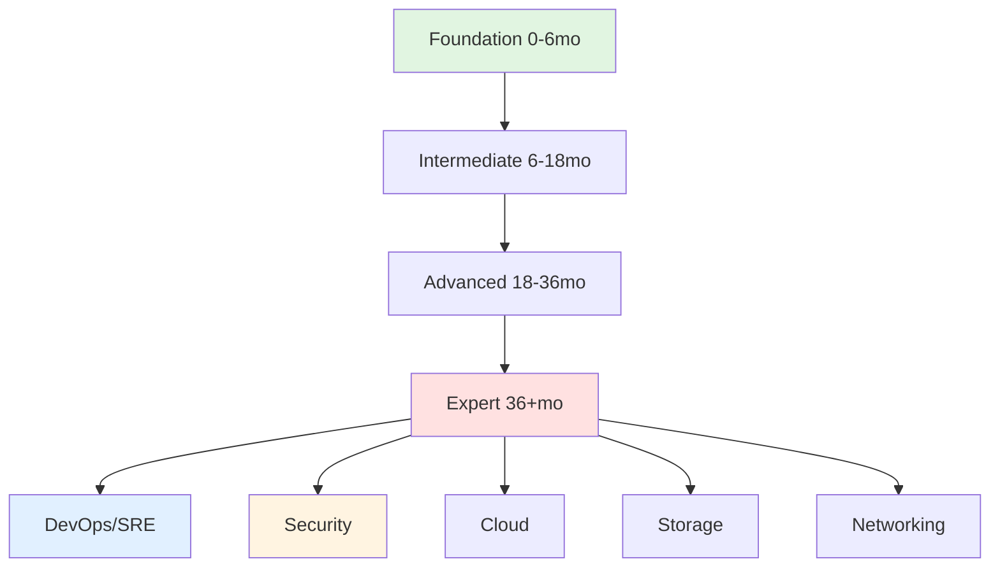

# Linux Administration Learning Path

**Purpose:** Structured career progression from beginner to expert Linux administrator.

---

## Learning Path Overview



---

## 1. Foundation Level (0-6 Months)

### Skills to Master
- **Commands**: 100+ essential commands (ls, cd, grep, find, awk, sed)
- **Filesystem**: FHS, permissions, ownership
- **Users**: useradd, usermod, sudo configuration
- **Packages**: yum/dnf (RHEL), apt (Debian)
- **Networking**: ip, nmcli, basic firewall
- **Services**: systemctl, journalctl

### Time Allocation
- **Daily**: 2 hours hands-on practice
- **Weekly**: 1 hour reading documentation
- **Monthly**: 1 lab project

### Resources
- **Book**: "The Linux Command Line" by William Shotts
- **Course**: Linux Foundation LFS101x (free)
- **Practice**: [advanced_file_management.md](file:///home/rk/Documents/labs/linux-lab/advanced_file_management.md)
- **Practice**: [user_management_security.md](file:///home/rk/Documents/labs/linux-lab/user_management_security.md)

### Success Metrics
- ✅ Complete 50 lab exercises
- ✅ Set up personal Linux server
- ✅ Write 10 basic shell scripts
- ✅ Pass LFCS practice exam

---

## 2. Intermediate Level (6-18 Months)

### Skills to Master
- **Scripting**: Bash, error handling, functions
- **Performance**: top, vmstat, iostat, tuning
- **Security**: SELinux, firewall, hardening
- **Networking**: Troubleshooting, VLANs, bonding
- **Storage**: LVM, RAID, filesystem tuning
- **Backup**: rsync, tar, snapshot strategies
- **Containers**: Docker basics, images, volumes

### Time Allocation
- **Daily**: 1.5 hours practice
- **Weekly**: 2 hours reading/courses
- **Monthly**: 1 production-like project

### Resources
- **Book**: "UNIX and Linux System Administration Handbook"
- **Course**: RHCSA/RHCE preparation
- **Practice**: [performance_tuning_notes.md](file:///home/rk/Documents/labs/linux-lab/performance_tuning_notes.md)
- **Practice**: [troubleshooting_methodology_notes.md](file:///home/rk/Documents/labs/linux-lab/troubleshooting_methodology_notes.md)
- **Scripts**: [health_check.sh](file:///home/rk/Documents/labs/linux-lab/health_check.sh)

### Success Metrics
- ✅ RHCSA or LFCS certification
- ✅ Manage 10+ production servers
- ✅ Resolve 50+ production issues
- ✅ Automate 20+ routine tasks

---

## 3. Advanced Level (18-36 Months)

### Skills to Master
- **Kernel**: sysctl tuning, module management
- **HA**: Pacemaker, keepalived, clustering
- **Automation**: Ansible, Terraform, CI/CD
- **Security**: Incident response, forensics
- **Capacity**: Forecasting, trend analysis
- **Cloud**: AWS/GCP/Azure fundamentals
- **Kubernetes**: Pods, deployments, services

### Time Allocation
- **Daily**: 1 hour deep work
- **Weekly**: 3 hours learning new tech
- **Monthly**: Contribute to open source

### Resources
- **Book**: "Site Reliability Engineering" (Google)
- **Course**: CKA (Certified Kubernetes Administrator)
- **Practice**: [automation_practices_notes.md](file:///home/rk/Documents/labs/linux-lab/automation_practices_notes.md)
- **Practice**: [container_orchestration_notes.md](file:///home/rk/Documents/labs/linux-lab/container_orchestration_notes.md)
- **Practice**: [capacity_planning_notes.md](file:///home/rk/Documents/labs/linux-lab/capacity_planning_notes.md)

### Success Metrics
- ✅ RHCE or CKA certification
- ✅ Design and implement HA system
- ✅ Automate 80% of routine tasks
- ✅ Lead 3+ major projects

---

## 4. Expert Level (36+ Months)

### Skills to Master
- **Architecture**: Multi-region, disaster recovery
- **Strategy**: Technology roadmap, vendor selection
- **Leadership**: Team mentoring, hiring
- **Process**: Change management, ITIL
- **Optimization**: Cost reduction, efficiency
- **Innovation**: POCs, emerging tech evaluation

### Time Allocation
- **Daily**: Strategic thinking
- **Weekly**: Team mentoring, code review
- **Monthly**: Conference talks, blog posts

### Resources
- **Book**: "The Phoenix Project" (DevOps novel)
- **Practice**: [knowledge_management_notes.md](file:///home/rk/Documents/labs/linux-lab/knowledge_management_notes.md)
- **Practice**: [change_management_notes.md](file:///home/rk/Documents/labs/linux-lab/change_management_notes.md)
- **Community**: Speak at conferences, write articles

### Success Metrics
- ✅ Architect enterprise infrastructure
- ✅ Mentor 5+ junior engineers
- ✅ Reduce infrastructure costs 30%+
- ✅ Industry recognition (talks, articles)

---

## 5. Specialization Paths

### DevOps/SRE Track
**Focus**: Automation, monitoring, reliability
- **Tools**: Ansible, Terraform, Prometheus, Grafana
- **Certifications**: CKA, AWS DevOps Pro
- **Resources**: [monitoring_logging_notes.md](file:///home/rk/Documents/labs/linux-lab/monitoring_logging_notes.md)

### Security Track
**Focus**: Hardening, compliance, forensics
- **Tools**: SELinux, auditd, AIDE, Vault
- **Certifications**: CISSP, CEH
- **Resources**: [layered_security_notes.md](file:///home/rk/Documents/labs/linux-lab/layered_security_notes.md)

### Cloud Track
**Focus**: Multi-cloud, cost optimization
- **Tools**: AWS, GCP, Azure, Terraform
- **Certifications**: AWS Solutions Architect, GCP Pro
- **Resources**: Cloud-native patterns

### Storage Track
**Focus**: High-performance storage, data management
- **Tools**: Ceph, GlusterFS, ZFS
- **Certifications**: Storage vendor certs
- **Resources**: [storage_architecture_notes.md](file:///home/rk/Documents/labs/linux-lab/storage_architecture_notes.md)

### Networking Track
**Focus**: High-speed networking, SDN
- **Tools**: DPDK, OVS, Calico
- **Certifications**: CCNA, CCNP
- **Resources**: [networking_notes.md](file:///home/rk/Documents/labs/linux-lab/networking_notes.md)

---

## 6. Skill Validation Methods

### Lab Exercises
- **Foundation**: Set up LAMP stack
- **Intermediate**: Configure HA web cluster
- **Advanced**: Deploy Kubernetes cluster
- **Expert**: Design multi-region DR

### Real-World Projects
- Migrate legacy app to containers
- Implement monitoring stack
- Automate infrastructure provisioning
- Design disaster recovery plan

### Troubleshooting Scenarios
- Database performance degradation
- Network connectivity issues
- Security breach response
- Capacity planning for growth

---

## 7. Continuous Improvement

### Weekly Commitment
- **1 hour**: Learn new technology
- **1 hour**: Read documentation/blogs
- **1 hour**: Practice hands-on labs

### Technology Radar
- Track emerging technologies
- Evaluate relevance to your role
- POC promising tools

### Community Engagement
- **Forums**: Stack Overflow, Reddit r/linuxadmin
- **Conferences**: LISA, DevOpsDays, KubeCon
- **Contributions**: Open source, documentation

### Teaching
- Write blog posts
- Create tutorials
- Mentor junior engineers
- Speak at meetups

---

## 8. Certification Roadmap

```
Foundation → LFCS (Linux Foundation)
           → CompTIA Linux+

Intermediate → RHCSA (Red Hat)
             → LPIC-2 (Linux Professional Institute)

Advanced → RHCE (Red Hat)
         → CKA (Kubernetes)
         → AWS Solutions Architect

Expert → RHCA (Red Hat Architect)
       → CKS (Kubernetes Security)
       → Multi-cloud certifications
```

---

## 9. Sample 3-Year Plan

### Year 1: Foundation & Intermediate
- **Q1-Q2**: Master basics, get LFCS
- **Q3-Q4**: Scripting, automation, get RHCSA

### Year 2: Advanced
- **Q1-Q2**: Kubernetes, containers, get CKA
- **Q3-Q4**: Cloud, automation, get RHCE

### Year 3: Expert & Specialization
- **Q1-Q2**: Choose specialization, deep dive
- **Q3-Q4**: Lead projects, mentor, speak

---

## 10. Success Indicators by Level

| Level | Salary Range | Team Size | Scope |
|-------|-------------|-----------|-------|
| Foundation | Entry | Individual | Single server |
| Intermediate | Mid | 2-5 servers | Small cluster |
| Advanced | Senior | 50+ servers | Multi-datacenter |
| Expert | Principal/Architect | 500+ servers | Global infrastructure |

---

## Quick Reference: Your Learning Resources

All resources are in `/home/rk/Documents/labs/linux-lab/`:
- **README.md**: Master index with diagrams
- **Guides**: Foundation level (2 files)
- **Scripts**: Intermediate level (2 files)
- **Study Notes**: Advanced/Expert level (17 files)

**Total**: 21 comprehensive resources covering your entire career path!
