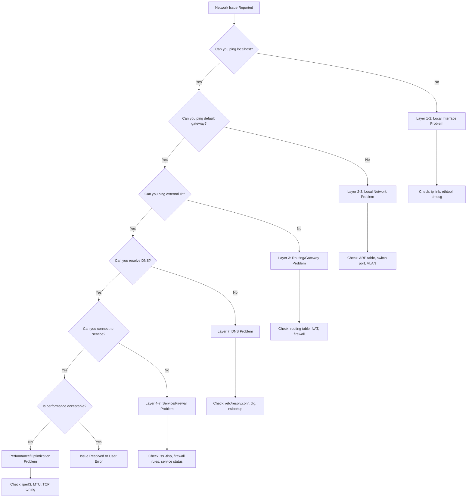
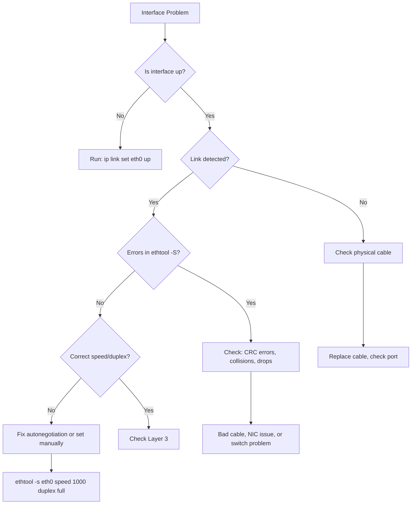
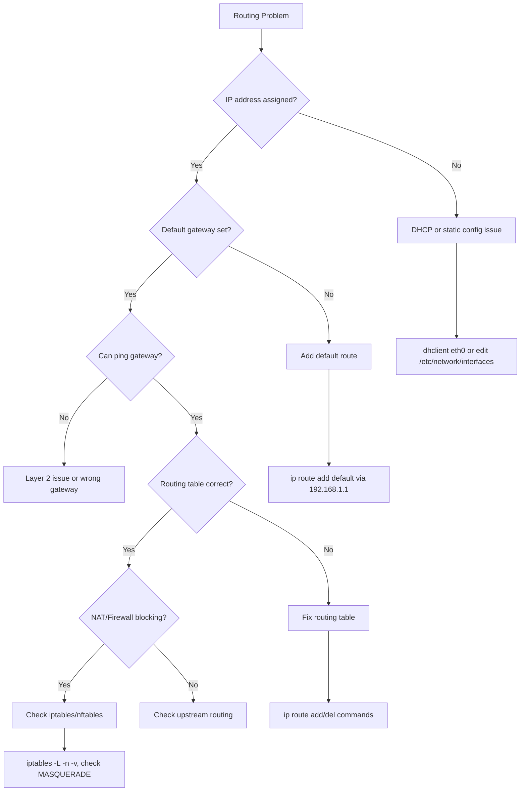
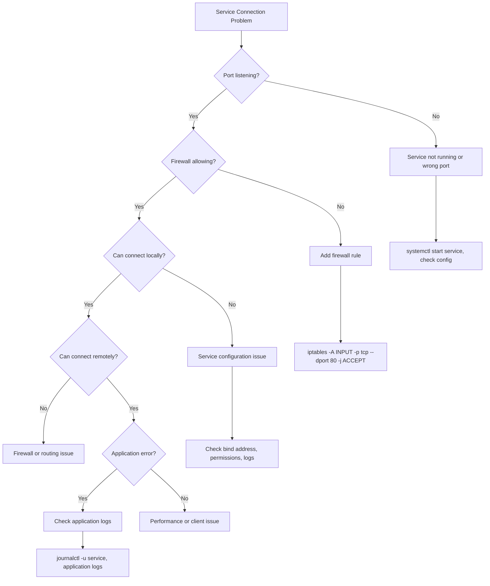

# Network Troubleshooting Methodology Guide

A comprehensive, systematic approach to diagnosing and resolving network issues using first principles and the scientific method.

---

## Table of Contents

1. [Troubleshooting Mindset & Principles](#troubleshooting-mindset--principles)
2. [Problem Classification Matrix](#problem-classification-matrix)
3. [Troubleshooting Workflow Decision Tree](#troubleshooting-workflow-decision-tree)
4. [OSI Layer Diagnostic Framework](#osi-layer-diagnostic-framework)
5. [Common Scenarios & Playbooks](#common-scenarios--playbooks)
6. [Advanced Diagnostic Techniques](#advanced-diagnostic-techniques)
7. [Documentation Templates](#documentation-templates)

---

## Troubleshooting Mindset & Principles

### Scientific Method for Networking

Apply rigorous scientific thinking to network problems:

#### 1. **Observation** 
Document what you're seeing:
- **Symptoms**: Cannot connect, slow speeds, intermittent failures, timeouts
- **Scope**: Single host, subnet, entire network, specific service
- **Timing**: Constant, intermittent, time-based patterns
- **Users affected**: Everyone, specific users, specific locations

```bash
# Document baseline observations
echo "$(date): User reports cannot access web server" >> troubleshooting.log
ping -c 4 target.example.com | tee -a troubleshooting.log
```

#### 2. **Hypothesis**
Form educated guesses based on:
- **OSI layer analysis**: Where in the stack could this fail?
- **Recent changes**: New deployments, config changes, updates
- **Patterns**: Similar past issues, known failure modes
- **Environmental factors**: Time of day, load, external dependencies

**Example Hypotheses**:
- "DNS resolution is failing due to misconfigured resolver"
- "Firewall rule is blocking port 443 traffic"
- "MTU mismatch causing packet fragmentation"

#### 3. **Prediction**
If hypothesis is correct, what should tests reveal?

| Hypothesis | Expected Test Results |
|------------|----------------------|
| DNS failure | `dig` returns SERVFAIL, `/etc/resolv.conf` has wrong nameserver |
| Firewall blocking | `tcpdump` shows SYN packets but no SYN-ACK response |
| MTU mismatch | `ping -M do -s 1472` succeeds, but `-s 1473` fails |

#### 4. **Testing**
Run specific, targeted tests:

```bash
# Test DNS resolution
dig @8.8.8.8 example.com +short

# Test connectivity at different layers
ping -c 3 192.168.1.1        # Layer 3
nc -zv example.com 443       # Layer 4
curl -I https://example.com  # Layer 7

# Capture evidence
tcpdump -i eth0 -w /tmp/capture.pcap host 192.168.1.100
```

#### 5. **Analysis**
Compare test results against predictions:
- Does evidence **support** the hypothesis?
- Does evidence **refute** the hypothesis?
- Is evidence **inconclusive** (need more data)?

#### 6. **Conclusion**
- **Root cause identified**: Document and remediate
- **Hypothesis refuted**: Form new hypothesis and repeat
- **Partial confirmation**: Refine hypothesis and test further

---

### First Principles for Network Issues

#### Core Principles

1. **Start Simple, Then Complex**
   ```bash
   # Simple first
   ping 8.8.8.8
   
   # Then more complex
   mtr --report --report-cycles 10 8.8.8.8
   
   # Finally, deep analysis
   tcpdump -i any -n 'icmp or (tcp port 53)' -w /tmp/debug.pcap
   ```

2. **Work Bottom-Up (OSI Layers)**
   - Layer 1 (Physical): Cable connected? Link light on?
   - Layer 2 (Data Link): Interface up? MAC address correct?
   - Layer 3 (Network): IP assigned? Routing correct?
   - Layer 4 (Transport): Port open? Firewall allowing?
   - Layer 7 (Application): Service running? Config correct?

3. **Test One Variable at a Time**
   ```bash
   # Bad: Change multiple things
   # systemctl restart networking && iptables -F && systemctl restart nginx
   
   # Good: Change one thing, test, document
   systemctl restart networking
   ping 8.8.8.8  # Test result
   # Document outcome before next change
   ```

4. **Document Everything**
   ```bash
   # Create troubleshooting session log
   SESSION_LOG="/tmp/troubleshoot-$(date +%Y%m%d-%H%M%S).log"
   
   # Log all commands and outputs
   exec > >(tee -a "$SESSION_LOG") 2>&1
   
   # Add timestamps
   echo "=== $(date): Starting diagnostics ==="
   ```

5. **Have a Rollback Plan**
   ```bash
   # Backup before changes
   cp /etc/network/interfaces /etc/network/interfaces.backup.$(date +%s)
   iptables-save > /tmp/iptables.backup.$(date +%s)
   
   # Set a safety timer for critical changes
   at now + 10 minutes <<< 'iptables-restore < /tmp/iptables.backup'
   ```

---

## Problem Classification Matrix

### Symptom-Based Diagnostic Guide

| Symptom | Likely Layer(s) | Priority | First Tests | Common Causes |
|---------|----------------|----------|-------------|---------------|
| **Cannot connect at all** | Physical (L1)<br>Data Link (L2) | 🔴 High | `ip link show`<br>`ethtool eth0`<br>`dmesg \| grep eth0`<br>Physical cable test | Cable unplugged<br>Interface down<br>Driver issues<br>Hardware failure |
| **Intermittent connectivity** | Physical (L1)<br>Network (L3) | 🟡 Medium | `mtr -r -c 100 target`<br>`ping -f -c 1000 target`<br>`dmesg \| tail -50`<br>`ethtool -S eth0` | Flapping interface<br>Packet loss<br>Duplex mismatch<br>CRC errors |
| **Slow performance** | Transport (L4)<br>Application (L7) | 🟡 Medium | `iperf3 -c server`<br>`ss -tin`<br>`nload`<br>`nethogs` | Bandwidth saturation<br>TCP window issues<br>Application bottleneck<br>QoS misconfiguration |
| **Timeouts but connects** | Network (L3)<br>Transport (L4) | 🔴 High | `traceroute -n target`<br>`tcptraceroute target 80`<br>`ping -M do -s 1472 target`<br>`ss -tan \| grep SYN` | MTU mismatch<br>Asymmetric routing<br>Firewall dropping packets<br>Connection timeout |
| **Works internally, not externally** | Network (L3)<br>Firewall | 🔴 High | `ip route show`<br>`iptables -L -n -v`<br>`nft list ruleset`<br>`tcpdump -i any icmp` | NAT misconfiguration<br>Firewall blocking<br>Missing default route<br>Routing loop |
| **DNS resolution failures** | Application (L7) | 🟡 Medium | `dig @8.8.8.8 domain.com`<br>`cat /etc/resolv.conf`<br>`systemctl status systemd-resolved`<br>`resolvectl status` | Wrong nameserver<br>DNS server down<br>Firewall blocking port 53<br>DNSSEC validation failure |
| **High latency** | Network (L3)<br>Physical (L1) | 🟡 Medium | `ping -c 100 target \| tail -1`<br>`mtr -r target`<br>`ss -ti` (check RTT)<br>`tc qdisc show` | Network congestion<br>Geographic distance<br>QoS policy<br>Bufferbloat |
| **Connection refused** | Transport (L4)<br>Application (L7) | 🟡 Medium | `ss -tlnp \| grep :PORT`<br>`telnet target PORT`<br>`nmap -p PORT target`<br>`journalctl -u service` | Service not running<br>Wrong port<br>Firewall blocking<br>Service crashed |
| **TLS/SSL errors** | Application (L7) | 🟡 Medium | `openssl s_client -connect host:443`<br>`curl -vvv https://host`<br>`nmap --script ssl-enum-ciphers -p 443 host` | Certificate expired<br>Cipher mismatch<br>SNI issues<br>CA trust problems |

---

## Troubleshooting Workflow Decision Tree

### Primary Decision Flow



### Layer 1-2: Physical/Data Link Issues



### Layer 3: Network/Routing Issues



### Layer 4-7: Service/Application Issues



---

## OSI Layer Diagnostic Framework

### Layer 1: Physical Layer

**What to check**: Cables, connectors, NICs, link status

```bash
# Check interface link status
ip link show eth0
# Look for: "state UP" or "state DOWN"

# Check physical layer details
ethtool eth0
# Look for: Link detected: yes, Speed, Duplex

# Check for physical errors
ethtool -S eth0 | grep -i 'error\|drop\|crc'

# Check kernel messages for hardware issues
dmesg | grep -i 'eth0\|network\|link'

# Check cable quality (if supported)
ethtool --show-cable eth0
```

**Common Issues**:
- Cable unplugged or damaged
- Wrong cable type (crossover vs straight)
- Port disabled on switch
- NIC hardware failure

---

### Layer 2: Data Link Layer

**What to check**: MAC addresses, ARP, switching, VLANs

```bash
# Check MAC address
ip link show eth0 | grep link/ether

# View ARP table
ip neigh show
arp -n

# Check for ARP issues
arping -I eth0 192.168.1.1

# Monitor ARP traffic
tcpdump -i eth0 arp -n

# Check VLAN configuration
ip -d link show
cat /proc/net/vlan/config

# View bridge/switch information
bridge link show
bridge fdb show
```

**Common Issues**:
- ARP cache poisoning or stale entries
- VLAN mismatch
- MAC address conflict
- Switch port configuration

---

### Layer 3: Network Layer

**What to check**: IP addressing, routing, ICMP

```bash
# Check IP configuration
ip addr show
ip -4 addr show  # IPv4 only
ip -6 addr show  # IPv6 only

# Check routing table
ip route show
ip route get 8.8.8.8  # Show route to specific destination

# Test basic connectivity
ping -c 4 8.8.8.8
ping -c 4 -I eth0 8.8.8.8  # Specify source interface

# Traceroute to destination
traceroute -n 8.8.8.8
mtr --report --report-cycles 10 8.8.8.8

# Check for packet loss
ping -c 100 -i 0.2 8.8.8.8 | grep -E 'packet loss|rtt'

# Test MTU/fragmentation
ping -M do -s 1472 8.8.8.8  # Should work (1500 MTU)
ping -M do -s 1473 8.8.8.8  # Should fail if MTU is 1500

# Check IP forwarding (for routers)
sysctl net.ipv4.ip_forward
cat /proc/sys/net/ipv4/ip_forward
```

**Common Issues**:
- Wrong IP address or subnet mask
- Missing or incorrect default gateway
- Routing loops
- MTU mismatch
- IP conflicts

---

### Layer 4: Transport Layer

**What to check**: TCP/UDP ports, connections, firewall

```bash
# Check listening ports
ss -tlnp  # TCP listening
ss -ulnp  # UDP listening
ss -tunap # All TCP/UDP with process info

# Check established connections
ss -tan state established
ss -tan | grep :80

# View connection statistics
ss -s

# Check for connection issues
ss -tan | grep SYN-SENT  # Stuck connections

# Test port connectivity
nc -zv example.com 443
telnet example.com 80

# TCP traceroute (better for firewalls)
tcptraceroute example.com 443

# Check firewall rules
iptables -L -n -v
iptables -L -n -v -t nat
nft list ruleset

# Monitor connection attempts
tcpdump -i any -n 'tcp[tcpflags] & tcp-syn != 0'

# Check TCP parameters
sysctl -a | grep -i tcp
```

**Common Issues**:
- Port not listening
- Firewall blocking connections
- Connection timeout
- Too many connections (exhaustion)
- TCP window scaling issues

---

### Layer 7: Application Layer

**What to check**: DNS, HTTP, TLS, application-specific protocols

```bash
# DNS troubleshooting
dig example.com
dig @8.8.8.8 example.com
nslookup example.com
host example.com

# Check DNS configuration
cat /etc/resolv.conf
resolvectl status
systemd-resolve --status

# Test DNS resolution time
time dig example.com

# HTTP/HTTPS testing
curl -v http://example.com
curl -I https://example.com  # Headers only
curl -w "@curl-format.txt" -o /dev/null -s https://example.com

# TLS/SSL debugging
openssl s_client -connect example.com:443 -servername example.com
openssl s_client -connect example.com:443 -showcerts

# Check certificate
echo | openssl s_client -connect example.com:443 2>/dev/null | openssl x509 -noout -dates

# Application logs
journalctl -u nginx -f
tail -f /var/log/nginx/error.log

# Check service status
systemctl status nginx
systemctl is-active nginx
```

**Common Issues**:
- DNS resolution failure
- Certificate expired or invalid
- Wrong application configuration
- Service not running
- Application-level firewall

---

## Common Scenarios & Playbooks

### Scenario 1: "Cannot Connect to Website"

**Systematic Approach**:

```bash
# Step 1: Verify local connectivity
ping -c 3 127.0.0.1  # Loopback works?

# Step 2: Check DNS resolution
dig example.com +short
# If fails, try different DNS
dig @8.8.8.8 example.com +short

# Step 3: Get IP and test connectivity
TARGET_IP=$(dig +short example.com | head -1)
ping -c 3 $TARGET_IP

# Step 4: Test port connectivity
nc -zv $TARGET_IP 80
nc -zv $TARGET_IP 443

# Step 5: Test HTTP/HTTPS
curl -v http://example.com
curl -v https://example.com

# Step 6: Check local firewall
iptables -L OUTPUT -n -v | grep -E 'dpt:80|dpt:443'

# Step 7: Trace route
mtr --report --report-cycles 10 example.com
```

**Decision Matrix**:
- DNS fails → Check `/etc/resolv.conf`, try `8.8.8.8`
- Ping fails → Routing or firewall issue
- Port closed → Service down or firewall blocking
- HTTP works, HTTPS fails → Certificate or TLS issue

---

### Scenario 2: "Intermittent Connection Drops"

**Systematic Approach**:

```bash
# Step 1: Long-term ping test
ping -i 1 8.8.8.8 | while read line; do echo "$(date): $line"; done | tee ping-log.txt

# Step 2: Check for interface errors over time
watch -n 5 'ethtool -S eth0 | grep -E "error|drop|crc"'

# Step 3: Monitor interface status
watch -n 1 'ip link show eth0'

# Step 4: Check kernel logs for interface events
dmesg -w | grep eth0

# Step 5: MTR for packet loss patterns
mtr --report --report-cycles 100 8.8.8.8 > mtr-report.txt

# Step 6: Check for duplex mismatches
ethtool eth0 | grep -E 'Speed|Duplex'

# Step 7: Monitor connection table
watch -n 2 'ss -s'

# Step 8: Capture traffic during drop
tcpdump -i eth0 -w /tmp/intermittent-$(date +%s).pcap &
# Let it run during problem period, then stop with kill
```

**Common Causes**:
- Flapping interface (cable or port issue)
- Duplex mismatch
- Wireless interference
- DHCP lease expiration
- Overloaded connection tracking table

---

### Scenario 3: "Slow Network Performance"

**Systematic Approach**:

```bash
# Step 1: Baseline bandwidth test
iperf3 -c iperf.example.com -t 30

# Step 2: Check interface utilization
nload eth0
iftop -i eth0

# Step 3: Check for bandwidth hogs
nethogs eth0

# Step 4: Test latency
ping -c 100 8.8.8.8 | tail -3

# Step 5: Check TCP window scaling
ss -tin | grep -E 'wscale|rtt'

# Step 6: Check for packet loss
mtr --report --report-cycles 50 target.example.com

# Step 7: Check MTU
ip link show eth0 | grep mtu
ping -M do -s 1472 target.example.com

# Step 8: Check QoS/traffic shaping
tc qdisc show dev eth0
tc -s class show dev eth0

# Step 9: Check TCP tuning
sysctl net.ipv4.tcp_window_scaling
sysctl net.core.rmem_max
sysctl net.core.wmem_max

# Step 10: Test different TCP congestion algorithms
sysctl net.ipv4.tcp_congestion_control
```

**Performance Checklist**:
- [ ] Bandwidth saturation?
- [ ] High latency/packet loss?
- [ ] MTU issues?
- [ ] TCP window too small?
- [ ] QoS limiting traffic?
- [ ] DNS lookup slow?
- [ ] Application bottleneck?

---

### Scenario 4: "Can Ping But Cannot Connect to Service"

**Systematic Approach**:

```bash
# Step 1: Verify service is listening
ss -tlnp | grep :80

# Step 2: Test local connection
curl -v http://localhost:80

# Step 3: Test from server's IP
curl -v http://192.168.1.100:80

# Step 4: Check firewall rules
iptables -L INPUT -n -v | grep 'dpt:80'
nft list ruleset | grep 'dport 80'

# Step 5: Check if service is bound to correct interface
ss -tlnp | grep :80
# Look for 0.0.0.0:80 (all interfaces) vs 127.0.0.1:80 (localhost only)

# Step 6: Test from remote host
# On remote host:
telnet 192.168.1.100 80
nc -zv 192.168.1.100 80

# Step 7: Capture traffic
tcpdump -i any -n 'port 80' -A

# Step 8: Check SELinux/AppArmor
getenforce  # SELinux
sestatus
aa-status   # AppArmor

# Step 9: Check application logs
journalctl -u nginx -n 50
tail -f /var/log/nginx/error.log
```

**Common Causes**:
- Firewall blocking port
- Service bound to localhost only
- SELinux/AppArmor blocking
- Wrong port number
- Service crashed/not running

---

## Advanced Diagnostic Techniques

### Packet Capture Analysis

```bash
# Basic capture
tcpdump -i eth0 -w capture.pcap

# Capture specific traffic
tcpdump -i eth0 'host 192.168.1.100 and port 80' -w http-traffic.pcap

# Capture with timestamps and no DNS resolution
tcpdump -i eth0 -n -tttt -w capture.pcap

# Capture only SYN packets (connection attempts)
tcpdump -i eth0 'tcp[tcpflags] & tcp-syn != 0' -w syn-packets.pcap

# Capture and display ASCII
tcpdump -i eth0 -A 'port 80'

# Capture with snaplen for full packets
tcpdump -i eth0 -s 65535 -w full-capture.pcap

# Read and analyze capture
tcpdump -r capture.pcap
tcpdump -r capture.pcap 'tcp.port == 80'

# Filter by TCP flags
tcpdump -r capture.pcap 'tcp[tcpflags] & tcp-rst != 0'  # RST packets
```

### Connection Tracking

```bash
# View connection tracking table
conntrack -L

# Count connections by state
conntrack -L | grep -c ESTABLISHED
conntrack -L | grep -c TIME_WAIT

# Monitor new connections
conntrack -E

# Check connection tracking limits
sysctl net.netfilter.nf_conntrack_max
sysctl net.netfilter.nf_conntrack_count

# View connection tracking statistics
cat /proc/net/nf_conntrack
```

### Network Namespace Debugging

```bash
# List network namespaces
ip netns list

# Execute command in namespace
ip netns exec namespace_name ip addr show

# Test connectivity from namespace
ip netns exec namespace_name ping 8.8.8.8

# Check routing in namespace
ip netns exec namespace_name ip route show

# Enter namespace for multiple commands
nsenter --net=/var/run/netns/namespace_name bash
```

### Performance Profiling

```bash
# Bandwidth testing with iperf3
# On server:
iperf3 -s

# On client:
iperf3 -c server_ip -t 30 -i 5

# UDP bandwidth test
iperf3 -c server_ip -u -b 100M

# Parallel streams
iperf3 -c server_ip -P 4

# Reverse mode (server sends)
iperf3 -c server_ip -R

# Network throughput monitoring
sar -n DEV 1 10  # Interface statistics
sar -n EDEV 1 10 # Error statistics

# Real-time bandwidth monitoring
iftop -i eth0
nload eth0
bmon
```

---

## Documentation Templates

### Troubleshooting Session Log Template

```markdown
# Network Troubleshooting Session

**Date**: 2025-12-19
**Engineer**: Your Name
**Ticket**: #12345
**Duration**: Start - End

## Problem Statement
Brief description of the reported issue.

## Initial Observations
- Symptom: 
- Scope: 
- Affected users/systems:
- When started:

## Hypothesis
What I think is causing this issue and why.

## Tests Performed

### Test 1: [Test Name]
**Command**: 
```bash
command here
```
**Result**: 
**Analysis**: 

### Test 2: [Test Name]
**Command**:
```bash
command here
```
**Result**:
**Analysis**:

## Root Cause
Final determination of what caused the issue.

## Resolution
Steps taken to fix the issue.

## Verification
How I confirmed the fix worked.

## Prevention
Recommendations to prevent recurrence.

## Follow-up Actions
- [ ] Action item 1
- [ ] Action item 2
```

### Quick Reference Card

```bash
# === LAYER 1-2: PHYSICAL/DATA LINK ===
ip link show eth0                    # Interface status
ethtool eth0                         # Link details
ethtool -S eth0 | grep error         # Error counters
ip neigh show                        # ARP table

# === LAYER 3: NETWORK ===
ip addr show                         # IP configuration
ip route show                        # Routing table
ping -c 4 8.8.8.8                    # Basic connectivity
mtr --report 8.8.8.8                 # Path analysis
traceroute -n 8.8.8.8                # Route tracing

# === LAYER 4: TRANSPORT ===
ss -tlnp                             # Listening TCP ports
ss -tan state established            # Active connections
nc -zv host 80                       # Port test
iptables -L -n -v                    # Firewall rules

# === LAYER 7: APPLICATION ===
dig example.com                      # DNS lookup
curl -v https://example.com          # HTTP test
openssl s_client -connect host:443   # TLS test
journalctl -u service                # Service logs

# === PACKET CAPTURE ===
tcpdump -i eth0 -w file.pcap         # Capture to file
tcpdump -i eth0 port 80 -A           # Capture and display

# === PERFORMANCE ===
iperf3 -c server                     # Bandwidth test
iftop -i eth0                        # Real-time bandwidth
nethogs                              # Per-process bandwidth
```

---

## Troubleshooting Cheat Sheet

### Quick Diagnostic Commands by Symptom

| Symptom | Quick Test | What It Tells You |
|---------|-----------|-------------------|
| No connectivity | `ip link show` | Interface up/down |
| Can't reach gateway | `ip route \| grep default` | Default route exists |
| Can't reach internet | `ping -c 3 8.8.8.8` | Layer 3 connectivity |
| DNS not working | `dig @8.8.8.8 google.com` | DNS resolution |
| Port not accessible | `ss -tlnp \| grep :PORT` | Service listening |
| Slow performance | `mtr --report target` | Latency/packet loss |
| Firewall issue | `iptables -L -n -v` | Firewall rules |
| Connection timeout | `tcpdump -i any port PORT` | Packets arriving |

### Emergency Quick Fixes

```bash
# Restart networking (Debian/Ubuntu)
systemctl restart networking

# Restart NetworkManager
systemctl restart NetworkManager

# Flush DNS cache
systemd-resolve --flush-caches
resolvectl flush-caches

# Clear ARP cache
ip neigh flush all

# Reset firewall (DANGEROUS - only if locked out)
iptables -F
iptables -P INPUT ACCEPT
iptables -P OUTPUT ACCEPT
iptables -P FORWARD ACCEPT

# Renew DHCP lease
dhclient -r eth0  # Release
dhclient eth0     # Renew

# Bring interface down and up
ip link set eth0 down
ip link set eth0 up
```

---

## Best Practices Summary

1. **Always start with the basics** - Don't jump to complex solutions
2. **Document as you go** - Future you will thank present you
3. **Change one thing at a time** - Know what fixed (or broke) it
4. **Have a rollback plan** - Especially in production
5. **Use version control** - For configuration files
6. **Automate repetitive tasks** - Create scripts for common diagnostics
7. **Learn from each issue** - Update runbooks and documentation
8. **Communicate clearly** - Keep stakeholders informed
9. **Test in non-production first** - When possible
10. **Know when to escalate** - Don't waste time on unknowns

---

## Additional Resources

### Useful Tools to Install

```bash
# Debian/Ubuntu
apt install -y mtr traceroute tcpdump nmap netcat iperf3 \
  ethtool net-tools dnsutils curl wget nload iftop nethogs \
  conntrack

# RHEL/CentOS
yum install -y mtr traceroute tcpdump nmap nmap-ncat iperf3 \
  ethtool net-tools bind-utils curl wget nload iftop nethogs \
  conntrack-tools
```

### Learning Resources

- **Wireshark University**: Packet analysis training
- **TCP/IP Illustrated**: Classic networking book
- **Linux Network Administrator's Guide**: Comprehensive reference
- **PacketLife.net**: Cheat sheets and diagrams
- **Julia Evans' Networking Zines**: Beginner-friendly explanations

---

**Remember**: The best troubleshooters are methodical, patient, and curious. Every problem is an opportunity to learn something new about how networks actually work.
