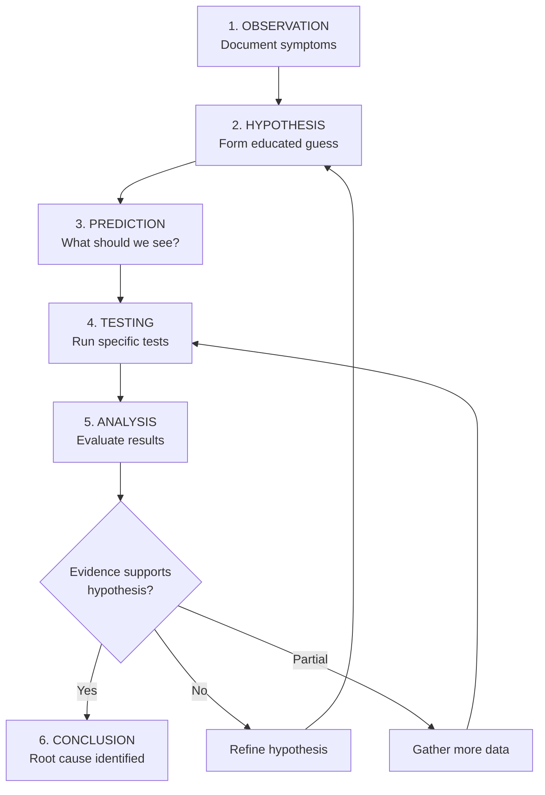
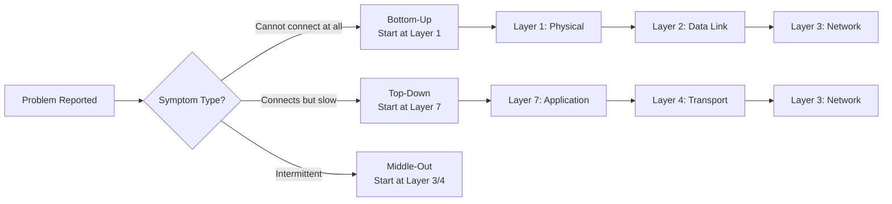
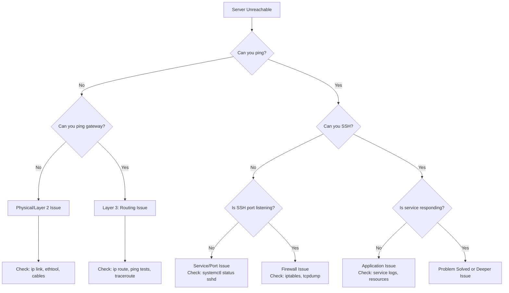
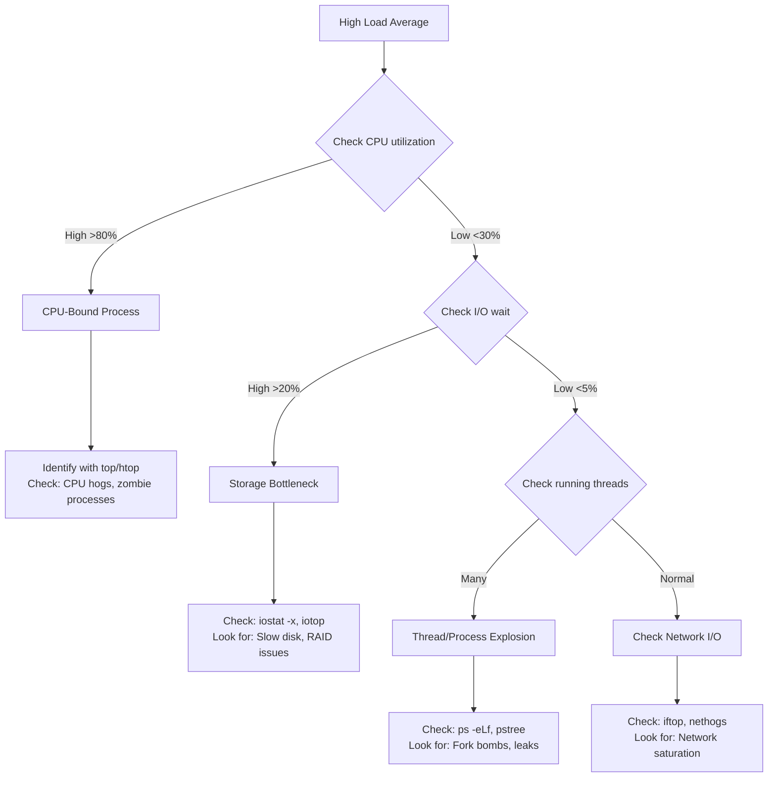
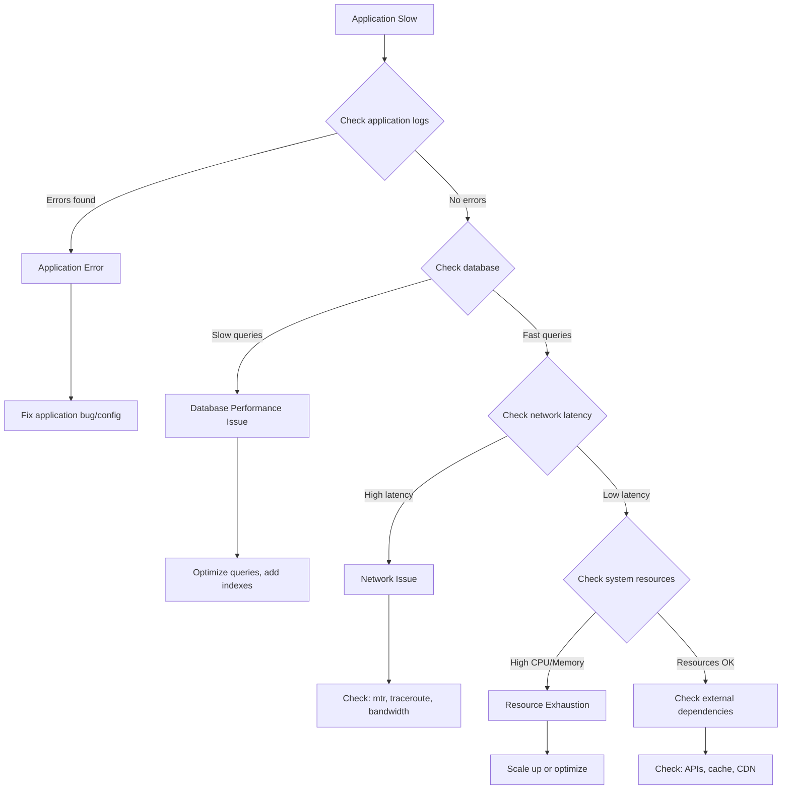
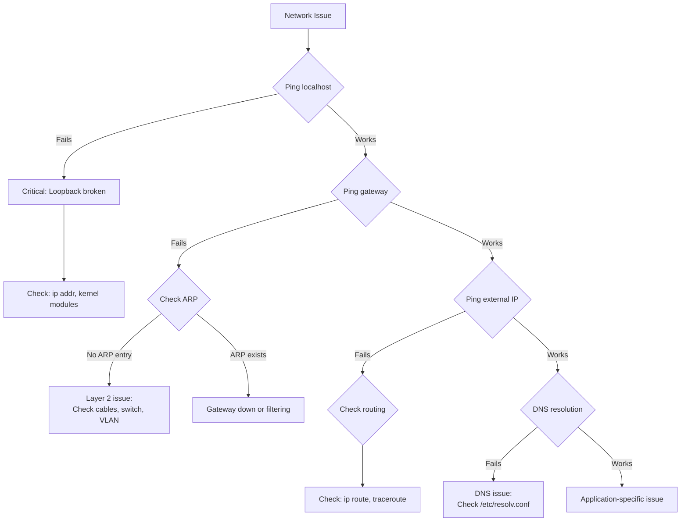

# The Linux Troubleshooting Mindset: Scientific Method for System Issues

A comprehensive guide to systematic troubleshooting methodology, cognitive frameworks, and organizational best practices.

---

## Table of Contents

1. [Foundational Principles](#foundational-principles)
2. [The Scientific Method Applied to Systems](#the-scientific-method-applied-to-systems)
3. [Layer-by-Layer Approach](#layer-by-layer-approach)
4. [Problem Classification Matrix](#problem-classification-matrix)
5. [Decision Trees for Common Scenarios](#decision-trees-for-common-scenarios)
6. [Information Gathering Protocol](#information-gathering-protocol)
7. [Documentation Templates](#documentation-templates)
8. [Cognitive Biases & Mitigation Strategies](#cognitive-biases--mitigation-strategies)
9. [Tool Selection Heuristics](#tool-selection-heuristics)
10. [Organizational Integration](#organizational-integration)
11. [Practical Exercises](#practical-exercises)
12. [Continuous Improvement](#continuous-improvement)

---

## Foundational Principles

### 1.1 First Principles Thinking in Troubleshooting

**Question Assumptions: "What do we actually know vs what we assume?"**

The foundation of effective troubleshooting is distinguishing between **observable facts** and **assumptions**.

#### Observable Symptoms vs Inferred Causes

| Observable (Facts) | Inferred (Assumptions) | Verification Method |
|-------------------|------------------------|---------------------|
| Service returns HTTP 500 | Database is down | Check `systemctl status mysql` |
| `ping` shows 50% packet loss | Network cable is bad | Check `ethtool -S eth0` for errors |
| Load average is 15.0 | CPU is overloaded | Check `mpstat` - might be I/O wait |
| Disk is 95% full | Out of space error | Check inodes with `df -i` |
| Connection timeout | Firewall blocking | Check `tcpdump` for packets arriving |

**Example: The "Database is Down" Assumption**

```bash
# ❌ ASSUMPTION: "Database is down"
# Observable: Application shows "Cannot connect to database"

# ✅ VERIFICATION STEPS:
# 1. Is the database process running?
systemctl status mysql
ps aux | grep mysqld

# 2. Is it listening on the expected port?
ss -tlnp | grep :3306

# 3. Can we connect locally?
mysql -u root -p -e "SELECT 1"

# 4. Can we connect from the application server?
mysql -h db.example.com -u app_user -p -e "SELECT 1"

# 5. Are there network issues?
ping -c 3 db.example.com
traceroute db.example.com

# RESULT: Database is running, but firewall rule was changed
# LESSON: "Database down" was an assumption, not a fact
```

#### The Importance of Baseline Knowledge

**What is "normal" for your system?**

```bash
# ESTABLISH BASELINES DURING NORMAL OPERATION:

# 1. CPU baseline
mpstat 1 60 > /var/log/baselines/cpu-baseline-$(date +%Y%m%d).log

# 2. Memory baseline
free -h && slabtop -o | head -20 > /var/log/baselines/memory-baseline-$(date +%Y%m%d).log

# 3. Disk I/O baseline
iostat -x 1 60 > /var/log/baselines/io-baseline-$(date +%Y%m%d).log

# 4. Network baseline
sar -n DEV 1 60 > /var/log/baselines/network-baseline-$(date +%Y%m%d).log

# 5. Connection baseline
ss -s > /var/log/baselines/connections-baseline-$(date +%Y%m%d).log
```

**Baseline Comparison Script:**

```bash
#!/bin/bash
# compare_to_baseline.sh - Compare current metrics to baseline

BASELINE_DIR="/var/log/baselines"
CURRENT_LOAD=$(uptime | awk -F'load average:' '{print $2}' | awk '{print $1}' | tr -d ',')
BASELINE_LOAD=$(grep "load average" $BASELINE_DIR/cpu-baseline-*.log | awk '{sum+=$NF; count++} END {print sum/count}')

echo "Current Load: $CURRENT_LOAD"
echo "Baseline Load: $BASELINE_LOAD"

if (( $(echo "$CURRENT_LOAD > $BASELINE_LOAD * 2" | bc -l) )); then
    echo "⚠️  ALERT: Load is 2x baseline!"
else
    echo "✓ Load is within normal range"
fi
```

---

### 1.2 The Scientific Method Applied to Systems

#### The Six-Step Process



#### Step 1: Observation

**Document what you're seeing, not what you think is happening.**

```bash
# OBSERVATION TEMPLATE:
cat > /tmp/troubleshooting-$(date +%Y%m%d-%H%M%S).log <<'EOF'
=== OBSERVATION PHASE ===
Timestamp: $(date)
Reporter: [Name/Team]
Ticket: [ID]

SYMPTOMS (Observable Facts):
- [ ] What is failing? (Be specific)
- [ ] When did it start? (Exact time if possible)
- [ ] Who is affected? (All users, specific users, specific services)
- [ ] What changed recently? (Deployments, config changes, updates)
- [ ] Is it constant or intermittent? (Pattern analysis)

INITIAL METRICS:
- Load Average: $(uptime | awk -F'load average:' '{print $2}')
- Memory: $(free -h | grep Mem:)
- Disk: $(df -h / | tail -1)
- Network: $(ss -s)

RECENT ERRORS:
$(journalctl --since "10 minutes ago" -p err --no-pager | tail -20)
EOF
```

**Example Observation:**

```
SYMPTOMS:
✓ Web application returning HTTP 502 errors
✓ Started at 14:35 UTC (5 minutes ago)
✓ Affects all users accessing /api/users endpoint
✓ Deployment of v2.3.1 completed at 14:30 UTC
✓ Constant failures (100% error rate on this endpoint)

INITIAL METRICS:
- Load Average: 0.45, 0.52, 0.48 (normal for 4-core system)
- Memory: 3.2G / 16G used (normal)
- Disk: 45% used (normal)
- Network: 234 TCP connections (normal)

RECENT ERRORS:
[14:35:22] nginx: upstream prematurely closed connection
[14:35:23] app: ConnectionRefusedError: [Errno 111] Connection refused
```

#### Step 2: Hypothesis

**Form educated guesses based on observations and knowledge.**

```bash
# HYPOTHESIS GENERATION FRAMEWORK:

# 1. RECENT CHANGES (Most likely cause)
# Question: What changed?
# Hypothesis: New deployment introduced bug or config error

# 2. OSI LAYER ANALYSIS
# Question: At what layer is the failure?
# Layer 7 (Application): App crashes, wrong response
# Layer 4 (Transport): Connection refused, timeout
# Layer 3 (Network): Cannot reach host
# Layer 2 (Data Link): Interface down
# Layer 1 (Physical): No link light

# 3. PATTERN RECOGNITION
# Question: Have we seen this before?
# Check: Runbooks, past incidents, known issues

# 4. ENVIRONMENTAL FACTORS
# Question: Is there a pattern?
# Check: Time of day, load patterns, external dependencies
```

**Example Hypotheses (Ranked by Likelihood):**

```
HYPOTHESIS 1 (High Probability):
New deployment (v2.3.1) introduced a bug in /api/users endpoint
Evidence: Timing correlation, specific endpoint affected
Prediction: Rolling back deployment will resolve issue

HYPOTHESIS 2 (Medium Probability):
Database connection pool exhausted
Evidence: Connection refused error
Prediction: Database connections at max, `ss -t sport = :3306` shows many connections

HYPOTHESIS 3 (Low Probability):
Network issue between app and database
Evidence: Connection errors
Prediction: `ping` or `traceroute` to database will show packet loss
```

#### Step 3: Prediction

**If hypothesis is correct, what specific evidence should we find?**

| Hypothesis | Expected Test Results | Unexpected Results (Refutes Hypothesis) |
|------------|----------------------|----------------------------------------|
| New deployment bug | Code review shows error handling issue | Code looks correct, no obvious bugs |
| DB connection pool exhausted | `SHOW PROCESSLIST` shows max connections | Only 10/100 connections used |
| Network issue | `ping` shows packet loss | `ping` shows 0% loss, <1ms latency |
| Firewall blocking | `tcpdump` shows SYN but no SYN-ACK | `tcpdump` shows complete TCP handshake |
| Disk full | `df -h` shows 100% usage | Disk only 45% full |
| Memory exhaustion | `free -h` shows 0 available | 12GB available memory |

#### Step 4: Testing

**Run specific, targeted tests to gather evidence.**

```bash
# TESTING PROTOCOL:

# 1. NON-INVASIVE TESTS FIRST (No system changes)
echo "=== Phase 1: Non-Invasive Tests ==="

# Test Hypothesis 1: Check application logs for errors
journalctl -u webapp --since "14:30" | grep -E "ERROR|FATAL|Exception"

# Test Hypothesis 2: Check database connections
mysql -e "SHOW PROCESSLIST" | wc -l
ss -t sport = :3306 | wc -l

# Test Hypothesis 3: Check network connectivity
ping -c 5 db.example.com
mtr --report --report-cycles 10 db.example.com

# 2. TARGETED INVESTIGATION (Minimal impact)
echo "=== Phase 2: Targeted Investigation ==="

# Check application configuration
diff /etc/webapp/config.yml /etc/webapp/config.yml.backup

# Check database connectivity from app server
mysql -h db.example.com -u webapp -p -e "SELECT 1"

# 3. INVASIVE TESTS (Only if necessary, with rollback plan)
echo "=== Phase 3: Invasive Tests (If Needed) ==="

# Enable debug logging (can impact performance)
# sed -i 's/LOG_LEVEL=INFO/LOG_LEVEL=DEBUG/' /etc/webapp/config
# systemctl restart webapp
```

**Test Execution Example:**

```bash
# HYPOTHESIS 1 TEST: Check for application errors in new deployment
$ journalctl -u webapp --since "14:30" | grep -E "ERROR|Exception"

[14:35:22] ERROR: Failed to connect to database: Connection refused
[14:35:22] Exception in thread "main" java.net.ConnectException: Connection refused
[14:35:23] ERROR: Database host 'localhost' not reachable

# FINDING: App is trying to connect to 'localhost' instead of 'db.example.com'
# EVIDENCE SUPPORTS HYPOTHESIS 1: Configuration error in new deployment
```

#### Step 5: Analysis

**Compare test results against predictions.**

```bash
# ANALYSIS FRAMEWORK:

# Question 1: Does evidence support the hypothesis?
# ✓ YES: Proceed to conclusion
# ✗ NO: Reject hypothesis, form new one
# ⚠ PARTIAL: Gather more data

# Question 2: Is there contradictory evidence?
# If yes, re-examine assumptions

# Question 3: Are there alternative explanations?
# Consider Occam's Razor: Simplest explanation is usually correct
```

**Analysis Example:**

```
HYPOTHESIS 1: New deployment introduced configuration error
PREDICTION: Config file will show wrong database host
TEST RESULT: ✓ Config shows 'localhost' instead of 'db.example.com'
ANALYSIS: Evidence STRONGLY SUPPORTS hypothesis

SUPPORTING EVIDENCE:
1. Timing: Error started immediately after deployment (14:30 → 14:35)
2. Scope: Only /api/users affected (new endpoint in v2.3.1)
3. Error message: "Connection refused" to localhost
4. Config diff: Database host changed from 'db.example.com' to 'localhost'

CONCLUSION: Configuration error in deployment
CONFIDENCE: 95%
```

#### Step 6: Conclusion

**Identify root cause or refine hypothesis.**

```bash
# CONCLUSION TEMPLATE:

ROOT CAUSE IDENTIFIED:
- What: Configuration file error in v2.3.1 deployment
- Where: /etc/webapp/config.yml, line 42
- When: Introduced in deployment at 14:30 UTC
- Why: Automated deployment script used wrong template
- Impact: 100% of /api/users requests failing

RESOLUTION:
1. Immediate fix: Manually correct config file
   sed -i 's/localhost/db.example.com/' /etc/webapp/config.yml
   systemctl restart webapp

2. Verification: Test endpoint
   curl -I https://api.example.com/api/users
   # Expected: HTTP 200 OK

3. Prevention: Update deployment template
   # Fix deployment script to use correct template

TIMELINE:
14:30 - Deployment started
14:35 - Errors began
14:42 - Root cause identified
14:45 - Fix applied
14:46 - Service restored

LESSONS LEARNED:
- Deployment validation should include config file review
- Automated tests should verify database connectivity
- Deployment script needs better template management
```

---

### 1.3 Layer-by-Layer Approach (OSI Model Adaptation)

#### Bottom-Up vs Top-Down: When to Use Each



#### Bottom-Up Approach (Physical → Application)

**Use when:** Complete connectivity failure, hardware issues suspected

```bash
# LAYER 1: PHYSICAL
echo "=== Layer 1: Physical Layer ==="
# Is the interface up?
ip link show eth0
# Is there a link?
ethtool eth0 | grep "Link detected"
# Any physical errors?
ethtool -S eth0 | grep -E "error|crc|collision"

# If Layer 1 fails, stop here and fix physical issues
# If Layer 1 passes, proceed to Layer 2

# LAYER 2: DATA LINK
echo "=== Layer 2: Data Link Layer ==="
# Is MAC address correct?
ip link show eth0 | grep link/ether
# Can we reach gateway via ARP?
arping -I eth0 -c 3 $(ip route show default | awk '{print $3}')
# Is ARP table populated?
ip neigh show

# If Layer 2 fails, check switching/VLAN issues
# If Layer 2 passes, proceed to Layer 3

# LAYER 3: NETWORK
echo "=== Layer 3: Network Layer ==="
# Do we have an IP address?
ip addr show eth0 | grep "inet "
# Can we ping the gateway?
ping -c 3 $(ip route show default | awk '{print $3}')
# Can we ping external IP?
ping -c 3 8.8.8.8
# Is routing correct?
ip route show

# If Layer 3 fails, check IP config/routing
# If Layer 3 passes, proceed to Layer 4

# LAYER 4: TRANSPORT
echo "=== Layer 4: Transport Layer ==="
# Is the port open?
ss -tlnp | grep :80
# Can we connect to the port?
nc -zv localhost 80
# Are there firewall rules blocking?
iptables -L -n -v | grep 80

# If Layer 4 fails, check service/firewall
# If Layer 4 passes, proceed to Layer 7

# LAYER 7: APPLICATION
echo "=== Layer 7: Application Layer ==="
# Is the application responding correctly?
curl -I http://localhost
# Are there application errors?
journalctl -u nginx --since "5 minutes ago" -p err
```

#### Top-Down Approach (Application → Physical)

**Use when:** Service is accessible but behaving incorrectly

```bash
# LAYER 7: APPLICATION
echo "=== Layer 7: Application Layer ==="
# What error is the application returning?
curl -v https://api.example.com/endpoint
# Check application logs
journalctl -u webapp -n 50
# Is the application process running?
systemctl status webapp

# If application error is found, fix it
# If application looks fine, check Layer 4

# LAYER 4: TRANSPORT
echo "=== Layer 4: Transport Layer ==="
# Are connections being established?
ss -tan | grep ESTABLISHED | grep :80
# Are there connection errors?
ss -tan | grep SYN-SENT
# Check for connection limits
sysctl net.ipv4.tcp_max_syn_backlog

# If transport issues found, investigate further
# If transport looks fine, check Layer 3

# LAYER 3: NETWORK
echo "=== Layer 3: Network Layer ==="
# Is there packet loss?
mtr --report --report-cycles 20 api.example.com
# Are there routing issues?
traceroute api.example.com
# Check for MTU problems
ping -M do -s 1472 api.example.com

# Continue down the stack as needed
```

#### Cross-Layer Interactions and Dependencies

**Understanding how layers affect each other:**

| Layer Issue | Symptoms at Other Layers | Diagnostic Confusion |
|-------------|-------------------------|---------------------|
| L1: Bad cable | L3: Intermittent ping failures | Might look like network congestion |
| L2: VLAN mismatch | L3: Cannot reach gateway | Might look like routing issue |
| L3: MTU mismatch | L7: Large transfers fail | Might look like application bug |
| L4: Connection tracking full | L7: Random connection failures | Might look like application crash |
| L7: Slow database queries | L4: Many TIME-WAIT connections | Might look like connection leak |

**Example: MTU Mismatch (Cross-Layer Issue)**

```bash
# SYMPTOM (Layer 7): Large file uploads fail, small uploads work
# APPEARS TO BE: Application bug

# INVESTIGATION:
# Layer 7 check - Application logs show no errors
journalctl -u webapp | grep -i error
# No errors found

# Layer 4 check - Connections established
ss -tan | grep ESTABLISHED
# Connections exist

# Layer 3 check - Test MTU
ping -M do -s 1472 server.example.com  # Works (1500 MTU)
ping -M do -s 1473 server.example.com  # Fails!

# ROOT CAUSE: MTU mismatch (Layer 3 issue)
# SOLUTION: Adjust MTU
ip link set dev eth0 mtu 1450

# LESSON: Layer 7 symptom caused by Layer 3 issue
```

---

## Problem Classification Matrix

### Comprehensive Symptom Analysis

| Symptom Pattern | Likely OSI Layer | Priority Level | First Diagnostic Commands | Common Root Causes | Escalation Threshold |
|----------------|------------------|----------------|---------------------------|-------------------|---------------------|
| **Cannot ping gateway** | Physical (L1)<br/>Data Link (L2) | 🔴 Critical | `ip link show`<br/>`ethtool eth0`<br/>`dmesg \| grep eth` | Cable unplugged<br/>NIC failure<br/>Switch port down<br/>Driver issue | 15 minutes |
| **Ping works, SSH fails** | Transport (L4)<br/>Application (L7) | 🟡 High | `ss -tlnp \| grep :22`<br/>`systemctl status sshd`<br/>`journalctl -u sshd` | SSH service down<br/>Firewall blocking<br/>MaxSessions reached<br/>Auth failure | 30 minutes |
| **High load, low CPU** | Storage I/O | 🟡 High | `iostat -x 1 5`<br/>`iotop -o`<br/>`ps aux \| grep " D "`  | Disk failure<br/>NFS hang<br/>RAID rebuild<br/>Slow storage | 20 minutes |
| **Out of memory** | Memory/Application | 🔴 Critical | `free -h`<br/>`ps aux --sort=-%mem`<br/>`slabtop -o` | Memory leak<br/>Insufficient RAM<br/>Kernel slab leak<br/>No swap | 10 minutes |
| **Intermittent packet loss** | Physical (L1)<br/>Network (L3) | 🟡 High | `mtr --report target`<br/>`ethtool -S eth0`<br/>`ping -f target` | Bad cable<br/>Duplex mismatch<br/>Network congestion<br/>Flapping interface | 45 minutes |
| **DNS resolution slow** | Application (L7) | 🟢 Medium | `dig example.com`<br/>`time nslookup example.com`<br/>`cat /etc/resolv.conf` | DNS server slow<br/>Network latency<br/>DNS cache full<br/>Wrong nameserver | 60 minutes |
| **Database connection timeout** | Transport (L4)<br/>Application (L7) | 🔴 Critical | `ss -t sport = :3306`<br/>`mysql -e "SHOW PROCESSLIST"`<br/>`tcpdump port 3306` | Max connections<br/>Slow queries<br/>Network timeout<br/>Firewall rules | 15 minutes |
| **Web server 502/503 errors** | Application (L7) | 🟡 High | `systemctl status nginx`<br/>`journalctl -u nginx`<br/>`ss -tlnp \| grep :80` | Backend down<br/>Timeout too short<br/>Connection pool exhausted | 20 minutes |
| **Disk full** | Filesystem | 🔴 Critical | `df -h`<br/>`du -sh /*`<br/>`lsof \| grep deleted` | Log growth<br/>Deleted files held open<br/>Large temp files<br/>No log rotation | 10 minutes |
| **Service crashes repeatedly** | Application (L7) | 🔴 Critical | `journalctl -u service`<br/>`coredumpctl list`<br/>`dmesg \| grep -i kill` | OOM killer<br/>Segfault<br/>Dependency failure<br/>Config error | 30 minutes |
| **Slow network performance** | Network (L3)<br/>Transport (L4) | 🟢 Medium | `iperf3 -c server`<br/>`ss -tin`<br/>`tc -s qdisc show` | Bandwidth saturation<br/>QoS limiting<br/>TCP window small<br/>Bufferbloat | 60 minutes |
| **Connection refused** | Transport (L4)<br/>Application (L7) | 🟡 High | `ss -tlnp \| grep :PORT`<br/>`telnet host PORT`<br/>`iptables -L -n -v` | Service not running<br/>Wrong port<br/>Firewall blocking<br/>Bind address wrong | 30 minutes |

### Priority Level Definitions

- 🔴 **Critical**: Service completely unavailable, data loss risk, security breach
- 🟡 **High**: Significant degradation, multiple users affected, workaround available
- 🟢 **Medium**: Minor impact, few users affected, non-critical service

---

## Decision Trees for Common Scenarios

### Scenario 1: Server Unreachable



**Detailed Workflow:**

```bash
#!/bin/bash
# server_unreachable_diagnostic.sh

SERVER="$1"
echo "=== Diagnosing: $SERVER ==="

# Step 1: Can we ping?
if ping -c 3 -W 2 "$SERVER" >/dev/null 2>&1; then
    echo "✓ Ping successful - Layer 3 connectivity OK"
    
    # Step 2: Can we SSH?
    if timeout 5 ssh -o ConnectTimeout=3 "$SERVER" "echo test" >/dev/null 2>&1; then
        echo "✓ SSH successful - Server is reachable"
        echo "→ Check application-specific issues"
    else
        echo "✗ SSH failed - Checking SSH service..."
        
        # Step 3: Is SSH port listening?
        if nc -zv -w 2 "$SERVER" 22 2>&1 | grep -q succeeded; then
            echo "✓ Port 22 is open"
            echo "→ Possible issues: Authentication, SSH config, MaxSessions"
        else
            echo "✗ Port 22 is closed"
            echo "→ Possible issues: SSH service down, firewall blocking"
        fi
    fi
else
    echo "✗ Ping failed - Checking network path..."
    
    # Step 4: Can we ping gateway?
    GATEWAY=$(ip route show default | awk '{print $3}')
    if ping -c 3 -W 2 "$GATEWAY" >/dev/null 2>&1; then
        echo "✓ Gateway reachable - Layer 3 routing issue"
        echo "→ Check: traceroute, routing tables, firewall"
        traceroute -n -m 10 "$SERVER"
    else
        echo "✗ Gateway unreachable - Physical/Layer 2 issue"
        echo "→ Check: cables, interface status, switch ports"
        ip link show
        ethtool eth0 2>/dev/null | grep "Link detected"
    fi
fi
```

### Scenario 2: High Load Average



**Detailed Workflow:**

```bash
#!/bin/bash
# high_load_diagnostic.sh

echo "=== High Load Average Diagnostic ==="

# Get current load
LOAD=$(uptime | awk -F'load average:' '{print $2}' | awk '{print $1}' | tr -d ',')
CORES=$(nproc)
echo "Load Average: $LOAD (Cores: $CORES)"

# Step 1: Check CPU utilization
CPU_IDLE=$(mpstat 1 3 | tail -1 | awk '{print $NF}')
CPU_USED=$(echo "100 - $CPU_IDLE" | bc)

echo "CPU Usage: ${CPU_USED}%"

if (( $(echo "$CPU_USED > 80" | bc -l) )); then
    echo "→ CPU-bound issue detected"
    echo "Top CPU consumers:"
    ps aux --sort=-%cpu | head -10
    
elif (( $(echo "$CPU_USED < 30" | bc -l) )); then
    echo "→ Not CPU-bound, checking I/O wait..."
    
    # Step 2: Check I/O wait
    IO_WAIT=$(iostat -x 1 3 | grep -A 1 "Device" | tail -1 | awk '{print $4}')
    echo "I/O Wait: ${IO_WAIT}%"
    
    if (( $(echo "$IO_WAIT > 20" | bc -l) )); then
        echo "→ Storage bottleneck detected"
        echo "Disk I/O statistics:"
        iostat -x 1 3
        echo ""
        echo "Top I/O consumers:"
        iotop -b -n 1 -o | head -10
    else
        # Step 3: Check thread count
        THREADS=$(ps -eLf | wc -l)
        echo "Thread count: $THREADS"
        
        if (( $THREADS > 5000 )); then
            echo "→ Thread explosion detected"
            echo "Processes with most threads:"
            ps -eLf | awk '{print $4}' | sort | uniq -c | sort -rn | head -10
        else
            echo "→ Checking network I/O..."
            ss -s
        fi
    fi
fi
```

### Scenario 3: Application Slow Response



### Scenario 4: Disk Space Issues

```mermaid
graph TD
    A[Disk Full Alert] --> B{Check actual usage}
    B -->|df shows 100%| C{Check inodes}
    B -->|df shows <90%| D[False alarm or threshold issue]
    
    C -->|Inodes 100%| E[Too many small files]
    C -->|Inodes OK| F{Find large files}
    
    E --> E1[Find and remove:<br/>find / -xdev -type f \| wc -l]
    
    F --> F1{Check du -sh /*}
    F1 -->|/var large| G{Check logs}
    F1 -->|/tmp large| H[Clean temp files]
    F1 -->|/home large| I[User data cleanup]
    
    G -->|Logs growing| G1[Check log rotation<br/>Find deleted but open files]
    G1 --> G2[lsof \| grep deleted]
```

### Scenario 5: Network Connectivity Issues



---

## Information Gathering Protocol

### Phase 1: Non-Invasive Data Collection (5 Minutes)

**Goal:** Gather maximum information without changing system state.

```bash
#!/bin/bash
# phase1_data_collection.sh - Non-invasive system snapshot

TIMESTAMP=$(date +%Y%m%d-%H%M%S)
OUTPUT_DIR="/var/log/troubleshooting/$TIMESTAMP"
mkdir -p "$OUTPUT_DIR"

echo "=== Phase 1: Non-Invasive Data Collection ==="
echo "Output directory: $OUTPUT_DIR"

# 1. System Overview (10 seconds)
echo "Collecting system overview..."
{
    echo "=== SYSTEM OVERVIEW ==="
    echo "Timestamp: $(date)"
    echo "Hostname: $(hostname)"
    echo "Uptime: $(uptime)"
    echo "Kernel: $(uname -r)"
    echo ""
} > "$OUTPUT_DIR/01-system-overview.txt"

# 2. Resource Utilization (20 seconds)
echo "Collecting resource metrics..."
{
    echo "=== CPU ==="
    mpstat 1 3
    echo ""
    echo "=== MEMORY ==="
    free -h
    echo ""
    echo "=== DISK ==="
    df -h
    echo ""
    echo "=== LOAD AVERAGE ==="
    uptime
} > "$OUTPUT_DIR/02-resources.txt"

# 3. Network Status (30 seconds)
echo "Collecting network status..."
{
    echo "=== INTERFACES ==="
    ip addr show
    echo ""
    echo "=== ROUTING ==="
    ip route show
    echo ""
    echo "=== CONNECTIONS ==="
    ss -s
    echo ""
    echo "=== LISTENING PORTS ==="
    ss -tlnp
} > "$OUTPUT_DIR/03-network.txt"

# 4. Process Information (20 seconds)
echo "Collecting process information..."
{
    echo "=== TOP PROCESSES (CPU) ==="
    ps aux --sort=-%cpu | head -20
    echo ""
    echo "=== TOP PROCESSES (MEMORY) ==="
    ps aux --sort=-%mem | head -20
    echo ""
    echo "=== PROCESS COUNT ==="
    ps aux | wc -l
} > "$OUTPUT_DIR/04-processes.txt"

# 5. Recent Logs (30 seconds)
echo "Collecting recent logs..."
{
    echo "=== KERNEL MESSAGES (Last 50) ==="
    dmesg -T | tail -50
    echo ""
    echo "=== SYSTEM ERRORS (Last 10 minutes) ==="
    journalctl --since "10 minutes ago" -p err --no-pager
    echo ""
    echo "=== AUTH LOG (Last 20) ==="
    journalctl -u ssh --since "10 minutes ago" --no-pager | tail -20
} > "$OUTPUT_DIR/05-logs.txt"

# 6. Service Status (20 seconds)
echo "Collecting service status..."
{
    echo "=== FAILED SERVICES ==="
    systemctl list-units --state=failed
    echo ""
    echo "=== CRITICAL SERVICES ==="
    for service in sshd nginx mysql docker; do
        echo "--- $service ---"
        systemctl status $service 2>/dev/null | head -10
        echo ""
    done
} > "$OUTPUT_DIR/06-services.txt"

# 7. Create summary
echo "Creating summary..."
{
    echo "=== TROUBLESHOOTING DATA COLLECTION SUMMARY ==="
    echo "Timestamp: $(date)"
    echo "Collection Duration: ~2 minutes"
    echo ""
    echo "FILES CREATED:"
    ls -lh "$OUTPUT_DIR"
    echo ""
    echo "QUICK FINDINGS:"
    echo "- Load Average: $(uptime | awk -F'load average:' '{print $2}')"
    echo "- Memory Usage: $(free -h | grep Mem: | awk '{print $3 "/" $2}')"
    echo "- Disk Usage: $(df -h / | tail -1 | awk '{print $5}')"
    echo "- Failed Services: $(systemctl list-units --state=failed --no-pager | grep -c failed)"
} > "$OUTPUT_DIR/00-summary.txt"

echo "✓ Phase 1 complete. Data saved to: $OUTPUT_DIR"
echo "Review: cat $OUTPUT_DIR/00-summary.txt"
```

### Phase 2: Targeted Investigation (15 Minutes)

**Goal:** Test specific hypotheses based on Phase 1 findings.

```bash
#!/bin/bash
# phase2_targeted_investigation.sh

HYPOTHESIS="$1"
OUTPUT_DIR="/var/log/troubleshooting/$(date +%Y%m%d-%H%M%S)"
mkdir -p "$OUTPUT_DIR"

echo "=== Phase 2: Targeted Investigation ==="
echo "Hypothesis: $HYPOTHESIS"

case "$HYPOTHESIS" in
    "high-cpu")
        echo "Investigating high CPU usage..."
        {
            echo "=== CPU PROFILING ==="
            # 1. Identify CPU hogs
            echo "Top CPU consumers (30 second sample):"
            pidstat -u 1 30 | tail -20
            
            # 2. Check for specific patterns
            echo ""
            echo "CPU usage by user:"
            ps aux | awk '{cpu[$1]+=$3; count[$1]++} END {for (user in cpu) print user, cpu[user], count[user]}' | sort -k2 -rn
            
            # 3. System call analysis on top process
            TOP_PID=$(ps aux --sort=-%cpu | head -2 | tail -1 | awk '{print $2}')
            echo ""
            echo "System calls for PID $TOP_PID:"
            timeout 10 strace -c -p $TOP_PID 2>&1 | tail -20
        } > "$OUTPUT_DIR/cpu-investigation.txt"
        ;;
        
    "memory-leak")
        echo "Investigating memory leak..."
        {
            echo "=== MEMORY ANALYSIS ==="
            # 1. Memory growth over time
            echo "Monitoring memory for 60 seconds..."
            for i in {1..12}; do
                echo "Sample $i: $(date)"
                ps aux --sort=-%mem | head -10
                sleep 5
            done
            
            # 2. Check for memory-mapped files
            echo ""
            echo "Memory-mapped files:"
            lsof | grep -E "\.so|\.jar" | awk '{print $1}' | sort | uniq -c | sort -rn | head -20
            
            # 3. Kernel slab usage
            echo ""
            echo "Kernel slab usage:"
            slabtop -o -s c | head -20
        } > "$OUTPUT_DIR/memory-investigation.txt"
        ;;
        
    "network-slow")
        echo "Investigating network performance..."
        {
            echo "=== NETWORK PERFORMANCE ANALYSIS ==="
            # 1. Latency testing
            echo "Latency to gateway:"
            GATEWAY=$(ip route show default | awk '{print $3}')
            ping -c 100 -i 0.2 $GATEWAY | tail -3
            
            # 2. Bandwidth utilization
            echo ""
            echo "Interface statistics (10 second sample):"
            sar -n DEV 1 10
            
            # 3. Connection states
            echo ""
            echo "Connection state distribution:"
            ss -tan | awk '{print $1}' | sort | uniq -c | sort -rn
            
            # 4. Packet loss detection
            echo ""
            echo "Checking for packet loss..."
            mtr --report --report-cycles 50 8.8.8.8
        } > "$OUTPUT_DIR/network-investigation.txt"
        ;;
        
    "disk-io")
        echo "Investigating disk I/O..."
        {
            echo "=== DISK I/O ANALYSIS ==="
            # 1. I/O statistics
            echo "Disk I/O statistics (30 second sample):"
            iostat -x 1 30
            
            # 2. Top I/O processes
            echo ""
            echo "Top I/O consumers:"
            iotop -b -n 10 -d 3 -o
            
            # 3. Inode usage
            echo ""
            echo "Inode usage:"
            df -i
            
            # 4. Large files
            echo ""
            echo "Largest files in /var:"
            find /var -xdev -type f -exec du -h {} + 2>/dev/null | sort -rh | head -20
        } > "$OUTPUT_DIR/disk-investigation.txt"
        ;;
        
    *)
        echo "Unknown hypothesis. Available options:"
        echo "  high-cpu, memory-leak, network-slow, disk-io"
        exit 1
        ;;
esac

echo "✓ Phase 2 complete. Results saved to: $OUTPUT_DIR"
```

### Phase 3: Deep Diagnostics (When Needed)

**Goal:** Perform invasive analysis when root cause remains elusive.

```bash
#!/bin/bash
# phase3_deep_diagnostics.sh
# WARNING: These tests can impact system performance

echo "=== Phase 3: Deep Diagnostics ==="
echo "⚠️  WARNING: These tests may impact system performance"
read -p "Continue? (yes/no): " CONFIRM

if [[ "$CONFIRM" != "yes" ]]; then
    echo "Aborted."
    exit 1
fi

OUTPUT_DIR="/var/log/troubleshooting/deep-$(date +%Y%m%d-%H%M%S)"
mkdir -p "$OUTPUT_DIR"

# 1. Performance Profiling with perf
echo "Running perf profiling (30 seconds)..."
perf record -F 99 -ag -- sleep 30
perf report --stdio > "$OUTPUT_DIR/perf-report.txt"
perf script > "$OUTPUT_DIR/perf-script.txt"

# 2. Packet Capture
echo "Capturing network traffic (60 seconds)..."
timeout 60 tcpdump -i any -w "$OUTPUT_DIR/traffic-capture.pcap" -s 0

# 3. System Call Tracing
echo "Tracing system calls on suspicious process..."
read -p "Enter PID to trace: " PID
timeout 30 strace -f -t -e trace=all -p $PID > "$OUTPUT_DIR/strace-$PID.txt" 2>&1

# 4. Block I/O Tracing
echo "Tracing block I/O (30 seconds)..."
timeout 30 blktrace -d /dev/sda -o "$OUTPUT_DIR/blktrace"
blkparse -i "$OUTPUT_DIR/blktrace" > "$OUTPUT_DIR/blktrace-report.txt"

# 5. eBPF Tracing (if available)
if command -v execsnoop-bpfcc &> /dev/null; then
    echo "Running eBPF tracing (30 seconds)..."
    timeout 30 execsnoop-bpfcc > "$OUTPUT_DIR/execsnoop.txt"
    timeout 30 opensnoop-bpfcc > "$OUTPUT_DIR/opensnoop.txt"
    timeout 30 tcpconnect-bpfcc > "$OUTPUT_DIR/tcpconnect.txt"
fi

echo "✓ Phase 3 complete. Results saved to: $OUTPUT_DIR"
echo "⚠️  Remember to analyze captures and remove sensitive data before sharing"
```

---

## Documentation Templates

### Troubleshooting Log Template

```markdown
# INCIDENT TROUBLESHOOTING LOG

**INCIDENT ID**: INC-2025-001234
**REPORTED**: 2025-12-19 14:35:00 UTC
**REPORTER**: John Doe / DevOps Team
**IMPACT**: 🔴 High - Production API unavailable
**SLA CLOCK**: Started at 14:35 UTC (Target resolution: 16:35 UTC)

---

## SYMPTOMS

### User Reports
- API endpoint `/api/users` returning HTTP 502 errors
- Mobile app unable to fetch user data
- Web dashboard showing "Service Unavailable"

### System Metrics
- Load Average: 0.45 (normal)
- Memory Usage: 3.2G / 16G (normal)
- Disk Usage: 45% (normal)
- Network: 234 connections (normal)

### Observable Facts
- ✓ Started at 14:35 UTC (5 minutes after deployment)
- ✓ Affects 100% of requests to `/api/users`
- ✓ Other endpoints working normally
- ✓ Database is up and responding
- ✓ No infrastructure changes

---

## TIMELINE

| Time (UTC) | Action Taken | Result/Observation |
|------------|--------------|-------------------|
| 14:30 | Deployment of v2.3.1 completed | No immediate errors |
| 14:35 | First error reports received | HTTP 502 errors on `/api/users` |
| 14:37 | Checked application logs | `Connection refused` to database |
| 14:39 | Verified database is running | Database up, accepting connections |
| 14:42 | Checked application config | Found `localhost` instead of `db.example.com` |
| 14:45 | Corrected config, restarted app | Service restored |
| 14:46 | Verified resolution | All endpoints responding normally |
| 14:50 | Post-incident monitoring | No further errors |

---

## HYPOTHESES TESTED

### Hypothesis 1: Database Server Down
**Test Method**: `systemctl status mysql` and `mysql -e "SELECT 1"`
**Result**: Database is running and responding
**Conclusion**: ✗ REJECTED

### Hypothesis 2: Network Issue Between App and Database
**Test Method**: `ping db.example.com` and `traceroute db.example.com`
**Result**: Network connectivity normal, <1ms latency
**Conclusion**: ✗ REJECTED

### Hypothesis 3: Configuration Error in Deployment
**Test Method**: Reviewed config file, compared to previous version
**Result**: Database host changed from `db.example.com` to `localhost`
**Conclusion**: ✓ ACCEPTED - Root cause identified

---

## ROOT CAUSE

**What**: Configuration file error in v2.3.1 deployment
**Where**: `/etc/webapp/config.yml`, line 42 (`database_host` parameter)
**When**: Introduced during deployment at 14:30 UTC
**Why**: Deployment script used wrong configuration template
**How**: Template had hardcoded `localhost` instead of variable substitution

---

## RESOLUTION

### Immediate Fix (14:45 UTC)
```bash
# Corrected database host in config
sed -i 's/database_host: localhost/database_host: db.example.com/' /etc/webapp/config.yml

# Restarted application
systemctl restart webapp

# Verified fix
curl -I https://api.example.com/api/users
# Result: HTTP 200 OK
```

### Verification
- ✓ All API endpoints responding with HTTP 200
- ✓ No errors in application logs
- ✓ Database connections established correctly
- ✓ Mobile app and web dashboard functional

---

## CURRENT STATUS

**Status**: ✅ RESOLVED
**Resolution Time**: 11 minutes (14:35 - 14:46 UTC)
**Within SLA**: Yes (2-hour SLA)

---

## NEXT UPDATE

No further updates required. Incident resolved.

---

## ESCALATION PATH

- If not resolved by 15:35 UTC → Escalate to Senior DevOps Engineer
- If not resolved by 16:35 UTC → Escalate to Engineering Manager
- If not resolved by 17:35 UTC → Engage vendor support

---

## PREVENTION MEASURES

1. **Immediate** (Completed):
   - Fixed deployment template to use correct variable substitution
   - Added validation step to deployment script

2. **Short-term** (This week):
   - Add automated test to verify database connectivity post-deployment
   - Implement configuration validation in CI/CD pipeline
   - Add smoke tests for all API endpoints

3. **Long-term** (This month):
   - Review all deployment templates for similar issues
   - Implement configuration management tool (Ansible/Chef)
   - Add pre-deployment configuration diff review

---

## LESSONS LEARNED

### What Went Well
- Quick identification of root cause (7 minutes)
- Systematic troubleshooting approach
- Clear communication with stakeholders
- Fast resolution (11 minutes total)

### What Could Be Improved
- Deployment validation should catch config errors
- Automated tests should verify external dependencies
- Configuration templates need better review process

### Action Items
- [ ] Update deployment checklist (Owner: DevOps, Due: 2025-12-20)
- [ ] Implement config validation tests (Owner: Dev Team, Due: 2025-12-26)
- [ ] Review all deployment templates (Owner: DevOps, Due: 2026-01-02)
- [ ] Schedule post-mortem meeting (Owner: Team Lead, Due: 2025-12-20)

---

**Prepared by**: Jane Smith, DevOps Engineer
**Reviewed by**: Mike Johnson, Senior DevOps Engineer
**Date**: 2025-12-19
```

---

*This is Part 1 of the Linux Troubleshooting Encyclopedia. Continue to the next sections for network troubleshooting and advanced diagnostic tools.*
