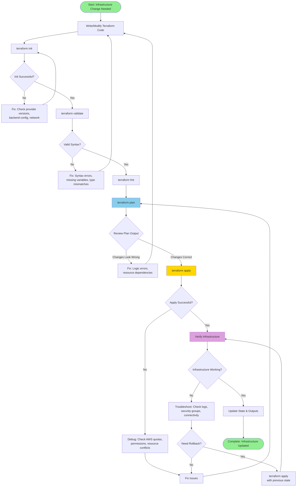
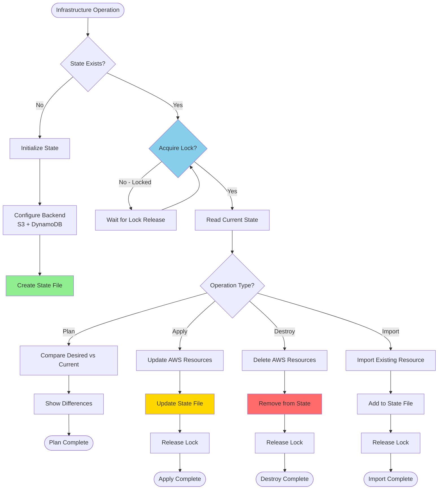
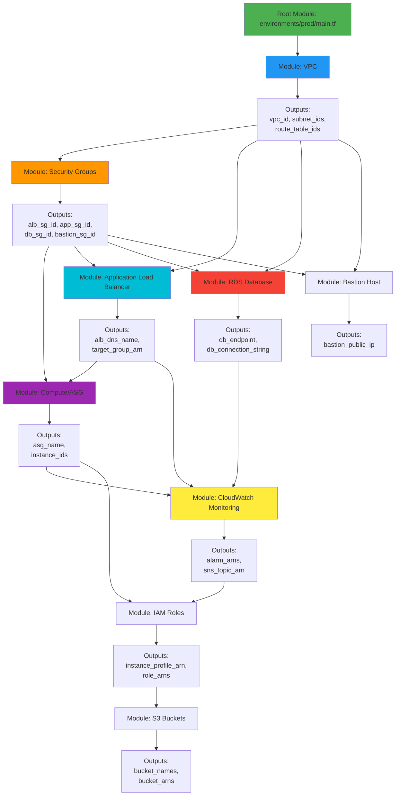
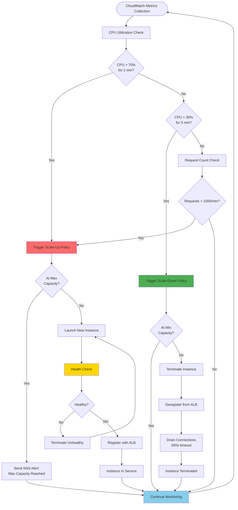
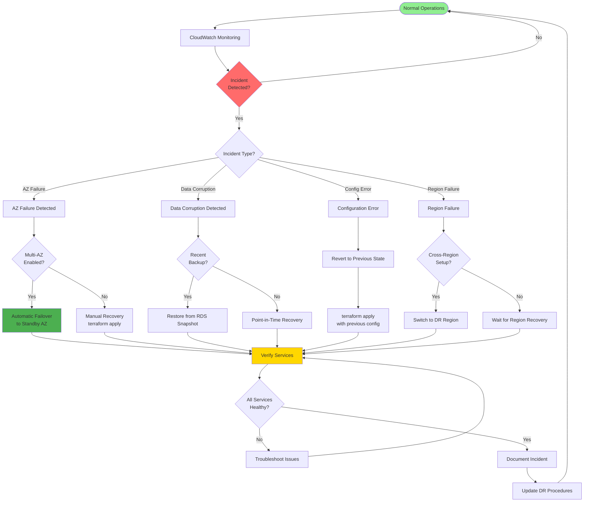
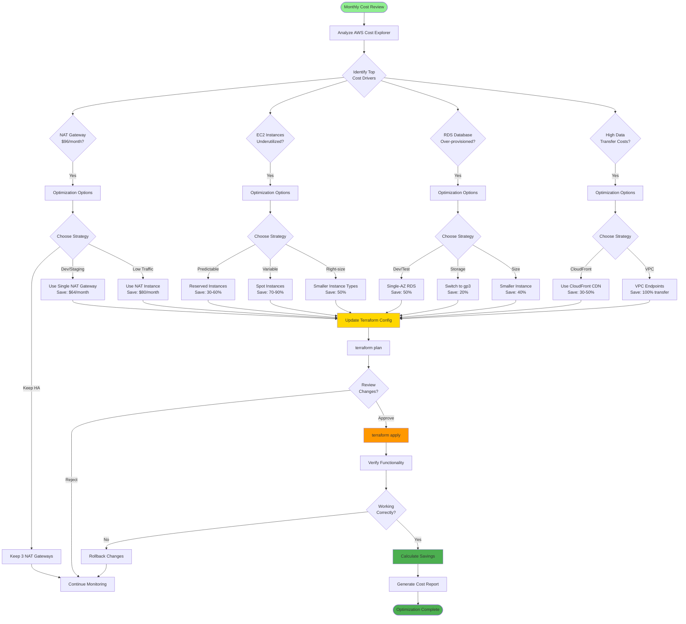

# Terraform Workflow Diagrams

This document contains comprehensive flow diagrams illustrating Terraform workflows, deployment processes, and operational patterns for the FinTech Payment Platform.

---

## 1. Terraform Core Workflow



---

## 2. Multi-Environment Deployment Flow

```mermaid
flowchart LR
    subgraph Development["🔧 Development Environment"]
        DevCode[Write Code] --> DevInit[terraform init]
        DevInit --> DevPlan[terraform plan]
        DevPlan --> DevApply[terraform apply]
        DevApply --> DevTest[Test Changes]
    end
    
    subgraph Staging["🧪 Staging Environment"]
        StgInit[terraform init] --> StgPlan[terraform plan]
        StgPlan --> StgApply[terraform apply]
        StgApply --> StgTest[QA Testing]
        StgTest --> StgApproval{Approval?}
    end
    
    subgraph Production["🚀 Production Environment"]
        ProdInit[terraform init] --> ProdPlan[terraform plan]
        ProdPlan --> ProdReview[Review Plan]
        ProdReview --> ProdApproval{Approve?}
        ProdApproval -->|Yes| ProdApply[terraform apply]
        ProdApproval -->|No| ProdReject[Reject Changes]
        ProdApply --> ProdMonitor[Monitor Metrics]
        ProdMonitor --> ProdHealth{Healthy?}
        ProdHealth -->|No| ProdRollback[Rollback]
        ProdHealth -->|Yes| ProdComplete([Deployed])
    end
    
    DevTest -->|Success| StgInit
    StgApproval -->|Approved| ProdInit
    StgApproval -->|Rejected| DevCode
    ProdRollback --> ProdReview
    
    style DevApply fill:#90EE90
    style StgApply fill:#FFD700
    style ProdApply fill:#FF6B6B
    style ProdComplete fill:#4CAF50
```



---

## 3. Terraform State Management Flow



---

## 4. Module Dependency Flow



---

## 5. Auto-Scaling Decision Flow



---

## 6. Disaster Recovery Flow



---

## 7. CI/CD Pipeline Integration

```mermaid
flowchart LR
    subgraph Developer["👨‍💻 Developer"]
        Code[Write Terraform Code] --> Commit[Git Commit]
        Commit --> Push[Git Push]
    end
    
    subgraph CI["🔄 CI Pipeline - GitHub Actions"]
        Push --> Trigger[Trigger Workflow]
        Trigger --> Checkout[Checkout Code]
        Checkout --> TFInit[terraform init]
        TFInit --> TFValidate[terraform validate]
        TFValidate --> TFLint[Run tflint]
        TFLint --> Checkov[Run checkov<br/>Security Scan]
        Checkov --> TFPlan[terraform plan]
        TFPlan --> SavePlan[Save Plan Artifact]
    end
    
    subgraph Review["👀 Review"]
        SavePlan --> PRReview{Pull Request<br/>Review}
        PRReview -->|Changes Requested| Code
        PRReview -->|Approved| Merge[Merge to Main]
    end
    
    subgraph CD["🚀 CD Pipeline"]
        Merge --> CDTrigger[Trigger Deploy]
        CDTrigger --> DevDeploy[Deploy to Dev]
        DevDeploy --> DevTest{Dev Tests<br/>Pass?}
        DevTest -->|No| Rollback1[Rollback Dev]
        DevTest -->|Yes| StgDeploy[Deploy to Staging]
        
        StgDeploy --> StgTest{Staging Tests<br/>Pass?}
        StgTest -->|No| Rollback2[Rollback Staging]
        StgTest -->|Yes| ManualApprove{Manual<br/>Approval?}
        
        ManualApprove -->|No| Stop([Stop Deployment])
        ManualApprove -->|Yes| ProdDeploy[Deploy to Production]
        
        ProdDeploy --> ProdMonitor[Monitor 15 min]
        ProdMonitor --> ProdHealth{Healthy?}
        ProdHealth -->|No| Rollback3[Rollback Production]
        ProdHealth -->|Yes| Success([Deployment Complete])
    end
    
    Rollback1 --> Code
    Rollback2 --> Code
    Rollback3 --> Code
    
    style Push fill:#90EE90
    style Checkov fill:#FF9800
    style ManualApprove fill:#FFD700
    style ProdDeploy fill:#FF6B6B
    style Success fill:#4CAF50
```



---

## 8. Cost Optimization Decision Flow



---

## Diagram Usage Guide

### When to Use Each Diagram

1. **Terraform Core Workflow**: Daily development and troubleshooting
2. **Multi-Environment Deployment**: Release planning and promotion
3. **State Management Flow**: Understanding state operations and locking
4. **Module Dependency Flow**: Architecture planning and debugging
5. **Auto-Scaling Decision Flow**: Performance tuning and capacity planning
6. **Disaster Recovery Flow**: Incident response and DR testing
7. **CI/CD Pipeline Integration**: Setting up automation
8. **Cost Optimization Decision Flow**: Monthly cost reviews

### Quick Reference Commands

```bash
# Initialize and validate
terraform init
terraform validate
terraform fmt -recursive

# Plan and review
terraform plan -out=tfplan
terraform show tfplan

# Apply changes
terraform apply tfplan

# State operations
terraform state list
terraform state show <resource>
terraform state mv <source> <dest>

# Import existing resources
terraform import <resource_type>.<name> <aws_id>

# Destroy resources
terraform destroy -target=<resource>
```

---

**Next**: See [terraform-capabilities.md](terraform-capabilities.md) for comprehensive capability reference.
